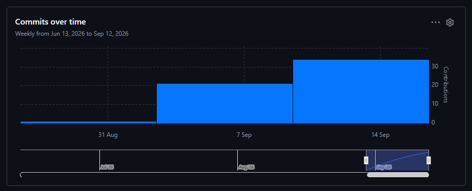
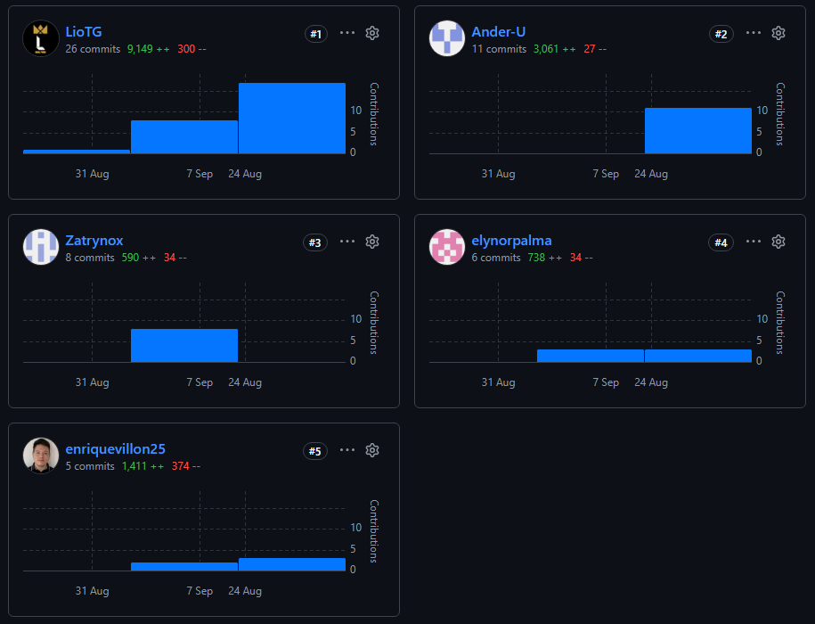

<!-- pdf:omit-start -->

---

Universidad Peruana de Ciencias Aplicadas

Carrera de Ingeniería de Software

#### 1ACC0238

#### Aplicaciones para Dispositivos Móviles

NRC

#### 13975

#### Informe del Trabajo Final

Docente

#### David Gerardo Quevedo Velasco

Equipo

#### Lernen Labs

Proyecto

#### Entreprenly

#### Integrantes

<strong>Código&emsp;&emsp;Apellidos y Nombres</strong> 
u202416151&emsp;Chavez Carrasco, Lionel Abraham 
u20241a972&emsp;Palma De Los Santos, Elynor Mikela 
u202418655&emsp;Laura Acosta, Victor Jhosef 
u20161a304&emsp;Villon Amez, Enrique Manuel 
u202120836&emsp;Gonza Morales, Anderson

#### Período 202620

#### Setiembre 2026

---

<!-- pdf:omit-end -->

<!-- pdf:only
\begin{titlepage}
\thispagestyle{empty}
\centering
\singlespacing
\setlength{\parindent}{0pt}
\vspace*{0.15in}
\includegraphics[width=0.75in]{docs/images/upc_logo.png}\par
\vspace{0.25cm}
Universidad Peruana de Ciencias Aplicadas\par
\vspace{0.22cm}
Carrera de Ingeniería de Software\par
\vspace{0.65cm}
\textbf{1ACC0238}\par
\vspace{0.20cm}
\textbf{Aplicaciones para Dispositivos Móviles}\par
\vspace{0.32cm}
NRC\par
\vspace{0.15cm}
\textbf{13975}\par
\vspace{0.32cm}
\textbf{Informe del Trabajo Final}\par
\vspace{0.30cm}
Docente\par
\vspace{0.15cm}
\textbf{David Gerardo Quevedo Velasco}\par
\vspace{0.48cm}
Equipo\par
\vspace{0.15cm}
\textbf{Lernen Labs}\par
\vspace{0.25cm}
Proyecto\par
\vspace{0.15cm}
\textbf{Entreprenly}\par
\vspace{0.48cm}
Integrantes\par
\vspace{0.15cm}
\begin{tabular}{@{}ll@{}}
\textbf{Código} & \textbf{Apellidos y Nombres} \\
u202416151 & Chavez Carrasco, Lionel Abraham \\
u20241a972 & Palma De Los Santos, Elynor Mikela \\
u202418655 & Laura Acosta, Victor Jhosef \\
u20161a304 & Villon Amez, Enrique Manuel \\
u202120836 & Gonza Morales, Anderson
\end{tabular}\par
\vfill
\textbf{Período 202620}\par
\vspace{0.20cm}
\textbf{Setiembre 2026}\par
\end{titlepage}
\onehalfspacing
-->

# Registro de Versiones del Informe

<table border="1" cellpadding="8" cellspacing="0" style="width:100%; border-collapse: collapse;">
  <tr style="background-color:#2c3e50; color:white;">
    <th>Versión</th><th>Fecha</th><th>Autor</th><th>Descripción de modificación</th>
  </tr>
  <tr>
    <td style="vertical-align:middle; text-align:center;">AV1</td>
    <td style="vertical-align:middle; text-align:center;">Setiembre 2026</td>
    <td style="vertical-align:middle; text-align:center;">Todos los integrantes</td>
    <td>Versión AV1: 2.1 Competidores, 2.2 Entrevistas y 2.6.2 Bounded Context Inventory (Domain, Application, Interface e Infrastructure Layers con diagramas de componentes, clases y base de datos y diccionario BC4).</td>
  </tr>
</table>

# Project Report Collaboration Insights

En esta sección se presenta la evidencia de colaboración del equipo Lernen Labs durante el desarrollo del AV1. La elaboración del informe se llevó a cabo de forma distribuida a través del repositorio **adm-entreprenly** bajo la organización https://github.com/LernenLabs, donde todos los miembros del equipo participaron activamente mediante commits y revisiones a lo largo del desarrollo de esta entrega.

## Repositorio del Informe

**URL:** https://github.com/LernenLabs/adm-entreprenly

### **AV1**

Durante la elaboración del AV1, los cinco integrantes del equipo contribuyeron en la redacción y revisión del informe, distribuyendo la carga de trabajo por capítulos. Por cada avance se realizaron commits siguiendo el flujo GitFlow, con integraciones periódicas a la rama `develop` y posteriormente a la rama `main` mediante Pull Requests.

#### Distribución de contribuciones por integrante (AV1)

| Integrante                         | Secciones principales del informe                                                                                                                               |
| ---------------------------------- | --------------------------------------------------------------------------------------------------------------------------------------------------------------- |
| Chavez Carrasco, Lionel Abraham    | 1.1 Startup Profile · 1.3 Segmentos objetivo · 2.4 Requirements Specification · Bounded Context: Profile · Integración y revisión final de los capítulos I y II |
| Palma De Los Santos, Elynor Mikela | 1.2 Solution Profile · 1.2.1 Antecedentes y problemática · 1.2.2 Lean UX Process · Bounded Context: Chatbot                                                     |
| Laura Acosta, Victor Jhosef        | 2.1 Competidores · 2.2.1 Diseño de entrevistas · Coordinación de la sección de entrevistas · Bounded Context: Inventory                                         |
| Villon Amez, Enrique Manuel        | 2.2.2 Registro de entrevistas · 2.2.3 Análisis de entrevistas · 2.3.1–2.3.4 Artefactos de Needfinding · Bounded Context: Subscription                           |
| Gonza Morales, Anderson            | 2.3.5 Big Picture EventStorming · 2.3.6 Ubiquitous Language · 2.5 Strategic-Level Domain-Driven Design · Bounded Context: Sales                                 |

  

**Figura AV1.1:** Commits semanales del repositorio `adm-entreprenly` entre el 13 de junio y el 12 de setiembre de 2026, con la concentración de trabajo en las semanas previas a la entrega del AV1. Fuente: GitHub Insights.

  

**Figura AV1.2:** Commits por integrante durante el AV1: LioTG (26), Ander-U (11), Zatrynox (8), elynorpalma (6) y enriquevillon25 (5), con las líneas añadidas y eliminadas por cada uno. Fuente: GitHub Insights.

<!-- pdf:omit-start -->

# Contenido

- [Student Outcome](#student-outcome)
- [Objetivos SMART](#objetivos-smart)

### [Capítulo I: Presentación](docs/capitulo-1.md)

- [1.1. Startup Profile](docs/capitulo-1.md#11-startup-profile)
  - [1.1.1. Descripción de la Startup](docs/capitulo-1.md#111-descripción-de-la-startup)
  - [1.1.2. Perfiles de integrantes del equipo](docs/capitulo-1.md#112-perfiles-de-integrantes-del-equipo)
- [1.2. Solution Profile](docs/capitulo-1.md#12-solution-profile)
  - [1.2.1. Antecedentes y problemática](docs/capitulo-1.md#121-antecedentes-y-problemática)
  - [1.2.2. Lean UX Process](docs/capitulo-1.md#122-lean-ux-process)
    - [1.2.2.1. Lean UX Problem Statements](docs/capitulo-1.md#1221-lean-ux-problem-statements)
    - [1.2.2.2. Lean UX Assumptions](docs/capitulo-1.md#1222-lean-ux-assumptions)
    - [1.2.2.3. Lean UX Hypothesis Statements](docs/capitulo-1.md#1223-lean-ux-hypothesis-statements)
    - [1.2.2.4. Lean UX Canvas](docs/capitulo-1.md#1224-lean-ux-canvas)
- [1.3. Segmentos objetivo](docs/capitulo-1.md#13-segmentos-objetivo)

### [Capítulo II: Requirements Development and Software Solution Design](docs/capitulo-2.md)

- [2.1. Competidores](docs/capitulo-2.md#21-competidores)
  - [2.1.1. Análisis competitivo](docs/capitulo-2.md#211-análisis-competitivo)
  - [2.1.2. Estrategias y tácticas frente a competidores](docs/capitulo-2.md#212-estrategias-y-tácticas-frente-a-competidores)
- [2.2. Entrevistas](docs/capitulo-2.md#22-entrevistas)
  - [2.2.1. Diseño de entrevistas](docs/capitulo-2.md#221-diseño-de-entrevistas)
  - [2.2.2. Registro de entrevistas](docs/capitulo-2.md#222-registro-de-entrevistas)
  - [2.2.3. Análisis de entrevistas](docs/capitulo-2.md#223-análisis-de-entrevistas)
- [2.3. Needfinding](docs/capitulo-2.md#23-needfinding)
  - [2.3.1. User Personas](docs/capitulo-2.md#231-user-personas)
  - [2.3.2. User Task Matrix](docs/capitulo-2.md#232-user-task-matrix)
  - [2.3.3. User Journey Mapping](docs/capitulo-2.md#233-user-journey-mapping)
  - [2.3.4. Empathy Mapping](docs/capitulo-2.md#234-empathy-mapping)
  - [2.3.5. Big Picture EventStorming](docs/capitulo-2.md#235-big-picture-eventstorming)
  - [2.3.6. Ubiquitous Language](docs/capitulo-2.md#236-ubiquitous-language)
- [2.4. Requirements Specification](docs/capitulo-2.md#24-requirements-specification)
  - [2.4.1. User Stories](docs/capitulo-2.md#241-user-stories)
  - [2.4.2. Impact Mapping](docs/capitulo-2.md#242-impact-mapping)
  - [2.4.3. Product Backlog](docs/capitulo-2.md#243-product-backlog)
- [2.5. Strategic-Level Domain-Driven Design](docs/capitulo-2.md#25-strategic-level-domain-driven-design)
  - [2.5.1. EventStorming](docs/capitulo-2.md#251-eventstorming)
    - [2.5.1.1. Candidate Context Discovery](docs/capitulo-2.md#2511-candidate-context-discovery)
    - [2.5.1.2. Domain Message Flows Modeling](docs/capitulo-2.md#2512-domain-message-flows-modeling)
    - [2.5.1.3. Bounded Context Canvases](docs/capitulo-2.md#2513-bounded-context-canvases)
  - [2.5.2. Context Mapping](docs/capitulo-2.md#252-context-mapping)
  - [2.5.3. Software Architecture](docs/capitulo-2.md#253-software-architecture)
    - [2.5.3.1. Software Architecture Context Level Diagrams](docs/capitulo-2.md#2531-software-architecture-context-level-diagrams)
    - [2.5.3.2. Software Architecture Container Level Diagrams](docs/capitulo-2.md#2532-software-architecture-container-level-diagrams)
    - [2.5.3.3. Software Architecture Deployment Diagrams](docs/capitulo-2.md#2533-software-architecture-deployment-diagrams)
- [2.6. Tactical-Level Domain-Driven Design](docs/capitulo-2.md#26-tactical-level-domain-driven-design)
  - [2.6.1. Bounded Context: Profile](docs/capitulo-2.md#261-bounded-context-profile)
    - [2.6.1.1. Domain Layer](docs/capitulo-2.md#2611-domain-layer)
    - [2.6.1.2. Interface Layer](docs/capitulo-2.md#2612-interface-layer)
    - [2.6.1.3. Application Layer](docs/capitulo-2.md#2613-application-layer)
    - [2.6.1.4. Infrastructure Layer](docs/capitulo-2.md#2614-infrastructure-layer)
    - [2.6.1.5. Bounded Context Software Architecture Component Level Diagrams](docs/capitulo-2.md#2615-bounded-context-software-architecture-component-level-diagrams)
    - [2.6.1.6. Bounded Context Software Architecture Code Level Diagrams](docs/capitulo-2.md#2616-bounded-context-software-architecture-code-level-diagrams)
      - [2.6.1.6.1. Bounded Context Domain Layer Class Diagrams](docs/capitulo-2.md#26161-bounded-context-domain-layer-class-diagrams)
      - [2.6.1.6.2. Bounded Context Database Design Diagram](docs/capitulo-2.md#26162-bounded-context-database-design-diagram)
  - [2.6.2. Bounded Context: Inventory](docs/capitulo-2.md#262-bounded-context-inventory)
    - [2.6.2.1. Domain Layer](docs/capitulo-2.md#2621-domain-layer)
    - [2.6.2.2. Interface Layer](docs/capitulo-2.md#2622-interface-layer)
    - [2.6.2.3. Application Layer](docs/capitulo-2.md#2623-application-layer)
    - [2.6.2.4. Infrastructure Layer](docs/capitulo-2.md#2624-infrastructure-layer)
    - [2.6.2.5. Bounded Context Software Architecture Component Level Diagrams](docs/capitulo-2.md#2625-bounded-context-software-architecture-component-level-diagrams)
    - [2.6.2.6. Bounded Context Software Architecture Code Level Diagrams](docs/capitulo-2.md#2626-bounded-context-software-architecture-code-level-diagrams)
      - [2.6.2.6.1. Bounded Context Domain Layer Class Diagrams](docs/capitulo-2.md#26261-bounded-context-domain-layer-class-diagrams)
      - [2.6.2.6.2. Bounded Context Database Design Diagram](docs/capitulo-2.md#26262-bounded-context-database-design-diagram)
  - [2.6.3. Bounded Context: Chatbot](docs/capitulo-2.md#263-bounded-context-chatbot)
    - [2.6.3.1. Domain Layer](docs/capitulo-2.md#2631-domain-layer)
    - [2.6.3.2. Interface Layer](docs/capitulo-2.md#2632-interface-layer)
    - [2.6.3.3. Application Layer](docs/capitulo-2.md#2633-application-layer)
    - [2.6.3.4. Infrastructure Layer](docs/capitulo-2.md#2634-infrastructure-layer)
    - [2.6.3.5. Bounded Context Software Architecture Component Level Diagrams](docs/capitulo-2.md#2635-bounded-context-software-architecture-component-level-diagrams)
    - [2.6.3.6. Bounded Context Software Architecture Code Level Diagrams](docs/capitulo-2.md#2636-bounded-context-software-architecture-code-level-diagrams)
      - [2.6.3.6.1. Bounded Context Domain Layer Class Diagrams](docs/capitulo-2.md#26361-bounded-context-domain-layer-class-diagrams)
      - [2.6.3.6.2. Bounded Context Database Design Diagram](docs/capitulo-2.md#26362-bounded-context-database-design-diagram)
  - [2.6.4. Bounded Context: Subscription](docs/capitulo-2.md#264-bounded-context-subscription)
    - [2.6.4.1. Domain Layer](docs/capitulo-2.md#2641-domain-layer)
    - [2.6.4.2. Interface Layer](docs/capitulo-2.md#2642-interface-layer)
    - [2.6.4.3. Application Layer](docs/capitulo-2.md#2643-application-layer)
    - [2.6.4.4. Infrastructure Layer](docs/capitulo-2.md#2644-infrastructure-layer)
    - [2.6.4.5. Bounded Context Software Architecture Component Level Diagrams](docs/capitulo-2.md#2645-bounded-context-software-architecture-component-level-diagrams)
    - [2.6.4.6. Bounded Context Software Architecture Code Level Diagrams](docs/capitulo-2.md#2646-bounded-context-software-architecture-code-level-diagrams)
      - [2.6.4.6.1. Bounded Context Domain Layer Class Diagrams](docs/capitulo-2.md#26461-bounded-context-domain-layer-class-diagrams)
      - [2.6.4.6.2. Bounded Context Database Design Diagram](docs/capitulo-2.md#26462-bounded-context-database-design-diagram)
  - [2.6.5. Bounded Context: Sales](docs/capitulo-2.md#265-bounded-context-sales)
    - [2.6.5.1. Domain Layer](docs/capitulo-2.md#2651-domain-layer)
    - [2.6.5.2. Interface Layer](docs/capitulo-2.md#2652-interface-layer)
    - [2.6.5.3. Application Layer](docs/capitulo-2.md#2653-application-layer)
    - [2.6.5.4. Infrastructure Layer](docs/capitulo-2.md#2654-infrastructure-layer)
    - [2.6.5.5. Bounded Context Software Architecture Component Level Diagrams](docs/capitulo-2.md#2655-bounded-context-software-architecture-component-level-diagrams)
    - [2.6.5.6. Bounded Context Software Architecture Code Level Diagrams](docs/capitulo-2.md#2656-bounded-context-software-architecture-code-level-diagrams)
      - [2.6.5.6.1. Bounded Context Domain Layer Class Diagrams](docs/capitulo-2.md#26561-bounded-context-domain-layer-class-diagrams)
      - [2.6.5.6.2. Bounded Context Database Design Diagram](docs/capitulo-2.md#26562-bounded-context-database-design-diagram)

---

- [Conclusiones y recomendaciones](docs/conclusiones.md)
- [Bibliografía](docs/bibliografia.md)
- [Anexos](docs/anexos.md)

<!-- pdf:omit-end -->

<!-- pdf:only
\tableofcontents
-->

# Student Outcome

En esta sección se detallan las actividades realizadas en el trabajo final y el sustento de cómo estas han ayudado a desarrollar las dimensiones del Student Outcome 7 (ABET – EAC), el cual se define como la capacidad de adquirir y aplicar nuevos conocimientos según sea necesario, utilizando estrategias de aprendizaje apropiadas. La información se presenta a través del siguiente cuadro, donde se especifican las dimensiones de la competencia, las acciones realizadas por cada integrante y las conclusiones generales del equipo.

| Criterio específico                                                                                                                     | Acciones realizadas                                                                                                                                                                                                                                                                                                                                                                                                     | Conclusiones                                                                                                                                                                                                                                                                                                                                                                                 |
| --------------------------------------------------------------------------------------------------------------------------------------- | ----------------------------------------------------------------------------------------------------------------------------------------------------------------------------------------------------------------------------------------------------------------------------------------------------------------------------------------------------------------------------------------------------------------------- | -------------------------------------------------------------------------------------------------------------------------------------------------------------------------------------------------------------------------------------------------------------------------------------------------------------------------------------------------------------------------------------------- |
| Actualiza conceptos y conocimientos necesarios para su desarrollo profesional y en especial para su proyecto en soluciones de software. | **Chavez Carrasco, Lionel Abraham** _AV1:_ Actualizó la presentación de la startup, los perfiles del equipo y los segmentos objetivo para el nuevo curso; adaptó la especificación de requisitos al dashboard móvil mediante User Stories, Impact Mapping y Product Backlog; desarrolló el diseño táctico del Bounded Context Profile e integró y revisó los capítulos I y II.                                       | Las actividades permitieron actualizar el conocimiento generado en el proyecto anterior y adaptarlo al contexto de una solución móvil. El equipo integró conceptos de Lean UX, investigación de usuarios, especificación de requisitos, arquitectura de software y Domain-Driven Design para producir un informe coherente con las necesidades actuales de Entreprenly.                      |
|                                                                                                                                         | **Palma De Los Santos, Elynor Mikela** _AV1:_ Reformuló el Solution Profile, los antecedentes y la problemática de Entreprenly, y desarrolló el proceso Lean UX mediante Problem Statements, Assumptions, Hypothesis Statements y Lean UX Canvas orientados al producto móvil.                                                                                                                                       |                                                                                                                                                                                                                                                                                                                                                                                              |
|                                                                                                                                         | **Laura Acosta, Victor Jhosef** _AV1:_ Actualizó el análisis competitivo, las estrategias frente a competidores y el diseño de entrevistas para los segmentos objetivo; además, documentó el Bounded Context Inventory en sus capas Domain, Application, Interface e Infrastructure, junto con sus diagramas y modelo de persistencia.                                                                               |                                                                                                                                                                                                                                                                                                                                                                                              |
|                                                                                                                                         | **Villon Amez, Enrique Manuel** _AV1:_ Consolidó el registro y análisis de las entrevistas y actualizó los artefactos de Needfinding: User Personas, User Task Matrix, User Journey Mapping y Empathy Mapping, relacionando los hallazgos con las necesidades de comerciantes y clientes finales.                                                                                                                    |                                                                                                                                                                                                                                                                                                                                                                                              |
|                                                                                                                                         | **Gonza Morales, Anderson** _AV1:_ Desarrolló el Big Picture EventStorming y el Ubiquitous Language; aplicó Strategic-Level Domain-Driven Design mediante Candidate Context Discovery, Domain Message Flows Modeling, Bounded Context Canvases, Context Mapping y los diagramas de arquitectura de software.                                                                                                         |                                                                                                                                                                                                                                                                                                                                                                                              |
| Reconoce la necesidad del aprendizaje permanente para el desempeño profesional y el desarrollo de proyectos en soluciones de software.  | **Chavez Carrasco, Lionel Abraham** _AV1:_ Contrastó el informe anterior con los requisitos del nuevo curso, investigó la adaptación de funcionalidades y criterios de aceptación a dispositivos móviles y aplicó lo aprendido en Impact Mapping, Product Backlog y el modelado táctico de Profile. La integración final le permitió reforzar la revisión cruzada y la consistencia entre requisitos y arquitectura. | El equipo evidenció aprendizaje permanente al reutilizar críticamente los avances previos, consultar técnicas específicas, contrastarlas con el nuevo alcance móvil y mejorar los artefactos mediante revisiones colaborativas. Esta práctica permitió incorporar conocimientos nuevos sin perder la trazabilidad del producto ni repetir de forma automática el trabajo del ciclo anterior. |
|                                                                                                                                         | **Palma De Los Santos, Elynor Mikela** _AV1:_ Revisó y ajustó continuamente los artefactos de Lean UX a partir del problema actual, los segmentos objetivo y la retroalimentación del equipo, reconociendo que los supuestos e hipótesis deben actualizarse cuando cambia el contexto de uso del producto.                                                                                                           |                                                                                                                                                                                                                                                                                                                                                                                              |
|                                                                                                                                         | **Laura Acosta, Victor Jhosef** _AV1:_ Comparó soluciones vigentes del mercado y actualizó las preguntas de entrevista para obtener evidencia relevante; asimismo, profundizó en DDD táctico y Clean Architecture al separar productos por unidad y peso, alertas, persistencia y contratos de integración de Inventory.                                                                                             |                                                                                                                                                                                                                                                                                                                                                                                              |
|                                                                                                                                         | **Villon Amez, Enrique Manuel** _AV1:_ Fortaleció el análisis cualitativo al transformar entrevistas en personas, tareas, recorridos y mapas de empatía, revisando iterativamente cada artefacto para evitar que las decisiones del producto se basaran únicamente en suposiciones.                                                                                                                                  |                                                                                                                                                                                                                                                                                                                                                                                              |
|                                                                                                                                         | **Gonza Morales, Anderson** _AV1:_ Profundizó en EventStorming, lenguaje ubicuo, Context Mapping y el modelo C4 para representar procesos, responsabilidades e interacciones entre contextos, aplicando estas técnicas de manera progresiva durante la elaboración de la arquitectura de Entreprenly.                                                                                                                |                                                                                                                                                                                                                                                                                                                                                                                              |

<!-- pdf:only
\clearpage
-->

# Objetivos SMART

En esta sección, cada integrante de Lernen Labs establece un plan de desarrollo profesional compuesto por dos objetivos SMART para el periodo posterior a su graduación. Cada objetivo especifica el resultado esperado, los indicadores que permitirán comprobar su cumplimiento, las acciones que lo hacen alcanzable, su relevancia profesional y un plazo definido.

## Chavez Carrasco, Lionel Abraham

### Objetivo SMART 1 — Especialización en desarrollo móvil y experiencia de usuario

Durante los primeros **12 meses posteriores a mi graduación**, completaré dos programas avanzados de al menos 40 horas cada uno sobre desarrollo de aplicaciones móviles y UX/UI. Aplicaré los conocimientos adquiridos en dos aplicaciones funcionales publicadas en mi portafolio y repositorio profesional, y validaré cada producto con un mínimo de 10 usuarios, buscando alcanzar una valoración promedio igual o superior a 4 de 5.

**Plan de acción:** dedicar seis horas semanales al estudio y desarrollo; completar el primer programa y prototipo durante el primer semestre; y finalizar el segundo programa, ambas aplicaciones y sus pruebas con usuarios antes de concluir el mes 12.

### Objetivo SMART 2 — Liderazgo de un producto digital

Dentro de los **tres años posteriores a mi graduación**, asumiré el liderazgo técnico o funcional de un equipo de al menos cuatro integrantes y dirigiré el lanzamiento de un producto digital que complete como mínimo tres iteraciones. El producto deberá cumplir al menos el 80 % de los criterios de aceptación planificados y obtener una satisfacción promedio de usuarios igual o superior a 4 de 5.

**Plan de acción:** fortalecer mis competencias en gestión ágil y liderazgo mediante un programa especializado durante el primer año, asumir progresivamente responsabilidades de coordinación y registrar los resultados de cada iteración mediante métricas de cumplimiento y retroalimentación de usuarios.

## Palma De Los Santos, Elynor Mikela

### Objetivo SMART 1 — Formación en Product Discovery y UX Research

Durante los primeros **12 meses posteriores a mi graduación**, completaré dos cursos especializados de al menos 30 horas cada uno sobre Product Discovery, Lean UX o investigación de usuarios. Elaboraré tres casos de estudio para mi portafolio, cada uno sustentado con entrevistas o pruebas realizadas con un mínimo de cinco usuarios del segmento correspondiente.

**Plan de acción:** reservar cinco horas semanales para capacitación y práctica; desarrollar un caso de estudio por cuatrimestre; y solicitar retroalimentación de profesionales o docentes antes de publicar cada resultado en mi portafolio.

### Objetivo SMART 2 — Consolidación como Business Analyst o Product Owner

Dentro de los **tres años posteriores a mi graduación**, asumiré formalmente funciones de Business Analyst o Product Owner y lideraré al menos dos ciclos completos de descubrimiento y definición de producto. Cada ciclo deberá producir una problemática validada, un backlog priorizado y una propuesta evaluada favorablemente por al menos el 80 % de los stakeholders participantes.

**Plan de acción:** participar durante el primer año en actividades de levantamiento de requisitos y análisis de usuarios, obtener una certificación relacionada con gestión de productos antes del segundo año y solicitar responsabilidades de priorización y facilitación en proyectos posteriores.

## Laura Acosta, Victor Jhosef

### Objetivo SMART 1 — Especialización en backend y bases de datos

Durante los primeros **12 meses posteriores a mi graduación**, completaré una certificación o programa especializado en desarrollo backend, arquitectura cloud o bases de datos. Como evidencia, implementaré y desplegaré una API para una aplicación móvil con documentación técnica, integración continua y una cobertura mínima del 80 % en pruebas automatizadas.

**Plan de acción:** dedicar seis horas semanales a la capacitación; diseñar el modelo de datos y los contratos de la API durante el primer trimestre; implementar y probar los servicios en los siguientes seis meses; y publicar la solución documentada antes del mes 12.

### Objetivo SMART 2 — Diseño y optimización de servicios en producción

Dentro de los **tres años posteriores a mi graduación**, participaré como responsable técnico en el diseño u optimización de al menos dos servicios backend utilizados en producción. En cada intervención documentaré una mejora medible, como reducir en al menos 25 % el tiempo promedio de respuesta, aumentar la cobertura de pruebas hasta un mínimo de 80 % o disminuir en 30 % la cantidad de errores recurrentes.

**Plan de acción:** registrar métricas de línea base antes de cada mejora, proponer decisiones respaldadas por pruebas de rendimiento y revisiones de código, y documentar los resultados obtenidos como parte de mi portafolio profesional.

## Villon Amez, Enrique Manuel

### Objetivo SMART 1 — Profundización en ingeniería frontend móvil

Durante los primeros **12 meses posteriores a mi graduación**, completaré una especialización avanzada en React Native, arquitectura frontend o accesibilidad digital y aplicaré lo aprendido en dos funcionalidades móviles desplegadas en un entorno real. Cada funcionalidad deberá superar una revisión de código y alcanzar al menos el 90 % de conformidad en una evaluación automatizada de accesibilidad y calidad definida por el equipo.

**Plan de acción:** dedicar cinco horas semanales al programa de especialización, seleccionar una necesidad concreta de producto por semestre, incorporar pruebas automatizadas y accesibilidad desde el inicio, y documentar las decisiones técnicas y resultados de ambas implementaciones.

### Objetivo SMART 2 — Evolución hacia un rol de liderazgo frontend

Dentro de los **tres años posteriores a mi graduación**, alcanzaré un rol de Senior Frontend Developer o Tech Lead y lideraré al menos dos entregas de producto de principio a fin. Además, acompañaré técnicamente a un mínimo de tres desarrolladores mediante sesiones mensuales de mentoría y revisiones de código, manteniendo por debajo del 5 % los defectos críticos detectados después de cada entrega liderada.

**Plan de acción:** asumir gradualmente responsabilidades de arquitectura y coordinación, registrar las sesiones de mentoría y acuerdos de revisión, y utilizar métricas de defectos y cumplimiento de entrega para evaluar y mejorar mi desempeño como líder técnico.

## Gonza Morales, Anderson

### Objetivo SMART 1 — Especialización en arquitectura y gestión de requisitos

Durante los primeros **12 meses posteriores a mi graduación**, completaré al menos 60 horas de formación especializada en arquitectura de software, Domain-Driven Design o gestión de requisitos. Elaboraré dos casos de estudio que incluyan modelos C4, decisiones arquitectónicas y trazabilidad de requisitos, y conseguiré que cada uno sea revisado por al menos dos profesionales del área.

**Plan de acción:** dedicar cinco horas semanales a la formación; desarrollar el primer caso durante los primeros seis meses y el segundo durante el siguiente semestre; y aplicar la retroalimentación recibida antes de incorporarlos a mi portafolio profesional.

### Objetivo SMART 2 — Liderazgo de proyectos de software

Dentro de los **tres años posteriores a mi graduación**, lideraré un equipo de al menos cinco integrantes durante tres entregas consecutivas de un proyecto de software. Buscaré alcanzar como mínimo el 90 % de los compromisos planificados en cada entrega y una valoración promedio de stakeholders igual o superior a 4 de 5 respecto a la comunicación, organización y cumplimiento del equipo.

**Plan de acción:** fortalecer mis competencias de liderazgo y gestión ágil durante el primer año, asumir responsabilidades de seguimiento y facilitación en proyectos profesionales, y utilizar indicadores de cumplimiento, retrospectivas y encuestas de satisfacción para mejorar después de cada entrega.
