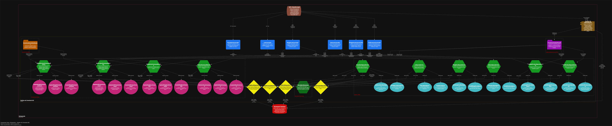
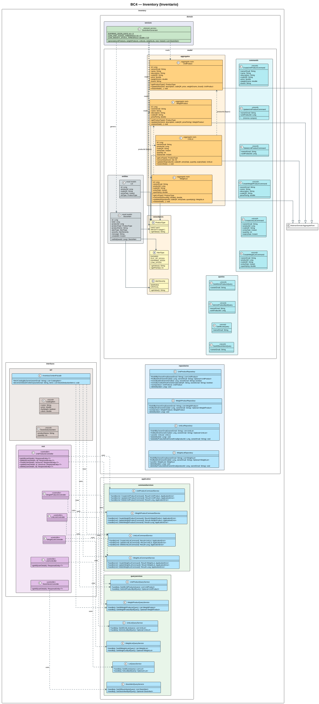
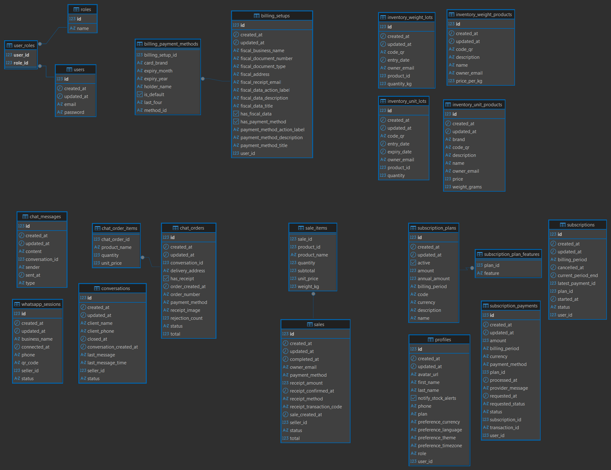

# Capítulo II: Requirements Development and Software Solution Design

## 2.1. Competidores

### 2.1.1. Análisis competitivo

##### ¿Por qué llevar a cabo este análisis

El presente análisis comparativo examina el desempeño de nuestra propuesta Entreprenly (plataforma de gestión digital para retail de productos perecederos), frente a soluciones actuales del mercado como Odoo y Lightspeed Retail.

El objetivo es diseñar una solución que resuelva el "caos multicanal" en pequeños comercios minoristas de alimentos frescos: pedidos por WhatsApp mezclados con ventas presenciales, inventario gestionado a mano y merma por desconocimiento del stock real. Entreprenly centraliza todos los canales en una única plataforma web, automatizando el control de inventario mediante lógica digital e integrando una balanza inteligente (IoT) que permite validar el stock físico en tiempo real.

##### Competidores

<table>
  <thead>
    <tr>
      <th>Entreprenly</th>
      <th>Odoo</th>
      <th>Lightspeed Retail</th>
    </tr>
  </thead>
  <tbody>
    <tr>
      <td></td>
      <td></td>
      <td></td>
    </tr>
  </tbody>
</table>

**Perfil**

##### Overview 
<table>
  <thead>
    <tr>
      <th>Entreprenly</th>
      <th>Odoo</th>
      <th>Lightspeed Retail</th>
    </tr>
  </thead>
  <tbody>
    <tr>
      <td>Plataforma web que centraliza pedidos de distintos canales de venta (WhatsApp + presencial) y automatiza el inventario en tiempo real mediante lógica digital y validación física con una balanza inteligente (IoT), permitiendo contrastar el stock registrado con el peso real disponible y detectar inconsistencias.</td>
      <td>Sistema ERP integral que permite gestionar operaciones empresariales como ventas, inventario, contabilidad y CRM en múltiples sectores.</td>
      <td>Sistema de punto de venta basado en la nube que permite gestionar ventas físicas, inventario y reportes en tiempo real para comercios minoristas.</td>
    </tr>
  </tbody>
</table>                     

##### ¿Qué valor ofrece a los clientes? 
<table>
  <thead>
    <tr>
      <th>Entreprenly</th>
      <th>Odoo</th>
      <th>Lightspeed Retail</th>
    </tr>
  </thead>
  <tbody>
    <tr>
      <td>Elimina el caos multicanal unificando pedidos de WhatsApp y ventas presenciales, reduce pérdidas por desconocimiento de stock y errores humanos mediante validación automática con una balanza inteligente (IoT), garantizando consistencia entre el inventario digital y el físico en todo momento.</td>
      <td>Ofrece control total del negocio mediante integración de múltiples módulos empresariales, mejorando la planificación y gestión a escala.</td>
      <td>Permite agilizar ventas en tienda física, mejorar el control de inventario y generar reportes comerciales de forma rápida.</td>
    </tr>
  </tbody>
</table>

##### Perfil de marketing 
<table>
  <thead>
    <tr>
      <th></th>
      <th>Entreprenly</th>
      <th>Odoo</th>
      <th>Lightspeed Retail</th>
    </tr>
  </thead>
  <tbody>
    <tr>
      <td>Mercado objetivo</td>
      <td>Pequeños negocios de alimentos frescos: fruterías, minimarkets, dark stores y verdulerías con alta rotación de productos perecederos.</td>
      <td>Empresas de todos los tamaños que buscan digitalizar su gestión integral de operaciones.</td>
      <td>Comercios minoristas de cualquier rubro que requieren optimizar ventas en tienda física.</td>
    </tr>
    <tr>
      <td>Estrategias de marketing / Ventaja competitiva / ¿Qué valor ofrece a los clientes?</td>
      <td>Simplicidad de adopción, centralización multicanal y gestión automatizada de stock, con un modelo de costos accesible para microempresas.</td>
      <td>Modularidad y escalabilidad empresarial con amplio ecosistema de integraciones.</td>
      <td>Facilidad de uso y rapidez en procesos de venta en punto de venta físico.</td>
    </tr>
  </tbody>
</table>

##### Perfil de producto 
<table>
  <thead>
    <tr>
      <th></th>
      <th>Entreprenly</th>
      <th>Odoo</th>
      <th>Lightspeed Retail</th>
    </tr>
  </thead>
  <tbody>
    <tr>
      <td>Productos &amp; servicios</td>
      <td>Dashboard tipo POS con módulo de inventario inteligente: centraliza pedidos de WhatsApp y ventas presenciales, controla stock en tiempo real y se integra con una balanza inteligente (IoT) que permite calcular el stock de productos por peso y validar automáticamente el inventario físico comparando el peso real con el esperado. El sistema gestiona productos bajo dos tipos: productos unitarios con precio fijo y productos por peso con precio por kilogramo, donde el stock se representa como el peso total disponible. Además, incorpora gestión por lotes para registrar fechas de caducidad y mejorar la trazabilidad de productos perecederos.</td>
      <td>Suite de aplicaciones empresariales: ventas, inventario, contabilidad, CRM, recursos humanos y más, integrables por módulos.</td>
      <td>Sistema POS con gestión de ventas, control de inventario, reportes comerciales y soporte para múltiples tiendas físicas.</td>
    </tr>
    <tr>
      <td>Canales de distribución</td>
      <td>Plataforma web accesible desde cualquier dispositivo con actualización de datos en tiempo real.</td>
      <td>Plataforma web modular, aplicaciones móviles y herramientas empresariales integradas.</td>
      <td>Aplicación web y dispositivos POS físicos conectados a la nube.</td>
    </tr>
  </tbody>
</table>

##### Análisis SWOT
<table>
  <thead>
    <tr>
      <th></th>
      <th>Entreprenly</th>
      <th>Odoo</th>
      <th>Lightspeed Retail</th>
    </tr>
  </thead>
  <tbody>
    <tr>
      <td>Fortalezas</td>
      <td>Centralización multicanal (WhatsApp + presencial), enfoque en productos perecederos, modelo de costos accesible e integración con una balanza inteligente (IoT) que permite validar el inventario físico en tiempo real.</td>
      <td>Sistema robusto, completo y altamente escalable con gran ecosistema de módulos y comunidad activa.</td>
      <td>Facilidad de uso, agilidad en procesos de venta y control de inventario en punto de venta físico.</td>
    </tr>
    <tr>
      <td>Debilidades</td>
      <td>Menor posicionamiento de marca frente a soluciones consolidadas y dependencia de correcta calibración de la balanza para asegurar precisión.</td>
      <td>Elevada complejidad de implementación y costos altos para pequeños negocios; requiere consultoría especializada.</td>
      <td>Limitado a ventas presenciales; sin automatización avanzada de inventario ni integración nativa de canales digitales como WhatsApp.</td>
    </tr>
    <tr>
      <td>Oportunidades</td>
      <td>Creciente digitalización de mercados tradicionales en el Perú y accesibilidad de dispositivos IoT de bajo costo como balanzas inteligentes aplicadas al retail.</td>
      <td>Expansión en mercados emergentes y demanda de digitalización empresarial a gran escala.</td>
      <td>Adopción creciente de sistemas POS en el sector retail y apertura de nuevos locales físicos.</td>
    </tr>
    <tr>
      <td>Amenazas</td>
      <td>Costo inicial de implementación de una balanza inteligente (IoT) y resistencia al cambio tecnológico en pequeños comerciantes.</td>
      <td>Nuevas soluciones más ligeras y accesibles dirigidas a pequeñas empresas.</td>
      <td>Evolución hacia sistemas más integrados.</td>
    </tr>
  </tbody>
</table>

### 2.1.2. Estrategias y tácticas frente a competidores

Tras evaluar el ecosistema actual, se definen los siguientes ejes estratégicos:

#### Estrategias

#### Diferenciación de Producto: 
- Resolución del caos multicanal: El problema central del segmento es la falta de sincronización entre los pedidos recibidos por WhatsApp y las ventas presenciales. Entreprenly lo resuelve unificando ambos flujos en un único panel de control.

- Automatización física del inventario (IoT):
Entreprenly valida el inventario digital mediante una balanza inteligente conectada al sistema, permitiendo contrastar el stock esperado con el peso real y detectar descuadres en tiempo real.

- Gestión activa de perecederos: A diferencia de soluciones generalistas, Entreprenly está diseñado para productos de alta rotación y riesgo de merma, generando alertas automáticas cuando el stock está por debajo de niveles críticos.

#### Segmentación del Mercado: 
- Foco en microcomercio peruano de alimentos frescos: fruterías, minimarkets y negocios tradicionales con gestión manual o semi-digital.

#### Costos Competitivos: 
- Modelo de suscripción accesible, sin requerir infraestructura compleja.

- Retorno visible desde el primer mes gracias a reducción de merma y errores operativos.

#### Relaciones Estratégicas: 
- Alianzas con mercados locales y asociaciones de comerciantes.

- Uso de canales de comunicación comunes para facilitar adopción.

---

#### Tácticas: 

#### Lanzamiento de Productos Innovadores: 
- Implementación inicial con balanza inteligente conectada al sistema.

#### Campañas de Marketing Dirigidas: 

- Demostraciones en mercados mostrando reducción de pérdidas y control de stock en tiempo real.

- Comunicación enfocada en beneficios tangibles (menos merma, menos errores, más control).

#### Inversión en I+D (Investigación y Desarrollo): 
- Optimización continua del módulo de inventario en tiempo real.
- Mejora en la precisión del cálculo de stock basado en peso.
- Integración y calibración de balanza inteligente (IoT) adaptada a microcomercios.
#### Mejora de la Experiencia del Cliente: 

- Visualización del stock actualizado en tiempo real desde cualquier dispositivo.
- Reducción de errores en pedidos gracias a la sincronización entre ventas y validación física del inventario.

## 2.2. Entrevistas
Esta sección presenta el estudio cualitativo basado en entrevistas semiestructuradas orientadas a validar una solución tecnológica que integra <b>Inteligencia Artificial (Chatbots), Internet de las Cosas (Sensores de peso) y automatización de pagos</b>. El estudio exploró las deficiencias actuales en el control de inventarios, la falta de transparencia en el pesaje de productos y la fricción en la atención al cliente vía WhatsApp. Participaron dueños de negocios con hasta 40 años de experiencia, expertos en procesos operativos y clientes finales, permitiendo identificar que la "inercia operativa" y el desorden financiero son las principales barreras para la digitalización de la microempresa local.

### 2.2.1. Diseño de entrevistas
"Antes de iniciar la entrevista, se brinda un saludo cordial y una breve presentación del entrevistador, explicando que el propósito de la conversación es conocer los desafíos y experiencias de los emprendedores en su gestión diaria. Se aclara que la información recopilada será utilizada únicamente con fines académicos para el desarrollo del proyecto y se mantendrá en estricta confidencialidad. Como primer paso, se solicita al entrevistado brindar su nombre completo, edad y lugar de residencia para fines de registro. Asimismo, se señala que la entrevista tendrá una duración aproximada de 5 a 10 minutos y se desarrollará de manera abierta, por lo que se le invita a responder con total libertad y basándose en ejemplos de su experiencia real, destacando que no existen respuestas correctas o incorrectas."

**Preguntas introductorias**
-   ¿Cuál es su nombre?
-   ¿Cuántos años tiene?
-   ¿Dónde vive?

**Segmento 1: Comerciantes (Dueños de Minimarkets/Mercados)**
1. Actualmente, ¿cómo lleva el control de los productos que tiene en estantes? (¿Usa cuaderno, Excel o solo memoria?).

2. ¿Con qué frecuencia nota que el stock que debería tener en el sistema o cuaderno no coincide con lo que físicamente hay en el estante?

3. ¿Ha tenido pérdidas económicas por productos mal pesados o errores humanos al registrar las ventas?

4. Al final del día, ¿qué tan difícil le resulta cuadrar el dinero en efectivo con los vouchers de tarjeta y los reportes de Yape o Plin?

5. ¿Qué problemas encuentra al tener que registrar manualmente en su sistema una venta que se pagó por el terminal POS o billetera digital?

6. Si tuviera una balanza que le dijera automáticamente cuántas unidades quedan de un producto solo por el peso, ¿cuánto tiempo y esfuerzo cree que ahorraría en inventarios?

7. ¿Actualmente atiende pedidos por WhatsApp? Si es así, ¿le resulta difícil estar pendiente del celular mientras atiende a los clientes en el local?

8. ¿Qué tan útil sería que, al confirmarse una venta por el chatbot, su POS físico imprima automáticamente el comprobante sin que usted tenga que intervenir?

9. ¿Le daría más tranquilidad tener un sistema que separe estrictamente lo que entra en efectivo de lo que entra por el POS para evitar errores de arqueo?

10. Si el sistema le permitiera vender 24/7 mediante un bot sin errores de stock, ¿cree que su volumen de ventas aumentaría significativamente?

**Segmento 2: Clientes Finales**
1. ¿Qué es lo que más le molesta cuando intenta comprar en un minimarket local por delivery o WhatsApp?

2. ¿Alguna vez ha pedido un producto por chat y, luego de pagar, le dijeron que ya se había agotado? ¿Cómo afectó eso su confianza en la tienda?

3. ¿Habitualmente prefiere pagar sus compras diarias con efectivo o utiliza más tarjetas, Yape y Plin?

4. Al comprar productos que se venden por peso o unidades, ¿qué tanta seguridad tiene de que le están entregando la cantidad exacta por la que pagó?

5. ¿Ha utilizado alguna vez un chatbot para realizar compras? ¿Le parece más cómodo que esperar a que una persona le responda el mensaje?

6. ¿Le daría más seguridad saber que el stock que ve en su celular está validado por un sensor de peso real en el estante de la tienda?

7. ¿Qué importancia le da a recibir el "papelito" o comprobante del POS inmediatamente después de realizar un pago virtual?

8. Si pudiera ver el catálogo real de un mercado cercano y comprar con 3 clics por WhatsApp, ¿dejaría de ir presencialmente para ahorrar tiempo?

9. ¿Le genera desconfianza pagar por adelantado en negocios locales si no recibe una confirmación automática del sistema?

10. ¿Preferiría comprar en un minimarket que use esta tecnología sobre uno tradicional que no garantiza el stock ni acepta todos los medios de pago?

### 2.2.2. Registro de entrevistas

Por completar.

### 2.2.3. Análisis de entrevistas

Por completar.

## 2.3. Needfinding

Por completar.

### 2.3.1. User Personas

Por completar.

### 2.3.2. User Task Matrix

Por completar.

### 2.3.3. User Journey Mapping

Por completar.

### 2.3.4. Empathy Mapping

Por completar.

### 2.3.5. Big Picture EventStorming

Por completar.

### 2.3.6. Ubiquitous Language

Por completar.

## 2.4. Requirements Specification

Por completar.

### 2.4.1. User Stories

Por completar.

### 2.4.2. Impact Mapping

Por completar.

### 2.4.3. Product Backlog

Por completar.

## 2.5. Strategic-Level Domain-Driven Design

Por completar.

### 2.5.1. EventStorming

Por completar.

#### 2.5.1.1. Candidate Context Discovery

Por completar.

#### 2.5.1.2. Domain Message Flows Modeling

Por completar.

#### 2.5.1.3. Bounded Context Canvases

Por completar.

### 2.5.2. Context Mapping

Por completar.

### 2.5.3. Software Architecture

Por completar.

#### 2.5.3.1. Software Architecture Context Level Diagrams

Por completar.

#### 2.5.3.2. Software Architecture Container Level Diagrams

Por completar.

#### 2.5.3.3. Software Architecture Deployment Diagrams

Por completar.

## 2.6. Tactical-Level Domain-Driven Design

Por completar.

### 2.6.1. Bounded Context: Profile

Por completar.

#### 2.6.1.1. Domain Layer

Por completar.

#### 2.6.1.2. Interface Layer

Por completar.

#### 2.6.1.3. Application Layer

Por completar.

#### 2.6.1.4. Infrastructure Layer

Por completar.

#### 2.6.1.5. Bounded Context Software Architecture Component Level Diagrams

Por completar.

#### 2.6.1.6. Bounded Context Software Architecture Code Level Diagrams

Por completar.

##### 2.6.1.6.1. Bounded Context Domain Layer Class Diagrams

Por completar.

##### 2.6.1.6.2. Bounded Context Database Design Diagram

Por completar.

### 2.6.2. Bounded Context: Inventory

Este Bounded Context es responsable de la administración del inventario del comerciante: catálogo de productos y gestión de lotes para productos perecederos. Está diseñado bajo Clean Architecture y DDD táctico, separando dominio, aplicación, infraestructura e interfaz. Soporta dos jerarquías paralelas según tipo de medida —productos por unidad y productos por peso— para evitar columnas nulas estructurales, integra la validación física con balanza inteligente (IoT) con fallback manual, y expone una fachada ACL (`InventoryContextFacade`) que provee el catálogo por propietario y permite el descuento de stock a otros contextos, principalmente Chatbot (pedidos por WhatsApp) y Sales (venta presencial). El aislamiento multitenant se logra con `owner_email` como referencia lógica al propietario, sin FK física entre Bounded Contexts.

#### 2.6.2.1. Domain Layer

**Sub-capa Model - Aggregates:**
<table border="1" cellpadding="8" cellspacing="0" style="width:100%; border-collapse: collapse;">
  <tr style="background-color:#2c3e50; color:white;">
    <th>Tipo</th><th>Nombre</th><th>Descripción</th><th>Responsabilidad Principal</th><th>Relación con otros elementos</th>
  </tr>
  <tr>
    <td>Aggregate Root</td><td>UnitProduct</td>
    <td>Producto vendido por unidad (ej. gaseosa, galleta). Extiende `AbstractDomainAggregateRoot`.</td>
    <td>Mantener invariantes de catálogo: `name` requerido, `code_qr` UNIQUE, `price >= 0`, `owner_email` obligatorio. El borrado elimina en cascada sus `UnitLot`.</td>
    <td>Agrega `UnitLot` vía `productId` lógico. Leído por `StockAlertGenerator` y expuesto vía Facade como `CatalogItem`.</td>
  </tr>
  <tr>
    <td>Aggregate Root</td><td>WeightProduct</td>
    <td>Producto vendido al peso (ej. manzana, pollo). Precio por kilogramo.</td>
    <td>Mantener `price_per_kg >= 0`, `code_qr` UNIQUE, `owner_email`. Soporta captura IoT de peso con fallback manual.</td>
    <td>Agrega `WeightLot`. Relacionado con Sales para validación Unidad/Peso y con Chatbot para descuento de stock.</td>
  </tr>
  <tr>
    <td>Aggregate Root</td><td>UnitLot</td>
    <td>Lote de un producto unitario. Trazabilidad de perecederos.</td>
    <td>Validar `quantity >= 0`, `entry_date <= expiry_date`, `expiry_date` no pasada al crear. Orden por defecto ascendente por vencimiento.</td>
    <td>Referencia lógica `product_id` a `UnitProduct`. Genera alertas vía `StockAlertGenerator`.</td>
  </tr>
  <tr>
    <td>Aggregate Root</td><td>WeightLot</td>
    <td>Lote de un producto por peso. Stock en `quantity_kg` decimal.</td>
    <td>Validar `quantity_kg >= 0`, fechas coherentes. Soporta ajuste por balanza IoT.</td>
    <td>Referencia lógica `product_id` a `WeightProduct`.</td>
  </tr>
</table>

**Sub-capa Model - Entities (lectura y alertas):**
<table border="1" cellpadding="8" cellspacing="0" style="width:100%; border-collapse: collapse;">
  <tr style="background-color:#2c3e50; color:white;">
    <th>Tipo</th><th>Nombre</th><th>Descripción</th><th>Responsabilidad Principal</th><th>Relación con otros elementos</th>
  </tr>
  <tr>
    <td>Entity</td><td>Lot</td>
    <td>Vista unificada de lectura de lotes (unitarios y por peso) para listados y panel resumen.</td>
    <td>Servir a `LotQueryService` (`GetAllLotsQuery`, `GetLotByIdQuery`) sin lógica de escritura.</td>
    <td>Derivada de `UnitLot` y `WeightLot`.</td>
  </tr>
  <tr>
    <td>Entity</td><td>StockAlert</td>
    <td>Alerta de monitoreo: stock bajo, agotado o lote por vencer/vencido.</td>
    <td>Almacenar `type`, `severity`, producto/lote afectado y mensaje para Dashboard y Toasts.</td>
    <td>Generada por `StockAlertGenerator`. Consultada por `StockAlertQueryService`.</td>
  </tr>
</table>

**Sub-capa Model - Commands:**
<table border="1" cellpadding="8" cellspacing="0" style="width:100%; border-collapse: collapse;">
  <tr style="background-color:#2c3e50; color:white;">
    <th>Tipo</th><th>Nombre</th><th>Descripción</th><th>Responsabilidad Principal</th><th>Relación con otros elementos</th>
  </tr>
  <tr><td>Command</td><td>CreateUnitProductCommand</td><td>Crear producto unitario (`name, description, code_qr, price, weight_grams, brand, owner_email`).</td><td>Validar unicidad de `code_qr` y precio válido.</td><td>Manejado por `UnitProductCommandService`. Publica `ProductCreated`.</td></tr>
  <tr><td>Command</td><td>UpdateUnitProductCommand</td><td>Actualizar datos de producto unitario.</td><td>Mantener invariantes sin cambiar `owner_email`.</td><td>Manejado por `UnitProductCommandService`.</td></tr>
  <tr><td>Command</td><td>DeleteUnitProductCommand</td><td>Eliminar producto unitario y sus lotes.</td><td>Ejecutar borrado en cascada.</td><td>Requiere confirmación modal en UI.</td></tr>
  <tr><td>Command</td><td>CreateWeightProductCommand</td><td>Crear producto por peso (`price_per_kg`).</td><td>Validar precio por kg y `code_qr` único.</td><td>Manejado por `WeightProductCommandService`.</td></tr>
  <tr><td>Command</td><td>CreateUnitLotCommand</td><td>Crear lote unitario (`product_id, code_qr, entry_date, expiry_date, quantity`).</td><td>Validar que `expiry_date` no sea pasada y que el producto exista.</td><td>Manejado por `UnitLotCommandService`. Publica `StockAdjusted`.</td></tr>
  <tr><td>Command</td><td>CreateWeightLotCommand</td><td>Crear lote por peso (`quantity_kg`).</td><td>Validar peso inicial y fechas.</td><td>Manejado por `WeightLotCommandService`.</td></tr>
</table>

**Sub-capa Model - Queries:**
<table border="1" cellpadding="8" cellspacing="0" style="width:100%; border-collapse: collapse;">
  <tr style="background-color:#2c3e50; color:white;">
    <th>Tipo</th><th>Nombre</th><th>Descripción</th><th>Responsabilidad Principal</th><th>Relación con otros elementos</th>
  </tr>
  <tr><td>Query</td><td>GetAllUnitProductsQuery</td><td>Listar productos unitarios del propietario autenticado.</td><td>Filtrar por `owner_email` con búsqueda en tiempo real por nombre/categoría.</td><td>Manejada por `UnitProductQueryService`.</td></tr>
  <tr><td>Query</td><td>GetUnitProductByIdQuery</td><td>Obtener detalle de un producto unitario.</td><td>Retornar con sus lotes ordenados por vencimiento.</td><td>Manejada por `UnitProductQueryService`.</td></tr>
  <tr><td>Query</td><td>GetAllLotsQuery / GetLotByIdQuery</td><td>Consulta unificada de lotes.</td><td>Servir tabla de lotes y panel `Activos / Próximos 7 días / Vencidos`.</td><td>Manejadas por `LotQueryService`.</td></tr>
  <tr><td>Query</td><td>GetAllWeightLotsQuery / GetWeightLotByIdQuery</td><td>Consulta de lotes por peso.</td><td>Servir validación de stock en POS y Chatbot.</td><td>Manejadas por `WeightLotQueryService`.</td></tr>
  <tr><td>Query</td><td>GetAllStockAlertsQuery / GetStockAlertByIdQuery</td><td>Consultar alertas generadas.</td><td>Alimentar KPIs del Dashboard y banners inline.</td><td>Manejadas por `StockAlertQueryService`.</td></tr>
</table>

**Sub-capa Model - Events (mejora respecto a la guía, que los omite):**
<table border="1" cellpadding="8" cellspacing="0" style="width:100%; border-collapse: collapse;">
  <tr style="background-color:#2c3e50; color:white;">
    <th>Tipo</th><th>Nombre</th><th>Descripción</th><th>Responsabilidad Principal</th><th>Relación con otros elementos</th>
  </tr>
  <tr><td>Event</td><td>ProductCreated</td><td>Se emite al crear `UnitProduct` o `WeightProduct`.</td><td>Permitir seeding y sincronización de catálogo.</td><td>Consumido internamente para generar alerta inicial si aplica.</td></tr>
  <tr><td>Event</td><td>StockAdjusted</td><td>Se emite al crear lote o descontar stock (venta o pedido Chatbot).</td><td>Disparar re-evaluación de alertas.</td><td>Entrada de `StockAlertGenerator`.</td></tr>
  <tr><td>Event</td><td>LowStockDetected / StockDepleted</td><td>Stock bajo umbral o en cero.</td><td>Generar `StockAlert` con severidad `WARNING` / `CRITICAL`.</td><td>Mostrado en Dashboard, tarjeta y Toast.</td></tr>
  <tr><td>Event</td><td>LotExpiringSoon / LotExpired</td><td>Lote próximo a vencer (7 días) o vencido.</td><td>Generar alerta amarilla/roja con banner inline.</td><td>Ordena tabla de lotes por `expiry_date` asc.</td></tr>
</table>

**Sub-capa Model - Value Objects:**
<table border="1" cellpadding="8" cellspacing="0" style="width:100%; border-collapse: collapse;">
  <tr style="background-color:#2c3e50; color:white;">
    <th>Tipo</th><th>Nombre</th><th>Descripción</th><th>Responsabilidad Principal</th><th>Relación con otros elementos</th>
  </tr>
  <tr><td>Value Object</td><td>ProductType</td><td>Enum `UNIT`, `WEIGHT`.</td><td>Decidir jerarquía, badge, filtro y modal POS (`Registrar Cantidad[int]` vs `Registrar Peso[decimal + balanza]`).</td><td>Usado por `UnitProduct`, `WeightProduct`, `Lot` y `StockAlert`.</td></tr>
  <tr><td>Value Object</td><td>AlertType</td><td>Tipo de alerta: `LOW_STOCK`, `OUT_OF_STOCK`, `EXPIRING_SOON`, `EXPIRED`.</td><td>Clasificar la causa de la alerta.</td><td>Atributo de `StockAlert`.</td></tr>
  <tr><td>Value Object</td><td>AlertSeverity</td><td>Severidad: `INFO`, `WARNING`, `CRITICAL` (verde/amarillo/rojo).</td><td>Mapear a color y a tarjeta KPI con borde izquierdo de 4px.</td><td>Atributo de `StockAlert`.</td></tr>
  <tr><td>Value Object</td><td>QrCode / Money</td><td>`code_qr` UNIQUE por producto/lote; `price` y `price_per_kg >= 0`.</td><td>Garantizar unicidad e invariantes monetarios.</td><td>Embebidos en agregados.</td></tr>
</table>

**Sub-capa Services:**
<table border="1" cellpadding="8" cellspacing="0" style="width:100%; border-collapse: collapse;">
  <tr style="background-color:#2c3e50; color:white;">
    <th>Tipo</th><th>Nombre</th><th>Descripción</th><th>Responsabilidad Principal</th><th>Relación con otros elementos</th>
  </tr>
  <tr>
    <td>Domain Service</td><td>StockAlertGenerator</td>
    <td>Servicio de monitoreo que lee productos y lotes y genera alertas.</td>
    <td>Evaluar umbrales de stock y vencimiento; crear `StockAlert` sin acoplarse a persistencia.</td>
    <td>Lee `UnitProduct`, `WeightProduct`, `UnitLot`, `WeightLot`; genera `StockAlert`. Se ejecuta tras `StockAdjusted`.</td>
  </tr>
</table>

**Sub-capa Repositories:**
<table border="1" cellpadding="8" cellspacing="0" style="width:100%; border-collapse: collapse;">
  <tr style="background-color:#2c3e50; color:white;">
    <th>Tipo</th><th>Nombre</th><th>Descripción</th><th>Responsabilidad Principal</th><th>Relación con otros elementos</th>
  </tr>
  <tr><td>Repository</td><td>UnitProductRepository</td><td>Interfaz de persistencia de productos unitarios.</td><td>CRUD filtrado por `owner_email`.</td><td>Implementada en Infrastructure (JPA).</td></tr>
  <tr><td>Repository</td><td>WeightProductRepository</td><td>Interfaz de persistencia de productos por peso.</td><td>CRUD filtrado por `owner_email`.</td><td>Implementada en Infrastructure.</td></tr>
  <tr><td>Repository</td><td>UnitLotRepository</td><td>Persistencia de lotes unitarios.</td><td>CRUD + consulta por `product_id` con cascade delete.</td><td>Implementada en Infrastructure.</td></tr>
  <tr><td>Repository</td><td>WeightLotRepository</td><td>Persistencia de lotes por peso.</td><td>CRUD + consulta por `product_id`.</td><td>Implementada en Infrastructure.</td></tr>
</table>

#### 2.6.2.2. Interface Layer

**REST - Controllers:**
<table border="1" cellpadding="8" cellspacing="0" style="width:100%; border-collapse: collapse;">
  <tr style="background-color:#2c3e50; color:white;">
    <th>Tipo</th><th>Nombre</th><th>Descripción</th><th>Responsabilidad Principal</th><th>Relación con otros elementos</th>
  </tr>
  <tr><td>Controller</td><td>UnitProductsController</td><td>Expone CRUD de productos unitarios. Métodos: `getAll`, `getById`, `create`, `update`, `delete` con `userDetails` para multitenancy.</td><td>Validar `owner_email` del token JWT y delegar a `UnitProductCommandService` / `UnitProductQueryService`.</td><td>Endpoints `GET/POST /api/v1/inventory/unit-products`, `GET/PUT/DELETE /api/v1/inventory/unit-products/{id}`.</td></tr>
  <tr><td>Controller</td><td>WeightProductsController</td><td>CRUD de productos por peso.</td><td>Delegar a `WeightProductCommandService` / `WeightProductQueryService`.</td><td>Endpoints `.../weight-products`.</td></tr>
  <tr><td>Controller</td><td>UnitLotsController / WeightLotsController</td><td>Gestión de lotes por tipo.</td><td>Validar `expiry_date` no pasada y existencia del producto.</td><td>Endpoints `.../unit-lots`, `.../weight-lots`.</td></tr>
  <tr><td>Controller</td><td>LotsController</td><td>Lectura unificada. Método `getAll`.</td><td>Servir tabla ordenada por vencimiento.</td><td>Usa `LotQueryService`. Endpoint `GET /api/v1/inventory/lots`.</td></tr>
  <tr><td>Controller</td><td>StockAlertsController</td><td>Lectura de alertas. Método `getAll`.</td><td>Servir KPIs y banners.</td><td>Usa `StockAlertQueryService`. Endpoint `GET /api/v1/inventory/stock-alerts`.</td></tr>
</table>

**REST - Resources y Transform (assemblers):**
<table border="1" cellpadding="8" cellspacing="0" style="width:100%; border-collapse: collapse;">
  <tr style="background-color:#2c3e50; color:white;">
    <th>Tipo</th><th>Nombre</th><th>Descripción</th><th>Responsabilidad Principal</th><th>Relación con otros elementos</th>
  </tr>
  <tr><td>Resource</td><td>CreateUnitProductResource / UnitProductResource</td><td>DTOs de entrada/salida (`name, description, code_qr, price, weight_grams, brand`).</td><td>Desacoplar API del dominio y validar formato.</td><td>Convertidos a `CreateUnitProductCommand` vía assembler.</td></tr>
  <tr><td>Resource</td><td>CreateWeightProductResource / CreateLotResource</td><td>DTOs para productos por peso y lotes (`price_per_kg`, `quantity / quantity_kg`, `entry_date`, `expiry_date`).</td><td>Validar tipos (int vs decimal) y fechas.</td><td>Usados por controllers de peso y lotes.</td></tr>
  <tr><td>Assembler</td><td>*ResourceFromEntityAssembler / *CommandFromResourceAssembler</td><td>Transformadores bidireccionales.</td><td>Evitar filtrado de entidades de dominio al exterior.</td><td>Puente entre Interface y Application.</td></tr>
</table>

**ACL - Fachada anticorrupción:**
<table border="1" cellpadding="8" cellspacing="0" style="width:100%; border-collapse: collapse;">
  <tr style="background-color:#2c3e50; color:white;">
    <th>Tipo</th><th>Nombre</th><th>Descripción</th><th>Responsabilidad Principal</th><th>Relación con otros elementos</th>
  </tr>
  <tr>
    <td>Facade</td><td>InventoryContextFacade</td>
    <td>Fachada para otros BCs. Métodos: `fetchCatalogByOwner(ownerEmail): List&lt;CatalogItem&gt;`, `decrementStockForItems(ownerEmail, items): void`.</td>
    <td>Proveer catálogo aislado por propietario y descontar stock de forma transaccional (bloquea venta si `Stock insuficiente. Disponible: X`).</td>
    <td>Usa `UnitProductQueryService`, `WeightProductQueryService`, `UnitLotCommandService` y `WeightLotCommandService`. Consumida por Chatbot y Sales.</td>
  </tr>
  <tr><td>Record</td><td>CatalogItem (`name, price, byWeight, stock`)</td><td>Ítem de catálogo expuesto.</td><td>Unificar unidad y peso para Chatbot.</td><td>Retornado por `fetchCatalogByOwner`.</td></tr>
  <tr><td>Record</td><td>StockDeductionItem (`productName, quantity`)</td><td>Solicitud de descuento.</td><td>Representar ítems confirmados de venta/pedido.</td><td>Parámetro de `decrementStockForItems`.</td></tr>
</table>

#### 2.6.2.3. Application Layer

**Internal - CommandServices:**
<table border="1" cellpadding="8" cellspacing="0" style="width:100%; border-collapse: collapse;">
  <tr style="background-color:#2c3e50; color:white;">
    <th>Tipo</th><th>Nombre</th><th>Descripción</th><th>Responsabilidad Principal</th><th>Relación con otros elementos</th>
  </tr>
  <tr><td>Service</td><td>UnitProductCommandService</td><td>Implementa `handle(Create/Update/DeleteUnitProductCommand)`.</td><td>Orquestar validaciones, persistencia y publicación de `ProductCreated`.</td><td>Usa `UnitProductRepository`. Llamado por `UnitProductsController` y Facade.</td></tr>
  <tr><td>Service</td><td>WeightProductCommandService</td><td>Maneja comandos de productos por peso.</td><td>Garantizar `price_per_kg` y unicidad de QR.</td><td>Usa `WeightProductRepository`.</td></tr>
  <tr><td>Service</td><td>UnitLotCommandService / WeightLotCommandService</td><td>Manejan `CreateUnitLotCommand` / `CreateWeightLotCommand` y descuento de stock.</td><td>Validar fechas y stock disponible; emitir `StockAdjusted`.</td><td>Usan `UnitLotRepository` / `WeightLotRepository`.</td></tr>
</table>

**Internal - QueryServices:**
<table border="1" cellpadding="8" cellspacing="0" style="width:100%; border-collapse: collapse;">
  <tr style="background-color:#2c3e50; color:white;">
    <th>Tipo</th><th>Nombre</th><th>Descripción</th><th>Responsabilidad Principal</th><th>Relación con otros elementos</th>
  </tr>
  <tr><td>Service</td><td>UnitProductQueryService / WeightProductQueryService</td><td>Implementan `handle(GetAll... / Get...ByIdQuery)`.</td><td>Consultas filtradas por `owner_email`.</td><td>Usados por controllers y Facade.</td></tr>
  <tr><td>Service</td><td>UnitLotQueryService / WeightLotQueryService / LotQueryService</td><td>Consultas de lotes.</td><td>Retornar ordenados por `expiry_date` asc para gestión de perecederos.</td><td>Usados por `LotsController` y Dashboard.</td></tr>
  <tr><td>Service</td><td>StockAlertQueryService</td><td>Implementa `handle(GetAllStockAlertsQuery, GetStockAlertByIdQuery)`.</td><td>Exponer alertas para KPIs y Toasts.</td><td>Usado por `StockAlertsController`.</td></tr>
</table>

#### 2.6.2.4. Infrastructure Layer

**Persistence:**
<table border="1" cellpadding="8" cellspacing="0" style="width:100%; border-collapse: collapse;">
  <tr style="background-color:#2c3e50; color:white;">
    <th>Tipo</th><th>Nombre</th><th>Descripción</th><th>Responsabilidad Principal</th><th>Relación con otros elementos</th>
  </tr>
  <tr><td>Repository JPA</td><td>JpaUnitProductRepository / JpaWeightProductRepository / JpaUnitLotRepository / JpaWeightLotRepository</td><td>Implementaciones JPA de las interfaces de dominio sobre PostgreSQL compartida (esquema `public`).</td><td>Persistir con herencia `AuditableAbstractPersistenceEntity(id BIGINT PK, created_at, updated_at)` y `SnakeCaseWithPluralizedTablePhysicalNamingStrategy`. `owner_email` como referencia lógica sin FK inter-BC; `product_id` con FK y cascade delete de lotes.</td><td>Respaldan a los Command/QueryServices. Siembra productos y lotes demo al arranque.</td></tr>
</table>

**Reglas de infraestructura y validación física:**
- Monolito modular Spring Boot con despliegue único; base PostgreSQL compartida en 3FN.
- Balanza inteligente (IoT): si el producto es `WEIGHT` y la balanza responde, captura automática del peso (valor grande en tiempo real); si no hay respuesta, fallback manual permitido. Funcionalidad premium ligada al Plan Control.
- Bloqueo de venta sin stock: si cantidad/peso solicitado supera disponible, se retorna error y no se agrega el ítem al ticket. Búsqueda y filtrado en tiempo real por nombre/categoría con estado vacío controlado.

#### 2.6.2.5. Bounded Context Software Architecture Component Level Diagrams

  

**Figura 2.6.2.1:** Diagrama de componentes de Inventory. Muestra controllers, command/query services, `InventoryContextFacade`, `StockAlertGenerator` y persistencia en PostgreSQL compartida, con seeding demo y borrado en cascada. Fuente: adaptado de `structurizr-104049-InventoryComponent` del proyecto original.

#### 2.6.2.6. Bounded Context Software Architecture Code Level Diagrams

##### 2.6.2.6.1. Bounded Context Domain Layer Class Diagrams

  

**Figura 2.6.2.2:** Diagrama de clases del dominio Inventory con paquetes `domain.model (aggregates, entities, commands, queries, valueobjects)`, `application (commandservices, queryservices)`, `interfaces (rest, acl)` e `infrastructure (persistence)`. Los agregados extienden `AbstractDomainAggregateRoot` y los lotes referencian a productos por `productId` lógico.

##### 2.6.2.6.2. Bounded Context Database Design Diagram

  

**Figura 2.6.2.3:** Diagrama de base de datos (vista general del modelo con énfasis en BC4 Inventory). Fuente: `Entreprenly_database_diagram` del proyecto original.

**Diccionario BC4 — Inventory (4 tablas, mejora respecto a la guía que solo muestra imagen):**

<table border="1" cellpadding="8" cellspacing="0" style="width:100%; border-collapse: collapse;">
  <tr style="background-color:#2c3e50; color:white;">
    <th>Tabla</th><th>Campo</th><th>Key</th><th>Descripción</th>
  </tr>
  <tr>
    <td rowspan="7" style="vertical-align:middle; text-align:center;"><code>inventory_unit_products</code></td>
    <td><code>id</code></td><td style="vertical-align:middle; text-align:center;">PK</td><td>Identificador autoincremental.</td>
  </tr>
  <tr>
    <td><code>created_at</code>, <code>updated_at</code></td><td style="vertical-align:middle; text-align:center;">—</td><td>Auditoría heredada.</td>
  </tr>
  <tr>
    <td><code>owner_email</code></td><td style="vertical-align:middle; text-align:center;">IDX</td><td>Email del propietario (lógico, sin FK inter-BC). Aísla catálogo por comerciante.</td>
  </tr>
  <tr>
    <td><code>name</code>, <code>description</code>, <code>brand</code></td><td style="vertical-align:middle; text-align:center;">—</td><td>Datos de catálogo.</td>
  </tr>
  <tr>
    <td><code>code_qr</code></td><td style="vertical-align:middle; text-align:center;">UNIQUE</td><td>Código QR único del producto.</td>
  </tr>
  <tr>
    <td><code>price</code></td><td style="vertical-align:middle; text-align:center;">—</td><td>Precio unitario <code>&gt;= 0</code>.</td>
  </tr>
  <tr>
    <td><code>weight_grams</code></td><td style="vertical-align:middle; text-align:center;">—</td><td>Peso referencial en gramos.</td>
  </tr>
  <tr>
    <td rowspan="3" style="vertical-align:middle; text-align:center;"><code>inventory_weight_products</code></td>
    <td><code>id</code></td><td style="vertical-align:middle; text-align:center;">PK</td><td>Identificador.</td>
  </tr>
  <tr>
    <td><code>owner_email</code>, <code>name</code>, <code>description</code>, <code>code_qr</code></td><td style="vertical-align:middle; text-align:center;">UNIQUE en <code>code_qr</code></td><td>Igual semántica que unitarios.</td>
  </tr>
  <tr>
    <td><code>price_per_kg</code></td><td style="vertical-align:middle; text-align:center;">—</td><td>Precio por kilogramo <code>&gt;= 0</code>.</td>
  </tr>
  <tr>
    <td rowspan="6" style="vertical-align:middle; text-align:center;"><code>inventory_unit_lots</code></td>
    <td><code>id</code></td><td style="vertical-align:middle; text-align:center;">PK</td><td>Identificador.</td>
  </tr>
  <tr>
    <td><code>owner_email</code></td><td style="vertical-align:middle; text-align:center;">IDX</td><td>Propietario lógico.</td>
  </tr>
  <tr>
    <td><code>product_id</code></td><td style="vertical-align:middle; text-align:center;">FK → <code>inventory_unit_products.id</code></td><td>Lote pertenece a un producto. Cascade delete.</td>
  </tr>
  <tr>
    <td><code>code_qr</code></td><td style="vertical-align:middle; text-align:center;">—</td><td>QR del lote para trazabilidad.</td>
  </tr>
  <tr>
    <td><code>entry_date</code>, <code>expiry_date</code></td><td style="vertical-align:middle; text-align:center;">—</td><td>Ingreso y vencimiento (<code>expiry_date</code> no pasada al crear).</td>
  </tr>
  <tr>
    <td><code>quantity</code></td><td style="vertical-align:middle; text-align:center;">—</td><td>Cantidad entera <code>&gt;= 0</code>.</td>
  </tr>
  <tr>
    <td rowspan="4" style="vertical-align:middle; text-align:center;"><code>inventory_weight_lots</code></td>
    <td><code>id</code></td><td style="vertical-align:middle; text-align:center;">PK</td><td>Identificador.</td>
  </tr>
  <tr>
    <td><code>product_id</code></td><td style="vertical-align:middle; text-align:center;">FK → <code>inventory_weight_products.id</code></td><td>Relación con producto por peso.</td>
  </tr>
  <tr>
    <td><code>code_qr</code>, <code>entry_date</code></td><td style="vertical-align:middle; text-align:center;">—</td><td>Trazabilidad e ingreso.</td>
  </tr>
  <tr>
    <td><code>quantity_kg</code></td><td style="vertical-align:middle; text-align:center;">—</td><td>Stock decimal en kg <code>&gt;= 0</code>, ajustable por balanza IoT.</td>
  </tr>
</table>

**Relaciones:** `inventory_unit_lots.product_id` → `inventory_unit_products.id`; `inventory_weight_lots.product_id` → `inventory_weight_products.id`. Sin FK físicas hacia otros BCs para preservar autonomía; `owner_email` referencia lógica a `users.email`.

### 2.6.3. Bounded Context: Chatbot

Por completar.

#### 2.6.3.1. Domain Layer

Por completar.

#### 2.6.3.2. Interface Layer

Por completar.

#### 2.6.3.3. Application Layer

Por completar.

#### 2.6.3.4. Infrastructure Layer

Por completar.

#### 2.6.3.5. Bounded Context Software Architecture Component Level Diagrams

Por completar.

#### 2.6.3.6. Bounded Context Software Architecture Code Level Diagrams

Por completar.

##### 2.6.3.6.1. Bounded Context Domain Layer Class Diagrams

Por completar.

##### 2.6.3.6.2. Bounded Context Database Design Diagram

Por completar.

### 2.6.4. Bounded Context: Subscription

Por completar.

#### 2.6.4.1. Domain Layer

Por completar.

#### 2.6.4.2. Interface Layer

Por completar.

#### 2.6.4.3. Application Layer

Por completar.

#### 2.6.4.4. Infrastructure Layer

Por completar.

#### 2.6.4.5. Bounded Context Software Architecture Component Level Diagrams

Por completar.

#### 2.6.4.6. Bounded Context Software Architecture Code Level Diagrams

Por completar.

##### 2.6.4.6.1. Bounded Context Domain Layer Class Diagrams

Por completar.

##### 2.6.4.6.2. Bounded Context Database Design Diagram

Por completar.

### 2.6.5. Bounded Context: Sales

Por completar.

#### 2.6.5.1. Domain Layer

Por completar.

#### 2.6.5.2. Interface Layer

Por completar.

#### 2.6.5.3. Application Layer

Por completar.

#### 2.6.5.4. Infrastructure Layer

Por completar.

#### 2.6.5.5. Bounded Context Software Architecture Component Level Diagrams

Por completar.

#### 2.6.5.6. Bounded Context Software Architecture Code Level Diagrams

Por completar.

##### 2.6.5.6.1. Bounded Context Domain Layer Class Diagrams

Por completar.

##### 2.6.5.6.2. Bounded Context Database Design Diagram

Por completar.
