# Capítulo II: Requirements Development and Software Solution Design

## 2.1. Competidores

### 2.1.1. Análisis competitivo

##### ¿Por qué llevar a cabo este análisis

El presente análisis comparativo examina el desempeño de nuestra propuesta Entreprenly (plataforma de gestión digital para retail de productos perecederos), frente a soluciones actuales del mercado como Odoo y Lightspeed Retail.

El objetivo es diseñar una solución que resuelva el "caos multicanal" en pequeños comercios minoristas de alimentos frescos: pedidos por WhatsApp mezclados con ventas presenciales, inventario gestionado a mano y merma por desconocimiento del stock real. Entreprenly centraliza todos los canales en una única plataforma web, automatizando el control de inventario mediante lógica digital e integrando una balanza inteligente (IoT) que permite validar el stock físico en tiempo real.

##### Competidores

<table>
  <thead>
    <tr>
      <th>Entreprenly</th>
      <th>Odoo</th>
      <th>Lightspeed Retail</th>
    </tr>
  </thead>
  <tbody>
    <tr>
      <td></td>
      <td></td>
      <td></td>
    </tr>
  </tbody>
</table>

**Perfil**

##### Overview

<table>
  <thead>
    <tr>
      <th>Entreprenly</th>
      <th>Odoo</th>
      <th>Lightspeed Retail</th>
    </tr>
  </thead>
  <tbody>
    <tr>
      <td>Plataforma web que centraliza pedidos de distintos canales de venta (WhatsApp + presencial) y automatiza el inventario en tiempo real mediante lógica digital y validación física con una balanza inteligente (IoT), permitiendo contrastar el stock registrado con el peso real disponible y detectar inconsistencias.</td>
      <td>Sistema ERP integral que permite gestionar operaciones empresariales como ventas, inventario, contabilidad y CRM en múltiples sectores.</td>
      <td>Sistema de punto de venta basado en la nube que permite gestionar ventas físicas, inventario y reportes en tiempo real para comercios minoristas.</td>
    </tr>
  </tbody>
</table>

##### ¿Qué valor ofrece a los clientes?

<table>
  <thead>
    <tr>
      <th>Entreprenly</th>
      <th>Odoo</th>
      <th>Lightspeed Retail</th>
    </tr>
  </thead>
  <tbody>
    <tr>
      <td>Elimina el caos multicanal unificando pedidos de WhatsApp y ventas presenciales, reduce pérdidas por desconocimiento de stock y errores humanos mediante validación automática con una balanza inteligente (IoT), garantizando consistencia entre el inventario digital y el físico en todo momento.</td>
      <td>Ofrece control total del negocio mediante integración de múltiples módulos empresariales, mejorando la planificación y gestión a escala.</td>
      <td>Permite agilizar ventas en tienda física, mejorar el control de inventario y generar reportes comerciales de forma rápida.</td>
    </tr>
  </tbody>
</table>

##### Perfil de marketing

<table>
  <thead>
    <tr>
      <th></th>
      <th>Entreprenly</th>
      <th>Odoo</th>
      <th>Lightspeed Retail</th>
    </tr>
  </thead>
  <tbody>
    <tr>
      <td>Mercado objetivo</td>
      <td>Pequeños negocios de alimentos frescos: fruterías, minimarkets, dark stores y verdulerías con alta rotación de productos perecederos.</td>
      <td>Empresas de todos los tamaños que buscan digitalizar su gestión integral de operaciones.</td>
      <td>Comercios minoristas de cualquier rubro que requieren optimizar ventas en tienda física.</td>
    </tr>
    <tr>
      <td>Estrategias de marketing / Ventaja competitiva / ¿Qué valor ofrece a los clientes?</td>
      <td>Simplicidad de adopción, centralización multicanal y gestión automatizada de stock, con un modelo de costos accesible para microempresas.</td>
      <td>Modularidad y escalabilidad empresarial con amplio ecosistema de integraciones.</td>
      <td>Facilidad de uso y rapidez en procesos de venta en punto de venta físico.</td>
    </tr>
  </tbody>
</table>

##### Perfil de producto

<table>
  <thead>
    <tr>
      <th></th>
      <th>Entreprenly</th>
      <th>Odoo</th>
      <th>Lightspeed Retail</th>
    </tr>
  </thead>
  <tbody>
    <tr>
      <td>Productos &amp; servicios</td>
      <td>dashboard móvil tipo POS con módulo de inventario inteligente: centraliza pedidos de WhatsApp y ventas presenciales, controla stock en tiempo real y se integra con una balanza inteligente (IoT) que permite calcular el stock de productos por peso y validar automáticamente el inventario físico comparando el peso real con el esperado. El sistema gestiona productos bajo dos tipos: productos unitarios con precio fijo y productos por peso con precio por kilogramo, donde el stock se representa como el peso total disponible. Además, incorpora gestión por lotes para registrar fechas de caducidad y mejorar la trazabilidad de productos perecederos.</td>
      <td>Suite de aplicaciones empresariales: ventas, inventario, contabilidad, CRM, recursos humanos y más, integrables por módulos.</td>
      <td>Sistema POS con gestión de ventas, control de inventario, reportes comerciales y soporte para múltiples tiendas físicas.</td>
    </tr>
    <tr>
      <td>Canales de distribución</td>
      <td>Plataforma web accesible desde cualquier dispositivo con actualización de datos en tiempo real.</td>
      <td>Plataforma web modular, aplicaciones móviles y herramientas empresariales integradas.</td>
      <td>Aplicación web y dispositivos POS físicos conectados a la nube.</td>
    </tr>
  </tbody>
</table>

##### Análisis SWOT

<table>
  <thead>
    <tr>
      <th></th>
      <th>Entreprenly</th>
      <th>Odoo</th>
      <th>Lightspeed Retail</th>
    </tr>
  </thead>
  <tbody>
    <tr>
      <td>Fortalezas</td>
      <td>Centralización multicanal (WhatsApp + presencial), enfoque en productos perecederos, modelo de costos accesible e integración con una balanza inteligente (IoT) que permite validar el inventario físico en tiempo real.</td>
      <td>Sistema robusto, completo y altamente escalable con gran ecosistema de módulos y comunidad activa.</td>
      <td>Facilidad de uso, agilidad en procesos de venta y control de inventario en punto de venta físico.</td>
    </tr>
    <tr>
      <td>Debilidades</td>
      <td>Menor posicionamiento de marca frente a soluciones consolidadas y dependencia de correcta calibración de la balanza para asegurar precisión.</td>
      <td>Elevada complejidad de implementación y costos altos para pequeños negocios; requiere consultoría especializada.</td>
      <td>Limitado a ventas presenciales; sin automatización avanzada de inventario ni integración nativa de canales digitales como WhatsApp.</td>
    </tr>
    <tr>
      <td>Oportunidades</td>
      <td>Creciente digitalización de mercados tradicionales en el Perú y accesibilidad de dispositivos IoT de bajo costo como balanzas inteligentes aplicadas al retail.</td>
      <td>Expansión en mercados emergentes y demanda de digitalización empresarial a gran escala.</td>
      <td>Adopción creciente de sistemas POS en el sector retail y apertura de nuevos locales físicos.</td>
    </tr>
    <tr>
      <td>Amenazas</td>
      <td>Costo inicial de implementación de una balanza inteligente (IoT) y resistencia al cambio tecnológico en pequeños comerciantes.</td>
      <td>Nuevas soluciones más ligeras y accesibles dirigidas a pequeñas empresas.</td>
      <td>Evolución hacia sistemas más integrados.</td>
    </tr>
  </tbody>
</table>

### 2.1.2. Estrategias y tácticas frente a competidores

Tras evaluar el ecosistema actual, se definen los siguientes ejes estratégicos:

#### Estrategias

#### Diferenciación de Producto:

- Resolución del caos multicanal: El problema central del segmento es la falta de sincronización entre los pedidos recibidos por WhatsApp y las ventas presenciales. Entreprenly lo resuelve unificando ambos flujos en un único panel de control.

- Automatización física del inventario (IoT):
  Entreprenly valida el inventario digital mediante una balanza inteligente conectada al sistema, permitiendo contrastar el stock esperado con el peso real y detectar descuadres en tiempo real.

- Gestión activa de perecederos: A diferencia de soluciones generalistas, Entreprenly está diseñado para productos de alta rotación y riesgo de merma, generando alertas automáticas cuando el stock está por debajo de niveles críticos.

#### Segmentación del Mercado:

- Foco en microcomercio peruano de alimentos frescos: fruterías, minimarkets y negocios tradicionales con gestión manual o semi-digital.

#### Costos Competitivos:

- Modelo de suscripción accesible, sin requerir infraestructura compleja.

- Retorno visible desde el primer mes gracias a reducción de merma y errores operativos.

#### Relaciones Estratégicas:

- Alianzas con mercados locales y asociaciones de comerciantes.

- Uso de canales de comunicación comunes para facilitar adopción.

---

#### Tácticas:

#### Lanzamiento de Productos Innovadores:

- Implementación inicial con balanza inteligente conectada al sistema.

#### Campañas de Marketing Dirigidas:

- Demostraciones en mercados mostrando reducción de pérdidas y control de stock en tiempo real.

- Comunicación enfocada en beneficios tangibles (menos merma, menos errores, más control).

#### Inversión en I+D (Investigación y Desarrollo):

- Optimización continua del módulo de inventario en tiempo real.
- Mejora en la precisión del cálculo de stock basado en peso.
- Integración y calibración de balanza inteligente (IoT) adaptada a microcomercios.

#### Mejora de la Experiencia del Cliente:

- Visualización del stock actualizado en tiempo real desde cualquier dispositivo.
- Reducción de errores en pedidos gracias a la sincronización entre ventas y validación física del inventario.

## 2.2. Entrevistas

Esta sección presenta el estudio cualitativo basado en entrevistas semiestructuradas orientadas a validar una solución tecnológica que integra <b>Inteligencia Artificial (Chatbots), Internet de las Cosas (Sensores de peso) y automatización de pagos</b>. El estudio exploró las deficiencias actuales en el control de inventarios, la falta de transparencia en el pesaje de productos y la fricción en la atención al cliente vía WhatsApp. Participaron dueños de negocios con hasta 40 años de experiencia, expertos en procesos operativos y clientes finales, permitiendo identificar que la "inercia operativa" y el desorden financiero son las principales barreras para la digitalización de la microempresa local.

### 2.2.1. Diseño de entrevistas

"Antes de iniciar la entrevista, se brinda un saludo cordial y una breve presentación del entrevistador, explicando que el propósito de la conversación es conocer los desafíos y experiencias de los emprendedores en su gestión diaria. Se aclara que la información recopilada será utilizada únicamente con fines académicos para el desarrollo del proyecto y se mantendrá en estricta confidencialidad. Como primer paso, se solicita al entrevistado brindar su nombre completo, edad y lugar de residencia para fines de registro. Asimismo, se señala que la entrevista tendrá una duración aproximada de 5 a 10 minutos y se desarrollará de manera abierta, por lo que se le invita a responder con total libertad y basándose en ejemplos de su experiencia real, destacando que no existen respuestas correctas o incorrectas."

**Preguntas introductorias**

- ¿Cuál es su nombre?
- ¿Cuántos años tiene?
- ¿Dónde vive?

**Segmento 1: Comerciantes (Dueños de Minimarkets/Mercados)**

1. Actualmente, ¿cómo lleva el control de los productos que tiene en estantes? (¿Usa cuaderno, Excel o solo memoria?).

2. ¿Con qué frecuencia nota que el stock que debería tener en el sistema o cuaderno no coincide con lo que físicamente hay en el estante?

3. ¿Ha tenido pérdidas económicas por productos mal pesados o errores humanos al registrar las ventas?

4. Al final del día, ¿qué tan difícil le resulta cuadrar el dinero en efectivo con los vouchers de tarjeta y los reportes de Yape o Plin?

5. ¿Qué problemas encuentra al tener que registrar manualmente en su sistema una venta que se pagó por el terminal POS o billetera digital?

6. Si tuviera una balanza que le dijera automáticamente cuántas unidades quedan de un producto solo por el peso, ¿cuánto tiempo y esfuerzo cree que ahorraría en inventarios?

7. ¿Actualmente atiende pedidos por WhatsApp? Si es así, ¿le resulta difícil estar pendiente del celular mientras atiende a los clientes en el local?

8. ¿Qué tan útil sería que, al confirmarse una venta por el chatbot, su POS físico imprima automáticamente el comprobante sin que usted tenga que intervenir?

9. ¿Le daría más tranquilidad tener un sistema que separe estrictamente lo que entra en efectivo de lo que entra por el POS para evitar errores de arqueo?

10. Si el sistema le permitiera vender 24/7 mediante un bot sin errores de stock, ¿cree que su volumen de ventas aumentaría significativamente?

**Segmento 2: Clientes Finales**

1. ¿Qué es lo que más le molesta cuando intenta comprar en un minimarket local por delivery o WhatsApp?

2. ¿Alguna vez ha pedido un producto por chat y, luego de pagar, le dijeron que ya se había agotado? ¿Cómo afectó eso su confianza en la tienda?

3. ¿Habitualmente prefiere pagar sus compras diarias con efectivo o utiliza más tarjetas, Yape y Plin?

4. Al comprar productos que se venden por peso o unidades, ¿qué tanta seguridad tiene de que le están entregando la cantidad exacta por la que pagó?

5. ¿Ha utilizado alguna vez un chatbot para realizar compras? ¿Le parece más cómodo que esperar a que una persona le responda el mensaje?

6. ¿Le daría más seguridad saber que el stock que ve en su celular está validado por un sensor de peso real en el estante de la tienda?

7. ¿Qué importancia le da a recibir el "papelito" o comprobante del POS inmediatamente después de realizar un pago virtual?

8. Si pudiera ver el catálogo real de un mercado cercano y comprar con 3 clics por WhatsApp, ¿dejaría de ir presencialmente para ahorrar tiempo?

9. ¿Le genera desconfianza pagar por adelantado en negocios locales si no recibe una confirmación automática del sistema?

10. ¿Preferiría comprar en un minimarket que use esta tecnología sobre uno tradicional que no garantiza el stock ni acepta todos los medios de pago?

### 2.2.2. Registro de entrevistas

**Segmento 1: Comerciantes (Dueños de Minimarkets/Mercados)**

- Primera entrevista:
  

  

    <!-- Encabezado -->
    

    
    

    <!-- Imagen de la captura de pantalla -->
    

      
    

    <!-- Datos en dos columnas -->
    <table style="width: 100%; border-collapse: collapse; font-size: 0.88em;">
      <tr>
        <td style="padding: 7px 14px; border: 1px solid #cfd8dc; width: 50%;">
          <strong>Entrevistado:</strong> Hercilio Carrasco Herrera
        </td>
        <td style="padding: 7px 14px; border: 1px solid #cfd8dc; width: 50%;">
          <strong>Género:</strong> Masculino
        </td>
      </tr>
      <tr>
        <td style="padding: 7px 14px; border: 1px solid #cfd8dc;">
          <strong>Entrevistador(a):</strong> Fernando Flores
        </td>
        <td style="padding: 7px 14px; border: 1px solid #cfd8dc;">
          <strong>Edad:</strong> 62
        </td>
      </tr>
      <tr>
        <td style="padding: 7px 14px; border: 1px solid #cfd8dc;">
          <strong>Duración:</strong> 8:17 - 15:03     </td>
        </td>
        <td style="padding: 7px 14px; border: 1px solid #cfd8dc;">
          <strong>Lugar de Residencia:</strong> Magdalena del Mar, Lima
        </td>
      </tr>
    </table>

    <!-- Link -->
    <table style="width: 100%; border-collapse: collapse; font-size: 0.88em;">
      <tr>
        <td style="padding: 7px 14px; border: 1px solid #cfd8dc;">
          <strong>Link de la entrevista:</strong>
          https://upcedupe-my.sharepoint.com/:v:/g/personal/u20241a972_upc_edu_pe/IQBA6K2q8EbuRLHJ6wHhv5MRAdAfXThRK4dopwDyqkN16uI?nav=eyJyZWZlcnJhbEluZm8iOnsicmVmZXJyYWxBcHAiOiJTdHJlYW1XZWJBcHAiLCJyZWZlcnJhbFZpZXciOiJTaGFyZURpYWxvZy1MaW5rIiwicmVmZXJyYWxBcHBQbGF0Zm9ybSI6IldlYiIsInJlZmVycmFsTW9kZSI6InZpZXcifX0%3D&e=gqzS76
        </td>
      </tr>
    </table>

    <!-- Descripción -->
    <table style="width: 100%; border-collapse: collapse; font-size: 0.88em;">
      <tr>
        <td style="padding: 10px 14px; border: 1px solid #cfd8dc; line-height: 1.6;">
          Herilio es un comerciante con cuatro décadas de trayectoria que actualmente utiliza Excel para su control de productos, aunque admite tener dificultades con el descuadre de stock (errores manuales al comprar o registrar). Su mayor "punto de dolor" es el desorden financiero: mezcla el dinero de las ventas con los pagos a proveedores y no logra cuadrar el efectivo con los vouchers de tarjetas y billeteras digitales como Yape o Plin.
          Valida con entusiasmo la implementación de balanzas inteligentes para inventario automático y un chatbot con IA que gestione los pedidos de WhatsApp, funciones que actualmente delega en su hijo. Considera que un sistema que automatice el arqueo de caja y permita ventas 24/7 sin errores de stock sería una solución "bacán" que le ahorraría tiempo, dinero y reduciría la carga operativa de su personal.
        </td>
      </tr>
    </table>

---

- Segunda entrevista:

  <!-- Encabezado -->
  

  
  

  <!-- Imagen de la captura de pantalla -->
  

    
  

  <!-- Datos en dos columnas -->
  <table style="width: 100%; border-collapse: collapse; font-size: 0.88em;">
    <tr>
      <td style="padding: 7px 14px; border: 1px solid #cfd8dc; width: 50%;">
        <strong>Entrevistado:</strong> María Encarnación Velázquez
      </td>
      <td style="padding: 7px 14px; border: 1px solid #cfd8dc; width: 50%;">
        <strong>Género:</strong> Femenino
      </td>
    </tr>
    <tr>
      <td style="padding: 7px 14px; border: 1px solid #cfd8dc;">
        <strong>Entrevistador(a):</strong> Fernando Flores
      </td>
      <td style="padding: 7px 14px; border: 1px solid #cfd8dc;">
        <strong>Edad:</strong> 60
      </td>
    </tr>
    <tr>
      <td style="padding: 7px 14px; border: 1px solid #cfd8dc;">
         <strong>Duración:</strong> 0:00 - 8:17 
      </td>
      <td style="padding: 7px 14px; border: 1px solid #cfd8dc;">
        <strong>Lugar de Residencia:</strong> Magdalena del Mar, Lima
      </td>
    </tr>
  </table>

  <!-- Link -->
  <table style="width: 100%; border-collapse: collapse; font-size: 0.88em;">
    <tr>
      <td style="padding: 7px 14px; border: 1px solid #cfd8dc;">
        <strong>Link de la entrevista:</strong>
        https://upcedupe-my.sharepoint.com/:v:/g/personal/u20241a972_upc_edu_pe/IQBA6K2q8EbuRLHJ6wHhv5MRAdAfXThRK4dopwDyqkN16uI?nav=eyJyZWZlcnJhbEluZm8iOnsicmVmZXJyYWxBcHAiOiJTdHJlYW1XZWJBcHAiLCJyZWZlcnJhbFZpZXciOiJTaGFyZURpYWxvZy1MaW5rIiwicmVmZXJyYWxBcHBQbGF0Zm9ybSI6IldlYiIsInJlZmVycmFsTW9kZSI6InZpZXcifX0%3D&e=gqzS76
      </td>
    </tr>
  </table>

  <!-- Descripción -->
  <table style="width: 100%; border-collapse: collapse; font-size: 0.88em;">
    <tr>
      <td style="padding: 10px 14px; border: 1px solid #cfd8dc; line-height: 1.6;">
        María gestiona su negocio basándose principalmente en la memoria y la inspección visual diaria. Admite que este método genera errores, como enviar pedidos equivocados o duplicados a los clientes, lo que deriva en pérdidas económicas (ej. kilos de fruta regalados para no quedar mal con el cliente). Existe una falta de consenso administrativo con su esposo: mientras ella busca un cierre de caja formal, él prefiere la inmediatez de usar el dinero de Yape/Tarjeta directamente para nuevas compras sin registrar.
        Muestra una apertura total hacia la tecnología para "hacer descansar al cerebro". Valida que una balanza inteligente le permitiría cobrar hasta los céntimos exactos (evitando el redondeo a favor del cliente que merman su ganancia). Además, ve en el chatbot y la impresión automática de vouchers una solución para no "perder tiempo pensando" y evitar errores de despacho, asegurando que su volumen de ventas subiría al ofrecer una atención mucho más rápida.
      </td>
    </tr>
  </table>

---

- Tercera entrevista:
  

  

    <!-- Encabezado -->
    

    
    

    <!-- Imagen de la captura de pantalla -->
    

      
    

    <!-- Datos en dos columnas -->
    <table style="width: 100%; border-collapse: collapse; font-size: 0.88em;">
      <tr>
        <td style="padding: 7px 14px; border: 1px solid #cfd8dc; width: 50%;">
          <strong>Entrevistado:</strong> Luis Vargas
        </td>
        <td style="padding: 7px 14px; border: 1px solid #cfd8dc; width: 50%;">
          <strong>Género:</strong> Masculino
        </td>
      </tr>
      <tr>
        <td style="padding: 7px 14px; border: 1px solid #cfd8dc;">
          <strong>Entrevistador(a):</strong> Fernando Flores
        </td>
        <td style="padding: 7px 14px; border: 1px solid #cfd8dc;">
          <strong>Edad:</strong> 54
        </td>
      </tr>
      <tr>
        <td style="padding: 7px 14px; border: 1px solid #cfd8dc;">
          <strong>Duración:</strong> 15:03 - 19:34
        </td>
        <td style="padding: 7px 14px; border: 1px solid #cfd8dc;">
          <strong>Lugar de Residencia:</strong> Magdalena del Mar, Lima
        </td>
      </tr>
    </table>

    <!-- Link -->
    <table style="width: 100%; border-collapse: collapse; font-size: 0.88em;">
      <tr>
        <td style="padding: 7px 14px; border: 1px solid #cfd8dc;">
          <strong>Link de la entrevista:</strong>
          https://upcedupe-my.sharepoint.com/:v:/g/personal/u20241a972_upc_edu_pe/IQBA6K2q8EbuRLHJ6wHhv5MRAdAfXThRK4dopwDyqkN16uI?nav=eyJyZWZlcnJhbEluZm8iOnsicmVmZXJyYWxBcHAiOiJTdHJlYW1XZWJBcHAiLCJyZWZlcnJhbFZpZXciOiJTaGFyZURpYWxvZy1MaW5rIiwicmVmZXJyYWxBcHBQbGF0Zm9ybSI6IldlYiIsInJlZmVycmFsTW9kZSI6InZpZXcifX0%3D&e=gqzS76
        </td>
      </tr>
    </table>

    <!-- Descripción -->
    <table style="width: 100%; border-collapse: collapse; font-size: 0.88em;">
      <tr>
        <td style="padding: 10px 14px; border: 1px solid #cfd8dc; line-height: 1.6;">
         Luis es un comerciante de 54 años que confía plenamente en su memoria para el control de inventarios. Al trabajar con fruta selecta, asegura que no tiene pérdidas económicas por calidad, aunque reconoce que actualmente no puede saber con exactitud si el stock físico coincide con lo que debería haber. Aunque no siente dificultad para revisar sus movimientos en Yape o Plin, admite que el proceso es manual.
          Valida que un sistema de inventario por peso le ahorraría mucho tiempo, evitando el conteo unidad por unidad. Además, ve con buenos ojos la automatización de pedidos por WhatsApp, señalando que una impresión automática de comprobantes haría el despacho "mucho más rápido". Finalmente, coincide en que un sistema que funcione 24/7 mediante un bot aumentaría significativamente su volumen de ventas al eliminar la fricción de la atención manual.
        </td>
      </tr>
    </table>

---

**Segmento 2: Clientes Finales**

- Primera entrevista:

  <!-- Encabezado -->
  

  
  

  <!-- Imagen de la captura de pantalla -->
  

    
  

  <!-- Datos en dos columnas -->
  <table style="width: 100%; border-collapse: collapse; font-size: 0.88em;">
    <tr>
      <td style="padding: 7px 14px; border: 1px solid #cfd8dc; width: 50%;">
        <strong>Entrevistada:</strong> María López
      </td>
      <td style="padding: 7px 14px; border: 1px solid #cfd8dc; width: 50%;">
        <strong>Género:</strong> Femenino
      </td>
    </tr>
    <tr>
      <td style="padding: 7px 14px; border: 1px solid #cfd8dc;">
        <strong>Entrevistador(a):</strong> Fernando Flores
      </td>
      <td style="padding: 7px 14px; border: 1px solid #cfd8dc;">
        <strong>Edad:</strong> 23
      </td>
    </tr>
    <tr>
      <td style="padding: 7px 14px; border: 1px solid #cfd8dc;">
        <strong>Duración:</strong> 19:34 - 24:17
      </td>
      <td style="padding: 7px 14px; border: 1px solid #cfd8dc;">
        <strong>Lugar de Residencia:</strong> San Martín de Porres
      </td>
    </tr>
  </table>

  <!-- Link -->
  <table style="width: 100%; border-collapse: collapse; font-size: 0.88em;">
    <tr>
      <td style="padding: 7px 14px; border: 1px solid #cfd8dc;">
        <strong>Link de la entrevista:</strong>
        https://upcedupe-my.sharepoint.com/:v:/g/personal/u20241a972_upc_edu_pe/IQBA6K2q8EbuRLHJ6wHhv5MRAdAfXThRK4dopwDyqkN16uI?nav=eyJyZWZlcnJhbEluZm8iOnsicmVmZXJyYWxBcHAiOiJTdHJlYW1XZWJBcHAiLCJyZWZlcnJhbFZpZXciOiJTaGFyZURpYWxvZy1MaW5rIiwicmVmZXJyYWxBcHBQbGF0Zm9ybSI6IldlYiIsInJlZmVycmFsTW9kZSI6InZpZXcifX0%3D&e=gqzS76
      </td>
    </tr>
  </table>

  <!-- Descripción -->
  <table style="width: 100%; border-collapse: collapse; font-size: 0.88em;">
    <tr>
      <td style="padding: 10px 14px; border: 1px solid #cfd8dc; line-height: 1.6;">
        María es una joven de 23 años que prefiere métodos de pago digitales como Yape y Plin. Su principal molestia al comprar en minimarkets locales es la lentitud en la respuesta y la incertidumbre sobre el stock real, habiendo tenido experiencias negativas donde pagó por productos agotados. Esta falta de transparencia ha quebrado su confianza en varios negocios locales.
        Muestra un alto interés en soluciones tecnológicas: validaría con entusiasmo un sistema que use sensores de peso reales para confirmar el stock desde su celular y valora críticamente la recepción inmediata de comprobantes de pago virtuales. Afirma que dejaría de ir presencialmente a los mercados si pudiera comprar de forma segura y rápida (en tres clics) vía WhatsApp, siempre que el sistema le brinde confirmaciones automáticas e inmediatas.
      </td>
    </tr>
  </table>

---

- Segunda entrevista:
  

  

    <!-- Encabezado -->
    

    
    

    <!-- Imagen de la captura de pantalla -->
    

      
    

    <!-- Datos en dos columnas -->
    <table style="width: 100%; border-collapse: collapse; font-size: 0.88em;">
      <tr>
        <td style="padding: 7px 14px; border: 1px solid #cfd8dc; width: 50%;">
          <strong>Entrevistado:</strong> Sebastián Curay
        </td>
        <td style="padding: 7px 14px; border: 1px solid #cfd8dc; width: 50%;">
          <strong>Género:</strong> Masculino
        </td>
      </tr>
      <tr>
        <td style="padding: 7px 14px; border: 1px solid #cfd8dc;">
          <strong>Entrevistador(a):</strong> Fernando Flores
        </td>
        <td style="padding: 7px 14px; border: 1px solid #cfd8dc;">
          <strong>Edad:</strong> 19
        </td>
      </tr>
      <tr>
        <td style="padding: 7px 14px; border: 1px solid #cfd8dc;">
          <strong>Duración:</strong> 24:18 -29:46
        </td>
        <td style="padding: 7px 14px; border: 1px solid #cfd8dc;">
          <strong>Lugar de Residencia:</strong> San Martín de Porres, Lima
        </td>
      </tr>
    </table>

    <!-- Link -->
    <table style="width: 100%; border-collapse: collapse; font-size: 0.88em;">
      <tr>
        <td style="padding: 7px 14px; border: 1px solid #cfd8dc;">
          <strong>Link de la entrevista:</strong>
          https://upcedupe-my.sharepoint.com/:v:/g/personal/u20241a972_upc_edu_pe/IQBA6K2q8EbuRLHJ6wHhv5MRAdAfXThRK4dopwDyqkN16uI?nav=eyJyZWZlcnJhbEluZm8iOnsicmVmZXJyYWxBcHAiOiJTdHJlYW1XZWJBcHAiLCJyZWZlcnJhbFZpZXciOiJTaGFyZURpYWxvZy1MaW5rIiwicmVmZXJyYWxBcHBQbGF0Zm9ybSI6IldlYiIsInJlZmVycmFsTW9kZSI6InZpZXcifX0%3D&e=gqzS76
        </td>
      </tr>
    </table>

    <!-- Descripción -->
    <table style="width: 100%; border-collapse: collapse; font-size: 0.88em;">
      <tr>
        <td style="padding: 10px 14px; border: 1px solid #cfd8dc; line-height: 1.6;">
          Sebastián es un estudiante de 19 años que prioriza la rapidez y los pagos digitales (Tarjeta y Yape/Plin) por encima del efectivo. Su mayor frustración es la incertidumbre del stock y la demora en la atención vía WhatsApp, habiendo experimentado varias veces el pagar por productos que finalmente estaban agotados, lo que ha erosionado su confianza en los negocios locales.
          Debido a su carga académica, valora enormemente la posibilidad de realizar compras en "tres clics" para ahorrar tiempo. No cuenta con herramientas en casa para validar el peso de lo que recibe, por lo que un sistema con sensores de peso reales que valide el stock digitalmente le brindaría la seguridad que actualmente le falta. Además, considera indispensable recibir una confirmación automática e inmediata tras el pago para mitigar la sensación de riesgo al pagar por adelantado.
        </td>
      </tr>
    </table>

---

- Tercera entrevista:
  

  

    <!-- Encabezado -->
    

    
    

    <!-- Imagen de la captura de pantalla -->
    

      
    

    <!-- Datos en dos columnas -->
    <table style="width: 100%; border-collapse: collapse; font-size: 0.88em;">
      <tr>
        <td style="padding: 7px 14px; border: 1px solid #cfd8dc; width: 50%;">
          <strong>Entrevistada:</strong> Rosmery Villa
        </td>
        <td style="padding: 7px 14px; border: 1px solid #cfd8dc; width: 50%;">
          <strong>Género:</strong> Femenino
        </td>
      </tr>
      <tr>
        <td style="padding: 7px 14px; border: 1px solid #cfd8dc;">
          <strong>Entrevistador(a):</strong> Fernando Flores
        </td>
        <td style="padding: 7px 14px; border: 1px solid #cfd8dc;">
          <strong>Edad:</strong> 21
        </td>
      </tr>
      <tr>
        <td style="padding: 7px 14px; border: 1px solid #cfd8dc;">
           <strong>Duración:</strong> 29:46 -35:55
        </td>
        <td style="padding: 7px 14px; border: 1px solid #cfd8dc;">
          <strong>Lugar de Residencia:</strong> an Martín de Porres, Lima
        </td>
      </tr>
    </table>

    <!-- Link -->
    <table style="width: 100%; border-collapse: collapse; font-size: 0.88em;">
      <tr>
        <td style="padding: 7px 14px; border: 1px solid #cfd8dc;">
          <strong>Link de la entrevista:</strong>
          https://upcedupe-my.sharepoint.com/:v:/g/personal/u20241a972_upc_edu_pe/IQBA6K2q8EbuRLHJ6wHhv5MRAdAfXThRK4dopwDyqkN16uI?nav=eyJyZWZlcnJhbEluZm8iOnsicmVmZXJyYWxBcHAiOiJTdHJlYW1XZWJBcHAiLCJyZWZlcnJhbFZpZXciOiJTaGFyZURpYWxvZy1MaW5rIiwicmVmZXJyYWxBcHBQbGF0Zm9ybSI6IldlYiIsInJlZmVycmFsTW9kZSI6InZpZXcifX0%3D&e=gqzS76
        </td>
      </tr>
    </table>

    <!-- Descripción -->
    <table style="width: 100%; border-collapse: collapse; font-size: 0.88em;">
      <tr>
        <td style="padding: 10px 14px; border: 1px solid #cfd8dc; line-height: 1.6;">
          Rosmery es una joven de 21 años que utiliza casi exclusivamente billeteras digitales (Yape) y tarjetas, evitando el uso de efectivo. Identifica la demora en la respuesta y la falta de stock actualizado como los principales motivos para abandonar una compra. Ha tenido experiencias negativas pagando por productos que luego resultan estar agotados, lo que genera una pérdida total de confianza en el negocio.
          Se define como alguien que no sabe "escoger productos" en el mercado físico, por lo que prefiere una solución digital de "tres clics" que pueda usar incluso mientras viaja en el bus. Valida con entusiasmo la implementación de sensores de peso reales en los estantes, ya que desconfía de las balanzas tradicionales de los mercados. Aunque no le da importancia al comprobante físico, exige una confirmación automática del sistema al pagar por adelantado para evitar la sensación de inseguridad e insatisfacción.
        </td>
      </tr>
    </table>

### 2.2.3. Análisis de entrevistas

Se realizaron 6 entrevistas semiestructuradas distribuidas en dos segmentos objetivos: 3 comerciantes dueños de minimarkets o puestos de mercado, y 3 clientes finales que realizan compras en negocios locales. El propósito fue identificar patrones comunes en sus experiencias, frustraciones y expectativas en torno a la gestión de inventario, medios de pago y atención digital. A partir de los resúmenes obtenidos, se extrajeron características objetivas y subjetivas de cada perfil, las cuales se presentan con respaldo estadístico expresado en porcentajes sobre el total de entrevistados por segmento.

#### Segmento objetivo #1: Comerciantes (Dueños de Minimarkets/Mercados)

**Hallazgos**

- El 100% de los comerciantes reportó enfrentar descuadres entre el stock físico y el registrado, ya sea por errores manuales al anotar entradas, por no contar con sistema alguno, o por no poder verificar con exactitud las unidades disponibles.
- El 100% identificó el desorden en el cierre de caja como un problema recurrente, manifestado principalmente en la dificultad de separar y conciliar los ingresos en efectivo con los pagos por Yape, Plin o terminal POS.
- El 67% mezcla el dinero de ventas con gastos operativos o compras a proveedores sin un registro formal, lo que genera pérdida de trazabilidad financiera al cierre del día.
- El 67% atiende pedidos por WhatsApp de forma manual, delegando esta tarea en familiares o atendiendo entre cliente y cliente, lo que genera errores y demoras.
- El 100% validó positivamente el uso de una balanza inteligente para automatizar el control de inventario, siendo el 67% entusiasta sin condiciones y el 33% restante favorable bajo la condición de que el sistema sea simple de configurar.
- El 33% utiliza Excel como herramienta de control; el 67% restante depende de la memoria o la inspección visual diaria, sin ningún registro sistemático.

**Problemas operativos identificados**

  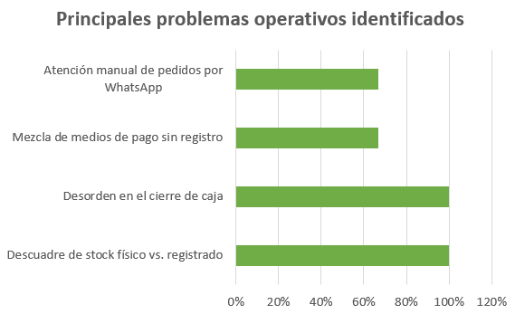

El descuadre de stock y el desorden en caja concentran el mayor porcentaje con un 100% cada uno, lo que los posiciona como los problemas más críticos y compartidos por la totalidad del segmento. La mezcla de medios de pago sin registro y la atención manual de WhatsApp, presentes en el 67% de los casos, complementan un panorama donde la falta de control operativo afecta tanto el inventario como la conciliación financiera y la atención al cliente.
**Método de control de inventario actual**

  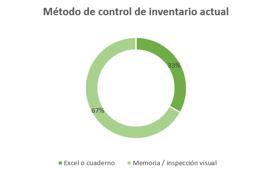

El 67% del segmento no cuenta con ninguna herramienta de registro estructurada y depende de la memoria o la revisión visual para controlar su inventario. Solo el 33% utiliza Excel, aunque con limitaciones reconocidas. Este dato indica que Entreprenly no compite con sistemas digitales existentes en estos perfiles, sino que se posiciona como la primera solución formal de gestión, lo que reduce la resistencia al cambio y facilita la adopción desde cero.

**Aceptación de balanza inteligente para inventario**

  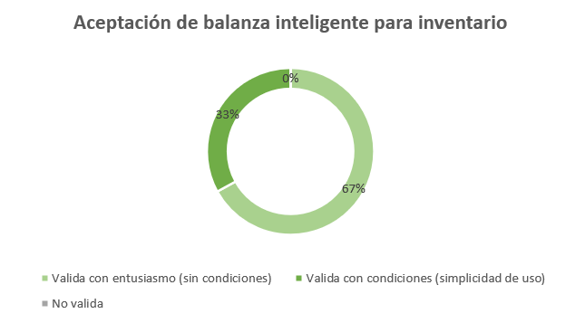

El 100% del segmento aceptó positivamente la propuesta de inventario automatizado por peso. El 67% lo hizo sin reservas, mientras que el 33% restante condicionó su aceptación a que el sistema sea sencillo de configurar y operar. La ausencia total de rechazo valida directamente una de las funcionalidades centrales de Entreprenly y confirma que el segmento percibe valor real en reemplazar el conteo manual por una solución basada en sensores.

**Interés en automatización de pedidos por WhatsApp**

  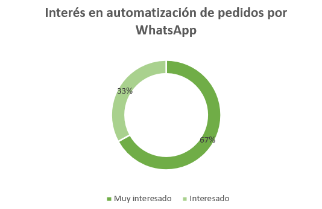

La totalidad del segmento mostró interés en automatizar la atención de pedidos por WhatsApp. El 67% lo valoró como una prioridad que reduciría la carga operativa del personal, mientras que el 33% restante lo consideró una mejora útil para agilizar el despacho. La unanimidad en este punto confirma que el canal conversacional es percibido como una solución real a un problema cotidiano, y no como una funcionalidad opcional o de baja relevancia para el negocio.

**Conclusiones**
Los comerciantes entrevistados operan con herramientas insuficientes o inexistentes para el control de su negocio. La dependencia de la memoria, la mezcla de fondos y la gestión manual de WhatsApp generan pérdidas económicas y decisiones tardías. La totalidad del segmento validó positivamente las funcionalidades centrales de Entreprenly, lo que confirma que existe una necesidad real y una disposición clara hacia la digitalización, siempre que la solución sea práctica y fácil de adoptar desde el primer día.

#### Segmento objetivo #2: Clientes finales

**Hallazgos**

- El 100% ha tenido al menos una experiencia negativa en la que pagó por un producto agotado, lo que generó pérdida de confianza en el negocio.
- El 100% afirmó que un sistema con validación de stock por sensor de peso les brindaría mayor seguridad al comprar desde su celular.
- El 100% señaló la demora en la respuesta por WhatsApp como una de sus principales frustraciones.
- El 67% prefiere billeteras digitales como medio de pago principal; el 33% combina tarjeta con billetera digital. Ninguno prioriza el efectivo.
- El 67% dejaría de ir presencialmente al mercado si pudiera comprar de forma rápida y segura por WhatsApp.
- El 33% restante lo haría bajo la condición de recibir confirmaciones automáticas confiables.
- El 67% considera indispensable recibir confirmación automática del sistema al pagar por adelantado.

**Medio de pago preferido**

  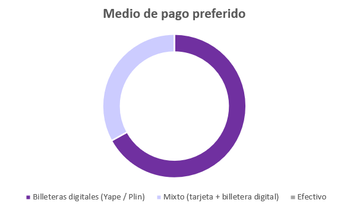

El gráfico evidencia una clara preferencia por los medios de pago digitales: el 67% de los entrevistados utiliza billeteras digitales como Yape o Plin como medio principal, mientras que el 33% restante combina tarjeta con billetera digital. Ningún entrevistado prioriza el efectivo, lo que confirma que la conciliación de pagos electrónicos es una necesidad central para este segmento y valida el enfoque de Entreprenly en la confirmación automática de cobros digitales.

**Principales frustraciones al comprar en minimarkets locales**

  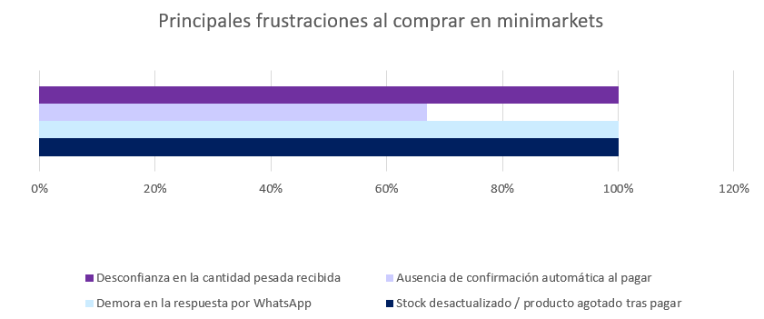

Las principales frustraciones se concentran en la incertidumbre del stock y la demora en la atención: el 100% del segmento ha pagado alguna vez por un producto que resultó estar agotado y el 100% señaló la lentitud en la respuesta por WhatsApp como una de sus mayores molestias. Estas experiencias negativas erosionan la confianza en el negocio local y orientan el diseño de Entreprenly hacia la validación de stock en tiempo real y la confirmación inmediata de pedidos.

**Confianza ante stock validado por sensor de peso**

  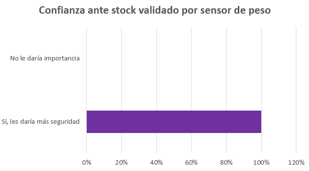

El 100% del segmento afirmó que un sistema con validación de stock mediante sensor de peso les brindaría mayor seguridad al comprar desde su celular. La unanimidad confirma que la desconfianza hacia el stock informado es una barrera real de compra y que la validación física del inventario por peso es percibida como un factor decisivo de confianza, respaldando directamente una de las funcionalidades centrales de Entreprenly.

**Disposición a reemplazar la compra presencial por canal digital**

  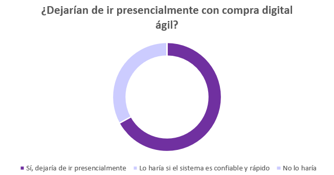

El 67% del segmento afirmó que dejaría de ir presencialmente al mercado si pudiera realizar compras de forma ágil y segura por WhatsApp. El 33% restante estaría dispuesto a hacerlo bajo la condición de recibir confirmaciones automáticas confiables, condición que Entreprenly está diseñada para cumplir. La ausencia total de rechazo evidencia que el canal conversacional tiene un potencial real de desplazar la visita presencial para compras de rutina en este perfil de consumidor.

**Conclusiones**
Los clientes finales entrevistados representan un perfil digital, exigente y con experiencias previas de frustración en el comercio local. Su principal barrera no es la tecnología, sino la falta de confianza en el stock disponible, en el proceso de pago y en la respuesta oportuna del negocio. Entreprenly responde directamente a estas tres barreras mediante la validación de stock por sensor, la confirmación automática de cobros y el chatbot de WhatsApp. Esto posiciona a la plataforma no solo como una herramienta de eficiencia operativa para el comerciante, sino también como un mecanismo de fidelización del consumidor final.

## 2.3. Needfinding

### 2.3.1. User Personas

**Segmento 1: Comerciantes (Dueños de Minimarkets/Mercados)**

  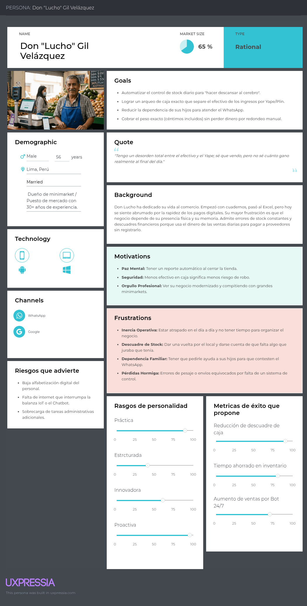

**Segmento 2: Clientes Finales**

  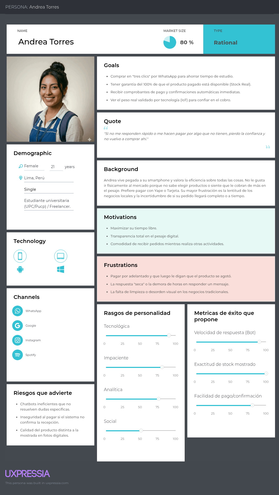

### 2.3.2. User Task Matrix

**Segmento 1: Comerciantes (Dueños de Minimarkets/Mercados)**

<table>
  <thead>
    <tr>
      <th>Tarea</th>
      <th>Frecuencia</th>
      <th>Importancia</th>
    </tr>
  </thead>
  <tbody>
    <tr>
      <td>Verificar el stock disponible de productos en el local</td>
      <td>Always</td>
      <td>High</td>
    </tr>
    <tr>
      <td>Registrar las ventas del día (efectivo y digital)</td>
      <td>Always</td>
      <td>High</td>
    </tr>
    <tr>
      <td>Cuadrar la caja al cierre del turno</td>
      <td>Always</td>
      <td>High</td>
    </tr>
    <tr>
      <td>Separar ingresos en efectivo de pagos por Yape/Plin/POS</td>
      <td>Often</td>
      <td>High</td>
    </tr>
    <tr>
      <td>Atender pedidos de clientes por WhatsApp</td>
      <td>Often</td>
      <td>High</td>
    </tr>
    <tr>
      <td>Reponer productos cuando detecta quiebre de stock</td>
      <td>Often</td>
      <td>High</td>
    </tr>
    <tr>
      <td>Verificar que el peso despachado coincida con lo cobrado</td>
      <td>Often</td>
      <td>High</td>
    </tr>
    <tr>
      <td>Delegar la atención de WhatsApp a un familiar o empleado</td>
      <td>Sometimes</td>
      <td>Medium</td>
    </tr>
    <tr>
      <td>Revisar movimientos de Yape o Plin desde el celular</td>
      <td>Often</td>
      <td>Medium</td>
    </tr>
    <tr>
      <td>Realizar conteo manual de inventario</td>
      <td>Sometimes</td>
      <td>High</td>
    </tr>
    <tr>
      <td>Coordinar pedidos con proveedores</td>
      <td>Sometimes</td>
      <td>Medium</td>
    </tr>
    <tr>
      <td>Detectar pérdidas o mermas en productos</td>
      <td>Rarely</td>
      <td>High</td>
    </tr>
  </tbody>
</table>

**Segmento 2: Clientes Finales**

<table>
  <thead>
    <tr>
      <th>Tarea</th>
      <th>Frecuencia</th>
      <th>Importancia</th>
    </tr>
  </thead>
  <tbody>
    <tr>
      <td>Buscar productos disponibles en negocios cercanos</td>
      <td>Often</td>
      <td>High</td>
    </tr>
    <tr>
      <td>Consultar por WhatsApp si un producto está disponible</td>
      <td>Often</td>
      <td>High</td>
    </tr>
    <tr>
      <td>Realizar el pago de una compra de forma digital (Yape/Tarjeta)</td>
      <td>Always</td>
      <td>High</td>
    </tr>
    <tr>
      <td>Verificar que el producto recibido coincida con lo pedido</td>
      <td>Often</td>
      <td>High</td>
    </tr>
    <tr>
      <td>Esperar confirmación de pago o recibo tras una compra</td>
      <td>Always</td>
      <td>High</td>
    </tr>
    <tr>
      <td>Evaluar si confiar en un negocio local para comprar en línea</td>
      <td>Sometimes</td>
      <td>High</td>
    </tr>
    <tr>
      <td>Comparar precios entre negocios locales</td>
      <td>Sometimes</td>
      <td>Medium</td>
    </tr>
    <tr>
      <td>Ir presencialmente al mercado o minimarket</td>
      <td>Sometimes</td>
      <td>Medium</td>
    </tr>
    <tr>
      <td>Revisar el estado de su pedido tras confirmar la compra</td>
      <td>Often</td>
      <td>Medium</td>
    </tr>
    <tr>
      <td>Reclamar o solicitar devolución por producto agotado o incorrecto</td>
      <td>Rarely</td>
      <td>High</td>
    </tr>
  </tbody>
</table>

**Análisis del User Task Matrix**
Las tareas con mayor frecuencia e importancia para el segmento de comerciantes son la verificación de stock, el registro de ventas y el cuadre de caja, las tres calificadas como Always y High. Esto confirma que su jornada gira en torno al control operativo del negocio y que cualquier herramienta que automatice o simplifique estas tareas tendrá una adopción directa e inmediata. La atención de pedidos por WhatsApp y la separación de medios de pago, calificadas como Often y High, representan tareas críticas que hoy realizan de forma manual y con alta probabilidad de error.

Para el segmento de clientes finales, las tareas de mayor frecuencia e importancia son el pago digital y la espera de confirmación, ambas calificadas como Always y High, junto con la consulta de disponibilidad por WhatsApp y la verificación del pedido recibido, calificadas como Often y High. Esto indica que su experiencia de compra está completamente mediada por el canal digital y que la confianza en el proceso depende directamente de recibir respuestas rápidas y confirmaciones automáticas.

La principal coincidencia entre ambos segmentos es que los dos otorgan alta importancia a la verificación del stock real: el segmento de comerciantes desde el lado operativo del negocio y el segmento de clientes finales desde el lado del consumidor que no quiere pagar por algo que no existe. La principal diferencia radica en la frecuencia del ontacto presencial: el segmento de comerciantes opera físicamente en el local todos los días, mientras que el segmento de clientes finales busca reducir o eliminar esa necesidad. Esta divergencia refuerza el valor de Entreprenly como puente entre la operación física del comerciante y la experiencia digital del cliente.

### 2.3.3. User Journey Mapping

**Segmento 1: Comerciantes (Dueños de Minimarkets/Mercados)**

  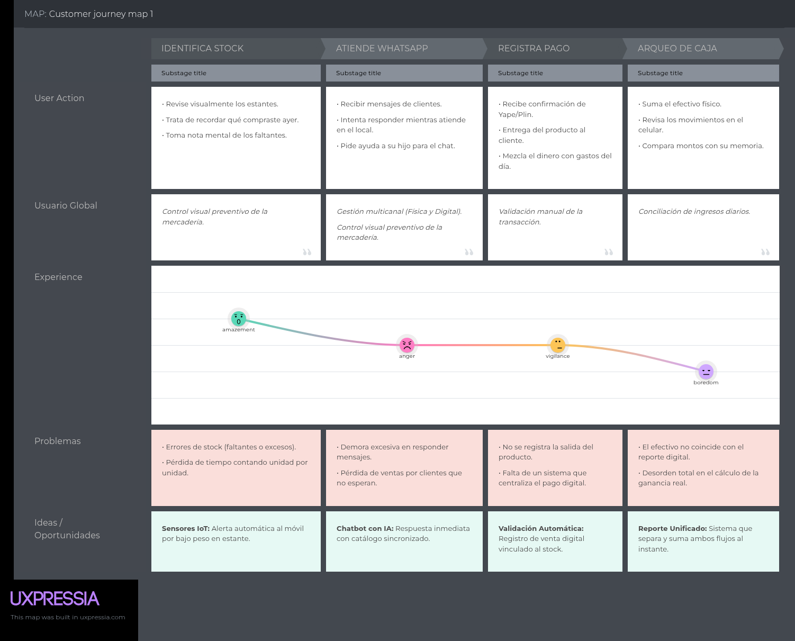

**Segmento 2: Clientes Finales**

  

### 2.3.4. Empathy Mapping

**Segmento 1: Comerciantes (Dueños de Minimarkets/Mercados)**

  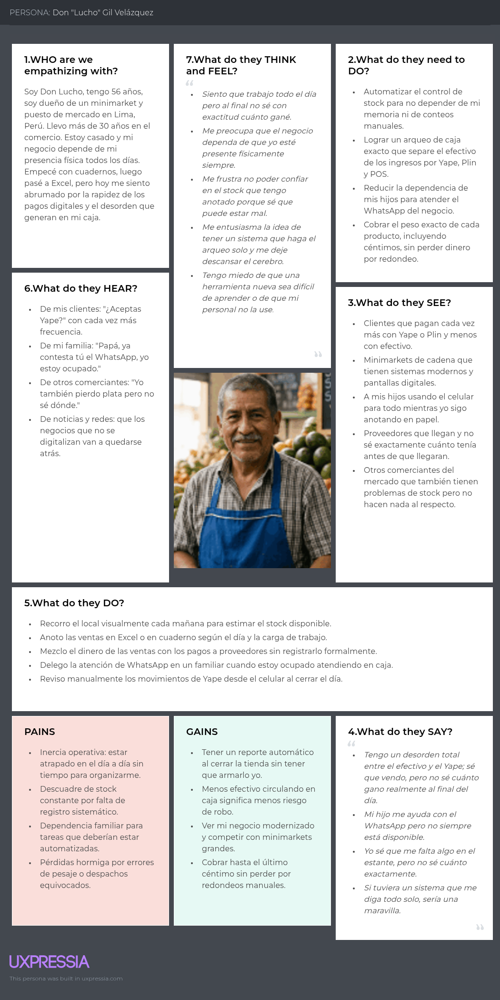

**Segmento 2: Clientes Finales**

  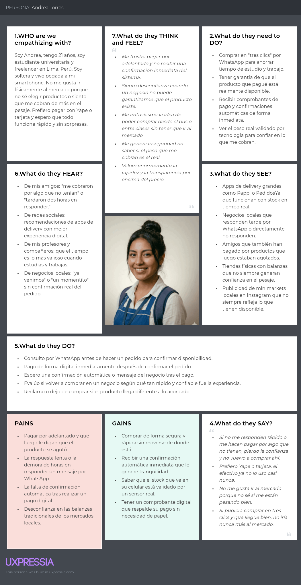

### 2.3.5. Big Picture EventStorming

El Big Picture Event Storming es una técnica de modelado colaborativo creada por Alberto Brandolini que permite a un equipo explorar y comprender el dominio de un negocio en pocas horas. A diferencia de las sesiones de análisis tradicionales, esta técnica se centra en identificar los Domain Events más significativos del negocio —es decir, los hechos relevantes que ocurren en el dominio— y organizarlos cronológicamente para construir una visión compartida del landscape del negocio. No se busca un diseño técnico detallado, sino una comprensión de alto nivel que exponga procesos clave, actores, sistemas externos y potenciales problemas u oportunidades.
El equipo Kauflink realizó una sesión colaborativa de Big Picture Event Storming sobre el dominio de Entreprenly, la plataforma de gestión operativa para minimarkets, bodegas y puestos de mercado. El objetivo fue modelar el ciclo de vida completo de la operación diaria de un comercio minorista de alimentos frescos: desde la configuración de productos hasta el cierre financiero del turno. La sesión fue guiada siguiendo el Step-by-Step Guide disponible en https://bit.ly/bpes-guide, y se utilizó Miro como herramienta de tablero digital colaborativo.

**Proceso realizado por el equipo**

A continuación se describe cada una de las etapas realizadas durante la sesión de Big Picture Event Storming, acompañadas de las capturas del tablero en Miro correspondientes a cada fase.

**Paso 1: Preparación del espacio de trabajo**

Antes de iniciar la sesión, el equipo preparó el tablero de Miro con el espacio de diseño necesario: un área de trabajo infinita con la leyenda de colores de sticky notes visible para todos los participantes, y una agenda visual de los pasos a seguir fijada en el lateral del tablero.

Se definieron los colores de cada tipo de elemento según la convención del método:

<table>
  <thead>
    <tr>
      <th>Elemento</th>
      <th>Descripción</th>
    </tr>
  </thead>
  <tbody>
    <tr>
      <td font-weight:bold; text-align:center;">Domain Event</td>
      <td>Hecho relevante que ocurrió en el dominio del negocio. Se redacta en tiempo pasado.</td>
    </tr>
    <tr>
      <td font-weight:bold; text-align:center;">Actor</td>
      <td>Persona con un rol específico que desencadena o participa en un evento del dominio.</td>
    </tr>
    <tr>
      <td font-weight:bold; text-align:center;">External System</td>
      <td>Sistema externo que interactúa con la plataforma, enviando o recibiendo información.</td>
    </tr>
    <tr>
      <td font-weight:bold; text-align:center;">Hot Spot</td>
      <td>Área de incertidumbre, conflicto o riesgo que requiere atención o resolución posterior.</td>
    </tr>
  </tbody>
</table>

En esta primera etapa, cada miembro propuso de forma individual los eventos de dominio relevantes para el sistema, redactándolos en tiempo pasado y representándolos con post-its de color naranja. Se buscó cubrir los flujos del comerciante y del cliente final sin filtrar ni debatir, generando el mayor volumen posible de eventos. Los eventos identificados abarcaron los procesos de registro de productos, control de inventario por peso (IoT), ventas presenciales, pedidos por WhatsApp, conciliación de caja y gestión de alertas operativas.

  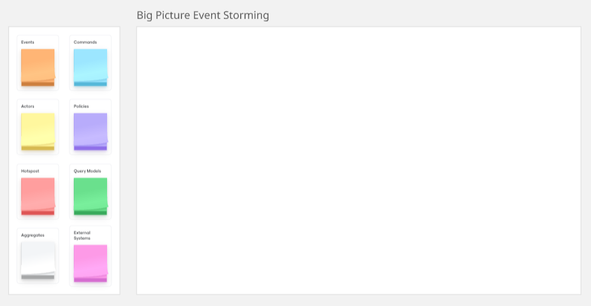

---

**Paso 2: Energizante colaborativo**

Para activar la participación y romper la dinámica habitual de reuniones, el equipo inició la sesión con una dinámica colaborativa breve. Dado que la sesión fue realizada de forma remota, se utilizó la dinámica de Collaborative Word Storm: cada participante escribió libremente en el tablero de Miro los primeros términos o situaciones del negocio que le venían a la mente al pensar en un comerciante de barrio peruano gestionando su negocio. Esto preparó a todos los integrantes para la fase de generación de eventos.

**Paso 3: Presentación del objetivo y alcance**

El equipo definió y comunicó a todos los participantes el objetivo, el alcance y los casos de uso que guiarían la sesión

- **Objetivo:** Obtener una visión de alto nivel del dominio de negocio de Entreprenly, identificando los eventos más relevantes del ciclo de vida operativo de un minimarket o puesto de mercado.

- **Alcance:** La operación diaria completa de un comercio minorista de alimentos frescos, desde la apertura del turno hasta el cierre de caja, incluyendo los canales de venta presencial y por WhatsApp, y la integración con balanzas inteligentes (IoT).

- Casos de uso principales a explorar:
  - Gestión de inventario de productos perecederos
  - Registro de ventas presenciales con conciliación de pagos
  - Atención de pedidos por WhatsApp con validación de stock
  - Detección de descuadres entre stock físico y digital

Para arrancar la sesión, el facilitador colocó el primer Domain Event en el tablero como ejemplo: _Lote registrado_

  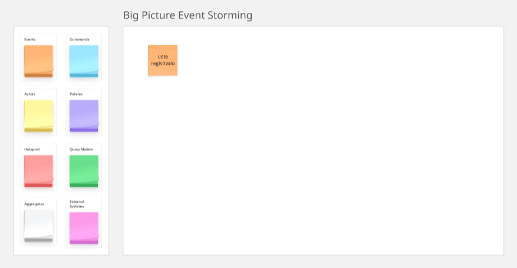

---

**Paso 4: Generación de Domain Events**

En esta fase, cada integrante del equipo generó de forma libre e independiente todos los Domain Events que consideró relevantes para el dominio de Entreprenly. Los eventos se redactaron en tiempo pasado y en inglés, siguiendo la convención del Ubiquitous Language del proyecto. No hubo restricciones ni orden; la idea fue plasmar el mayor número posible de eventos significativos del negocio.

La fase duró aproximadamente 20 minutos, hasta que el ritmo de generación de nuevos eventos disminuyó notablemente.

  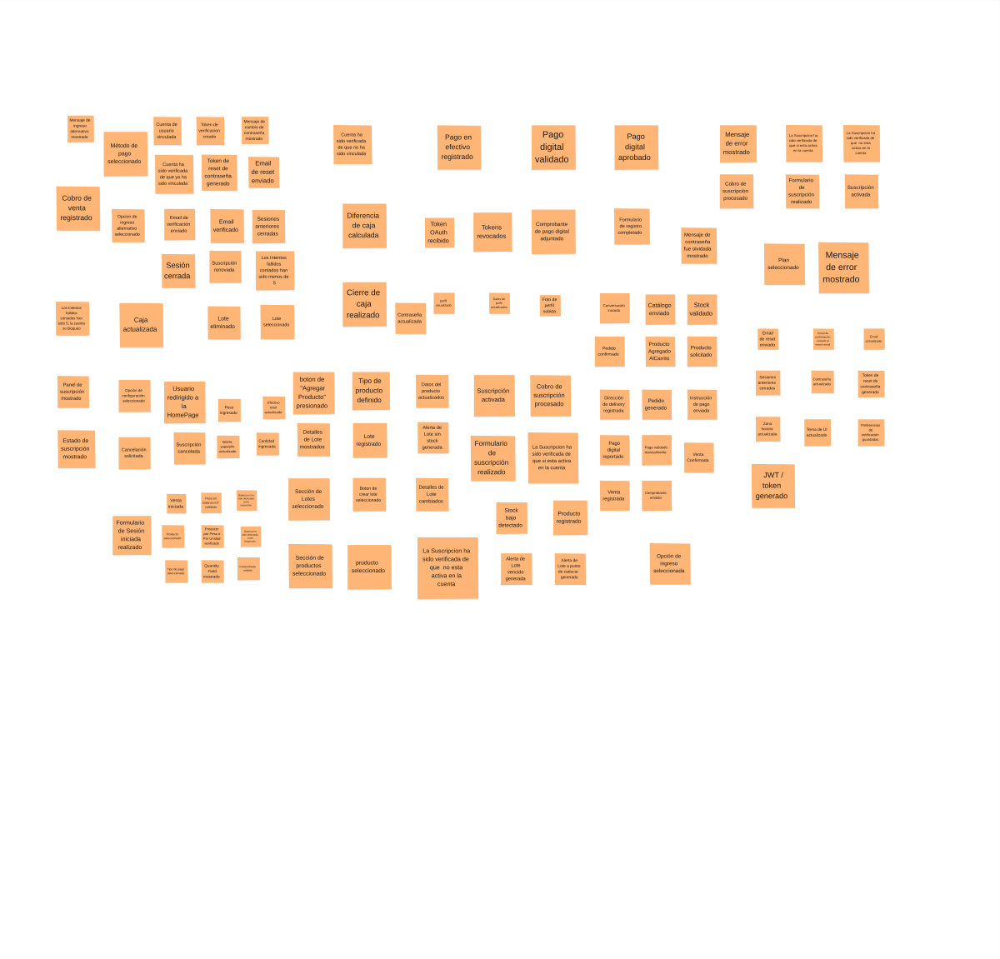

---

**Paso 5: Ordenamiento cronológico de Domain Events**

Una vez generados todos los eventos, el equipo procedió a organizarlos cronológicamente de izquierda a derecha en el tablero, representando el flujo temporal de la operación del negocio. Esta etapa fue la más rica en discusión, ya que los distintos puntos de vista de los integrantes afloraron al intentar acordar el orden y la relación entre eventos.

  

---

**Paso 6: Incorporación de Actores y Sistemas externos**

Con los eventos ya ordenados, el equipo identificó y colocó los Actores (personas con un rol específico) y los Sistemas externos que desencadenan o responden a los eventos del dominio.

  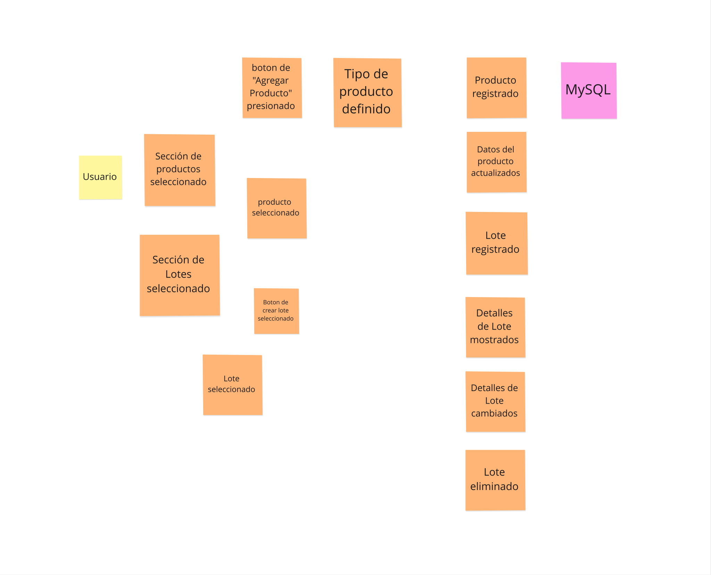

  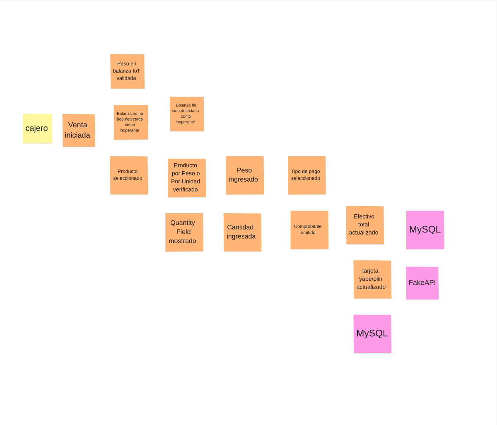

  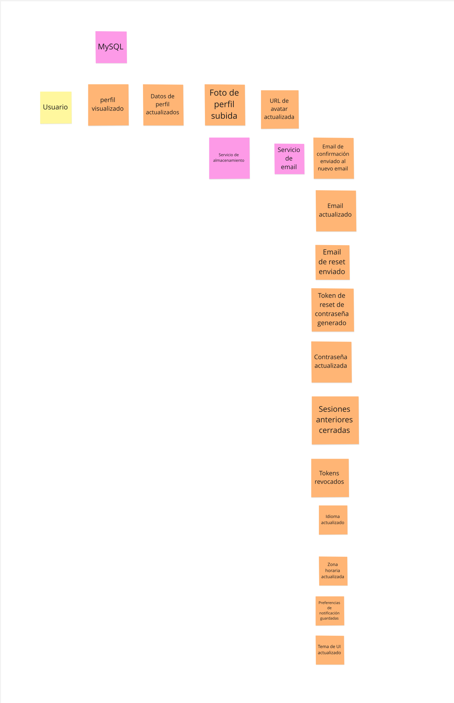

  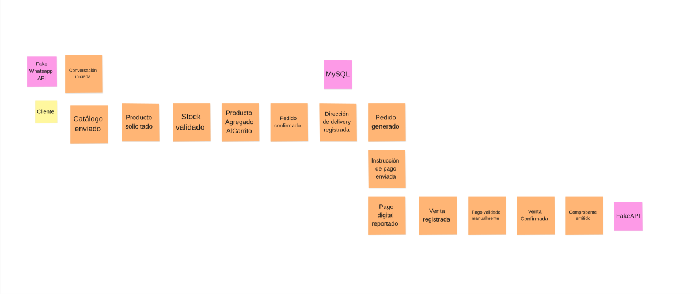

  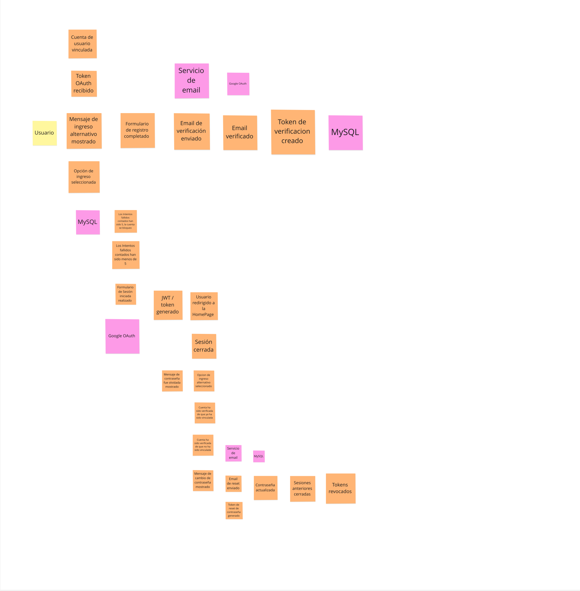

  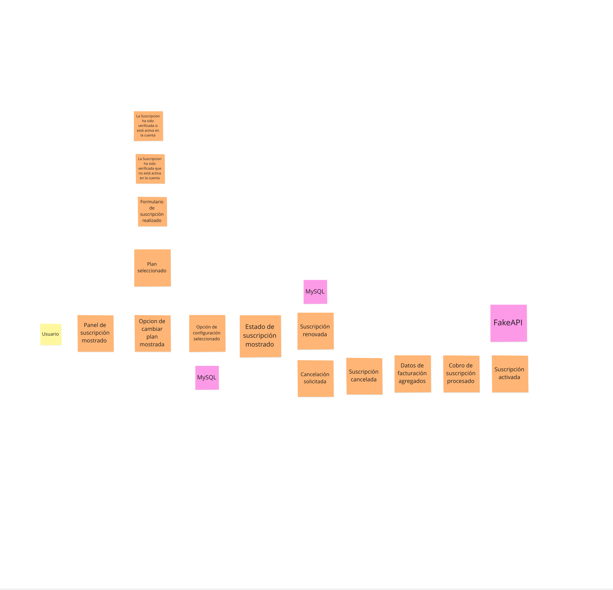

Como resultado de la sesión, el equipo consolidó una visión compartida del dominio operativo de Entreprenly, identificando siete flujos principales: inicio de sesión, proceso de suscripción, configuración de suscripción, venta presencial, gestión de inventario, chatbot de pedidos por WhatsApp y gestión de perfil y configuración. Esta base sirvió como punto de partida para la definición del Ubiquitous Language y el posterior Design-Level Event Storming.

### 2.3.6. Ubiquitous Language

A continuación se presenta el glosario de términos y conceptos del dominio de negocio de Entreprenly. Estos términos han sido definidos de forma clara y sin ambigüedad, con el objetivo de que todos los miembros del equipo y stakeholders compartan un lenguaje común durante el ciclo de vida del proyecto. Los términos se presentan en inglés, idioma base del dominio, acompañados de su definición en español.

<table border="1" cellpadding="10" cellspacing="0" style="border-collapse: collapse; width: 100%;">
  <thead>
    <tr color: white;">
      <th style="width: 25%;">Término (EN)</th>
      <th>Definición</th>
    </tr>
  </thead>
  <tbody>
    <tr>
      <td><strong>Merchant</strong></td>
      <td>Dueño o administrador de un minimarket, bodega o puesto de mercado que gestiona su operación a través de Entreprenly.</td>
    </tr>
    <tr>
      <td><strong>Customer</strong></td>
      <td>Cliente final que realiza pedidos a través del canal de WhatsApp.</td>
    </tr>
    <tr>
      <td><strong>Product</strong></td>
      <td>Artículo registrado en el sistema con nombre, precio y categoría. Puede ser de tipo unitario o vendido por peso.</td>
    </tr>
    <tr>
      <td><strong>Unit Product</strong></td>
      <td>Producto cuyo stock se mide en unidades individuales y tiene un precio fijo por unidad.</td>
    </tr>
    <tr>
      <td><strong>Weight Product</strong></td>
      <td>Producto cuyo stock se representa como el peso total disponible en kilogramos y tiene un precio por kilogramo.</td>
    </tr>
    <tr>
      <td><strong>Stock</strong></td>
      <td>Cantidad disponible de un producto en el local, expresada en unidades o kilogramos según el tipo de producto.</td>
    </tr>
    <tr>
      <td><strong>Batch</strong></td>
      <td>Lote de un producto registrado con fecha de caducidad, utilizado para el control y trazabilidad de productos perecederos.</td>
    </tr>
    <tr>
      <td><strong>Scale Reading</strong></td>
      <td>Lectura enviada por la balanza inteligente que indica el peso actual de un producto en el estante en tiempo real.</td>
    </tr>
    <tr>
      <td><strong>Stock Discrepancy</strong></td>
      <td>Diferencia detectada entre el stock registrado en el sistema y el peso real reportado por la balanza inteligente.</td>
    </tr>
    <tr>
      <td><strong>Sale</strong></td>
      <td>Transacción registrada por la venta de uno o más productos a un cliente, ya sea de forma presencial o a través del chatbot de WhatsApp.</td>
    </tr>
    <tr>
      <td><strong>Cash Register</strong></td>
      <td>Registro digital de los ingresos en efectivo acumulados durante un turno de trabajo del comerciante.</td>
    </tr>
    <tr>
      <td><strong>Shift</strong></td>
      <td>Período de trabajo del comerciante durante el cual se registran ventas y al final del cual se realiza el cierre y conciliación de caja.</td>
    </tr>
    <tr>
      <td><strong>Order</strong></td>
      <td>Pedido realizado por un cliente a través del chatbot de WhatsApp, con los productos y cantidades especificadas.</td>
    </tr>
    <tr>
      <td><strong>Alert</strong></td>
      <td>Notificación generada automáticamente por el sistema ante situaciones críticas como stock bajo o descuadre detectado entre inventario físico y digital.</td>
    </tr>
    <tr>
      <td><strong>Subscription</strong></td>
      <td>Plan contratado por el comerciante para acceder a las funcionalidades de la plataforma Entreprenly.</td>
    </tr>
    <tr>
      <td><strong>Smart Scale</strong></td>
      <td>Balanza inteligente conectada al sistema que envía lecturas de peso en tiempo real para validar el stock físico disponible en el estante.</td>
    </tr>
    <tr>
      <td><strong>Inventory Sync</strong></td>
      <td>Proceso de conciliación entre el stock registrado digitalmente en el sistema y el peso real detectado por la balanza inteligente.</td>
    </tr>
    <tr>
      <td><strong>Chatbot</strong></td>
      <td>Asistente conversacional integrado en WhatsApp que permite a los clientes realizar pedidos, consultar disponibilidad de productos y recibir confirmaciones de compra de forma automatizada.</td>
    </tr>
    <tr>
      <td><strong>Perishable Product</strong></td>
      <td>Producto con fecha de caducidad definida que requiere control especial de rotación y merma para evitar pérdidas económicas.</td>
    </tr>
    <tr>
      <td><strong>Shrinkage</strong></td>
      <td>Pérdida de producto no registrada como venta, que puede deberse a merma, deterioro, error de pesaje o retiro no autorizado.</td>
    </tr>
  </tbody>
</table>

## 2.4. Requirements Specification

En esta sección se especifican los requisitos funcionales de Entreprenly mediante las User Stories, el Impact Mapping y el Product Backlog. Estos artefactos permiten definir el alcance del producto, relacionar los objetivos de negocio con las funcionalidades propuestas y organizar el trabajo del equipo de acuerdo con el valor y la prioridad de cada requerimiento.

### 2.4.1. User Stories

En esta sección se especifican las épicas y las User Stories que definen el alcance funcional de Entreprenly como una solución compuesta por una aplicación móvil y una Landing Page. Se conservan los identificadores del producto original para mantener la trazabilidad, pero las interacciones del dashboard se adaptan al contexto móvil. Primero se presentan las épicas con el conjunto de User Stories que agrupan y luego se detalla cada historia con su descripción y criterios de aceptación.

### Épicas

<table>
  <tbody>
    <tr>
      <td><strong>EPIC - 01</strong></td>
      <td colspan="2"><strong>Gestión de inventario</strong></td>
    </tr>
    <tr>
      <td colspan="3"><strong>Descripción:</strong>  Como usuario quiero gestionar mi inventario (lotes y productos) para visualizar los datos con mayor claridad.</td>
    </tr>
    <tr>
      <td><strong>ID</strong></td>
      <td colspan="2"><strong>User Story</strong></td>
    </tr>
    <tr>
      <td>US-01</td>
      <td colspan="2">Agregar productos</td>
    </tr>
    <tr>
      <td>US-02</td>
      <td colspan="2">Editar lotes</td>
    </tr>
    <tr>
      <td>US-03</td>
      <td colspan="2">Agregar lotes</td>
    </tr>
    <tr>
      <td>US-04</td>
      <td colspan="2">Eliminar lotes</td>
    </tr>
    <tr>
      <td>US-05</td>
      <td colspan="2">Editar productos</td>
    </tr>
    <tr>
      <td>US-06</td>
      <td colspan="2">Visualizar detalles de lotes</td>
    </tr>
    <tr>
      <td>US-07</td>
      <td colspan="2">Visualizar detalles de producto</td>
    </tr>
    <tr>
      <td>US-08</td>
      <td colspan="2">Buscar productos</td>
    </tr>
    <tr>
      <td>US-09</td>
      <td colspan="2">Crear lotes</td>
    </tr>
    <tr>
      <td>US-10</td>
      <td colspan="2">Escanear código QR en inventario</td>
    </tr>
    <tr>
      <td>US-90</td>
      <td colspan="2">Eliminar productos</td>
    </tr>
    <tr>
      <td>US-95</td>
      <td colspan="2">Buscar lotes</td>
    </tr>
  </tbody>
</table>

<table>
  <tbody>
    <tr>
      <td><strong>EPIC - 02</strong></td>
      <td colspan="2"><strong>Alertas y notificaciones móviles de inventario</strong></td>
    </tr>
    <tr>
      <td colspan="3"><strong>Descripción:</strong>  Como usuario quiero recibir alertas dentro de la aplicación y notificaciones push sobre el estado de mis lotes para organizarme mejor.</td>
    </tr>
    <tr>
      <td><strong>ID</strong></td>
      <td colspan="2"><strong>User Story</strong></td>
    </tr>
    <tr>
      <td>US-11</td>
      <td colspan="2">Detectar stock agotado</td>
    </tr>
    <tr>
      <td>US-12</td>
      <td colspan="2">Mostrar alertas de estado al visualizar detalles</td>
    </tr>
    <tr>
      <td>US-13</td>
      <td colspan="2">Visualizar dashboard móvil de lotes</td>
    </tr>
    <tr>
      <td>US-14</td>
      <td colspan="2">Recibir notificación de caducidad de lote</td>
    </tr>
  </tbody>
</table>

<table>
  <tbody>
    <tr>
      <td><strong>EPIC - 03</strong></td>
      <td colspan="2"><strong>Proceso de suscripción</strong></td>
    </tr>
    <tr>
      <td colspan="3"><strong>Descripción:</strong>  Como usuario con una cuenta creada y el Plan Free asignado por defecto, quiero iniciar la suscripción al Plan Control desde la Landing Page o desde la sección "Suscripción" de la aplicación móvil para habilitar las funcionalidades premium.</td>
    </tr>
    <tr>
      <td><strong>ID</strong></td>
      <td colspan="2"><strong>User Story</strong></td>
    </tr>
    <tr>
      <td>US-15</td>
      <td colspan="2">Seleccionar plan de suscripción</td>
    </tr>
    <tr>
      <td>US-16</td>
      <td colspan="2">Iniciar proceso de suscripción</td>
    </tr>
    <tr>
      <td>US-17</td>
      <td colspan="2">Registrar datos de facturación</td>
    </tr>
    <tr>
      <td>US-18</td>
      <td colspan="2">Procesar cobro de suscripción</td>
    </tr>
    <tr>
      <td>US-19</td>
      <td colspan="2">Activar suscripción</td>
    </tr>
  </tbody>
</table>

<table>
  <tbody>
    <tr>
      <td><strong>EPIC - 04</strong></td>
      <td colspan="2"><strong>Configuración de suscripción</strong></td>
    </tr>
    <tr>
      <td colspan="3"><strong>Descripción:</strong>  Como usuario, quiero visualizar y gestionar mi plan actual desde la sección "Suscripción" de la aplicación móvil para consultar su estado, renovarlo o cancelarlo según mis necesidades.</td>
    </tr>
    <tr>
      <td><strong>ID</strong></td>
      <td colspan="2"><strong>User Story</strong></td>
    </tr>
    <tr>
      <td>US-20</td>
      <td colspan="2">Visualizar panel de suscripción</td>
    </tr>
    <tr>
      <td>US-21</td>
      <td colspan="2">Consultar estado de suscripción</td>
    </tr>
    <tr>
      <td>US-22</td>
      <td colspan="2">Renovar suscripción</td>
    </tr>
    <tr>
      <td>US-23</td>
      <td colspan="2">Solicitar cancelación de suscripción</td>
    </tr>
    <tr>
      <td>US-24</td>
      <td colspan="2">Cancelar suscripción</td>
    </tr>
    <tr>
      <td>US-25</td>
      <td colspan="2">Agregar método de pago de suscripción</td>
    </tr>
    <tr>
      <td>US-26</td>
      <td colspan="2">Completar datos fiscales de suscripción</td>
    </tr>
    <tr>
      <td>US-27</td>
      <td colspan="2">Descargar historial de suscripción</td>
    </tr>
    <tr>
      <td>US-96</td>
      <td colspan="2">Gestionar métodos de pago de suscripción</td>
    </tr>
  </tbody>
</table>

<table>
  <tbody>
    <tr>
      <td><strong>EPIC - 05</strong></td>
      <td colspan="2"><strong>Gestión de Transacciones y Operaciones de Venta</strong></td>
    </tr>
    <tr>
      <td colspan="3"><strong>Descripción:</strong>  Como comerciante, quiero gestionar el proceso completo de registro de ventas, desde la selección de productos hasta la emisión del comprobante, para asegurar una operación ágil y sin errores.</td>
    </tr>
    <tr>
      <td><strong>ID</strong></td>
      <td colspan="2"><strong>User Story</strong></td>
    </tr>
    <tr>
      <td>US-28</td>
      <td colspan="2">Buscar productos en el inventario y validar su tipo de medida</td>
    </tr>
    <tr>
      <td>US-29</td>
      <td colspan="2">Registrar la cantidad de unidades en el Ticket de Venta</td>
    </tr>
    <tr>
      <td>US-30</td>
      <td colspan="2">Capturar el peso mediante balanza IoT o ingreso manual</td>
    </tr>
    <tr>
      <td>US-31</td>
      <td colspan="2">Gestionar el desglose y cálculo del Ticket de Venta</td>
    </tr>
    <tr>
      <td>US-32</td>
      <td colspan="2">Seleccionar el método de pago para la transacción</td>
    </tr>
    <tr>
      <td>US-33</td>
      <td colspan="2">Finalizar la venta y emitir el comprobante de pago</td>
    </tr>
    <tr>
      <td>US-34</td>
      <td colspan="2">Cancelar venta en curso</td>
    </tr>
  </tbody>
</table>

<table>
  <tbody>
    <tr>
      <td><strong>EPIC - 06</strong></td>
      <td colspan="2"><strong>Control de Ingresos y Monitoreo de Caja</strong></td>
    </tr>
    <tr>
      <td colspan="3"><strong>Descripción:</strong>  Como dueño del negocio, quiero supervisar los flujos de dinero entrante en tiempo real, para tener visibilidad total sobre la liquidez y los métodos de pago utilizados durante el día.</td>
    </tr>
    <tr>
      <td><strong>ID</strong></td>
      <td colspan="2"><strong>User Story</strong></td>
    </tr>
    <tr>
      <td>US-35</td>
      <td colspan="2">Clasificar automáticamente los ingresos según el medio de pago</td>
    </tr>
    <tr>
      <td>US-36</td>
      <td colspan="2">Monitorear el Resumen de Caja en tiempo real dentro del panel de ventas</td>
    </tr>
    <tr>
      <td>US-97</td>
      <td colspan="2">Consultar el historial de ventas del día</td>
    </tr>
    <tr>
      <td>US-98</td>
      <td colspan="2">Consultar el detalle de una venta registrada</td>
    </tr>
  </tbody>
</table>

<table>
  <tbody>
    <tr>
      <td><strong>EPIC - 07</strong></td>
      <td colspan="2"><strong>Configurar Chatbot de WhatsApp Business</strong></td>
    </tr>
    <tr>
      <td colspan="3"><strong>Descripción:</strong>  Como comerciante, quiero configurar y vincular el chatbot de WhatsApp Business desde la aplicación móvil para activar la atención automatizada de clientes.</td>
    </tr>
    <tr>
      <td><strong>ID</strong></td>
      <td colspan="2"><strong>User Story</strong></td>
    </tr>
    <tr>
      <td>US-37</td>
      <td colspan="2">Vincular cuenta de WhatsApp Business desde el dispositivo móvil</td>
    </tr>
    <tr>
      <td>US-38</td>
      <td colspan="2">Consultar estado de vinculación del chatbot</td>
    </tr>
  </tbody>
</table>

<table>
  <tbody>
    <tr>
      <td><strong>EPIC - 08</strong></td>
      <td colspan="2"><strong>Gestionar conversaciones desde la aplicación móvil</strong></td>
    </tr>
    <tr>
      <td colspan="3"><strong>Descripción:</strong>  Como comerciante, quiero visualizar y gestionar los chats de mis clientes directamente desde la aplicación móvil para atenderlos sin salir de Entreprenly.</td>
    </tr>
    <tr>
      <td><strong>ID</strong></td>
      <td colspan="2"><strong>User Story</strong></td>
    </tr>
    <tr>
      <td>US-39</td>
      <td colspan="2">Visualizar conversaciones de clientes en la aplicación móvil</td>
    </tr>
    <tr>
      <td>US-40</td>
      <td colspan="2">Responder mensajes de clientes desde la aplicación móvil</td>
    </tr>
  </tbody>
</table>

<table>
  <tbody>
    <tr>
      <td><strong>EPIC - 09</strong></td>
      <td colspan="2"><strong>Procesar Pedidos mediante Bot Automático</strong></td>
    </tr>
    <tr>
      <td colspan="3"><strong>Descripción:</strong>  Como sistema, quiero que el chatbot responda automáticamente a los clientes según el stock disponible del negocio para facilitar el proceso de pedido sin intervención manual del comerciante.</td>
    </tr>
    <tr>
      <td><strong>ID</strong></td>
      <td colspan="2"><strong>User Story</strong></td>
    </tr>
    <tr>
      <td>US-41</td>
      <td colspan="2">Responder consulta de producto disponible</td>
    </tr>
    <tr>
      <td>US-42</td>
      <td colspan="2">Sugerir alternativas ante producto no disponible</td>
    </tr>
    <tr>
      <td>US-43</td>
      <td colspan="2">Confirmar pedido con el cliente</td>
    </tr>
  </tbody>
</table>

<table>
  <tbody>
    <tr>
      <td><strong>EPIC - 10</strong></td>
      <td colspan="2"><strong>Gestionar Pago Digital P2P</strong></td>
    </tr>
    <tr>
      <td colspan="3"><strong>Descripción:</strong>  Como cliente y comerciante, queremos gestionar el envío y la validación de comprobantes de pago digitales (Yape/Plin) a través de WhatsApp y la aplicación móvil para garantizar una transacción segura y confirmada antes de finalizar la venta.</td>
    </tr>
    <tr>
      <td><strong>ID</strong></td>
      <td colspan="2"><strong>User Story</strong></td>
    </tr>
    <tr>
      <td>US-44</td>
      <td colspan="2">Recibir instrucciones de pago por WhatsApp</td>
    </tr>
    <tr>
      <td>US-45</td>
      <td colspan="2">Reportar comprobante de pago digital</td>
    </tr>
    <tr>
      <td>US-46</td>
      <td colspan="2">Validar comprobante de pago desde la aplicación móvil</td>
    </tr>
    <tr>
      <td>US-47</td>
      <td colspan="2">Notificar resultado de validación al cliente</td>
    </tr>
  </tbody>
</table>

<table>
  <tbody>
    <tr>
      <td><strong>EPIC - 11</strong></td>
      <td colspan="2"><strong>Confirmar Venta y Emitir Comprobante</strong></td>
    </tr>
    <tr>
      <td colspan="3"><strong>Descripción:</strong>  Como dueño de negocio, quiero que el sistema confirme el pedido tras la validación del pago, descuente el stock y emita un comprobante digital, para mantener el control financiero y brindar un respaldo de la compra al cliente.</td>
    </tr>
    <tr>
      <td><strong>ID</strong></td>
      <td colspan="2"><strong>User Story</strong></td>
    </tr>
    <tr>
      <td>US-48</td>
      <td colspan="2">Confirmar pedido y descontar stock</td>
    </tr>
    <tr>
      <td>US-49</td>
      <td colspan="2">Registrar venta en el sistema</td>
    </tr>
  </tbody>
</table>

<table>
  <tbody>
    <tr>
      <td><strong>EPIC - 12</strong></td>
      <td colspan="2"><strong>Manejar Flujos Alternativos y Restricciones</strong></td>
    </tr>
    <tr>
      <td colspan="3"><strong>Descripción:</strong>  Como sistema de gestión, quiero manejar escenarios de excepción como falta de stock, tiempos de espera agotados y rechazos de pago, para proteger la integridad del inventario y evitar pérdidas económicas.</td>
    </tr>
    <tr>
      <td><strong>ID</strong></td>
      <td colspan="2"><strong>User Story</strong></td>
    </tr>
    <tr>
      <td>US-50</td>
      <td colspan="2">Manejar stock insuficiente en pedido</td>
    </tr>
    <tr>
      <td>US-51</td>
      <td colspan="2">Cancelar pedido por expiración de tiempo de pago</td>
    </tr>
    <tr>
      <td>US-52</td>
      <td colspan="2">Rechazar comprobante de pago inválido</td>
    </tr>
  </tbody>
</table>

<table>
  <tbody>
    <tr>
      <td><strong>EPIC - 13</strong></td>
      <td colspan="2"><strong>Technical Stories – Implementar RESTful API</strong></td>
    </tr>
    <tr>
      <td colspan="3"><strong>Descripción:</strong>  Como equipo de desarrollo, queremos implementar una arquitectura de servicios RESTful segura y escalable para que todos los componentes de la plataforma intercambien datos de manera consistente.</td>
    </tr>
    <tr>
      <td><strong>ID</strong></td>
      <td colspan="2"><strong>User Story</strong></td>
    </tr>
    <tr>
      <td>US-53</td>
      <td colspan="2">Conocer propuesta de valor en landing page</td>
    </tr>
    <tr>
      <td>US-54</td>
      <td colspan="2">Gestionar ciclo de vida de pedidos mediante API</td>
    </tr>
    <tr>
      <td>US-55</td>
      <td colspan="2">Validar y registrar pagos mediante API</td>
    </tr>
    <tr>
      <td>US-91</td>
      <td colspan="2">Autenticar y autorizar usuarios mediante JWT</td>
    </tr>
    <tr>
      <td>US-92</td>
      <td colspan="2">Containerizar y desplegar la API mediante Docker y CI/CD</td>
    </tr>
    <tr>
      <td>US-93</td>
      <td colspan="2">Persistir datos mediante JPA por bounded context</td>
    </tr>
    <tr>
      <td>US-94</td>
      <td colspan="2">Desplegar la Landing Page en Firebase Hosting</td>
    </tr>
  </tbody>
</table>

<table>
  <tbody>
    <tr>
      <td><strong>EPIC - 14</strong></td>
      <td colspan="2"><strong>Inicio de sesión y registro</strong></td>
    </tr>
    <tr>
      <td colspan="3"><strong>Descripción:</strong>  Como usuario quiero registrarme, verificar mi cuenta, iniciar sesión y recuperar mi contraseña para acceder de forma segura a la plataforma.</td>
    </tr>
    <tr>
      <td><strong>ID</strong></td>
      <td colspan="2"><strong>User Story</strong></td>
    </tr>
    <tr>
      <td>US-56</td>
      <td colspan="2">Registrar cuenta con email</td>
    </tr>
    <tr>
      <td>US-57</td>
      <td colspan="2">Verificar email</td>
    </tr>
    <tr>
      <td>US-58</td>
      <td colspan="2">Iniciar sesión con credenciales</td>
    </tr>
    <tr>
      <td>US-59</td>
      <td colspan="2">Iniciar sesión con Google OAuth</td>
    </tr>
    <tr>
      <td>US-60</td>
      <td colspan="2">Recuperar contraseña</td>
    </tr>
    <tr>
      <td>US-61</td>
      <td colspan="2">Cerrar sesión</td>
    </tr>
  </tbody>
</table>

<table>
  <tbody>
    <tr>
      <td><strong>EPIC - 15</strong></td>
      <td colspan="2"><strong>Perfil y configuración</strong></td>
    </tr>
    <tr>
      <td colspan="3"><strong>Descripción:</strong>  Como usuario quiero gestionar mi perfil y preferencias personales para personalizar mi experiencia dentro de la plataforma.</td>
    </tr>
    <tr>
      <td><strong>ID</strong></td>
      <td colspan="2"><strong>User Story</strong></td>
    </tr>
    <tr>
      <td>US-62</td>
      <td colspan="2">Visualizar perfil actual</td>
    </tr>
    <tr>
      <td>US-63</td>
      <td colspan="2">Actualizar nombre y biografía</td>
    </tr>
    <tr>
      <td>US-64</td>
      <td colspan="2">Subir foto de perfil</td>
    </tr>
    <tr>
      <td>US-65</td>
      <td colspan="2">Cambiar email con re-verificación</td>
    </tr>
    <tr>
      <td>US-66</td>
      <td colspan="2">Cambiar contraseña</td>
    </tr>
    <tr>
      <td>US-67</td>
      <td colspan="2">Configurar preferencias de idioma, zona horaria, tema y moneda</td>
    </tr>
    <tr>
      <td>US-68</td>
      <td colspan="2">Configurar notificaciones</td>
    </tr>
    <tr>
      <td>US-69</td>
      <td colspan="2">Registrar y verificar número de teléfono</td>
    </tr>
  </tbody>
</table>

<table>
  <tbody>
    <tr>
      <td><strong>EPIC - 16</strong></td>
      <td colspan="2"><strong>Panel de Inicio (Home)</strong></td>
    </tr>
    <tr>
      <td colspan="3"><strong>Descripción:</strong>  Como comerciante, quiero contar con un panel de inicio centralizado que me muestre un resumen visual del estado de mi negocio al ingresar a la plataforma, para tomar decisiones rápidas sin necesidad de navegar entre módulos.</td>
    </tr>
    <tr>
      <td><strong>ID</strong></td>
      <td colspan="2"><strong>User Story</strong></td>
    </tr>
    <tr>
      <td>US-70</td>
      <td colspan="2">Visualizar resumen de ventas del día</td>
    </tr>
    <tr>
      <td>US-71</td>
      <td colspan="2">Visualizar estado del chatbot en la pantalla de Inicio</td>
    </tr>
    <tr>
      <td>US-72</td>
      <td colspan="2">Visualizar alertas de inventario en la pantalla de Inicio</td>
    </tr>
    <tr>
      <td>US-73</td>
      <td colspan="2">Visualizar contador de pedidos pendientes en la pantalla de Inicio</td>
    </tr>
    <tr>
      <td>US-74</td>
      <td colspan="2">Visualizar pedidos recientes en la pantalla de Inicio</td>
    </tr>
    <tr>
      <td>US-75</td>
      <td colspan="2">Acceder a módulos desde accesos directos de la pantalla de Inicio</td>
    </tr>
  </tbody>
</table>

<table>
  <tbody>
    <tr>
      <td><strong>EPIC - 17</strong></td>
      <td colspan="2"><strong>Centro de Soporte y Ayuda</strong></td>
    </tr>
    <tr>
      <td colspan="3"><strong>Descripción:</strong>  Como comerciante, quiero contar con un centro de soporte accesible desde el botón de Ayuda para resolver mis dudas, reportar problemas y consultar guías de uso de la plataforma sin necesidad de contactar a un agente externo.</td>
    </tr>
    <tr>
      <td><strong>ID</strong></td>
      <td colspan="2"><strong>User Story</strong></td>
    </tr>
    <tr>
      <td>US-76</td>
      <td colspan="2">Visualizar el centro de soporte</td>
    </tr>
    <tr>
      <td>US-77</td>
      <td colspan="2">Buscar artículo de ayuda</td>
    </tr>
    <tr>
      <td>US-78</td>
      <td colspan="2">Consultar artículo de ayuda</td>
    </tr>
    <tr>
      <td>US-79</td>
      <td colspan="2">Reportar un problema</td>
    </tr>
    <tr>
      <td>US-80</td>
      <td colspan="2">Confirmar envío del reporte</td>
    </tr>
  </tbody>
</table>

<table>
  <tbody>
    <tr>
      <td><strong>EPIC - 18</strong></td>
      <td colspan="2"><strong>Experiencia global de la aplicación móvil</strong></td>
    </tr>
    <tr>
      <td colspan="3"><strong>Descripción:</strong>  Como usuario autenticado, quiero contar con navegación móvil, cambio de idioma y manejo de estados generales para utilizar Entreprenly de forma consistente entre módulos.</td>
    </tr>
    <tr>
      <td><strong>ID</strong></td>
      <td colspan="2"><strong>User Story</strong></td>
    </tr>
    <tr>
      <td>US-81</td>
      <td colspan="2">Navegar entre módulos desde el menú de navegación móvil</td>
    </tr>
    <tr>
      <td>US-82</td>
      <td colspan="2">Cambiar idioma de la interfaz</td>
    </tr>
    <tr>
      <td>US-83</td>
      <td colspan="2">Gestionar destinos de navegación no disponibles</td>
    </tr>
  </tbody>
</table>

<table>
  <tbody>
    <tr>
      <td><strong>EPIC - 19</strong></td>
      <td colspan="2"><strong>Landing Page</strong></td>
    </tr>
    <tr>
      <td colspan="3"><strong>Descripción:</strong>  Como comerciante quiero acceder a la landing page para visualizar la propuesta de valor de Entreprenly, sus funciones, planes y cómo facilita la gestión de inventario, ventas y atención por WhatsApp de mi negocio.</td>
    </tr>
    <tr>
      <td><strong>ID</strong></td>
      <td colspan="2"><strong>User Story</strong></td>
    </tr>
    <tr>
      <td>US-84</td>
      <td colspan="2">Visualizar la propuesta de valor</td>
    </tr>
    <tr>
      <td>US-85</td>
      <td colspan="2">Explorar las funciones principales</td>
    </tr>
    <tr>
      <td>US-86</td>
      <td colspan="2">Revisar los planes de suscripción</td>
    </tr>
    <tr>
      <td>US-87</td>
      <td colspan="2">Consultar las preguntas frecuentes</td>
    </tr>
    <tr>
      <td>US-88</td>
      <td colspan="2">Acceder a la aplicación móvil desde la landing page</td>
    </tr>
    <tr>
      <td>US-89</td>
      <td colspan="2">Descargar la aplicación mediante el botón de acción principal</td>
    </tr>
  </tbody>
</table>

### User Stories

A continuación se detalla cada User Story con su épica relacionada, descripción y criterios de aceptación.

<table>
  <tbody>
    <tr>
      <td><strong>User Story</strong></td>
      <td>01</td>
      <td><strong>Epic ID</strong></td>
      <td>01</td>
    </tr>
    <tr>
      <td><strong>Title</strong></td>
      <td colspan="3">Agregar productos</td>
    </tr>
    <tr>
      <td><strong>Description</strong></td>
      <td colspan="3">Como comerciante quiero agregar productos para gestionar mi inventario de manera eficiente.</td>
    </tr>
    <tr>
      <td><strong>Acceptance Criteria</strong></td>
      <td colspan="3">
      <strong>Scenario 1: Agregar producto unitario correctamente</strong> 
      Dado que el comerciante está en el formulario de productos en la pantalla "Productos" de la aplicación móvil, cuando ingresa nombre, descripción, precio por unidad, stock inicial, categoría y tipo "unitario" y presiona "Guardar", entonces el producto se registra en el inventario y aparece en el listado con tipo "Unit Product".  
      <strong>Scenario 2: Agregar producto por peso correctamente</strong> 
      Dado que el comerciante está en el formulario de productos, cuando selecciona tipo "por peso" e ingresa precio por kg y stock en kg, entonces el producto se registra y aparece en el listado con tipo "Weight Product" mostrando el stock en kilogramos.  
      <strong>Scenario 3: Validación de campos obligatorios</strong> 
      Dado que el comerciante está en el formulario de productos, cuando deje campos obligatorios vacíos y presione "Guardar", entonces el sistema resalta cada campo omitido con el mensaje "Este campo es obligatorio" y no registra el producto.
      </td>
    </tr>
  </tbody>
</table>

<table>
  <tbody>
    <tr>
      <td><strong>User Story</strong></td>
      <td>02</td>
      <td><strong>Epic ID</strong></td>
      <td>01</td>
    </tr>
    <tr>
      <td><strong>Title</strong></td>
      <td colspan="3">Editar lotes</td>
    </tr>
    <tr>
      <td><strong>Description</strong></td>
      <td colspan="3">Como comerciante quiero editar los lotes para actualizar los datos del inventario.</td>
    </tr>
    <tr>
      <td><strong>Acceptance Criteria</strong></td>
      <td colspan="3">
      <strong>Scenario 1: Editar lote correctamente</strong> 
      Dado que el usuario está en la sección de lotes y selecciona un lote existente, cuando modifique los datos correctamente y presione "Guardar", entonces los cambios del lote se actualizarán exitosamente.  
      <strong>Scenario 2: Validación al editar lote</strong> 
      Dado que el usuario está editando un lote, cuando ingrese datos inválidos o deje campos obligatorios vacíos y presione "Guardar", entonces el sistema mostrará mensajes de error y no guardará los cambios.
      </td>
    </tr>
  </tbody>
</table>

<table>
  <tbody>
    <tr>
      <td><strong>User Story</strong></td>
      <td>03</td>
      <td><strong>Epic ID</strong></td>
      <td>01</td>
    </tr>
    <tr>
      <td><strong>Title</strong></td>
      <td colspan="3">Agregar lotes</td>
    </tr>
    <tr>
      <td><strong>Description</strong></td>
      <td colspan="3">Como comerciante quiero agregar lotes para gestionar correctamente las cantidades y fechas de vencimiento.</td>
    </tr>
    <tr>
      <td><strong>Acceptance Criteria</strong></td>
      <td colspan="3">
      <strong>Scenario 1: Agregar lote correctamente</strong> 
      Dado que el usuario está en la sección de lotes y selecciona un lote existente, cuando ingrese una cantidad y fecha válida y presione "Agregar", entonces el nuevo lote se agregará exitosamente.  
      <strong>Scenario 2: Intento de registro de lote con información incompleta</strong> 
      Dado que el usuario se encuentra en el formulario de Agregación de Lotes, cuando intenta procesar la solicitud dejando uno o más campos obligatorios vacíos, entonces el sistema debe impedir el registro y resaltar cada campo omitido con el mensaje: "Este campo es obligatorio".
      </td>
    </tr>
  </tbody>
</table>

<table>
  <tbody>
    <tr>
      <td><strong>User Story</strong></td>
      <td>04</td>
      <td><strong>Epic ID</strong></td>
      <td>01</td>
    </tr>
    <tr>
      <td><strong>Title</strong></td>
      <td colspan="3">Eliminar lotes</td>
    </tr>
    <tr>
      <td><strong>Description</strong></td>
      <td colspan="3">Como comerciante quiero eliminar lotes para deshacerme de los lotes que no me sirvan.</td>
    </tr>
    <tr>
      <td><strong>Acceptance Criteria</strong></td>
      <td colspan="3">
      <strong>Scenario 1: Eliminar lote correctamente</strong> 
      Dado que el usuario está en la sección de lotes y selecciona un lote existente, cuando presione "Eliminar", entonces el lote se eliminará exitosamente.  
      <strong>Scenario 2: Validación al eliminar lote</strong> 
      Dado que el usuario está en la sección de lotes y no selecciona un lote existente, cuando presione "Eliminar", entonces saldrá un mensaje de error de no haber seleccionado un lote.
      </td>
    </tr>
  </tbody>
</table>

<table>
  <tbody>
    <tr>
      <td><strong>User Story</strong></td>
      <td>05</td>
      <td><strong>Epic ID</strong></td>
      <td>01</td>
    </tr>
    <tr>
      <td><strong>Title</strong></td>
      <td colspan="3">Editar productos</td>
    </tr>
    <tr>
      <td><strong>Description</strong></td>
      <td colspan="3">Como comerciante quiero editar productos para actualizar los datos en el inventario.</td>
    </tr>
    <tr>
      <td><strong>Acceptance Criteria</strong></td>
      <td colspan="3">
      <strong>Scenario 1: Producto editado correctamente</strong> 
      Dado que el usuario está en la sección de productos y selecciona un producto existente, cuando presione "Editar", entonces el producto se actualizará exitosamente.  
      <strong>Scenario 2: Validación al editar productos</strong> 
      Dado que el usuario se encuentra en la lista de inventario y ha seleccionado un producto existente, cuando el usuario intenta cambiar el "Tipo de Producto" y presiona el botón de guardar, entonces el sistema debe impedir la acción y mostrar un mensaje de error indicando: "Este campo no se puede modificar".
      </td>
    </tr>
  </tbody>
</table>

<table>
  <tbody>
    <tr>
      <td><strong>User Story</strong></td>
      <td>06</td>
      <td><strong>Epic ID</strong></td>
      <td>01</td>
    </tr>
    <tr>
      <td><strong>Title</strong></td>
      <td colspan="3">Visualizar detalles de lotes</td>
    </tr>
    <tr>
      <td><strong>Description</strong></td>
      <td colspan="3">Como comerciante quiero visualizar los detalles de los lotes para gestionar mejor el inventario.</td>
    </tr>
    <tr>
      <td><strong>Acceptance Criteria</strong></td>
      <td colspan="3">
      <strong>Scenario 1: Detalles de lote mostrados correctamente</strong> 
      Dado que el usuario está en la sección de lotes y selecciona un lote existente, cuando presione "Ver Detalles", entonces los detalles se mostrarán exitosamente.  
      <strong>Scenario 2: Error al recuperar los detalles del lote</strong> 
      Dado que el usuario visualiza la tarjeta de un producto con lotes existentes, cuando el usuario presiona "Ver Detalles" pero ocurre un error de comunicación con el servidor (timeout o error 500), entonces el sistema debe mostrar un mensaje de error indicando: "No se pudieron cargar los detalles en este momento. Inténtelo más tarde".
      </td>
    </tr>
  </tbody>
</table>

<table>
  <tbody>
    <tr>
      <td><strong>User Story</strong></td>
      <td>07</td>
      <td><strong>Epic ID</strong></td>
      <td>01</td>
    </tr>
    <tr>
      <td><strong>Title</strong></td>
      <td colspan="3">Visualizar detalles de producto</td>
    </tr>
    <tr>
      <td><strong>Description</strong></td>
      <td colspan="3">Como comerciante quiero visualizar la información detallada de cada producto en el listado para conocer rápidamente sus características, stock disponible y precio sin necesidad de ingresar a otra pantalla.</td>
    </tr>
    <tr>
      <td><strong>Acceptance Criteria</strong></td>
      <td colspan="3">
      <strong>Scenario 1: Visualización de información del producto</strong> 
      Dado que el usuario accede al listado de productos, cuando se carga la información, entonces cada producto debe mostrar: tipo, nombre, descripción, código QR, stock total y precio.  
      <strong>Scenario 2: Manejo de información incompleta del producto</strong> 
      Dado que un producto no cuenta con algún dato, cuando se carga la información, entonces el sistema muestra los datos disponibles y los campos faltantes aparecen como "-".
      </td>
    </tr>
  </tbody>
</table>

<table>
  <tbody>
    <tr>
      <td><strong>User Story</strong></td>
      <td>08</td>
      <td><strong>Epic ID</strong></td>
      <td>01</td>
    </tr>
    <tr>
      <td><strong>Title</strong></td>
      <td colspan="3">Buscar productos</td>
    </tr>
    <tr>
      <td><strong>Description</strong></td>
      <td colspan="3">Como comerciante quiero tener un buscador de productos para perder menos tiempo buscando en el inventario.</td>
    </tr>
    <tr>
      <td><strong>Acceptance Criteria</strong></td>
      <td colspan="3">
      <strong>Scenario 1: Búsqueda de productos por nombre</strong> 
      Dado que el usuario está en el listado de productos, cuando ingresa el nombre de un producto en el campo de búsqueda, entonces el sistema filtra y muestra los productos que coincidan.  
      <strong>Scenario 2: Búsqueda de productos por categoría</strong> 
      Dado que el usuario está en el listado de productos, cuando selecciona o ingresa una categoría, entonces el sistema filtra y muestra los productos de esa categoría.
      </td>
    </tr>
  </tbody>
</table>

<table>
  <tbody>
    <tr>
      <td><strong>User Story</strong></td>
      <td>09</td>
      <td><strong>Epic ID</strong></td>
      <td>01</td>
    </tr>
    <tr>
      <td><strong>Title</strong></td>
      <td colspan="3">Crear lotes</td>
    </tr>
    <tr>
      <td><strong>Description</strong></td>
      <td colspan="3">Como comerciante quiero crear lotes de productos para controlar mejor el stock y la caducidad en el inventario.</td>
    </tr>
    <tr>
      <td><strong>Acceptance Criteria</strong></td>
      <td colspan="3">
      <strong>Scenario 1: Creación de lote exitosa</strong> 
      Dado que el usuario está en la sección de productos, cuando presiona "Crear Lote", selecciona un producto y completa los datos correctamente, entonces el sistema registra el nuevo lote y lo muestra en la lista.  
      <strong>Scenario 2: Validación al crear lote</strong> 
      Dado que el usuario no selecciona un producto o ingresa datos incompletos, cuando intenta guardar el lote, entonces el sistema muestra mensajes de error y no permite su creación.
      </td>
    </tr>
  </tbody>
</table>

<table>
  <tbody>
    <tr>
      <td><strong>User Story</strong></td>
      <td>10</td>
      <td><strong>Epic ID</strong></td>
      <td>01</td>
    </tr>
    <tr>
      <td><strong>Title</strong></td>
      <td colspan="3">Escanear código QR en inventario</td>
    </tr>
    <tr>
      <td><strong>Description</strong></td>
      <td colspan="3">Como usuario de inventario, quiero escanear códigos QR desde los formularios de productos y lotes para completar el código del registro sin ingresarlo manualmente.</td>
    </tr>
    <tr>
      <td><strong>Acceptance Criteria</strong></td>
      <td colspan="3">
      <strong>Scenario 1: Escaneo de QR exitoso</strong> 
      Dado que el usuario se encuentra en un formulario de producto o lote con el componente de escaneo disponible, cuando presiona el botón con ícono de cámara y escanea un código QR válido, entonces el sistema completa el campo de código QR con el valor detectado y cierra el panel de escaneo.  
      <strong>Scenario 2: Permiso de cámara denegado</strong> 
      Dado que el usuario presiona el botón de escaneo, cuando el sistema operativo deniega el permiso de acceso a la cámara, entonces el sistema muestra el mensaje de permiso denegado y no modifica el campo de código QR.  
      <strong>Scenario 3: Cámara no disponible</strong> 
      Dado que el usuario intenta abrir el escáner y el dispositivo no permite iniciar la cámara, cuando el sistema recibe el error, entonces muestra el mensaje "No se pudo acceder a la cámara" y permite cerrar el panel.
      </td>
    </tr>
  </tbody>
</table>

<table>
  <tbody>
    <tr>
      <td><strong>User Story</strong></td>
      <td>11</td>
      <td><strong>Epic ID</strong></td>
      <td>02</td>
    </tr>
    <tr>
      <td><strong>Title</strong></td>
      <td colspan="3">Detectar stock agotado</td>
    </tr>
    <tr>
      <td><strong>Description</strong></td>
      <td colspan="3">Como comerciante quiero recibir alertas cuando el stock esté bajo o agotado para reponer los productos a tiempo.</td>
    </tr>
    <tr>
      <td><strong>Acceptance Criteria</strong></td>
      <td colspan="3">
      <strong>Scenario 1: Alerta de stock próximo a agotarse</strong> 
      Dado que uno o más productos tienen stock total mayor a cero pero igual o menor a 5 unidades o kilogramos, cuando el usuario presiona el botón de campana de alertas en el dashboard móvil de lotes, entonces el panel de alertas muestra una alerta de stock bajo indicando el número de lotes a punto de quedarse sin stock, junto con el producto y el lote afectados.  
      <strong>Scenario 2: Alerta de stock agotado</strong> 
      Dado que uno o más lotes tienen cantidad igual a cero o un producto no tiene stock en ninguno de sus lotes, cuando el usuario accede al dashboard móvil de lotes, entonces el indicador "Sin Stock" muestra el número de casos agotados y el panel de alertas lista cada lote sin stock indicando el producto afectado.
      </td>
    </tr>
  </tbody>
</table>

<table>
  <tbody>
    <tr>
      <td><strong>User Story</strong></td>
      <td>12</td>
      <td><strong>Epic ID</strong></td>
      <td>02</td>
    </tr>
    <tr>
      <td><strong>Title</strong></td>
      <td colspan="3">Mostrar alertas de estado al visualizar detalles</td>
    </tr>
    <tr>
      <td><strong>Description</strong></td>
      <td colspan="3">Como comerciante quiero visualizar alertas de estado al ver el detalle de un lote para identificar rápidamente si tiene stock bajo, está agotado o próximo a vencer.</td>
    </tr>
    <tr>
      <td><strong>Acceptance Criteria</strong></td>
      <td colspan="3">
      <strong>Scenario 1: Alertas de estado mostradas en el detalle</strong> 
      Dado que el producto consultado tiene lotes con stock bajo, agotados, vencidos o próximos a vencer, cuando el usuario presiona "Ver detalles", entonces la pantalla móvil muestra alertas agrupadas por tipo y una lista de lotes; los lotes vencidos se identifican con la etiqueta "Vencido" y la fecha de caducidad resaltada.  
      <strong>Scenario 2: Sin alertas si el estado es normal</strong> 
      Dado que los lotes del producto no presentan condiciones críticas, cuando el usuario presiona "Ver detalles", entonces el sistema muestra la lista de lotes sin alertas ni etiquetas de estado crítico.
      </td>
    </tr>
  </tbody>
</table>

<table>
  <tbody>
    <tr>
      <td><strong>User Story</strong></td>
      <td>13</td>
      <td><strong>Epic ID</strong></td>
      <td>02</td>
    </tr>
    <tr>
      <td><strong>Title</strong></td>
      <td colspan="3">Visualizar dashboard móvil de lotes</td>
    </tr>
    <tr>
      <td><strong>Description</strong></td>
      <td colspan="3">Como comerciante quiero visualizar un dashboard móvil de lotes con indicadores y alertas para conocer rápidamente el estado de mi inventario al ingresar al módulo de lotes.</td>
    </tr>
    <tr>
      <td><strong>Acceptance Criteria</strong></td>
      <td colspan="3">
      <strong>Scenario 1: Visualización de resumen de lotes</strong> 
      Dado que el usuario ingresa al módulo de lotes, cuando se carga la pantalla, entonces se muestran los indicadores "Total de Lotes" (contando solo lotes asociados a productos existentes), "Lotes Vencidos" y "Sin Stock", las tarjetas por producto con su stock total y número de lotes registrados, y el botón de campana con el contador de alertas activas.  
      <strong>Scenario 2: Sin alertas si no hay condiciones críticas</strong> 
      Dado que no existen lotes vencidos, agotados, con stock bajo ni próximos a vencer, cuando se carga el dashboard móvil, entonces el contador de la campana no se muestra y, al abrir el panel de alertas, se indica el mensaje "No hay alertas pendientes.".
      </td>
    </tr>
  </tbody>
</table>

<table>
  <tbody>
    <tr>
      <td><strong>User Story</strong></td>
      <td>14</td>
      <td><strong>Epic ID</strong></td>
      <td>02</td>
    </tr>
    <tr>
      <td><strong>Title</strong></td>
      <td colspan="3">Recibir notificación de caducidad de lote</td>
    </tr>
    <tr>
      <td><strong>Description</strong></td>
      <td colspan="3">Como comerciante quiero recibir una notificación push cuando un lote esté próximo a vencer o ya haya vencido para tomar acciones como priorizar su venta o descartarlo.</td>
    </tr>
    <tr>
      <td><strong>Acceptance Criteria</strong></td>
      <td colspan="3">
      <strong>Scenario 1: Notificación de lote próximo a vencer</strong> 
      Dado que uno o más lotes vencerán dentro de los próximos 5 días y el usuario autorizó las notificaciones, cuando el sistema procesa las fechas de caducidad, entonces envía una notificación push que indica el producto afectado, los días restantes y la fecha de vencimiento.  
      <strong>Scenario 2: Alerta de lote vencido dentro de la aplicación</strong> 
      Dado que uno o más lotes tienen una fecha de caducidad anterior a la fecha actual, cuando el usuario abre el panel de alertas, entonces se muestra una alerta de lotes vencidos con el producto y la fecha correspondiente, se le asigna la mayor prioridad y el indicador "Lotes Vencidos" refleja el total.  
      <strong>Scenario 3: Navegación desde la alerta al lote afectado</strong> 
      Dado que el usuario toca una notificación o una alerta de caducidad, cuando Entreprenly procesa la acción, entonces abre el detalle de los lotes del producto afectado para que pueda revisar o gestionar el lote correspondiente.
      </td>
    </tr>
  </tbody>
</table>

<table>
  <tbody>
    <tr>
      <td><strong>User Story</strong></td>
      <td>15</td>
      <td><strong>Epic ID</strong></td>
      <td>03</td>
    </tr>
    <tr>
      <td><strong>Title</strong></td>
      <td colspan="3">Seleccionar plan de suscripción</td>
    </tr>
    <tr>
      <td><strong>Description</strong></td>
      <td colspan="3">Como usuario con Plan Free, quiero presionar el botón "Elegir plan" en la tarjeta del Plan Control para definir el plan que deseo contratar y continuar con el proceso de suscripción.</td>
    </tr>
    <tr>
      <td><strong>Acceptance Criteria</strong></td>
      <td colspan="3">
      <strong>Scenario 1: Selección de plan realizada correctamente</strong> 
      Dado que el usuario visualiza los planes disponibles en la landing o en la sección "Suscripción", cuando presiona el botón "Elegir plan" de la tarjeta "Plan Control", entonces el sistema registra el plan seleccionado, resalta visualmente la tarjeta y habilita el botón "Continuar con la suscripción".  
      <strong>Scenario 2: Intento de continuar sin seleccionar un plan</strong> 
      Dado que el usuario no ha presionado el botón "Elegir plan" en ninguna tarjeta, cuando intenta tocar "Continuar con la suscripción", entonces el sistema no permite avanzar y muestra un mensaje indicando que debe seleccionar un plan primero.
      </td>
    </tr>
  </tbody>
</table>

<table>
  <tbody>
    <tr>
      <td><strong>User Story</strong></td>
      <td>16</td>
      <td><strong>Epic ID</strong></td>
      <td>03</td>
    </tr>
    <tr>
      <td><strong>Title</strong></td>
      <td colspan="3">Iniciar proceso de suscripción</td>
    </tr>
    <tr>
      <td><strong>Description</strong></td>
      <td colspan="3">Como usuario con un plan seleccionado, quiero presionar el botón "Continuar con la suscripción" para abrir el formulario de facturación y comenzar formalmente la contratación del plan elegido.</td>
    </tr>
    <tr>
      <td><strong>Acceptance Criteria</strong></td>
      <td colspan="3">
      <strong>Scenario 1: Proceso de suscripción iniciado correctamente</strong> 
      Dado que el usuario ya seleccionó el Plan Control, cuando presiona el botón "Continuar con la suscripción", entonces el sistema registra el inicio del proceso y lo redirige al formulario de facturación.  
      <strong>Scenario 2: Intento sin plan seleccionado</strong> 
      Dado que el usuario no ha seleccionado un plan, cuando presiona el botón "Continuar con la suscripción", entonces el sistema no permite iniciar el proceso y muestra un mensaje solicitando seleccionar un plan primero.
      </td>
    </tr>
  </tbody>
</table>

<table>
  <tbody>
    <tr>
      <td><strong>User Story</strong></td>
      <td>17</td>
      <td><strong>Epic ID</strong></td>
      <td>03</td>
    </tr>
    <tr>
      <td><strong>Title</strong></td>
      <td colspan="3">Registrar datos de facturación</td>
    </tr>
    <tr>
      <td><strong>Description</strong></td>
      <td colspan="3">Como usuario, quiero completar el formulario de facturación y presionar el botón "Continuar al pago" para que el sistema pueda preparar el cobro correspondiente a la suscripción.</td>
    </tr>
    <tr>
      <td><strong>Acceptance Criteria</strong></td>
      <td colspan="3">
      <strong>Scenario 1: Datos de facturación registrados correctamente</strong> 
      Dado que el usuario completa correctamente los campos obligatorios del formulario de facturación y presiona el botón "Continuar al pago", cuando el sistema valida la información, entonces registra los datos y habilita el resumen previo al cobro.  
      <strong>Scenario 2: Datos de facturación inválidos</strong> 
      Dado que el usuario ingresa datos incompletos o inválidos en el formulario, cuando presiona el botón "Continuar al pago", entonces el sistema no registra la información, resalta los campos con error y muestra un mensaje de validación.
      </td>
    </tr>
  </tbody>
</table>

<table>
  <tbody>
    <tr>
      <td><strong>User Story</strong></td>
      <td>18</td>
      <td><strong>Epic ID</strong></td>
      <td>03</td>
    </tr>
    <tr>
      <td><strong>Title</strong></td>
      <td colspan="3">Procesar cobro de suscripción</td>
    </tr>
    <tr>
      <td><strong>Description</strong></td>
      <td colspan="3">Como usuario, quiero revisar el resumen de cobro y presionar el botón "Pagar y activar suscripción" para validar el pago del Plan Control seleccionado.</td>
    </tr>
    <tr>
      <td><strong>Acceptance Criteria</strong></td>
      <td colspan="3">
      <strong>Scenario 1: Cobro procesado exitosamente</strong> 
      Dado que el usuario ya registró correctamente sus datos de facturación, cuando presiona el botón "Pagar y activar suscripción" y el cobro es aprobado, entonces el sistema registra el pago exitoso y habilita la activación de la suscripción.  
      <strong>Scenario 2: Error durante el procesamiento del cobro</strong> 
      Dado que el usuario presionó el botón "Pagar y activar suscripción", cuando ocurre un error durante el cobro (tarjeta rechazada o datos inválidos), entonces el sistema no activa la suscripción y muestra el motivo del error dentro de la misma vista.
      </td>
    </tr>
  </tbody>
</table>

<table>
  <tbody>
    <tr>
      <td><strong>User Story</strong></td>
      <td>19</td>
      <td><strong>Epic ID</strong></td>
      <td>03</td>
    </tr>
    <tr>
      <td><strong>Title</strong></td>
      <td colspan="3">Activar suscripción</td>
    </tr>
    <tr>
      <td><strong>Description</strong></td>
      <td colspan="3">Como usuario, quiero que al confirmarse el pago el sistema active automáticamente el Plan Control y me redirija al panel de suscripción para acceder a las funcionalidades premium.</td>
    </tr>
    <tr>
      <td><strong>Acceptance Criteria</strong></td>
      <td colspan="3">
      <strong>Scenario 1: Activación de suscripción exitosa</strong> 
      Dado que el cobro fue procesado correctamente, cuando el sistema confirma el pago, entonces activa el Plan Control, actualiza el estado de la suscripción a "Activa" y redirige al usuario al panel de suscripción con acceso a funcionalidades premium.  
      <strong>Scenario 2: Suscripción no activada por pago no confirmado</strong> 
      Dado que el cobro no fue confirmado, cuando el sistema intenta activar la suscripción, entonces el Plan Control no se activa, la cuenta permanece en Plan Free y el usuario no accede a funcionalidades premium.
      </td>
    </tr>
  </tbody>
</table>

<table>
  <tbody>
    <tr>
      <td><strong>User Story</strong></td>
      <td>20</td>
      <td><strong>Epic ID</strong></td>
      <td>04</td>
    </tr>
    <tr>
      <td><strong>Title</strong></td>
      <td colspan="3">Visualizar panel de suscripción</td>
    </tr>
    <tr>
      <td><strong>Description</strong></td>
      <td colspan="3">Como usuario, quiero abrir la opción "Suscripción" desde la navegación móvil para consultar mi plan actual, su estado, la fecha de renovación, la facturación y las acciones disponibles.</td>
    </tr>
    <tr>
      <td><strong>Acceptance Criteria</strong></td>
      <td colspan="3">
      <strong>Scenario 1: Panel de suscripción mostrado correctamente</strong> 
      Dado que el usuario presiona la opción "Suscripción" en el menú de navegación móvil, cuando el sistema carga la pantalla, entonces muestra los datos generales del plan actual y las acciones relacionadas.  
      <strong>Scenario 2: Usuario con Plan Free por defecto</strong> 
      Dado que el usuario solo tiene el Plan Free asignado por defecto, cuando carga la vista de "Suscripción", entonces el panel muestra el estado del Plan Free y la opción para actualizar al Plan Control.
      </td>
    </tr>
  </tbody>
</table>

<table>
  <tbody>
    <tr>
      <td><strong>User Story</strong></td>
      <td>21</td>
      <td><strong>Epic ID</strong></td>
      <td>04</td>
    </tr>
    <tr>
      <td><strong>Title</strong></td>
      <td colspan="3">Consultar estado de suscripción</td>
    </tr>
    <tr>
      <td><strong>Description</strong></td>
      <td colspan="3">Como usuario, quiero ver una etiqueta de estado en el panel de suscripción para saber si mi plan se encuentra en estado "Activa", "Cancelación programada", "Cancelada" o "Plan Free".</td>
    </tr>
    <tr>
      <td><strong>Acceptance Criteria</strong></td>
      <td colspan="3">
      <strong>Scenario 1: Estado activa mostrado correctamente</strong> 
      Dado que el usuario tiene una suscripción vigente de pago, cuando ingresa al panel de "Suscripción", entonces el sistema muestra una etiqueta visible con el estado "Activa".  
      <strong>Scenario 2: Estado no activa mostrado correctamente</strong> 
      Dado que el usuario tiene una suscripción cancelada, con cancelación programada o solo el Plan Free, cuando ingresa al panel de "Suscripción", entonces el sistema muestra la etiqueta correspondiente al estado real del plan.
      </td>
    </tr>
  </tbody>
</table>

<table>
  <tbody>
    <tr>
      <td><strong>User Story</strong></td>
      <td>22</td>
      <td><strong>Epic ID</strong></td>
      <td>04</td>
    </tr>
    <tr>
      <td><strong>Title</strong></td>
      <td colspan="3">Renovar suscripción</td>
    </tr>
    <tr>
      <td><strong>Description</strong></td>
      <td colspan="3">Como usuario con una suscripción de pago activa o próxima a vencer, quiero presionar el botón "Renovar suscripción" para extender la vigencia de mi acceso a la plataforma.</td>
    </tr>
    <tr>
      <td><strong>Acceptance Criteria</strong></td>
      <td colspan="3">
      <strong>Scenario 1: Renovación realizada correctamente</strong> 
      Dado que el usuario tiene una suscripción activa o próxima a vencer, cuando presiona el botón "Renovar suscripción" y confirma la acción, entonces el sistema registra la renovación y actualiza la nueva fecha de vencimiento en el panel.  
      <strong>Scenario 2: Renovación no permitida</strong> 
      Dado que el usuario se encuentra en Plan Free o no cuenta con una suscripción renovable, cuando presiona el botón "Renovar suscripción", entonces el sistema muestra un mensaje indicando que primero debe contratar o reactivar un plan de pago.
      </td>
    </tr>
  </tbody>
</table>

<table>
  <tbody>
    <tr>
      <td><strong>User Story</strong></td>
      <td>23</td>
      <td><strong>Epic ID</strong></td>
      <td>04</td>
    </tr>
    <tr>
      <td><strong>Title</strong></td>
      <td colspan="3">Solicitar cancelación de suscripción</td>
    </tr>
    <tr>
      <td><strong>Description</strong></td>
      <td colspan="3">Como usuario con una suscripción de pago activa, quiero presionar el botón "Solicitar cancelación" y luego "Confirmar cancelación" para detener la renovación automática al finalizar el periodo vigente.</td>
    </tr>
    <tr>
      <td><strong>Acceptance Criteria</strong></td>
      <td colspan="3">
      <strong>Scenario 1: Solicitud de cancelación registrada correctamente</strong> 
      Dado que el usuario tiene una suscripción activa, cuando presiona el botón "Solicitar cancelación" y confirma la acción, entonces el sistema registra la solicitud y mantiene el acceso hasta la fecha de vencimiento.  
      <strong>Scenario 2: Usuario cancela la operación antes de confirmar</strong> 
      Dado que el usuario inició el proceso de cancelación, cuando presiona el botón "Volver" o cierra el diálogo antes de confirmar, entonces el sistema no registra la cancelación y la suscripción continúa sin cambios.  
      <strong>Scenario 3: Mantener plan vigente</strong> 
      Dado que el usuario visualiza el diálogo de confirmación para cancelar su suscripción, cuando presiona el botón "Mantener plan", entonces el sistema cierra el diálogo, no registra ninguna solicitud de cancelación y conserva el Plan Control activo con su fecha de renovación original.
      </td>
    </tr>
  </tbody>
</table>

<table>
  <tbody>
    <tr>
      <td><strong>User Story</strong></td>
      <td>24</td>
      <td><strong>Epic ID</strong></td>
      <td>04</td>
    </tr>
    <tr>
      <td><strong>Title</strong></td>
      <td colspan="3">Cancelar suscripción</td>
    </tr>
    <tr>
      <td><strong>Description</strong></td>
      <td colspan="3">Como sistema, quiero cancelar la suscripción de pago al finalizar su periodo vigente para retirar el acceso premium y devolver la cuenta del usuario al Plan Free.</td>
    </tr>
    <tr>
      <td><strong>Acceptance Criteria</strong></td>
      <td colspan="3">
      <strong>Scenario 1: Cancelación ejecutada correctamente</strong> 
      Dado que existe una solicitud de cancelación registrada y la fecha de vencimiento ha sido alcanzada, cuando el sistema procesa el fin del periodo, entonces la suscripción de pago es cancelada, el acceso premium es retirado y la cuenta vuelve automáticamente al Plan Free.  
      <strong>Scenario 2: Suscripción aún dentro del periodo vigente</strong> 
      Dado que la fecha de vencimiento aún no ha llegado, cuando el sistema verifica el estado, entonces la suscripción continúa activa, mantiene acceso premium y conserva el estado "Cancelación programada" hasta el final del periodo.
      </td>
    </tr>
  </tbody>
</table>

<table>
  <tbody>
    <tr>
      <td><strong>User Story</strong></td>
      <td>25</td>
      <td><strong>Epic ID</strong></td>
      <td>04</td>
    </tr>
    <tr>
      <td><strong>Title</strong></td>
      <td colspan="3">Agregar método de pago de suscripción</td>
    </tr>
    <tr>
      <td><strong>Description</strong></td>
      <td colspan="3">Como usuario con acceso al panel "Suscripción", quiero presionar el botón "Agregar método de pago" dentro de la sección "Método de pago y datos fiscales" para registrar un medio de cobro que pueda usarse en pagos y renovaciones del Plan Control.</td>
    </tr>
    <tr>
      <td><strong>Acceptance Criteria</strong></td>
      <td colspan="3">
      <strong>Scenario 1: Formulario de método de pago abierto</strong> 
      Dado que el usuario se encuentra en la sección "Método de pago y datos fiscales", cuando presiona el botón "Agregar método de pago", entonces el sistema muestra un formulario o diálogo para registrar los datos del medio de pago.  
      <strong>Scenario 2: Método de pago registrado correctamente</strong> 
      Dado que el usuario completa los datos requeridos del método de pago y presiona "Guardar método de pago", cuando el sistema valida la información, entonces el método queda asociado a la suscripción y se muestra en el panel como método disponible para futuros cobros.  
      <strong>Scenario 3: Método de pago inválido o cancelado</strong> 
      Dado que el usuario ingresa datos incompletos, inválidos o cierra el formulario antes de guardar, cuando el sistema valida la acción, entonces no registra cambios y mantiene el estado anterior del método de pago.
      </td>
    </tr>
  </tbody>
</table>

<table>
  <tbody>
    <tr>
      <td><strong>User Story</strong></td>
      <td>26</td>
      <td><strong>Epic ID</strong></td>
      <td>04</td>
    </tr>
    <tr>
      <td><strong>Title</strong></td>
      <td colspan="3">Completar datos fiscales de suscripción</td>
    </tr>
    <tr>
      <td><strong>Description</strong></td>
      <td colspan="3">Como usuario con una cuenta registrada, quiero presionar el botón "Completar datos" dentro de "Método de pago y datos fiscales" para registrar mi RUC o DNI, razón social o nombre, dirección fiscal y correo de facturación.</td>
    </tr>
    <tr>
      <td><strong>Acceptance Criteria</strong></td>
      <td colspan="3">
      <strong>Scenario 1: Formulario de datos fiscales mostrado</strong> 
      Dado que el usuario se encuentra en la sección "Método de pago y datos fiscales", cuando presiona el botón "Completar datos", entonces el sistema muestra un formulario con los campos fiscales requeridos para la facturación de la suscripción.  
      <strong>Scenario 2: Datos fiscales guardados correctamente</strong> 
      Dado que el usuario completa los campos fiscales obligatorios y presiona "Guardar datos fiscales", cuando el sistema valida la información, entonces registra los datos y actualiza la sección mostrando que la información fiscal está completa.  
      <strong>Scenario 3: Datos fiscales incompletos o inválidos</strong> 
      Dado que el usuario deja campos obligatorios vacíos o ingresa un documento inválido, cuando presiona "Guardar datos fiscales", entonces el sistema no guarda la información, resalta los campos con error y muestra un mensaje de validación.
      </td>
    </tr>
  </tbody>
</table>

<table>
  <tbody>
    <tr>
      <td><strong>User Story</strong></td>
      <td>27</td>
      <td><strong>Epic ID</strong></td>
      <td>04</td>
    </tr>
    <tr>
      <td><strong>Title</strong></td>
      <td colspan="3">Descargar historial de suscripción</td>
    </tr>
    <tr>
      <td><strong>Description</strong></td>
      <td colspan="3">Como usuario, quiero presionar el botón "Descargar historial" dentro de "Actividad de la suscripción" para obtener un archivo con los eventos de mi plan, pagos, renovaciones, cambios y cancelaciones.</td>
    </tr>
    <tr>
      <td><strong>Acceptance Criteria</strong></td>
      <td colspan="3">
      <strong>Scenario 1: Historial descargado correctamente</strong> 
      Dado que existen eventos registrados en la actividad de la suscripción, cuando el usuario presiona el botón "Descargar historial", entonces el sistema genera y descarga un archivo con el historial de actividad visible para el usuario.  
      <strong>Scenario 2: Historial sin actividad suficiente</strong> 
      Dado que la suscripción aún no tiene eventos relevantes registrados, cuando el usuario presiona "Descargar historial", entonces el sistema muestra un mensaje indicando que no hay actividad suficiente para descargar.  
      <strong>Scenario 3: Error al generar descarga</strong> 
      Dado que ocurre un error al preparar el archivo, cuando el usuario intenta descargar el historial, entonces el sistema muestra un mensaje de error y mantiene disponible el botón para volver a intentarlo.
      </td>
    </tr>
  </tbody>
</table>

<table>
  <tbody>
    <tr>
      <td><strong>User Story</strong></td>
      <td>28</td>
      <td><strong>Epic ID</strong></td>
      <td>05</td>
    </tr>
    <tr>
      <td><strong>Title</strong></td>
      <td colspan="3">Buscar productos en el inventario y validar su tipo de medida</td>
    </tr>
    <tr>
      <td><strong>Description</strong></td>
      <td colspan="3">Como cajero, quiero buscar productos del inventario para que el sistema valide si son por cantidad o peso, para abrir la interfaz de ingreso correspondiente.</td>
    </tr>
    <tr>
      <td><strong>Acceptance Criteria</strong></td>
      <td colspan="3">
      <strong>Scenario 1: Búsqueda con autocompletado y validación por peso</strong> 
      Dado que el cajero está en la pantalla "Ventas" de la aplicación móvil y escribe en el campo de búsqueda, cuando el texto coincide con un producto del inventario, entonces el sistema muestra una lista de sugerencias en tiempo real; al seleccionar un producto con tipo "Weight Product", el sistema cierra el buscador y abre el diálogo "Registrar Peso".  
      <strong>Scenario 2: Búsqueda con autocompletado y validación por cantidad</strong> 
      Dado que el cajero escribe en el campo de búsqueda, cuando selecciona un producto con tipo "Unit Product" de la lista de sugerencias, entonces el sistema cierra el buscador y abre el diálogo "Registrar Cantidad".  
      <strong>Scenario 3: Producto no encontrado</strong> 
      Dado que el cajero ingresa un término que no coincide con ningún producto del inventario, cuando el sistema evalúa las coincidencias, entonces la lista de sugerencias muestra el mensaje "Producto no encontrado" y no permite seleccionar ningún ítem.
      </td>
    </tr>
  </tbody>
</table>

<table>
  <tbody>
    <tr>
      <td><strong>User Story</strong></td>
      <td>29</td>
      <td><strong>Epic ID</strong></td>
      <td>05</td>
    </tr>
    <tr>
      <td><strong>Title</strong></td>
      <td colspan="3">Registrar la cantidad de unidades en el Ticket de Venta</td>
    </tr>
    <tr>
      <td><strong>Description</strong></td>
      <td colspan="3">Como cajero, quiero ingresar el número de unidades de un producto seleccionado, para añadirlo al detalle de la venta.</td>
    </tr>
    <tr>
      <td><strong>Acceptance Criteria</strong></td>
      <td colspan="3">
      <strong>Scenario 1: Confirmación de cantidad unitaria</strong> 
      Dado que el diálogo "Registrar Cantidad" está abierto y muestra el nombre del producto y el stock disponible, cuando el cajero usa el teclado numérico del diálogo para ingresar un número entero (p. ej. "3") y presiona "Confirmar cantidad", entonces el sistema calcula el subtotal (precio × 3), cierra el diálogo y añade el ítem al ticket de venta con nombre, cantidad y subtotal visibles.  
      <strong>Scenario 2: Validación de stock insuficiente por cantidad</strong> 
      Dado que el diálogo "Registrar Cantidad" está abierto, cuando el cajero ingresa una cantidad mayor al stock disponible del producto y presiona "Confirmar cantidad", entonces el sistema muestra una alerta de "Stock insuficiente" dentro del diálogo y no añade el producto al ticket, manteniendo el diálogo abierto para que el cajero corrija la cantidad.
      </td>
    </tr>
  </tbody>
</table>

<table>
  <tbody>
    <tr>
      <td><strong>User Story</strong></td>
      <td>30</td>
      <td><strong>Epic ID</strong></td>
      <td>05</td>
    </tr>
    <tr>
      <td><strong>Title</strong></td>
      <td colspan="3">Capturar el peso mediante balanza IoT o ingreso manual</td>
    </tr>
    <tr>
      <td><strong>Description</strong></td>
      <td colspan="3">Como cajero, quiero obtener el peso del producto automáticamente o por teclado para procesar la venta de productos al granel.</td>
    </tr>
    <tr>
      <td><strong>Acceptance Criteria</strong></td>
      <td colspan="3">
      <strong>Scenario 1: Captura automática con balanza IoT</strong> 
      Dado que el diálogo "Registrar Peso" está abierto y el endpoint "/api/v1/iot-scale" retorna <code>connected: true</code>, cuando el sistema obtiene la lectura de la balanza, entonces muestra el peso en el campo del diálogo; después de 800 ms de mostrar el valor, el sistema confirma automáticamente y añade el producto al ticket de venta sin que el cajero deba pulsar ningún botón.  
      <strong>Scenario 2: Registro de peso manual (sin balanza)</strong> 
      Dado que el diálogo "Registrar Peso" está abierto y el endpoint "/api/v1/iot-scale" retorna <code>connected: false</code>, cuando el cajero usa el teclado decimal del diálogo para ingresar el peso observado físicamente y presiona "Confirmar Peso", entonces el sistema calcula el subtotal (precio/kg × peso), cierra el diálogo y añade el producto al ticket.  
      <strong>Scenario 3: Validación de stock insuficiente por peso</strong> 
      Dado que el diálogo "Registrar Peso" está abierto, cuando el peso ingresado o capturado es mayor al stock disponible en kg del producto, entonces el sistema muestra una alerta "Stock insuficiente" dentro del diálogo y no añade el producto al ticket.
      </td>
    </tr>
  </tbody>
</table>

<table>
  <tbody>
    <tr>
      <td><strong>User Story</strong></td>
      <td>31</td>
      <td><strong>Epic ID</strong></td>
      <td>05</td>
    </tr>
    <tr>
      <td><strong>Title</strong></td>
      <td colspan="3">Gestionar el desglose y cálculo del Ticket de Venta</td>
    </tr>
    <tr>
      <td><strong>Description</strong></td>
      <td colspan="3">Como cajero, quiero visualizar el desglose de productos (nombre, cantidad/peso, precio unitario y subtotal) para verificar que la información sea correcta antes de proceder al pago.</td>
    </tr>
    <tr>
      <td><strong>Acceptance Criteria</strong></td>
      <td colspan="3">
      <strong>Scenario 1: Actualización del detalle y monto total</strong> 
      Dado que se han añadido productos al ticket de venta, cuando el sistema procesa cada ítem de la lista y calcula automáticamente el subtotal multiplicando el precio por la cantidad o peso y suma todos los subtotales, entonces el sistema muestra el desglose detallado y el monto total acumulado de la venta en la interfaz.  
      <strong>Scenario 2: Eliminación de un ítem del detalle</strong> 
      Dado que un producto ya se encuentra registrado en el ticket de venta, cuando el cajero presiona el ícono de basurero (eliminar) que aparece junto al ítem, entonces el sistema elimina el producto del ticket de forma inmediata y recalcula el subtotal y el conteo de ítems sin requerir confirmación adicional.
      </td>
    </tr>
  </tbody>
</table>

<table>
  <tbody>
    <tr>
      <td><strong>User Story</strong></td>
      <td>32</td>
      <td><strong>Epic ID</strong></td>
      <td>05</td>
    </tr>
    <tr>
      <td><strong>Title</strong></td>
      <td colspan="3">Seleccionar el método de pago para la transacción</td>
    </tr>
    <tr>
      <td><strong>Description</strong></td>
      <td colspan="3">Como cajero, quiero elegir el medio por el cual está pagando el cliente (Efectivo o Tarjeta/Yape/Plin), para que el ingreso se registre en la categoría contable correcta.</td>
    </tr>
    <tr>
      <td><strong>Acceptance Criteria</strong></td>
      <td colspan="3">
      <strong>Scenario 1: Selección de método de pago exitosa</strong> 
      Dado que el ticket de venta tiene al menos un producto, cuando el cajero toca "Efectivo" o "Tarjeta / Yape / Plin" (digital), entonces el sistema marca visualmente la opción seleccionada; el método "digital" agrupa Tarjeta, Yape y Plin como un único canal y lo registra como ingreso digital en la caja.  
      <strong>Scenario 2: Intento de finalización sin método de pago</strong> 
      Dado que el cajero ha terminado de agregar productos al ticket pero no seleccionó método de pago, cuando presiona "Finalizar Venta", entonces el sistema muestra el mensaje "Por favor, seleccione un método de pago" que desaparece automáticamente después de 3 segundos, y no procesa la venta.
      </td>
    </tr>
  </tbody>
</table>

<table>
  <tbody>
    <tr>
      <td><strong>User Story</strong></td>
      <td>33</td>
      <td><strong>Epic ID</strong></td>
      <td>05</td>
    </tr>
    <tr>
      <td><strong>Title</strong></td>
      <td colspan="3">Finalizar la venta y emitir el comprobante de pago</td>
    </tr>
    <tr>
      <td><strong>Description</strong></td>
      <td colspan="3">Como cajero, quiero procesar el pago y finalizar la venta en un solo paso, para registrar la transacción en el sistema y entregar el comprobante al cliente de forma inmediata.</td>
    </tr>
    <tr>
      <td><strong>Acceptance Criteria</strong></td>
      <td colspan="3">
      <strong>Scenario 1: Procesamiento exitoso del cierre de venta</strong> 
      Dado que el ticket de venta tiene al menos un producto y el método de pago está seleccionado, cuando el cajero presiona "Finalizar Venta", entonces el sistema registra la venta en el endpoint "/api/v1/sales", actualiza el resumen de caja en "/api/v1/cash-registers" sumando el monto al canal correspondiente, y muestra el diálogo "Venta Exitosa"; el diálogo se cierra automáticamente después de 2 segundos o manualmente con el botón "X", y el ticket queda vacío listo para una nueva venta.  
      <strong>Scenario 2: Bloqueo por ticket vacío</strong> 
      Dado que el cajero se encuentra en la pantalla de ventas con el ticket sin productos, cuando presiona "Finalizar Venta", entonces el sistema muestra el mensaje "No hay productos en el ticket" que desaparece automáticamente después de 3 segundos, y no procesa la venta.
      </td>
    </tr>
  </tbody>
</table>

<table>
  <tbody>
    <tr>
      <td><strong>User Story</strong></td>
      <td>34</td>
      <td><strong>Epic ID</strong></td>
      <td>05</td>
    </tr>
    <tr>
      <td><strong>Title</strong></td>
      <td colspan="3">Cancelar venta en curso</td>
    </tr>
    <tr>
      <td><strong>Description</strong></td>
      <td colspan="3">Como cajero, quiero cancelar la venta en curso para limpiar el ticket y empezar una nueva transacción sin procesar el cobro.</td>
    </tr>
    <tr>
      <td><strong>Acceptance Criteria</strong></td>
      <td colspan="3">
      <strong>Scenario 1: Cancelación exitosa del ticket</strong> 
      Dado que el cajero tiene productos en el ticket de venta en la pantalla "Ventas" de la aplicación móvil, cuando presiona el botón de cancelar venta, entonces el sistema elimina todos los ítems del ticket, limpia el método de pago seleccionado y deja la interfaz lista para una nueva venta sin registrar ninguna transacción.  
      <strong>Scenario 2: Cancelación con ticket vacío</strong> 
      Dado que el cajero no tiene productos en el ticket, cuando el sistema evalúa la acción de cancelar, entonces no realiza ninguna operación ya que el ticket ya está vacío.
      </td>
    </tr>
  </tbody>
</table>

<table>
  <tbody>
    <tr>
      <td><strong>User Story</strong></td>
      <td>35</td>
      <td><strong>Epic ID</strong></td>
      <td>06</td>
    </tr>
    <tr>
      <td><strong>Title</strong></td>
      <td colspan="3">Clasificar automáticamente los ingresos según el medio de pago</td>
    </tr>
    <tr>
      <td><strong>Description</strong></td>
      <td colspan="3">Como comerciante, quiero que cada venta finalizada sume su monto al acumulado del método correspondiente, para tener visibilidad inmediata de cuánto dinero hay en efectivo y cuánto en digital.</td>
    </tr>
    <tr>
      <td><strong>Acceptance Criteria</strong></td>
      <td colspan="3">
      <strong>Scenario 1: Actualización del acumulado por método de pago</strong> 
      Dado que se ha finalizado una venta exitosamente, cuando el sistema procesa el registro de la transacción con método "CASH" o "DIGITAL", entonces el sistema suma el monto al campo <code>totalCash</code> o <code>totalDigital</code> del registro de caja del día en el endpoint "/api/v1/cash-registers" y actualiza visualmente el panel "Resumen de Caja" de forma inmediata.  
      <strong>Scenario 2: Visualización del total general de ingresos</strong> 
      Dado que existen ingresos registrados en efectivo y/o digital, cuando el comerciante visualiza el panel "Resumen de Caja" en la pantalla de Ventas, entonces el sistema muestra "Efectivo", "Tarjeta / Yape / Plin" y "Total del Día" como la suma de ambos canales, expresados en la moneda configurada en las preferencias del perfil.
      </td>
    </tr>
  </tbody>
</table>

<table>
  <tbody>
    <tr>
      <td><strong>User Story</strong></td>
      <td>36</td>
      <td><strong>Epic ID</strong></td>
      <td>06</td>
    </tr>
    <tr>
      <td><strong>Title</strong></td>
      <td colspan="3">Monitorear el Resumen de Caja en tiempo real dentro del panel de ventas</td>
    </tr>
    <tr>
      <td><strong>Description</strong></td>
      <td colspan="3">Como cajero, quiero visualizar de forma centralizada los ingresos acumulados por método de pago, para tener un control inmediato de los saldos del día sin salir de la interfaz principal.</td>
    </tr>
    <tr>
      <td><strong>Acceptance Criteria</strong></td>
      <td colspan="3">
      <strong>Scenario 1: Visualización dinámica de ingresos operativos</strong> 
      Dado que el cajero se encuentra en la pantalla "Ventas" de la aplicación móvil, cuando finaliza transacciones de forma sucesiva, entonces el sistema actualiza automáticamente los valores de "Efectivo", "Tarjeta / Yape / Plin" y "Total del día" en el panel "Resumen de Caja" sin requerir una actualización manual.  
      <strong>Scenario 2: Carga de saldos persistidos al ingresar a ventas</strong> 
      Dado que el comerciante tiene ventas registradas en el día, cuando accede o regresa a la pantalla "Ventas" de la aplicación móvil, entonces el sistema consulta el endpoint "/api/v1/cash-registers" y muestra los saldos acumulados del día correspondiente a la fecha actual, sin perder datos al navegar entre secciones o actualizar manualmente la pantalla.
      </td>
    </tr>
  </tbody>
</table>

<table>
  <tbody>
    <tr>
      <td><strong>User Story</strong></td>
      <td>37</td>
      <td><strong>Epic ID</strong></td>
      <td>07</td>
    </tr>
    <tr>
      <td><strong>Title</strong></td>
      <td colspan="3">Vincular cuenta de WhatsApp Business desde el dispositivo móvil</td>
    </tr>
    <tr>
      <td><strong>Description</strong></td>
      <td colspan="3">Como comerciante, quiero vincular mi cuenta de WhatsApp Business desde el celular para activar el chatbot de atención a clientes en Entreprenly.</td>
    </tr>
    <tr>
      <td><strong>Acceptance Criteria</strong></td>
      <td colspan="3">
      <strong>Scenario 1: Vinculación mediante enlace seguro</strong> 
      Dado que el comerciante no tiene una cuenta vinculada y WhatsApp Business está instalado en su dispositivo, cuando presiona "Vincular WhatsApp", entonces Entreprenly abre un enlace seguro en WhatsApp Business para autorizar la conexión y permite regresar a la aplicación móvil.  
      <strong>Scenario 2: Vinculación alternativa mediante código QR</strong> 
      Dado que el comerciante elige vincular su cuenta mediante un código QR, cuando escanea desde WhatsApp Business el código mostrado por Entreprenly en otro dispositivo y el sistema confirma la conexión, entonces registra la vinculación, activa el chatbot y habilita la visualización de conversaciones en la aplicación móvil.  
      <strong>Scenario 3: Vinculación fallida por código QR expirado</strong> 
      Dado que el comerciante está en el proceso de vinculación de WhatsApp Business, cuando el código QR expira sin haber sido escaneado y el sistema detecta que la sesión no fue establecida en el tiempo límite, entonces el sistema descarta el código expirado, muestra un mensaje indicando que el código expiró y genera un nuevo código QR automáticamente.
      </td>
    </tr>
  </tbody>
</table>

<table>
  <tbody>
    <tr>
      <td><strong>User Story</strong></td>
      <td>38</td>
      <td><strong>Epic ID</strong></td>
      <td>07</td>
    </tr>
    <tr>
      <td><strong>Title</strong></td>
      <td colspan="3">Consultar estado de vinculación del chatbot</td>
    </tr>
    <tr>
      <td><strong>Description</strong></td>
      <td colspan="3">Como comerciante, quiero conocer el estado de conexión de mi WhatsApp Business para saber si el chatbot se encuentra activo o requiere reconexión.</td>
    </tr>
    <tr>
      <td><strong>Acceptance Criteria</strong></td>
      <td colspan="3">
      <strong>Scenario 1: Estado activo cuando la cuenta está vinculada</strong> 
      Dado que el comerciante tiene una cuenta vinculada, cuando accede a la sección de chatbot, entonces el sistema muestra el estado como activo junto al número vinculado.  
      <strong>Scenario 2: Estado desconectado cuando la sesión expiró</strong> 
      Dado que la sesión ha expirado o fue cerrada externamente, cuando el comerciante accede a la sección de chatbot, entonces el sistema muestra el estado como desconectado y habilita la opción de volver a vincular.
      </td>
    </tr>
  </tbody>
</table>

<table>
  <tbody>
    <tr>
      <td><strong>User Story</strong></td>
      <td>39</td>
      <td><strong>Epic ID</strong></td>
      <td>08</td>
    </tr>
    <tr>
      <td><strong>Title</strong></td>
      <td colspan="3">Visualizar conversaciones de clientes en la aplicación móvil</td>
    </tr>
    <tr>
      <td><strong>Description</strong></td>
      <td colspan="3">Como comerciante, quiero ver en la aplicación móvil los chats que el bot ha mantenido con mis clientes para conocer todas las conversaciones activas sin abrir WhatsApp.</td>
    </tr>
    <tr>
      <td><strong>Acceptance Criteria</strong></td>
      <td colspan="3">
      <strong>Scenario 1: Conversaciones cargadas cuando existe actividad</strong> 
      Dado que el comerciante tiene su WhatsApp Business vinculado, cuando accede a la sección de chatbot, entonces el sistema muestra la lista de conversaciones ordenada por la más reciente con el último mensaje visible.  
      <strong>Scenario 2: Mensaje informativo cuando no hay conversaciones</strong> 
      Dado que ningún cliente ha iniciado una conversación con el bot, cuando el comerciante accede a la sección, entonces el sistema indica que aún no existen conversaciones registradas.
      </td>
    </tr>
  </tbody>
</table>

<table>
  <tbody>
    <tr>
      <td><strong>User Story</strong></td>
      <td>40</td>
      <td><strong>Epic ID</strong></td>
      <td>08</td>
    </tr>
    <tr>
      <td><strong>Title</strong></td>
      <td colspan="3">Responder mensajes de clientes desde la aplicación móvil</td>
    </tr>
    <tr>
      <td><strong>Description</strong></td>
      <td colspan="3">Como comerciante, quiero enviar mensajes a mis clientes directamente desde la aplicación móvil para gestionar las conversaciones sin abrir WhatsApp.</td>
    </tr>
    <tr>
      <td><strong>Acceptance Criteria</strong></td>
      <td colspan="3">
      <strong>Scenario 1: Mensaje enviado correctamente al cliente</strong> 
      Dado que el comerciante selecciona una conversación activa y redacta un mensaje, cuando confirma el envío, entonces el sistema envía el mensaje al cliente a través de WhatsApp y lo registra en el hilo de conversación.  
      <strong>Scenario 2: Envío bloqueado cuando el mensaje está vacío</strong> 
      Dado que el comerciante no ha redactado ningún contenido, cuando intenta confirmar el envío, entonces el sistema no procesa el mensaje y mantiene la conversación sin cambios.
      </td>
    </tr>
  </tbody>
</table>

<table>
  <tbody>
    <tr>
      <td><strong>User Story</strong></td>
      <td>41</td>
      <td><strong>Epic ID</strong></td>
      <td>09</td>
    </tr>
    <tr>
      <td><strong>Title</strong></td>
      <td colspan="3">Responder consulta de producto disponible</td>
    </tr>
    <tr>
      <td><strong>Description</strong></td>
      <td colspan="3">Como sistema, quiero que el chatbot responda automáticamente al cliente con la información del producto solicitado cuando este existe en el inventario para iniciar el proceso de pedido sin intervención del comerciante.</td>
    </tr>
    <tr>
      <td><strong>Acceptance Criteria</strong></td>
      <td colspan="3">
      <strong>Scenario 1: Bot informa disponibilidad del producto solicitado</strong> 
      Dado que el cliente envía el nombre de un producto, cuando el sistema lo encuentra con stock mayor a cero, entonces el bot responde con el nombre, el precio y el stock disponible, y ofrece agregarlo al pedido.  
      <strong>Scenario 2: Bot registra selección confirmada por el cliente</strong> 
      Dado que el bot informó la disponibilidad del producto, cuando el cliente confirma la cantidad deseada, entonces el sistema registra la selección en el pedido en curso y consulta si desea agregar más productos.
      </td>
    </tr>
  </tbody>
</table>

<table>
  <tbody>
    <tr>
      <td><strong>User Story</strong></td>
      <td>42</td>
      <td><strong>Epic ID</strong></td>
      <td>09</td>
    </tr>
    <tr>
      <td><strong>Title</strong></td>
      <td colspan="3">Sugerir alternativas ante producto no disponible</td>
    </tr>
    <tr>
      <td><strong>Description</strong></td>
      <td colspan="3">Como sistema, quiero que el chatbot informe al cliente cuando un producto no está disponible y le sugiera otros productos del inventario para evitar que la conversación quede sin respuesta útil.</td>
    </tr>
    <tr>
      <td><strong>Acceptance Criteria</strong></td>
      <td colspan="3">
      <strong>Scenario 1: Bot sugiere alternativas cuando el producto no existe</strong> 
      Dado que el producto solicitado no se encuentra o tiene stock igual a cero, cuando el sistema verifica la disponibilidad, entonces el bot informa que no está disponible y presenta alternativas con stock.  
      <strong>Scenario 2: Bot notifica cuando el inventario completo está agotado</strong> 
      Dado que todos los productos tienen stock igual a cero, cuando el sistema verifica la disponibilidad general, entonces el bot informa que no hay productos disponibles e invita al cliente a intentarlo más tarde.
      </td>
    </tr>
  </tbody>
</table>

<table>
  <tbody>
    <tr>
      <td><strong>User Story</strong></td>
      <td>43</td>
      <td><strong>Epic ID</strong></td>
      <td>09</td>
    </tr>
    <tr>
      <td><strong>Title</strong></td>
      <td colspan="3">Confirmar pedido con el cliente</td>
    </tr>
    <tr>
      <td><strong>Description</strong></td>
      <td colspan="3">Como sistema, quiero que el chatbot presente un resumen del pedido al cliente y solicite confirmación antes de proceder al pago para asegurar que los productos y cantidades sean correctos.</td>
    </tr>
    <tr>
      <td><strong>Acceptance Criteria</strong></td>
      <td colspan="3">
      <strong>Scenario 1: Bot envía resumen y solicita confirmación</strong> 
      Dado que el cliente indicó todos los productos y su dirección de entrega, cuando indica que no desea agregar más, entonces el sistema genera un resumen con productos, cantidades, total y dirección, y solicita confirmación.  
      <strong>Scenario 2: Sistema registra pedido tras confirmación del cliente</strong> 
      Dado que el bot envió el resumen del pedido, cuando el cliente confirma que es correcto, entonces el sistema registra el pedido con estado pendiente y envía las instrucciones de pago.  
      <strong>Scenario 3: Solicitar dirección de entrega al cliente</strong> 
      Dado que el cliente confirmó los productos de su pedido, cuando el chatbot verifica que aún no se registró una dirección de entrega, entonces solicita al cliente que indique su dirección antes de continuar y no genera el resumen del pedido hasta que el cliente la proporcione.
      </td>
    </tr>
  </tbody>
</table>

<table>
  <tbody>
    <tr>
      <td><strong>User Story</strong></td>
      <td>44</td>
      <td><strong>Epic ID</strong></td>
      <td>10</td>
    </tr>
    <tr>
      <td><strong>Title</strong></td>
      <td colspan="3">Recibir instrucciones de pago por WhatsApp</td>
    </tr>
    <tr>
      <td><strong>Description</strong></td>
      <td colspan="3">Como cliente, quiero recibir las instrucciones de pago a través del chatbot para saber cómo realizar la transferencia y completar mi pedido.</td>
    </tr>
    <tr>
      <td><strong>Acceptance Criteria</strong></td>
      <td colspan="3">
      <strong>Scenario 1: Bot envía instrucciones tras confirmación del pedido</strong> 
      Dado que el cliente confirmó su pedido y el stock fue validado, cuando el sistema procesa la confirmación, entonces el bot envía el número Yape/Plin del comerciante, el monto total y el número de pedido como referencia.  
      <strong>Scenario 2: Sistema registra el evento de instrucción enviada</strong> 
      Dado que el bot entrega las instrucciones de pago, cuando el sistema confirma la entrega del mensaje, entonces registra el evento con marca de tiempo para trazabilidad.
      </td>
    </tr>
  </tbody>
</table>

<table>
  <tbody>
    <tr>
      <td><strong>User Story</strong></td>
      <td>45</td>
      <td><strong>Epic ID</strong></td>
      <td>10</td>
    </tr>
    <tr>
      <td><strong>Title</strong></td>
      <td colspan="3">Reportar comprobante de pago digital</td>
    </tr>
    <tr>
      <td><strong>Description</strong></td>
      <td colspan="3">Como cliente, quiero enviar el comprobante de mi pago al chatbot para que el comerciante pueda verificarlo y confirmar mi pedido.</td>
    </tr>
    <tr>
      <td><strong>Acceptance Criteria</strong></td>
      <td colspan="3">
      <strong>Scenario 1: Sistema registra comprobante recibido y notifica al comerciante</strong> 
      Dado que el cliente realizó el pago por Yape o Plin, cuando envía el comprobante al chatbot, entonces el sistema lo registra, actualiza el estado del pedido a pendiente de validación y notifica al comerciante.  
      <strong>Scenario 2: Bot envía recordatorio ante ausencia de reporte</strong> 
      Dado que el cliente recibió las instrucciones de pago, cuando transcurren treinta minutos sin que reporte el comprobante, entonces el sistema envía un recordatorio y mantiene el pedido en estado esperando pago.
      </td>
    </tr>
  </tbody>
</table>

<table>
  <tbody>
    <tr>
      <td><strong>User Story</strong></td>
      <td>46</td>
      <td><strong>Epic ID</strong></td>
      <td>10</td>
    </tr>
    <tr>
      <td><strong>Title</strong></td>
      <td colspan="3">Validar comprobante de pago desde la aplicación móvil</td>
    </tr>
    <tr>
      <td><strong>Description</strong></td>
      <td colspan="3">Como comerciante, quiero revisar el comprobante reportado por el cliente y aprobarlo o rechazarlo desde la aplicación móvil para confirmar que el dinero fue recibido correctamente.</td>
    </tr>
    <tr>
      <td><strong>Acceptance Criteria</strong></td>
      <td colspan="3">
      <strong>Scenario 1: Comerciante visualiza comprobante y detalles del pedido</strong> 
      Dado que el cliente reportó su comprobante, cuando el comerciante revisa el pedido, entonces el sistema muestra el comprobante, el monto y los detalles del pedido asociado.  
      <strong>Scenario 2: Sistema registra validación manual al aprobar el pago</strong> 
      Dado que el comerciante verifica que el comprobante es correcto, cuando aprueba el pago, entonces el sistema registra la validación con marca de tiempo y continúa el flujo de confirmación.  
      <strong>Scenario 3: Sistema notifica al cliente al rechazar el pago</strong> 
      Dado que el comerciante detecta que el comprobante es incorrecto, cuando lo rechaza indicando el motivo, entonces el sistema registra el rechazo y el bot notifica al cliente con los pasos a seguir.
      </td>
    </tr>
  </tbody>
</table>

<table>
  <tbody>
    <tr>
      <td><strong>User Story</strong></td>
      <td>47</td>
      <td><strong>Epic ID</strong></td>
      <td>10</td>
    </tr>
    <tr>
      <td><strong>Title</strong></td>
      <td colspan="3">Notificar resultado de validación al cliente</td>
    </tr>
    <tr>
      <td><strong>Description</strong></td>
      <td colspan="3">Como cliente, quiero recibir una notificación sobre el resultado de la validación de mi pago para saber si mi pedido fue confirmado o si debo realizar alguna acción adicional.</td>
    </tr>
    <tr>
      <td><strong>Acceptance Criteria</strong></td>
      <td colspan="3">
      <strong>Scenario 1: Bot confirma al cliente que el pago fue aprobado</strong> 
      Dado que el comerciante aprueba el comprobante, cuando el sistema actualiza el estado del pedido, entonces el bot envía al cliente un mensaje confirmando que el pago fue recibido y el pedido está en proceso.  
      <strong>Scenario 2: Bot informa al cliente que el pago fue rechazado</strong> 
      Dado que el comerciante rechaza el comprobante, cuando el sistema actualiza el estado, entonces el bot informa al cliente que el pago no fue validado, indica el motivo y solicita que reintente.
      </td>
    </tr>
  </tbody>
</table>

<table>
  <tbody>
    <tr>
      <td><strong>User Story</strong></td>
      <td>48</td>
      <td><strong>Epic ID</strong></td>
      <td>11</td>
    </tr>
    <tr>
      <td><strong>Title</strong></td>
      <td colspan="3">Confirmar pedido y descontar stock</td>
    </tr>
    <tr>
      <td><strong>Description</strong></td>
      <td colspan="3">Como sistema, quiero confirmar el pedido automáticamente al aprobar el pago para actualizar el inventario en tiempo real y reflejar el consumo de stock.</td>
    </tr>
    <tr>
      <td><strong>Acceptance Criteria</strong></td>
      <td colspan="3">
      <strong>Scenario 1: Sistema actualiza inventario al confirmar el pedido</strong> 
      Dado que el comerciante aprueba el comprobante de pago, cuando el sistema confirma el pedido, entonces actualiza el estado a confirmado y descuenta la cantidad correspondiente del stock de cada producto.  
      <strong>Scenario 2: Sistema sincroniza peso con balanza IoT para productos por peso</strong> 
      Dado que el pedido incluye productos vendidos por peso, cuando el sistema descuenta el stock, entonces actualiza el peso disponible registrado en la balanza IoT.
      </td>
    </tr>
  </tbody>
</table>

<table>
  <tbody>
    <tr>
      <td><strong>User Story</strong></td>
      <td>49</td>
      <td><strong>Epic ID</strong></td>
      <td>11</td>
    </tr>
    <tr>
      <td><strong>Title</strong></td>
      <td colspan="3">Registrar venta en el sistema</td>
    </tr>
    <tr>
      <td><strong>Description</strong></td>
      <td colspan="3">Como comerciante, quiero que cada pedido confirmado quede registrado como venta en el sistema para mantener un control financiero preciso y trazable.</td>
    </tr>
    <tr>
      <td><strong>Acceptance Criteria</strong></td>
      <td colspan="3">
      <strong>Scenario 1: Sistema crea registro de venta al confirmar pedido</strong> 
      Dado que el pedido ha sido confirmado tras la validación del pago, cuando el sistema procesa el cierre de la transacción, entonces crea un registro de venta con monto total, método de pago, productos vendidos y marca de tiempo.  
      <strong>Scenario 2: Sistema separa ingresos digitales de los ingresos en efectivo</strong> 
      Dado que el método de pago fue Yape o Plin, cuando el sistema registra la venta, entonces asocia el monto al canal de pagos digitales, manteniéndolo separado del efectivo en caja.
      </td>
    </tr>
  </tbody>
</table>

<table>
  <tbody>
    <tr>
      <td><strong>User Story</strong></td>
      <td>50</td>
      <td><strong>Epic ID</strong></td>
      <td>12</td>
    </tr>
    <tr>
      <td><strong>Title</strong></td>
      <td colspan="3">Manejar stock insuficiente en pedido</td>
    </tr>
    <tr>
      <td><strong>Description</strong></td>
      <td colspan="3">Como cliente, quiero ser notificado cuando un producto no tiene stock suficiente para ajustar mi pedido antes de proceder al pago.</td>
    </tr>
    <tr>
      <td><strong>Acceptance Criteria</strong></td>
      <td colspan="3">
      <strong>Scenario 1: Bot notifica al cliente sobre stock insuficiente</strong> 
      Dado que el cliente solicita una cantidad mayor al stock disponible, cuando el sistema valida el inventario, entonces el bot informa qué producto no tiene stock suficiente y ofrece ajustar la cantidad o eliminarlo del pedido.  
      <strong>Scenario 2: Sistema actualiza el pedido con la nueva cantidad</strong> 
      Dado que el bot informó al cliente sobre el stock insuficiente, cuando el cliente confirma una nueva cantidad menor o igual al stock disponible, entonces el sistema actualiza el pedido y continúa el flujo de forma normal.
      </td>
    </tr>
  </tbody>
</table>

<table>
  <tbody>
    <tr>
      <td><strong>User Story</strong></td>
      <td>51</td>
      <td><strong>Epic ID</strong></td>
      <td>12</td>
    </tr>
    <tr>
      <td><strong>Title</strong></td>
      <td colspan="3">Cancelar pedido por expiración de tiempo de pago</td>
    </tr>
    <tr>
      <td><strong>Description</strong></td>
      <td colspan="3">Como sistema, quiero cancelar automáticamente un pedido cuando el cliente no reporta el comprobante de pago en el tiempo establecido para liberar el stock reservado.</td>
    </tr>
    <tr>
      <td><strong>Acceptance Criteria</strong></td>
      <td colspan="3">
      <strong>Scenario 1: Sistema cancela el pedido y libera el stock al expirar el tiempo</strong> 
      Dado que el cliente recibió las instrucciones de pago, cuando transcurren sesenta minutos sin que reporte el comprobante, entonces el sistema cancela el pedido, libera el stock reservado y notifica al cliente.  
      <strong>Scenario 2: Sistema registra el evento de cancelación para trazabilidad</strong> 
      Dado que el pedido es cancelado por expiración, cuando el sistema actualiza el estado, entonces registra el evento de cancelación con el motivo y marca de tiempo correspondientes.
      </td>
    </tr>
  </tbody>
</table>

<table>
  <tbody>
    <tr>
      <td><strong>User Story</strong></td>
      <td>52</td>
      <td><strong>Epic ID</strong></td>
      <td>12</td>
    </tr>
    <tr>
      <td><strong>Title</strong></td>
      <td colspan="3">Rechazar comprobante de pago inválido</td>
    </tr>
    <tr>
      <td><strong>Description</strong></td>
      <td colspan="3">Como comerciante, quiero rechazar un comprobante de pago cuando sea incorrecto o sospechoso para proteger el negocio de transacciones fraudulentas.</td>
    </tr>
    <tr>
      <td><strong>Acceptance Criteria</strong></td>
      <td colspan="3">
      <strong>Scenario 1: Sistema revierte el estado del pedido al rechazar el comprobante</strong> 
      Dado que el comerciante identifica un comprobante sospechoso o incorrecto, cuando lo rechaza indicando el motivo, entonces el sistema devuelve el pedido al estado "esperando pago" y el bot notifica al cliente.  
      <strong>Scenario 2: Sistema alerta al comerciante ante rechazos repetidos del mismo cliente</strong> 
      Dado que el mismo cliente presenta comprobantes rechazados en dos ocasiones consecutivas, cuando el sistema detecta el patrón, entonces alerta al comerciante y bloquea el pedido para revisión manual.
      </td>
    </tr>
  </tbody>
</table>

<table>
  <tbody>
    <tr>
      <td><strong>User Story</strong></td>
      <td>53</td>
      <td><strong>Epic ID</strong></td>
      <td>13</td>
    </tr>
    <tr>
      <td><strong>Title</strong></td>
      <td colspan="3">Conocer propuesta de valor en landing page</td>
    </tr>
    <tr>
      <td><strong>Description</strong></td>
      <td colspan="3">Como visitante, quiero entender qué hace Entreprenly y cómo puede beneficiar a mi negocio para decidir si me interesa adquirirlo.</td>
    </tr>
    <tr>
      <td><strong>Acceptance Criteria</strong></td>
      <td colspan="3">
      <strong>Scenario 1: Visitante visualiza la propuesta de valor al cargar la página</strong> 
      Dado que el visitante accede a la landing page, cuando la página termina de cargar, entonces el sistema muestra el headline principal, la propuesta de valor y los beneficios clave del producto.  
      <strong>Scenario 2: Visitante accede a la sección de funcionalidades</strong> 
      Dado que el visitante navega por la landing page, cuando llega a la sección de funcionalidades, entonces el sistema presenta las características principales: chatbot WhatsApp, inventario, balanza IoT y dashboard móvil financiero.
      </td>
    </tr>
  </tbody>
</table>

<table>
  <tbody>
    <tr>
      <td><strong>User Story</strong></td>
      <td>54</td>
      <td><strong>Epic ID</strong></td>
      <td>13</td>
    </tr>
    <tr>
      <td><strong>Title</strong></td>
      <td colspan="3">Gestionar ciclo de vida de pedidos mediante API</td>
    </tr>
    <tr>
      <td><strong>Description</strong></td>
      <td colspan="3">Como integrante del equipo de desarrollo, quiero endpoints para crear y actualizar pedidos para que el chatbot y la aplicación móvil intercambien información del pedido de forma automática y consistente.</td>
    </tr>
    <tr>
      <td><strong>Acceptance Criteria</strong></td>
      <td colspan="3">
      <strong>Scenario 1: Creación exitosa de pedido</strong> 
      Dado que un cliente autorizado envía una solicitud de creación con datos válidos, cuando el servidor valida el cuerpo, entonces el sistema responde con HTTP 201, retorna el ID del pedido, el estado pendiente y la marca de tiempo.  
      <strong>Scenario 2: Actualización de estado de pedido existente</strong> 
      Dado que un cliente autorizado envía una solicitud de actualización con un estado válido, cuando el servidor procesa la solicitud, entonces el sistema responde con HTTP 200 y retorna el pedido actualizado.  
      <strong>Scenario 3: Solicitud sobre pedido inexistente</strong> 
      Dado que un cliente autorizado referencia un ID de pedido inexistente, cuando el servidor busca el recurso, entonces el sistema responde con HTTP 404 indicando que el pedido no fue encontrado.
      </td>
    </tr>
  </tbody>
</table>

<table>
  <tbody>
    <tr>
      <td><strong>User Story</strong></td>
      <td>55</td>
      <td><strong>Epic ID</strong></td>
      <td>13</td>
    </tr>
    <tr>
      <td><strong>Title</strong></td>
      <td colspan="3">Validar y registrar pagos mediante API</td>
    </tr>
    <tr>
      <td><strong>Description</strong></td>
      <td colspan="3">Como integrante del equipo de desarrollo, quiero un endpoint para aprobar o rechazar pagos desde la aplicación móvil para que el sistema actualice el inventario y notifique al cliente de forma automática.</td>
    </tr>
    <tr>
      <td><strong>Acceptance Criteria</strong></td>
      <td colspan="3">
      <strong>Scenario 1: Aprobación de pago con descuento de stock</strong> 
      Dado que un cliente autorizado envía una solicitud de aprobación, cuando el servidor procesa la validación, entonces el sistema responde con HTTP 200, actualiza el pedido a confirmado y descuenta el stock correspondiente.  
      <strong>Scenario 2: Rechazo de pago con registro de motivo</strong> 
      Dado que un cliente autorizado envía una solicitud de rechazo con un motivo, cuando el servidor procesa el rechazo, entonces el sistema responde con HTTP 200 y registra el motivo en el historial del pago.  
      <strong>Scenario 3: Solicitud sobre pago inexistente</strong> 
      Dado que un cliente autorizado referencia un ID de pago inexistente, cuando el servidor busca el recurso, entonces el sistema responde con HTTP 404 indicando que el pago no fue encontrado.
      </td>
    </tr>
  </tbody>
</table>

<table>
  <tbody>
    <tr>
      <td><strong>User Story</strong></td>
      <td>56</td>
      <td><strong>Epic ID</strong></td>
      <td>14</td>
    </tr>
    <tr>
      <td><strong>Title</strong></td>
      <td colspan="3">Registrar cuenta con email</td>
    </tr>
    <tr>
      <td><strong>Description</strong></td>
      <td colspan="3">Como usuario anónimo, quiero registrarme con mi email y contraseña para crear una cuenta en Entreprenly y obtener automáticamente el Plan Free.</td>
    </tr>
    <tr>
      <td><strong>Acceptance Criteria</strong></td>
      <td colspan="3">
      <strong>Scenario 1: Registro exitoso</strong> 
      Dado que el usuario ingresa un email no registrado y una contraseña válida, cuando envía el formulario, entonces el sistema crea la cuenta, asigna automáticamente el Plan Free, envía un email de verificación y muestra un mensaje de confirmación.  
      <strong>Scenario 2: Email ya registrado</strong> 
      Dado que el usuario ingresa un email que ya existe, cuando envía el formulario, entonces el sistema muestra un mensaje de error indicando que el email ya está en uso.  
      <strong>Scenario 3: Datos inválidos</strong> 
      Dado que la contraseña no cumple los requisitos mínimos, cuando envía el formulario, entonces el sistema muestra los errores de validación sin crear la cuenta.
      </td>
    </tr>
  </tbody>
</table>

<table>
  <tbody>
    <tr>
      <td><strong>User Story</strong></td>
      <td>57</td>
      <td><strong>Epic ID</strong></td>
      <td>14</td>
    </tr>
    <tr>
      <td><strong>Title</strong></td>
      <td colspan="3">Verificar email</td>
    </tr>
    <tr>
      <td><strong>Description</strong></td>
      <td colspan="3">Como usuario registrado, quiero verificar mi email mediante el enlace enviado a mi correo para activar mi cuenta.</td>
    </tr>
    <tr>
      <td><strong>Acceptance Criteria</strong></td>
      <td colspan="3">
      <strong>Scenario 1: Verificación exitosa</strong> 
      Dado que el usuario toca un enlace de verificación válido desde su correo, cuando Entreprenly valida el token mediante un enlace profundo, entonces la cuenta queda activa y la aplicación muestra la pantalla "Inicio".  
      <strong>Scenario 2: Token expirado</strong> 
      Dado que el token ha expirado, cuando el sistema intenta validarlo, entonces muestra un mensaje de error y ofrece la opción de reenviar el email de verificación.  
      <strong>Scenario 3: Token inválido</strong> 
      Dado que el token está malformado, cuando el sistema intenta procesarlo, entonces muestra un mensaje de error indicando que el enlace no es válido.
      </td>
    </tr>
  </tbody>
</table>

<table>
  <tbody>
    <tr>
      <td><strong>User Story</strong></td>
      <td>58</td>
      <td><strong>Epic ID</strong></td>
      <td>14</td>
    </tr>
    <tr>
      <td><strong>Title</strong></td>
      <td colspan="3">Iniciar sesión con credenciales</td>
    </tr>
    <tr>
      <td><strong>Description</strong></td>
      <td colspan="3">Como usuario registrado, quiero iniciar sesión con mi email y contraseña desde el celular para acceder al dashboard móvil de Entreprenly.</td>
    </tr>
    <tr>
      <td><strong>Acceptance Criteria</strong></td>
      <td colspan="3">
      <strong>Scenario 1: Inicio de sesión exitoso</strong> 
      Dado que el usuario ingresa credenciales válidas, cuando envía el formulario, entonces el sistema genera un JWT, inicia la sesión y muestra la pantalla "Inicio" de la aplicación móvil.  
      <strong>Scenario 2: Credenciales inválidas</strong> 
      Dado que el usuario ingresa una contraseña incorrecta, cuando envía el formulario, entonces el sistema muestra un mensaje de error sin revelar cuál campo es incorrecto.  
      <strong>Scenario 3: Cuenta bloqueada por intentos fallidos</strong> 
      Dado que el usuario ha fallado 5 intentos consecutivos, cuando intenta iniciar sesión nuevamente, entonces el sistema bloquea la cuenta y notifica al usuario por email.
      </td>
    </tr>
  </tbody>
</table>

<table>
  <tbody>
    <tr>
      <td><strong>User Story</strong></td>
      <td>59</td>
      <td><strong>Epic ID</strong></td>
      <td>14</td>
    </tr>
    <tr>
      <td><strong>Title</strong></td>
      <td colspan="3">Iniciar sesión con Google OAuth</td>
    </tr>
    <tr>
      <td><strong>Description</strong></td>
      <td colspan="3">Como usuario anónimo, quiero iniciar sesión con mi cuenta de Google para acceder a Entreprenly sin necesidad de crear credenciales nuevas.</td>
    </tr>
    <tr>
      <td><strong>Acceptance Criteria</strong></td>
      <td colspan="3">
      <strong>Scenario 1: OAuth exitoso con cuenta nueva</strong> 
      Dado que el usuario selecciona una cuenta desde el proveedor de identidad de Google del dispositivo y esta no se encuentra registrada, cuando Google autoriza el acceso, entonces el sistema crea una nueva cuenta vinculada al proveedor e inicia la sesión en la aplicación móvil.  
      <strong>Scenario 2: OAuth exitoso con cuenta existente</strong> 
      Dado que el usuario selecciona una cuenta de Google cuyo email ya está registrado, cuando Google devuelve el token, entonces el sistema vincula el proveedor a la cuenta existente e inicia la sesión en la aplicación móvil.  
      <strong>Scenario 3: OAuth denegado por el usuario</strong> 
      Dado que el usuario cancela la autorización en la pantalla de Google, cuando el flujo es interrumpido, entonces el sistema redirige al usuario a la pantalla de login sin crear ninguna cuenta.
      </td>
    </tr>
  </tbody>
</table>

<table>
  <tbody>
    <tr>
      <td><strong>User Story</strong></td>
      <td>60</td>
      <td><strong>Epic ID</strong></td>
      <td>14</td>
    </tr>
    <tr>
      <td><strong>Title</strong></td>
      <td colspan="3">Recuperar contraseña</td>
    </tr>
    <tr>
      <td><strong>Description</strong></td>
      <td colspan="3">Como usuario registrado, quiero recuperar el acceso a mi cuenta mediante un enlace enviado a mi email para restablecer mi contraseña.</td>
    </tr>
    <tr>
      <td><strong>Acceptance Criteria</strong></td>
      <td colspan="3">
      <strong>Scenario 1: Reset exitoso</strong> 
      Dado que el usuario solicita el restablecimiento con un email registrado y abre el enlace recibido, cuando Entreprenly valida el token mediante un enlace profundo y el usuario confirma la nueva contraseña, entonces actualiza la contraseña, invalida las sesiones anteriores y muestra la pantalla de inicio de sesión.  
      <strong>Scenario 2: Token de reset expirado</strong> 
      Dado que el usuario accede al enlace después de que el token ha expirado, cuando el sistema intenta validarlo, entonces muestra un mensaje de error y solicita generar un nuevo enlace.  
      <strong>Scenario 3: Email no registrado</strong> 
      Dado que el usuario solicita el reset con un email que no existe, cuando envía el formulario, entonces el sistema responde con un mensaje genérico sin confirmar ni negar la existencia del email.
      </td>
    </tr>
  </tbody>
</table>

<table>
  <tbody>
    <tr>
      <td><strong>User Story</strong></td>
      <td>61</td>
      <td><strong>Epic ID</strong></td>
      <td>14</td>
    </tr>
    <tr>
      <td><strong>Title</strong></td>
      <td colspan="3">Cerrar sesión</td>
    </tr>
    <tr>
      <td><strong>Description</strong></td>
      <td colspan="3">Como usuario autenticado, quiero cerrar mi sesión para que el sistema revoque mi token y me redirija a la pantalla de login.</td>
    </tr>
    <tr>
      <td><strong>Acceptance Criteria</strong></td>
      <td colspan="3">
      <strong>Scenario 1: Cierre de sesión exitoso</strong> 
      Dado que el usuario toca la opción de cerrar sesión, cuando el sistema procesa la solicitud, entonces revoca el JWT activo y muestra la pantalla de inicio de sesión.  
      <strong>Scenario 2: Intento de acceso tras cerrar sesión</strong> 
      Dado que el usuario ha cerrado su sesión y el token ha sido revocado, cuando intenta abrir una pantalla protegida, entonces el sistema rechaza la solicitud y muestra la pantalla de inicio de sesión.
      </td>
    </tr>
  </tbody>
</table>

<table>
  <tbody>
    <tr>
      <td><strong>User Story</strong></td>
      <td>62</td>
      <td><strong>Epic ID</strong></td>
      <td>15</td>
    </tr>
    <tr>
      <td><strong>Title</strong></td>
      <td colspan="3">Visualizar perfil actual</td>
    </tr>
    <tr>
      <td><strong>Description</strong></td>
      <td colspan="3">Como usuario autenticado, quiero visualizar mi perfil actual para revisar mis datos registrados en la plataforma.</td>
    </tr>
    <tr>
      <td><strong>Acceptance Criteria</strong></td>
      <td colspan="3">
      <strong>Scenario 1: Visualización exitosa</strong> 
      Dado que el usuario navega a la sección de perfil, cuando el sistema carga los datos, entonces muestra nombre, bio, foto de perfil, email y preferencias actuales del usuario.  
      <strong>Scenario 2: Sesión expirada</strong> 
      Dado que la sesión del usuario ha expirado, cuando intenta acceder a la sección de perfil, entonces el sistema redirige al login.
      </td>
    </tr>
  </tbody>
</table>

<table>
  <tbody>
    <tr>
      <td><strong>User Story</strong></td>
      <td>63</td>
      <td><strong>Epic ID</strong></td>
      <td>15</td>
    </tr>
    <tr>
      <td><strong>Title</strong></td>
      <td colspan="3">Actualizar nombre y biografía</td>
    </tr>
    <tr>
      <td><strong>Description</strong></td>
      <td colspan="3">Como usuario autenticado, quiero actualizar mi nombre y biografía para mantener mi perfil al día.</td>
    </tr>
    <tr>
      <td><strong>Acceptance Criteria</strong></td>
      <td colspan="3">
      <strong>Scenario 1: Actualización exitosa</strong> 
      Dado que el usuario edita su nombre y/o bio con datos válidos, cuando guarda los cambios, entonces el sistema actualiza los datos y muestra el perfil con la información nueva.  
      <strong>Scenario 2: Campo obligatorio vacío</strong> 
      Dado que el usuario deja el campo de nombre vacío, cuando intenta guardar, entonces el sistema muestra un error de validación sin guardar los cambios.
      </td>
    </tr>
  </tbody>
</table>

<table>
  <tbody>
    <tr>
      <td><strong>User Story</strong></td>
      <td>64</td>
      <td><strong>Epic ID</strong></td>
      <td>15</td>
    </tr>
    <tr>
      <td><strong>Title</strong></td>
      <td colspan="3">Subir foto de perfil</td>
    </tr>
    <tr>
      <td><strong>Description</strong></td>
      <td colspan="3">Como usuario autenticado, quiero tomar o elegir una foto desde mi dispositivo móvil para personalizar mi perfil.</td>
    </tr>
    <tr>
      <td><strong>Acceptance Criteria</strong></td>
      <td colspan="3">
      <strong>Scenario 1: Selección exitosa desde la galería</strong> 
      Dado que el usuario concede acceso a sus imágenes y selecciona una con formato y tamaño permitidos, cuando confirma la selección, entonces el servicio de almacenamiento guarda el archivo y muestra la nueva foto en el perfil.  
      <strong>Scenario 2: Captura exitosa con la cámara</strong> 
      Dado que el usuario concede permiso para usar la cámara, cuando toma y confirma una fotografía, entonces Entreprenly la carga y actualiza la imagen del perfil.  
      <strong>Scenario 3: Permiso denegado</strong> 
      Dado que el usuario deniega el permiso de cámara o galería, cuando intenta elegir ese origen, entonces la aplicación explica cómo habilitarlo desde la configuración del dispositivo y conserva la foto actual.  
      <strong>Scenario 4: Formato de imagen no permitido</strong> 
      Dado que el usuario intenta subir un archivo con formato no soportado, cuando el sistema valida el archivo, entonces muestra un mensaje de error indicando los formatos aceptados sin guardar el archivo.  
      <strong>Scenario 5: Tamaño de archivo excedido</strong> 
      Dado que el usuario intenta subir una imagen que supera el tamaño máximo (5120 KB), cuando el sistema valida el archivo, entonces muestra un mensaje de error indicando el límite de tamaño.
      </td>
    </tr>
  </tbody>
</table>

<table>
  <tbody>
    <tr>
      <td><strong>User Story</strong></td>
      <td>65</td>
      <td><strong>Epic ID</strong></td>
      <td>15</td>
    </tr>
    <tr>
      <td><strong>Title</strong></td>
      <td colspan="3">Cambiar email con re-verificación</td>
    </tr>
    <tr>
      <td><strong>Description</strong></td>
      <td colspan="3">Como usuario autenticado, quiero cambiar mi email y verificarlo para mantener mis datos de contacto actualizados.</td>
    </tr>
    <tr>
      <td><strong>Acceptance Criteria</strong></td>
      <td colspan="3">
      <strong>Scenario 1: Cambio de email exitoso</strong> 
      Dado que el usuario solicitó cambiar su email a uno no registrado previamente, cuando confirma el cambio desde el enlace enviado y el sistema valida el token, entonces se actualiza el email y queda marcado como verificado.  
      <strong>Scenario 2: Nuevo email ya en uso</strong> 
      Dado que el usuario ingresa un email que ya pertenece a otra cuenta, cuando intenta guardar el cambio, entonces el sistema muestra un mensaje de error sin actualizar el email.  
      <strong>Scenario 3: Confirmación desde enlace expirado</strong> 
      Dado que el usuario toca un enlace de confirmación expirado desde su dispositivo, cuando el sistema valida el token, entonces muestra un mensaje de error y ofrece reenviar el email de confirmación.
      </td>
    </tr>
  </tbody>
</table>

<table>
  <tbody>
    <tr>
      <td><strong>User Story</strong></td>
      <td>66</td>
      <td><strong>Epic ID</strong></td>
      <td>15</td>
    </tr>
    <tr>
      <td><strong>Title</strong></td>
      <td colspan="3">Cambiar contraseña</td>
    </tr>
    <tr>
      <td><strong>Description</strong></td>
      <td colspan="3">Como usuario autenticado, quiero cambiar mi contraseña para mantener la seguridad de mi cuenta.</td>
    </tr>
    <tr>
      <td><strong>Acceptance Criteria</strong></td>
      <td colspan="3">
      <strong>Scenario 1: Cambio exitoso</strong> 
      Dado que el usuario ingresa su contraseña actual correcta y una nueva contraseña válida, cuando guarda el cambio, entonces el sistema actualiza la contraseña e invalida todas las sesiones activas excepto la actual.  
      <strong>Scenario 2: Contraseña actual incorrecta</strong> 
      Dado que el usuario ingresa una contraseña actual incorrecta, cuando intenta guardar, entonces el sistema muestra un error de validación sin actualizar la contraseña.  
      <strong>Scenario 3: Nueva contraseña no cumple requisitos</strong> 
      Dado que el usuario ingresa una nueva contraseña que no cumple los requisitos mínimos, cuando intenta guardar, entonces el sistema muestra los requisitos incumplidos sin aplicar el cambio.
      </td>
    </tr>
  </tbody>
</table>

<table>
  <tbody>
    <tr>
      <td><strong>User Story</strong></td>
      <td>67</td>
      <td><strong>Epic ID</strong></td>
      <td>15</td>
    </tr>
    <tr>
      <td><strong>Title</strong></td>
      <td colspan="3">Configurar preferencias de idioma, zona horaria, tema y moneda</td>
    </tr>
    <tr>
      <td><strong>Description</strong></td>
      <td colspan="3">Como comerciante autenticado, quiero configurar mi idioma, zona horaria, tema visual y moneda para adaptar la plataforma a mis preferencias operativas.</td>
    </tr>
    <tr>
      <td><strong>Acceptance Criteria</strong></td>
      <td colspan="3">
      <strong>Scenario 1: Cambio de idioma exitoso</strong> 
      Dado que el comerciante está en la sección "Preferencias" de la pantalla "Perfil" y selecciona "Español" o "English", cuando el sistema aplica el cambio mediante el servicio de traducción, entonces todos los textos traducibles de la interfaz se actualizan de forma inmediata sin reiniciar la aplicación.  
      <strong>Scenario 2: Cambio de zona horaria exitoso</strong> 
      Dado que el comerciante selecciona una zona horaria de la lista disponible (p. ej. "America/Lima (UTC-05:00)"), cuando el sistema persiste la preferencia, entonces las fechas y horas mostradas en la plataforma se ajustan a la zona horaria seleccionada.  
      <strong>Scenario 3: Cambio de tema exitoso</strong> 
      Dado que el comerciante selecciona el tema "light" u "dark", cuando el sistema aplica el cambio, entonces la interfaz cambia de tema de forma inmediata y persiste la preferencia para futuras sesiones.  
      <strong>Scenario 4: Cambio de moneda exitoso</strong> 
      Dado que el comerciante selecciona "S/ Sol (PEN)" o "$ Dollar (USD)" en el selector de moneda, cuando el sistema persiste la preferencia, entonces los montos en el Resumen de Caja y en el ticket de ventas se formatean con el símbolo de la moneda seleccionada.
      </td>
    </tr>
  </tbody>
</table>

<table>
  <tbody>
    <tr>
      <td><strong>User Story</strong></td>
      <td>68</td>
      <td><strong>Epic ID</strong></td>
      <td>15</td>
    </tr>
    <tr>
      <td><strong>Title</strong></td>
      <td colspan="3">Configurar notificaciones</td>
    </tr>
    <tr>
      <td><strong>Description</strong></td>
      <td colspan="3">Como usuario autenticado, quiero configurar mis preferencias de notificaciones push para recibir en mi dispositivo solo los avisos que me sean relevantes.</td>
    </tr>
    <tr>
      <td><strong>Acceptance Criteria</strong></td>
      <td colspan="3">
      <strong>Scenario 1: Guardado exitoso de preferencias</strong> 
      Dado que el usuario concedió el permiso de notificaciones y activa o desactiva tipos de aviso, cuando guarda los cambios, entonces el sistema almacena las preferencias y las aplica a las notificaciones push futuras.  
      <strong>Scenario 2: Permiso de notificaciones denegado</strong> 
      Dado que el permiso de notificaciones está desactivado en el dispositivo, cuando el usuario intenta habilitar las notificaciones push, entonces Entreprenly explica por qué las necesita y ofrece abrir la configuración del sistema sin cambiar el permiso automáticamente.  
      <strong>Scenario 3: Sin cambios realizados</strong> 
      Dado que el usuario accede a la sección de notificaciones sin modificar nada, cuando sale de la sección, entonces el sistema mantiene las preferencias anteriores sin alteración.
      </td>
    </tr>
  </tbody>
</table>

<table>
  <tbody>
    <tr>
      <td><strong>User Story</strong></td>
      <td>69</td>
      <td><strong>Epic ID</strong></td>
      <td>15</td>
    </tr>
    <tr>
      <td><strong>Title</strong></td>
      <td colspan="3">Registrar y verificar número de teléfono</td>
    </tr>
    <tr>
      <td><strong>Description</strong></td>
      <td colspan="3">Como comerciante autenticado, quiero registrar y verificar mi número de teléfono en el perfil para tener un canal de contacto adicional vinculado a mi cuenta.</td>
    </tr>
    <tr>
      <td><strong>Acceptance Criteria</strong></td>
      <td colspan="3">
      <strong>Scenario 1: Número de teléfono registrado correctamente</strong> 
      Dado que el comerciante está en la tarjeta "Verificar Teléfono" de la pantalla "Perfil" de la aplicación móvil e ingresa un número con formato válido (entre 7 y 20 dígitos, opcionalmente con prefijo internacional "+"), cuando presiona "Verificar teléfono", entonces el sistema registra el número y muestra confirmación del envío del código de verificación.  
      <strong>Scenario 2: Formato de teléfono inválido</strong> 
      Dado que el comerciante ingresa un número con menos de 7 dígitos o caracteres no permitidos, cuando el sistema valida el campo, entonces muestra un mensaje de error de formato y no envía el código de verificación.
      </td>
    </tr>
  </tbody>
</table>

<table>
  <tbody>
    <tr>
      <td><strong>User Story</strong></td>
      <td>70</td>
      <td><strong>Epic ID</strong></td>
      <td>16</td>
    </tr>
    <tr>
      <td><strong>Title</strong></td>
      <td colspan="3">Visualizar resumen de ventas del día</td>
    </tr>
    <tr>
      <td><strong>Description</strong></td>
      <td colspan="3">Como comerciante, quiero visualizar un resumen de las ventas del día en el panel de inicio para conocer el rendimiento de mi negocio sin ingresar al módulo de ventas.</td>
    </tr>
    <tr>
      <td><strong>Acceptance Criteria</strong></td>
      <td colspan="3">
      <strong>Scenario 1: Resumen de ventas cargado correctamente</strong> 
      Dado que el comerciante accede al panel de inicio y existen ventas registradas en el día, cuando el sistema carga la información, entonces se muestra la tarjeta "Ingresos del día" con el total acumulado, el total en efectivo y el total digital correspondiente a Yape, Plin o tarjeta.  
      <strong>Scenario 2: Sin ventas registradas en el día</strong> 
      Dado que el comerciante accede al panel de inicio y no se ha registrado ninguna venta en el día actual, cuando el sistema carga la información, entonces la tarjeta muestra S/0.00 en el total del día, efectivo y digital.  
      <strong>Scenario 3: Acceso al módulo de ventas</strong> 
      Dado que el comerciante visualiza la tarjeta "Ingresos del día", cuando presiona el enlace "Ir a Ventas", entonces el sistema navega a la pantalla "Ventas" de la aplicación móvil.
      </td>
    </tr>
  </tbody>
</table>

<table>
  <tbody>
    <tr>
      <td><strong>User Story</strong></td>
      <td>71</td>
      <td><strong>Epic ID</strong></td>
      <td>16</td>
    </tr>
    <tr>
      <td><strong>Title</strong></td>
      <td colspan="3">Visualizar estado del chatbot en la pantalla de Inicio</td>
    </tr>
    <tr>
      <td><strong>Description</strong></td>
      <td colspan="3">Como comerciante, quiero visualizar el estado de conexión del chatbot y los chats activos desde el panel de inicio para saber si mi canal de ventas por WhatsApp está operativo sin ingresar al módulo de chatbot.</td>
    </tr>
    <tr>
      <td><strong>Acceptance Criteria</strong></td>
      <td colspan="3">
      <strong>Scenario 1: Chatbot conectado con actividad reciente</strong> 
      Dado que el comerciante accede al panel de inicio y el chatbot se encuentra vinculado y activo, cuando el sistema carga la vista, entonces se muestra el estado "WhatsApp Conectado" y el texto que indica que el chatbot está activo y recibiendo mensajes.  
      <strong>Scenario 2: Chatbot desconectado</strong> 
      Dado que el comerciante accede al panel de inicio y el chatbot no está vinculado o su sesión expiró, cuando el sistema carga la vista, entonces se muestra el estado "WhatsApp Desconectado", una descripción del problema y el botón "Conectar ahora".  
      <strong>Scenario 3: Pedidos pendientes visibles desde el estado del chatbot</strong> 
      Dado que existen pedidos esperando validación de pago, cuando el sistema carga la tarjeta de estado del chatbot, entonces se muestra un aviso con el número de pedidos pendientes.
      </td>
    </tr>
  </tbody>
</table>

<table>
  <tbody>
    <tr>
      <td><strong>User Story</strong></td>
      <td>72</td>
      <td><strong>Epic ID</strong></td>
      <td>16</td>
    </tr>
    <tr>
      <td><strong>Title</strong></td>
      <td colspan="3">Visualizar alertas de inventario en la pantalla de Inicio</td>
    </tr>
    <tr>
      <td><strong>Description</strong></td>
      <td colspan="3">Como comerciante, quiero ver las alertas críticas de inventario directamente en el panel de inicio para identificar rápidamente productos agotados o lotes próximos a vencer sin ingresar al módulo de lotes.</td>
    </tr>
    <tr>
      <td><strong>Acceptance Criteria</strong></td>
      <td colspan="3">
      <strong>Scenario 1: Alertas de inventario mostradas en la pantalla de Inicio</strong> 
      Dado que el comerciante accede al panel de inicio y existen productos sin stock, con stock bajo, vencidos o próximos a vencer, cuando el sistema carga la vista, entonces se muestra un banner de alerta y una lista con el producto afectado y el tipo de alerta correspondiente.  
      <strong>Scenario 2: Sin alertas activas de inventario</strong> 
      Dado que el comerciante accede al panel de inicio y no existen condiciones críticas en el inventario, cuando el sistema carga la vista, entonces la sección de alertas muestra el mensaje "Todo en orden" e indica que no hay alertas de inventario.  
      <strong>Scenario 3: Acceso al inventario desde una alerta</strong> 
      Dado que el comerciante visualiza alertas en la pantalla de Inicio, cuando presiona "Ver inventario", entonces el sistema navega a la pantalla "Lotes" de la aplicación móvil.
      </td>
    </tr>
  </tbody>
</table>

<table>
  <tbody>
    <tr>
      <td><strong>User Story</strong></td>
      <td>73</td>
      <td><strong>Epic ID</strong></td>
      <td>16</td>
    </tr>
    <tr>
      <td><strong>Title</strong></td>
      <td colspan="3">Visualizar contador de pedidos pendientes en la pantalla de Inicio</td>
    </tr>
    <tr>
      <td><strong>Description</strong></td>
      <td colspan="3">Como comerciante, quiero ver el número de pedidos que están pendientes de atención en el panel de inicio para priorizar mi respuesta sin necesidad de ingresar al módulo de chatbot.</td>
    </tr>
    <tr>
      <td><strong>Acceptance Criteria</strong></td>
      <td colspan="3">
      <strong>Scenario 1: Pedidos pendientes mostrados correctamente</strong> 
      Dado que el comerciante accede al panel de inicio y existen pedidos pendientes de validación de pago, cuando el sistema carga la vista, entonces se muestra un aviso dentro de la tarjeta de chatbot con el número de pedidos esperando validación.  
      <strong>Scenario 2: Sin pedidos pendientes</strong> 
      Dado que el comerciante accede al panel de inicio y todos los pedidos han sido atendidos o no existe ninguno, cuando el sistema carga la vista, entonces no se muestra el aviso de pedidos pendientes.
      </td>
    </tr>
  </tbody>
</table>

<table>
  <tbody>
    <tr>
      <td><strong>User Story</strong></td>
      <td>74</td>
      <td><strong>Epic ID</strong></td>
      <td>16</td>
    </tr>
    <tr>
      <td><strong>Title</strong></td>
      <td colspan="3">Visualizar pedidos recientes en la pantalla de Inicio</td>
    </tr>
    <tr>
      <td><strong>Description</strong></td>
      <td colspan="3">Como comerciante, quiero ver los pedidos más recientes con su estado actual en el panel de inicio para hacer seguimiento sin ingresar al módulo de pedidos.</td>
    </tr>
    <tr>
      <td><strong>Acceptance Criteria</strong></td>
      <td colspan="3">
      <strong>Scenario 1: Pedidos recientes mostrados correctamente</strong> 
      Dado que el comerciante accede al panel de inicio y existen pedidos registrados, cuando el sistema carga la vista, entonces se muestran los pedidos recientes con número de pedido, fecha, monto total y estado actual.  
      <strong>Scenario 2: Sin pedidos registrados en el día</strong> 
      Dado que el comerciante accede al panel de inicio y no se ha registrado ningún pedido, cuando el sistema carga la vista, entonces la sección de pedidos recientes muestra el mensaje "Sin pedidos todavía".  
      <strong>Scenario 3: Resumen por estado</strong> 
      Dado que existen pedidos recientes, cuando el sistema carga la sección, entonces muestra contadores de pedidos aprobados y pendientes.
      </td>
    </tr>
  </tbody>
</table>

<table>
  <tbody>
    <tr>
      <td><strong>User Story</strong></td>
      <td>75</td>
      <td><strong>Epic ID</strong></td>
      <td>16</td>
    </tr>
    <tr>
      <td><strong>Title</strong></td>
      <td colspan="3">Acceder a módulos desde accesos directos de la pantalla de Inicio</td>
    </tr>
    <tr>
      <td><strong>Description</strong></td>
      <td colspan="3">Como comerciante, quiero contar con accesos directos a los módulos principales desde la pantalla de Inicio para navegar rápidamente sin abrir el menú de navegación móvil.</td>
    </tr>
    <tr>
      <td><strong>Acceptance Criteria</strong></td>
      <td colspan="3">
      <strong>Scenario 1: Acceso directo navega al módulo correcto</strong> 
      Dado que el comerciante se encuentra en el panel de inicio, cuando presiona un acceso directo, entonces el sistema lo redirige al módulo correspondiente entre Ventas, Chatbot, Pedidos, Inventario o Ayuda.  
      <strong>Scenario 2: Accesibilidad de accesos directos</strong> 
      Dado que el comerciante utiliza un lector de pantalla, cuando recorre los accesos directos, entonces cada control anuncia el nombre del módulo de destino y dispone de un área táctil accesible.
      </td>
    </tr>
  </tbody>
</table>

<table>
  <tbody>
    <tr>
      <td><strong>User Story</strong></td>
      <td>76</td>
      <td><strong>Epic ID</strong></td>
      <td>17</td>
    </tr>
    <tr>
      <td><strong>Title</strong></td>
      <td colspan="3">Visualizar el centro de soporte</td>
    </tr>
    <tr>
      <td><strong>Description</strong></td>
      <td colspan="3">Como comerciante, quiero visualizar el centro de soporte al presionar el botón de Ayuda para acceder de forma rápida a las opciones de asistencia disponibles.</td>
    </tr>
    <tr>
      <td><strong>Acceptance Criteria</strong></td>
      <td colspan="3">
      <strong>Scenario 1: Centro de soporte cargado correctamente</strong> 
      Dado que el comerciante presiona el botón de Ayuda en el menú de navegación móvil, cuando el sistema carga la vista de soporte, entonces se muestran el buscador de ayuda, artículos más consultados, todos los artículos, categorías y acceso directo a reportar un problema.  
      <strong>Scenario 2: Centro de soporte sin artículos disponibles</strong> 
      Dado que el comerciante accede al centro de soporte y no existen artículos de ayuda configurados, cuando el sistema carga la vista, entonces se muestra un mensaje indicando que el contenido de ayuda no está disponible aún y se mantiene visible la opción de reportar un problema.
      </td>
    </tr>
  </tbody>
</table>

<table>
  <tbody>
    <tr>
      <td><strong>User Story</strong></td>
      <td>77</td>
      <td><strong>Epic ID</strong></td>
      <td>17</td>
    </tr>
    <tr>
      <td><strong>Title</strong></td>
      <td colspan="3">Buscar artículo de ayuda</td>
    </tr>
    <tr>
      <td><strong>Description</strong></td>
      <td colspan="3">Como comerciante, quiero buscar artículos de ayuda por palabras clave para encontrar rápidamente la información que necesito sin revisar todas las categorías.</td>
    </tr>
    <tr>
      <td><strong>Acceptance Criteria</strong></td>
      <td colspan="3">
      <strong>Scenario 1: Búsqueda con resultados encontrados</strong> 
      Dado que el comerciante está en el centro de soporte, cuando ingresa una palabra clave en el buscador y confirma la búsqueda, entonces el sistema muestra la cantidad de resultados encontrados, el término buscado, las categorías relacionadas y los artículos que coinciden con la consulta.  
      <strong>Scenario 2: Búsqueda sin resultados</strong> 
      Dado que el comerciante ingresa un término en el buscador y no existen artículos que coincidan con la búsqueda, cuando el sistema procesa la consulta, entonces se muestra un mensaje indicando que no se encontraron resultados y se sugiere reformular la búsqueda o reportar el problema directamente.
      </td>
    </tr>
  </tbody>
</table>

<table>
  <tbody>
    <tr>
      <td><strong>User Story</strong></td>
      <td>78</td>
      <td><strong>Epic ID</strong></td>
      <td>17</td>
    </tr>
    <tr>
      <td><strong>Title</strong></td>
      <td colspan="3">Consultar artículo de ayuda</td>
    </tr>
    <tr>
      <td><strong>Description</strong></td>
      <td colspan="3">Como comerciante, quiero abrir y leer un artículo de ayuda para entender cómo usar una funcionalidad de la plataforma o resolver un problema específico.</td>
    </tr>
    <tr>
      <td><strong>Acceptance Criteria</strong></td>
      <td colspan="3">
      <strong>Scenario 1: Artículo cargado correctamente</strong> 
      Dado que el comerciante selecciona un artículo desde el listado o los resultados de búsqueda, cuando el sistema carga el artículo, entonces se muestra el breadcrumb de ayuda, categoría, título, tiempo de lectura, pasos del artículo y artículos relacionados cuando existan.  
      <strong>Scenario 2: Artículo marcado como útil o no útil</strong> 
      Dado que el comerciante leyó el artículo de ayuda, cuando selecciona la opción "¿Te fue útil este artículo?" y elige "Sí" o "No", entonces el sistema registra la respuesta y si elige "No", muestra la opción de reportar el problema directamente.
      </td>
    </tr>
  </tbody>
</table>

<table>
  <tbody>
    <tr>
      <td><strong>User Story</strong></td>
      <td>79</td>
      <td><strong>Epic ID</strong></td>
      <td>17</td>
    </tr>
    <tr>
      <td><strong>Title</strong></td>
      <td colspan="3">Reportar un problema</td>
    </tr>
    <tr>
      <td><strong>Description</strong></td>
      <td colspan="3">Como comerciante, quiero reportar un problema o incidencia desde el centro de soporte para que el equipo de Entreprenly pueda revisarlo y darle seguimiento.</td>
    </tr>
    <tr>
      <td><strong>Acceptance Criteria</strong></td>
      <td colspan="3">
      <strong>Scenario 1: Reporte enviado correctamente</strong> 
      Dado que el comerciante está en el formulario de reporte de problema y completa los campos obligatorios: categoría, descripción y módulo afectado, cuando presiona el botón "Enviar reporte", entonces el sistema registra el reporte y muestra una confirmación indicando que fue recibido.  
      <strong>Scenario 2: Intento de envío con campos incompletos</strong> 
      Dado que el comerciante está en el formulario de reporte y deja campos obligatorios vacíos, cuando presiona el botón "Enviar reporte", entonces el sistema no registra el reporte y muestra mensajes de error indicando los campos que deben completarse.
      </td>
    </tr>
  </tbody>
</table>

<table>
  <tbody>
    <tr>
      <td><strong>User Story</strong></td>
      <td>80</td>
      <td><strong>Epic ID</strong></td>
      <td>17</td>
    </tr>
    <tr>
      <td><strong>Title</strong></td>
      <td colspan="3">Confirmar envío del reporte</td>
    </tr>
    <tr>
      <td><strong>Description</strong></td>
      <td colspan="3">Como comerciante, quiero recibir una confirmación visual tras enviar un reporte para tener la certeza de que mi solicitud fue registrada correctamente.</td>
    </tr>
    <tr>
      <td><strong>Acceptance Criteria</strong></td>
      <td colspan="3">
      <strong>Scenario 1: Confirmación mostrada correctamente</strong> 
      Dado que el comerciante envió un reporte de problema exitosamente, cuando el sistema procesa el envío, entonces se muestra una pantalla de confirmación con el número de ticket generado, fecha, resumen del reporte y la opción de volver al centro de soporte.  
      <strong>Scenario 2: Error en el envío del reporte</strong> 
      Dado que el comerciante intentó enviar un reporte y ocurre un error en el sistema durante el procesamiento, cuando el sistema detecta el fallo, entonces no se genera el ticket y se muestra un mensaje indicando que hubo un error e invita a intentarlo nuevamente.
      </td>
    </tr>
  </tbody>
</table>

<table>
  <tbody>
    <tr>
      <td><strong>User Story</strong></td>
      <td>81</td>
      <td><strong>Epic ID</strong></td>
      <td>18</td>
    </tr>
    <tr>
      <td><strong>Title</strong></td>
      <td colspan="3">Navegar entre módulos desde el menú de navegación móvil</td>
    </tr>
    <tr>
      <td><strong>Description</strong></td>
      <td colspan="3">Como usuario autenticado, quiero utilizar el menú de navegación de la aplicación móvil para ingresar rápidamente a Inicio, Productos, Lotes, Ventas, Suscripción, Pedidos, Chatbot y Ayuda.</td>
    </tr>
    <tr>
      <td><strong>Acceptance Criteria</strong></td>
      <td colspan="3">
      <strong>Scenario 1: Navegación a módulo correcto</strong> 
      Dado que el usuario se encuentra dentro de la aplicación móvil, cuando toca una opción del menú de navegación, entonces el sistema abre la pantalla correspondiente y marca la opción activa visualmente.  
      <strong>Scenario 2: Acceso al perfil desde el bloque de usuario</strong> 
      Dado que el usuario visualiza el bloque de perfil del menú de navegación móvil, cuando presiona dicho bloque, entonces el sistema navega a la pantalla "Perfil" de la aplicación móvil.
      </td>
    </tr>
  </tbody>
</table>

<table>
  <tbody>
    <tr>
      <td><strong>User Story</strong></td>
      <td>82</td>
      <td><strong>Epic ID</strong></td>
      <td>18</td>
    </tr>
    <tr>
      <td><strong>Title</strong></td>
      <td colspan="3">Cambiar idioma de la interfaz</td>
    </tr>
    <tr>
      <td><strong>Description</strong></td>
      <td colspan="3">Como usuario de la aplicación móvil, quiero alternar entre español e inglés para visualizar los textos de la interfaz en el idioma que prefiera.</td>
    </tr>
    <tr>
      <td><strong>Acceptance Criteria</strong></td>
      <td colspan="3">
      <strong>Scenario 1: Cambio de idioma a español</strong> 
      Dado que el usuario visualiza el selector de idioma, cuando presiona la opción "ES", entonces el sistema actualiza el idioma activo a español mediante el servicio de traducción y refresca los textos traducibles de la interfaz.  
      <strong>Scenario 2: Cambio de idioma a inglés</strong> 
      Dado que el usuario visualiza el selector de idioma, cuando presiona la opción "EN", entonces el sistema actualiza el idioma activo a inglés y mantiene resaltada la opción seleccionada.
      </td>
    </tr>
  </tbody>
</table>

<table>
  <tbody>
    <tr>
      <td><strong>User Story</strong></td>
      <td>83</td>
      <td><strong>Epic ID</strong></td>
      <td>18</td>
    </tr>
    <tr>
      <td><strong>Title</strong></td>
      <td colspan="3">Gestionar destinos de navegación no disponibles</td>
    </tr>
    <tr>
      <td><strong>Description</strong></td>
      <td colspan="3">Como usuario de la aplicación móvil, quiero recibir una pantalla informativa cuando intento abrir un destino no disponible para comprender lo ocurrido y regresar a una sección válida.</td>
    </tr>
    <tr>
      <td><strong>Acceptance Criteria</strong></td>
      <td colspan="3">
      <strong>Scenario 1: Enlace profundo inválido</strong> 
      Dado que el usuario abre un enlace profundo cuyo destino no existe o ya no está disponible, cuando Entreprenly procesa el enlace, entonces muestra una pantalla informativa con una acción para regresar al Inicio.  
      <strong>Scenario 2: Destino inicial sin especificar</strong> 
      Dado que el usuario autenticado abre la aplicación sin un destino específico, cuando el sistema resuelve la navegación inicial, entonces muestra automáticamente la pantalla "Inicio".
      </td>
    </tr>
  </tbody>
</table>

<table>
  <tbody>
    <tr>
      <td><strong>User Story</strong></td>
      <td>84</td>
      <td><strong>Epic ID</strong></td>
      <td>19</td>
    </tr>
    <tr>
      <td><strong>Title</strong></td>
      <td colspan="3">Visualizar la propuesta de valor</td>
    </tr>
    <tr>
      <td><strong>Description</strong></td>
      <td colspan="3">Como comerciante que visita la web, quiero ver el headline y la propuesta de valor en el Hero para entender rápidamente qué problemas resuelve Entreprenly.</td>
    </tr>
    <tr>
      <td><strong>Acceptance Criteria</strong></td>
      <td colspan="3">
      <strong>Scenario 1: Visualización del Hero completo</strong> 
      Dado que el comerciante carga la URL principal de la landing page, cuando la página termina de renderizar, entonces el sistema muestra el mensaje "Controla inventario, pedidos y cobros de tu negocio" y el botón de acción principal visible en pantalla.
      </td>
    </tr>
  </tbody>
</table>

<table>
  <tbody>
    <tr>
      <td><strong>User Story</strong></td>
      <td>85</td>
      <td><strong>Epic ID</strong></td>
      <td>19</td>
    </tr>
    <tr>
      <td><strong>Title</strong></td>
      <td colspan="3">Explorar las funciones principales</td>
    </tr>
    <tr>
      <td><strong>Description</strong></td>
      <td colspan="3">Como comerciante interesado, quiero conocer los pilares técnicos (Inventario, Finanzas, Chatbot, Balanza) para evaluar si las herramientas se ajustan a mis necesidades operativas.</td>
    </tr>
    <tr>
      <td><strong>Acceptance Criteria</strong></td>
      <td colspan="3">
      <strong>Scenario 1: Sección de funciones visible al hacer scroll</strong> 
      Dado que el comerciante hace scroll hacia abajo en la landing page, cuando llega a la sección de funciones, entonces el sistema muestra los iconos y las descripciones detalladas de cada uno de los 4 pilares clave: Inventario, Finanzas, Chatbot y Balanza IoT.
      </td>
    </tr>
  </tbody>
</table>

<table>
  <tbody>
    <tr>
      <td><strong>User Story</strong></td>
      <td>86</td>
      <td><strong>Epic ID</strong></td>
      <td>19</td>
    </tr>
    <tr>
      <td><strong>Title</strong></td>
      <td colspan="3">Revisar los planes de suscripción</td>
    </tr>
    <tr>
      <td><strong>Description</strong></td>
      <td colspan="3">Como comerciante potencial, quiero ver la tabla comparativa de precios y beneficios para seleccionar el plan que mejor se adapte a mi presupuesto (Free o Control).</td>
    </tr>
    <tr>
      <td><strong>Acceptance Criteria</strong></td>
      <td colspan="3">
      <strong>Scenario 1: Tarjetas de planes mostradas correctamente</strong> 
      Dado que el comerciante navega a la sección de precios en la landing page, cuando visualiza las tarjetas de planes, entonces el sistema muestra el costo mensual y la lista de funcionalidades incluidas en cada nivel: Plan Free y Plan Control.
      </td>
    </tr>
  </tbody>
</table>

<table>
  <tbody>
    <tr>
      <td><strong>User Story</strong></td>
      <td>87</td>
      <td><strong>Epic ID</strong></td>
      <td>19</td>
    </tr>
    <tr>
      <td><strong>Title</strong></td>
      <td colspan="3">Consultar las preguntas frecuentes</td>
    </tr>
    <tr>
      <td><strong>Description</strong></td>
      <td colspan="3">Como comerciante con dudas, quiero leer la sección de FAQ para resolver inquietudes comunes sobre la integración de la balanza IoT o el uso del chatbot sin contactar a soporte.</td>
    </tr>
    <tr>
      <td><strong>Acceptance Criteria</strong></td>
      <td colspan="3">
      <strong>Scenario 1: Acordeón de FAQ funciona correctamente</strong> 
      Dado que el comerciante se encuentra en la sección FAQ de la Landing Page, cuando selecciona una pregunta, entonces el sistema expande la respuesta correspondiente de forma fluida y colapsa las demás preguntas abiertas.
      </td>
    </tr>
  </tbody>
</table>

<table>
  <tbody>
    <tr>
      <td><strong>User Story</strong></td>
      <td>88</td>
      <td><strong>Epic ID</strong></td>
      <td>19</td>
    </tr>
    <tr>
      <td><strong>Title</strong></td>
      <td colspan="3">Acceder a la aplicación móvil desde la landing page</td>
    </tr>
    <tr>
      <td><strong>Description</strong></td>
      <td colspan="3">Como comerciante registrado, quiero utilizar el botón de ingreso de la Landing Page para abrir Entreprenly y acceder rápidamente a mi dashboard móvil.</td>
    </tr>
    <tr>
      <td><strong>Acceptance Criteria</strong></td>
      <td colspan="3">
      <strong>Scenario 1: Aplicación instalada</strong> 
      Dado que el comerciante tiene Entreprenly instalado en su dispositivo móvil, cuando selecciona el botón "Ingresar" de la Landing Page, entonces el sistema abre la pantalla de inicio de sesión de la aplicación mediante un enlace profundo.  
      <strong>Scenario 2: Aplicación no instalada</strong> 
      Dado que el comerciante no tiene Entreprenly instalado, cuando selecciona el botón "Ingresar", entonces la Landing Page muestra las opciones disponibles para descargar la aplicación móvil.
      </td>
    </tr>
  </tbody>
</table>

<table>
  <tbody>
    <tr>
      <td><strong>User Story</strong></td>
      <td>89</td>
      <td><strong>Epic ID</strong></td>
      <td>19</td>
    </tr>
    <tr>
      <td><strong>Title</strong></td>
      <td colspan="3">Descargar la aplicación mediante el botón de acción principal</td>
    </tr>
    <tr>
      <td><strong>Description</strong></td>
      <td colspan="3">Como comerciante nuevo, quiero utilizar el botón "Empezar gratis" del Hero para descargar Entreprenly e iniciar mi registro desde el celular.</td>
    </tr>
    <tr>
      <td><strong>Acceptance Criteria</strong></td>
      <td colspan="3">
      <strong>Scenario 1: Acceso a la descarga desde el llamado a la acción</strong> 
      Dado que el comerciante selecciona el botón "Empezar gratis" del Hero, cuando la Landing Page identifica el sistema operativo del dispositivo, entonces muestra el enlace de descarga compatible para instalar Entreprenly.  
      <strong>Scenario 2: Registro con la aplicación instalada</strong> 
      Dado que Entreprenly ya está instalado en el dispositivo, cuando el comerciante selecciona "Empezar gratis", entonces el sistema abre mediante un enlace profundo la pantalla de registro de una cuenta nueva.
      </td>
    </tr>
  </tbody>
</table>

<table>
  <tbody>
    <tr>
      <td><strong>User Story</strong></td>
      <td>90</td>
      <td><strong>Epic ID</strong></td>
      <td>01</td>
    </tr>
    <tr>
      <td><strong>Title</strong></td>
      <td colspan="3">Eliminar productos</td>
    </tr>
    <tr>
      <td><strong>Description</strong></td>
      <td colspan="3">Como comerciante quiero eliminar productos para deshacerme de los productos que no me sirvan.</td>
    </tr>
    <tr>
      <td><strong>Acceptance Criteria</strong></td>
      <td colspan="3">
      <strong>Scenario 1: Eliminar producto correctamente</strong> 
      Dado que el usuario está en la sección de productos y selecciona un producto existente, cuando presione "Eliminar", entonces el producto se eliminará exitosamente.  
      <strong>Scenario 2: Validación al eliminar lote</strong> 
      Dado que el usuario está en la sección de productos y no selecciona un producto existente, cuando presione "Eliminar", entonces saldrá un mensaje de error de no haber seleccionado un producto.
      </td>
    </tr>
  </tbody>
</table>

<table>
  <tbody>
    <tr>
      <td><strong>User Story</strong></td>
      <td>91</td>
      <td><strong>Epic ID</strong></td>
      <td>13</td>
    </tr>
    <tr>
      <td><strong>Title</strong></td>
      <td colspan="3">Autenticar y autorizar usuarios mediante JWT</td>
    </tr>
    <tr>
      <td><strong>Description</strong></td>
      <td colspan="3">Como equipo de desarrollo, queremos proteger los endpoints de la API mediante autenticación basada en JWT para que solo los usuarios autenticados accedan a los recursos del comerciante.</td>
    </tr>
    <tr>
      <td><strong>Acceptance Criteria</strong></td>
      <td colspan="3">
      <strong>Scenario 1: Generación de token al iniciar sesión</strong> 
      Dado que un usuario envía credenciales válidas al endpoint de autenticación, cuando el servidor las valida, entonces responde con HTTP 200 y retorna un token JWT firmado con su tiempo de expiración.  
      <strong>Scenario 2: Acceso autorizado con token válido</strong> 
      Dado que el cliente incluye un token JWT válido en la cabecera Authorization, cuando solicita un recurso protegido, entonces el servidor valida el token y responde con HTTP 200 y los datos solicitados.  
      <strong>Scenario 3: Rechazo de token inválido o ausente</strong> 
      Dado que el cliente solicita un recurso protegido sin token o con un token inválido o expirado, cuando el servidor evalúa la solicitud, entonces responde con HTTP 401 indicando que la autenticación es requerida.
      </td>
    </tr>
  </tbody>
</table>
<table>
  <tbody>
    <tr>
      <td><strong>User Story</strong></td>
      <td>92</td>
      <td><strong>Epic ID</strong></td>
      <td>13</td>
    </tr>
    <tr>
      <td><strong>Title</strong></td>
      <td colspan="3">Containerizar y desplegar la API mediante Docker y CI/CD</td>
    </tr>
    <tr>
      <td><strong>Description</strong></td>
      <td colspan="3">Como equipo de desarrollo, queremos empaquetar el backend en una imagen Docker y automatizar su construcción y despliegue mediante un pipeline de CI/CD para garantizar entregas reproducibles y consistentes.</td>
    </tr>
    <tr>
      <td><strong>Acceptance Criteria</strong></td>
      <td colspan="3">
      <strong>Scenario 1: Construcción de imagen Docker</strong> 
      Dado que el código fuente está en la rama principal, cuando se ejecuta la construcción definida en el Dockerfile, entonces el sistema genera una imagen ejecutable del backend sin errores.  
      <strong>Scenario 2: Pipeline de integración continua exitoso</strong> 
      Dado que se realiza un push o merge a la rama integradora, cuando el pipeline de GitHub Actions se ejecuta, entonces compila el proyecto, ejecuta las pruebas y construye la imagen automáticamente.  
      <strong>Scenario 3: Fallo de build detiene el despliegue</strong> 
      Dado que la compilación o las pruebas fallan, cuando el pipeline se ejecuta, entonces el sistema detiene el proceso y no publica una imagen defectuosa.
      </td>
    </tr>
  </tbody>
</table>

<table>
  <tbody>
    <tr>
      <td><strong>User Story</strong></td>
      <td>93</td>
      <td><strong>Epic ID</strong></td>
      <td>13</td>
    </tr>
    <tr>
      <td><strong>Title</strong></td>
      <td colspan="3">Persistir datos mediante JPA por bounded context</td>
    </tr>
    <tr>
      <td><strong>Description</strong></td>
      <td colspan="3">Como equipo de desarrollo, queremos mapear las entidades de dominio a la base de datos mediante JPA respetando los límites de cada bounded context para mantener la integridad y separación de los datos.</td>
    </tr>
    <tr>
      <td><strong>Acceptance Criteria</strong></td>
      <td colspan="3">
      <strong>Scenario 1: Persistencia de entidad de dominio</strong> 
      Dado que se ejecuta una operación de creación sobre un agregado, cuando el repositorio JPA persiste la entidad, entonces los datos quedan almacenados y son recuperables por su identificador.  
      <strong>Scenario 2: Generación automática del esquema</strong> 
      Dado que la aplicación arranca con un nuevo bounded context, cuando se inicializa la capa de persistencia, entonces el sistema crea las tablas correspondientes según el mapeo definido.  
      <strong>Scenario 3: Aislamiento entre contextos</strong> 
      Dado que dos bounded contexts definen entidades distintas, cuando se persisten sus datos, entonces cada contexto gestiona sus tablas sin interferir con los demás.
      </td>
    </tr>
  </tbody>
</table>

<table>
  <tbody>
    <tr>
      <td><strong>User Story</strong></td>
      <td>94</td>
      <td><strong>Epic ID</strong></td>
      <td>13</td>
    </tr>
    <tr>
      <td><strong>Title</strong></td>
      <td colspan="3">Desplegar la Landing Page en Firebase Hosting</td>
    </tr>
    <tr>
      <td><strong>Description</strong></td>
      <td colspan="3">Como equipo de desarrollo, queremos desplegar la Landing Page en Firebase Hosting para presentar el producto y facilitar el acceso a la aplicación móvil de forma escalable.</td>
    </tr>
    <tr>
      <td><strong>Acceptance Criteria</strong></td>
      <td colspan="3">
      <strong>Scenario 1: Build de producción de la Landing Page</strong> 
      Dado que el código de la Landing Page está listo para una versión, cuando se ejecuta el build de producción, entonces el sistema genera los artefactos optimizados sin errores.  
      <strong>Scenario 2: Despliegue exitoso en Firebase</strong> 
      Dado que existe un build de producción válido, cuando se ejecuta el despliegue a Firebase Hosting, entonces la Landing Page queda publicada y accesible mediante su URL.  
      <strong>Scenario 3: Reversión ante despliegue fallido</strong> 
      Dado que un despliegue presenta errores, cuando el equipo lo detecta, entonces Firebase Hosting permite revertir a la versión estable previamente publicada.
      </td>
    </tr>
  </tbody>
</table>

<table>
  <tbody>
    <tr>
      <td><strong>User Story</strong></td>
      <td>95</td>
      <td><strong>Epic ID</strong></td>
      <td>01</td>
    </tr>
    <tr>
      <td><strong>Title</strong></td>
      <td colspan="3">Buscar lotes</td>
    </tr>
    <tr>
      <td><strong>Description</strong></td>
      <td colspan="3">Como comerciante quiero contar con un buscador en el módulo móvil de Lotes para localizar rápidamente los lotes de un producto por su nombre o marca sin recorrer toda la lista.</td>
    </tr>
    <tr>
      <td><strong>Acceptance Criteria</strong></td>
      <td colspan="3">
      <strong>Scenario 1: Búsqueda de lotes por nombre de producto</strong> 
      Dado que el usuario está en la pantalla "Lotes" de la aplicación móvil, cuando ingresa el nombre de un producto en el campo de búsqueda, entonces el sistema filtra en tiempo real y muestra únicamente las tarjetas de los productos cuyo nombre coincide con el texto ingresado.  
      <strong>Scenario 2: Búsqueda de lotes por marca</strong> 
      Dado que el usuario está en la pantalla "Lotes", cuando ingresa la marca de un producto en el campo de búsqueda, entonces el sistema filtra y muestra las tarjetas cuyos productos coinciden con esa marca.  
      <strong>Scenario 3: Búsqueda sin coincidencias</strong> 
      Dado que el usuario ingresa un término en el campo de búsqueda, cuando ningún producto coincide con el texto, entonces el sistema no muestra tarjetas hasta que se ajuste o se limpie la búsqueda.
      </td>
    </tr>
  </tbody>
</table>

<table>
  <tbody>
    <tr>
      <td><strong>User Story</strong></td>
      <td>96</td>
      <td><strong>Epic ID</strong></td>
      <td>04</td>
    </tr>
    <tr>
      <td><strong>Title</strong></td>
      <td colspan="3">Gestionar métodos de pago de suscripción</td>
    </tr>
    <tr>
      <td><strong>Description</strong></td>
      <td colspan="3">Como comerciante con acceso al panel "Suscripción", quiero visualizar mis métodos de pago registrados y seleccionar cuál será el principal para que los pagos y renovaciones del Plan Control usen el medio correcto.</td>
    </tr>
    <tr>
      <td><strong>Acceptance Criteria</strong></td>
      <td colspan="3">
      <strong>Scenario 1: Lista de métodos de pago mostrada correctamente</strong> 
      Dado que el comerciante tiene uno o más métodos de pago registrados, cuando presiona "Ver métodos de pago" en la sección de facturación, entonces el sistema muestra un diálogo con las tarjetas disponibles, identifica el método principal y permite seleccionar otra tarjeta como principal.  
      <strong>Scenario 2: Registro de nuevo método desde la lista</strong> 
      Dado que el comerciante se encuentra en el diálogo de métodos de pago, cuando presiona "Agregar método de pago", completa los datos requeridos y guarda los cambios, entonces el sistema registra el nuevo método, lo muestra en la lista y lo deja disponible para pagos y renovaciones.
      </td>
    </tr>
  </tbody>
</table>

<table>
  <tbody>
    <tr>
      <td><strong>User Story</strong></td>
      <td>97</td>
      <td><strong>Epic ID</strong></td>
      <td>06</td>
    </tr>
    <tr>
      <td><strong>Title</strong></td>
      <td colspan="3">Consultar el historial de ventas del día</td>
    </tr>
    <tr>
      <td><strong>Description</strong></td>
      <td colspan="3">Como comerciante, quiero consultar el listado de las ventas registradas en un día seleccionado, para revisar la actividad comercial y verificar las transacciones sin salir del panel de ventas.</td>
    </tr>
    <tr>
      <td><strong>Acceptance Criteria</strong></td>
      <td colspan="3">
      <strong>Scenario 1: Historial cargado con las ventas del día</strong> 
      Dado que el comerciante se encuentra en la pantalla "Ventas" de la aplicación móvil y existen ventas registradas en el día actual, cuando el sistema consulta el endpoint "/api/v1/sales" filtrando por la fecha seleccionada, entonces muestra en el panel "Historial de ventas" cada transacción ordenada de la más reciente a la más antigua, indicando la hora, el método de pago, la cantidad de productos y el total formateado en la moneda configurada en el perfil.  
      <strong>Scenario 2: Consulta de otro día mediante el selector de fecha</strong> 
      Dado que el comerciante visualiza el panel "Historial de ventas", cuando selecciona una fecha distinta en el selector de fecha, entonces el sistema consulta las ventas correspondientes a ese día de negocio y actualiza la lista sin actualizar manualmente la pantalla.  
      <strong>Scenario 3: Día sin ventas o carga en curso</strong> 
      Dado que el comerciante selecciona un día sin ventas registradas, cuando el sistema termina de consultar la información después de mostrar el estado "Cargando ventas…", entonces presenta el mensaje "No hay ventas registradas para este día".
      </td>
    </tr>
  </tbody>
</table>

<table>
  <tbody>
    <tr>
      <td><strong>User Story</strong></td>
      <td>98</td>
      <td><strong>Epic ID</strong></td>
      <td>06</td>
    </tr>
    <tr>
      <td><strong>Title</strong></td>
      <td colspan="3">Consultar el detalle de una venta registrada</td>
    </tr>
    <tr>
      <td><strong>Description</strong></td>
      <td colspan="3">Como comerciante, quiero abrir el detalle de una venta del historial, para revisar los productos vendidos con sus cantidades o pesos y sus montos.</td>
    </tr>
    <tr>
      <td><strong>Acceptance Criteria</strong></td>
      <td colspan="3">
      <strong>Scenario 1: Apertura del detalle de la venta</strong> 
      Dado que el comerciante visualiza el panel "Historial de ventas" con al menos una venta, cuando toca una venta de la lista, entonces el sistema abre la pantalla "Detalle de venta" y muestra la fecha, la hora, el método de pago, cada producto con su cantidad o peso, el precio unitario, el subtotal y el total de la venta.  
      <strong>Scenario 2: Regreso al historial</strong> 
      Dado que la pantalla "Detalle de venta" está abierta, cuando el comerciante utiliza la acción de regresar, entonces el sistema vuelve al historial sin modificar la venta consultada.
      </td>
    </tr>
  </tbody>
</table>

### 2.4.2. Impact Mapping

El Impact Mapping permite relacionar el objetivo de negocio de Entreprenly con los actores que influyen en su cumplimiento, los cambios de comportamiento esperados, los entregables de la solución y las User Stories que los sustentan. El mapa fue elaborado en [UXPressia](https://uxpressia.com/w/ZwzpS/i/Is5FJ?impactView=impact-map&tagId=noTag) y se orienta al uso de Entreprenly como una plataforma móvil para la gestión de pequeños comercios.

El objetivo principal consiste en permitir que los comercios gestionen su negocio desde el celular, reduzcan pérdidas y automaticen la recepción de pedidos. Para alcanzar este objetivo se identificaron dos actores: el **Comerciante**, que administra el inventario, las ventas, la cuenta y la adopción de la plataforma; y el **Cliente final**, que realiza pedidos y pagos mediante WhatsApp.

Los impactos del Comerciante se materializan mediante funcionalidades de inventario y alertas, ventas y caja, inicio y soporte, suscripciones, autenticación y perfil, Landing Page e infraestructura técnica. Para el Cliente final, el impacto esperado se sustenta en el chatbot y el flujo de pedidos y pagos. El mapa organiza estas capacidades en **19 entregables**, correspondientes a las épicas del producto, y muestra de forma individual las **98 User Stories** de la sección 2.4.1, desde la US-01 hasta la US-98.

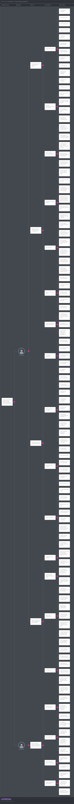

### 2.4.3. Product Backlog

A continuación se presenta el Product Backlog de Entreprenly, conformado por las 98 User Stories especificadas para la Landing Page, la aplicación móvil y los servicios que la soportan. Las historias se organizan en cuatro bloques según la superficie o capa principal de entrega: Landing Page; aplicación móvil; backend, sistema e infraestructura; y autenticación, registro y perfil. La estimación conserva la escala de 1, 2, 3 y 5 story points, con un total de **245 story points**.

<table>
  <thead>
    <tr>
      <th>Order</th>
      <th>User Story Id</th>
      <th>Title</th>
      <th>Description</th>
      <th>Story Points</th>
    </tr>
  </thead>
  <tbody>
    <!-- BLOQUE 1: LANDING PAGE -->
    <tr><td>1</td><td>US-53</td><td>Conocer propuesta de valor en landing page</td><td>Como visitante, quiero entender qué hace Entreprenly y cómo puede beneficiar a mi negocio para decidir si me interesa adquirirlo.</td><td>3</td></tr>
    <tr><td>2</td><td>US-84</td><td>Visualizar la propuesta de valor</td><td>Como comerciante que visita la web, quiero ver el headline y la propuesta de valor en el Hero para entender rápidamente qué problemas resuelve Entreprenly.</td><td>2</td></tr>
    <tr><td>3</td><td>US-85</td><td>Explorar las funciones principales</td><td>Como comerciante interesado, quiero conocer los pilares técnicos (Inventario, Finanzas, Chatbot, Balanza) para evaluar si las herramientas se ajustan a mis necesidades operativas.</td><td>2</td></tr>
    <tr><td>4</td><td>US-86</td><td>Revisar los planes de suscripción</td><td>Como comerciante potencial, quiero ver la tabla comparativa de precios y beneficios para seleccionar el plan que mejor se adapte a mi presupuesto (Free o Control).</td><td>2</td></tr>
    <tr><td>5</td><td>US-87</td><td>Consultar las preguntas frecuentes</td><td>Como comerciante con dudas, quiero leer la sección de FAQ para resolver inquietudes comunes sobre la integración de la balanza IoT o el uso del chatbot sin contactar a soporte.</td><td>1</td></tr>
    <tr><td>6</td><td>US-88</td><td>Acceder a la aplicación móvil desde la landing page</td><td>Como comerciante registrado, quiero utilizar el botón de ingreso de la Landing Page para abrir Entreprenly y acceder rápidamente a mi dashboard móvil.</td><td>1</td></tr>
    <tr><td>7</td><td>US-89</td><td>Descargar la aplicación mediante el botón de acción principal</td><td>Como comerciante nuevo, quiero utilizar el botón "Empezar gratis" del Hero para descargar Entreprenly e iniciar mi registro desde el celular.</td><td>1</td></tr>
    <!-- BLOQUE 2: APLICACIÓN MÓVIL -->
    <tr><td>8</td><td>US-01</td><td>Agregar productos</td><td>Como comerciante quiero agregar productos para gestionar mi inventario de manera eficiente.</td><td>3</td></tr>
    <tr><td>9</td><td>US-02</td><td>Editar lotes</td><td>Como comerciante quiero editar los lotes para actualizar los datos del inventario.</td><td>2</td></tr>
    <tr><td>10</td><td>US-03</td><td>Agregar lotes</td><td>Como comerciante quiero agregar lotes para gestionar correctamente las cantidades y fechas de vencimiento.</td><td>2</td></tr>
    <tr><td>11</td><td>US-04</td><td>Eliminar lotes</td><td>Como comerciante quiero eliminar lotes para deshacerme de los lotes que no me sirvan.</td><td>1</td></tr>
    <tr><td>12</td><td>US-05</td><td>Editar productos</td><td>Como comerciante quiero editar productos para actualizar los datos en el inventario.</td><td>2</td></tr>
    <tr><td>13</td><td>US-06</td><td>Visualizar detalles de lotes</td><td>Como comerciante quiero visualizar los detalles de los lotes para gestionar mejor el inventario.</td><td>2</td></tr>
    <tr><td>14</td><td>US-07</td><td>Visualizar detalles de producto</td><td>Como comerciante quiero visualizar la información detallada de cada producto en el listado para conocer rápidamente sus características, stock disponible y precio sin necesidad de ingresar a otra pantalla.</td><td>2</td></tr>
    <tr><td>15</td><td>US-08</td><td>Buscar productos</td><td>Como comerciante quiero tener un buscador de productos para perder menos tiempo buscando en el inventario.</td><td>3</td></tr>
    <tr><td>16</td><td>US-95</td><td>Buscar lotes</td><td>Como comerciante quiero contar con un buscador en el módulo móvil de Lotes para localizar rápidamente los lotes de un producto por su nombre o marca sin recorrer toda la lista.</td><td>2</td></tr>
    <tr><td>17</td><td>US-09</td><td>Crear lotes</td><td>Como comerciante quiero crear lotes de productos para controlar mejor el stock y la caducidad en el inventario.</td><td>3</td></tr>
    <tr><td>18</td><td>US-10</td><td>Escanear código QR en inventario</td><td>Como usuario de inventario, quiero escanear códigos QR desde los formularios de productos y lotes para completar el código del registro sin ingresarlo manualmente.</td><td>3</td></tr>
    <tr><td>19</td><td>US-90</td><td>Eliminar productos</td><td>Como comerciante quiero eliminar productos para deshacerme de los productos que no me sirvan.</td><td>1</td></tr>
    <tr><td>20</td><td>US-11</td><td>Detectar stock agotado</td><td>Como comerciante quiero recibir alertas cuando el stock esté bajo o agotado para reponer los productos a tiempo.</td><td>3</td></tr>
    <tr><td>21</td><td>US-12</td><td>Mostrar alertas de estado al visualizar detalles</td><td>Como comerciante quiero visualizar alertas de estado al ver el detalle de un lote para identificar rápidamente si tiene stock bajo, está agotado o próximo a vencer.</td><td>2</td></tr>
    <tr><td>22</td><td>US-13</td><td>Visualizar dashboard móvil de lotes</td><td>Como comerciante quiero visualizar un dashboard móvil de lotes con indicadores y alertas para conocer rápidamente el estado de mi inventario al ingresar al módulo de lotes.</td><td>3</td></tr>
    <tr><td>23</td><td>US-14</td><td>Recibir notificación de caducidad de lote</td><td>Como comerciante quiero recibir una notificación push cuando un lote esté próximo a vencer o ya haya vencido para tomar acciones como priorizar su venta o descartarlo.</td><td>3</td></tr>
    <tr><td>24</td><td>US-15</td><td>Seleccionar plan de suscripción</td><td>Como usuario con Plan Free, quiero presionar el botón "Elegir plan" en la tarjeta del Plan Control para definir el plan que deseo contratar y continuar con el proceso de suscripción.</td><td>2</td></tr>
    <tr><td>25</td><td>US-16</td><td>Iniciar proceso de suscripción</td><td>Como usuario con un plan seleccionado, quiero presionar el botón "Continuar con la suscripción" para abrir el formulario de facturación y comenzar formalmente la contratación del plan elegido.</td><td>2</td></tr>
    <tr><td>26</td><td>US-17</td><td>Registrar datos de facturación</td><td>Como usuario, quiero completar el formulario de facturación y presionar el botón "Continuar al pago" para que el sistema pueda preparar el cobro correspondiente a la suscripción.</td><td>3</td></tr>
    <tr><td>27</td><td>US-18</td><td>Procesar cobro de suscripción</td><td>Como usuario, quiero revisar el resumen de cobro y presionar el botón "Pagar y activar suscripción" para validar el pago del Plan Control seleccionado.</td><td>5</td></tr>
    <tr><td>28</td><td>US-19</td><td>Activar suscripción</td><td>Como usuario, quiero que al confirmarse el pago el sistema active automáticamente el Plan Control y me redirija al panel de suscripción para acceder a las funcionalidades premium.</td><td>3</td></tr>
    <tr><td>29</td><td>US-20</td><td>Visualizar panel de suscripción</td><td>Como usuario, quiero abrir la opción "Suscripción" desde la navegación móvil para consultar mi plan actual, su estado, la fecha de renovación, la facturación y las acciones disponibles.</td><td>2</td></tr>
    <tr><td>30</td><td>US-21</td><td>Consultar estado de suscripción</td><td>Como usuario, quiero ver una etiqueta de estado en el panel de suscripción para saber si mi plan se encuentra en estado "Activa", "Cancelación programada", "Cancelada" o "Plan Free".</td><td>1</td></tr>
    <tr><td>31</td><td>US-22</td><td>Renovar suscripción</td><td>Como usuario con una suscripción de pago activa o próxima a vencer, quiero presionar el botón "Renovar suscripción" para extender la vigencia de mi acceso a la plataforma.</td><td>3</td></tr>
    <tr><td>32</td><td>US-23</td><td>Solicitar cancelación de suscripción</td><td>Como usuario con una suscripción de pago activa, quiero presionar el botón "Solicitar cancelación" y luego "Confirmar cancelación" para detener la renovación automática al finalizar el periodo vigente.</td><td>2</td></tr>
    <tr><td>33</td><td>US-24</td><td>Cancelar suscripción</td><td>Como sistema, quiero cancelar la suscripción de pago al finalizar su periodo vigente para retirar el acceso premium y devolver la cuenta del usuario al Plan Free.</td><td>3</td></tr>
    <tr><td>34</td><td>US-25</td><td>Agregar método de pago de suscripción</td><td>Como usuario con acceso al panel "Suscripción", quiero presionar el botón "Agregar método de pago" dentro de la sección "Método de pago y datos fiscales" para registrar un medio de cobro que pueda usarse en pagos y renovaciones del Plan Control.</td><td>3</td></tr>
    <tr><td>35</td><td>US-96</td><td>Gestionar métodos de pago de suscripción</td><td>Como comerciante con acceso al panel "Suscripción", quiero visualizar mis métodos de pago registrados y seleccionar cuál será el principal para que los pagos y renovaciones del Plan Control usen el medio correcto.</td><td>2</td></tr>
    <tr><td>36</td><td>US-26</td><td>Completar datos fiscales de suscripción</td><td>Como usuario con una cuenta registrada, quiero presionar el botón "Completar datos" dentro de "Método de pago y datos fiscales" para registrar mi RUC o DNI, razón social o nombre, dirección fiscal y correo de facturación.</td><td>2</td></tr>
    <tr><td>37</td><td>US-27</td><td>Descargar historial de suscripción</td><td>Como usuario, quiero presionar el botón "Descargar historial" dentro de "Actividad de la suscripción" para obtener un archivo con los eventos de mi plan, pagos, renovaciones, cambios y cancelaciones.</td><td>2</td></tr>
    <tr><td>38</td><td>US-28</td><td>Buscar productos en el inventario y validar su tipo de medida</td><td>Como cajero, quiero buscar productos del inventario para que el sistema valide si son por cantidad o peso, para abrir la interfaz de ingreso correspondiente.</td><td>3</td></tr>
    <tr><td>39</td><td>US-29</td><td>Registrar la cantidad de unidades en el Ticket de Venta</td><td>Como cajero, quiero ingresar el número de unidades de un producto seleccionado, para añadirlo al detalle de la venta.</td><td>2</td></tr>
    <tr><td>40</td><td>US-30</td><td>Capturar el peso mediante balanza IoT o ingreso manual</td><td>Como cajero, quiero obtener el peso del producto automáticamente o por teclado para procesar la venta de productos al granel.</td><td>5</td></tr>
    <tr><td>41</td><td>US-31</td><td>Gestionar el desglose y cálculo del Ticket de Venta</td><td>Como cajero, quiero visualizar el desglose de productos (nombre, cantidad/peso, precio unitario y subtotal) para verificar que la información sea correcta antes de proceder al pago.</td><td>3</td></tr>
    <tr><td>42</td><td>US-32</td><td>Seleccionar el método de pago para la transacción</td><td>Como cajero, quiero elegir el medio por el cual está pagando el cliente (Efectivo o Tarjeta/Yape/Plin), para que el ingreso se registre en la categoría contable correcta.</td><td>2</td></tr>
    <tr><td>43</td><td>US-33</td><td>Finalizar la venta y emitir el comprobante de pago</td><td>Como cajero, quiero procesar el pago y finalizar la venta en un solo paso, para registrar la transacción en el sistema y entregar el comprobante al cliente de forma inmediata.</td><td>3</td></tr>
    <tr><td>44</td><td>US-34</td><td>Cancelar venta en curso</td><td>Como cajero, quiero cancelar la venta en curso para limpiar el ticket y empezar una nueva transacción sin procesar el cobro.</td><td>1</td></tr>
    <tr><td>45</td><td>US-35</td><td>Clasificar automáticamente los ingresos según el medio de pago</td><td>Como comerciante, quiero que cada venta finalizada sume su monto al acumulado del método correspondiente, para tener visibilidad inmediata de cuánto dinero hay en efectivo y cuánto en digital.</td><td>3</td></tr>
    <tr><td>46</td><td>US-36</td><td>Monitorear el Resumen de Caja en tiempo real dentro del panel de ventas</td><td>Como cajero, quiero visualizar de forma centralizada los ingresos acumulados por método de pago, para tener un control inmediato de los saldos del día sin salir de la interfaz principal.</td><td>2</td></tr>
    <tr><td>47</td><td>US-97</td><td>Consultar el historial de ventas del día</td><td>Como comerciante, quiero consultar el listado de las ventas registradas en un día seleccionado, para revisar la actividad comercial y verificar las transacciones sin salir del panel de ventas.</td><td>2</td></tr>
    <tr><td>48</td><td>US-98</td><td>Consultar el detalle de una venta registrada</td><td>Como comerciante, quiero abrir el detalle de una venta del historial, para revisar los productos vendidos con sus cantidades o pesos y sus montos.</td><td>2</td></tr>
    <tr><td>49</td><td>US-37</td><td>Vincular cuenta de WhatsApp Business desde el dispositivo móvil</td><td>Como comerciante, quiero vincular mi cuenta de WhatsApp Business desde el celular para activar el chatbot de atención a clientes en Entreprenly.</td><td>5</td></tr>
    <tr><td>50</td><td>US-38</td><td>Consultar estado de vinculación del chatbot</td><td>Como comerciante, quiero conocer el estado de conexión de mi WhatsApp Business para saber si el chatbot se encuentra activo o requiere reconexión.</td><td>2</td></tr>
    <tr><td>51</td><td>US-39</td><td>Visualizar conversaciones de clientes en la aplicación móvil</td><td>Como comerciante, quiero ver en la aplicación móvil los chats que el bot ha mantenido con mis clientes para conocer todas las conversaciones activas sin abrir WhatsApp.</td><td>3</td></tr>
    <tr><td>52</td><td>US-40</td><td>Responder mensajes de clientes desde la aplicación móvil</td><td>Como comerciante, quiero enviar mensajes a mis clientes directamente desde la aplicación móvil para gestionar las conversaciones sin abrir WhatsApp.</td><td>3</td></tr>
    <tr><td>53</td><td>US-70</td><td>Visualizar resumen de ventas del día</td><td>Como comerciante, quiero visualizar un resumen de las ventas del día en el panel de inicio para conocer el rendimiento de mi negocio sin ingresar al módulo de ventas.</td><td>2</td></tr>
    <tr><td>54</td><td>US-71</td><td>Visualizar estado del chatbot en la pantalla de Inicio</td><td>Como comerciante, quiero visualizar el estado de conexión del chatbot y los chats activos desde el panel de inicio para saber si mi canal de ventas por WhatsApp está operativo sin ingresar al módulo de chatbot.</td><td>2</td></tr>
    <tr><td>55</td><td>US-72</td><td>Visualizar alertas de inventario en la pantalla de Inicio</td><td>Como comerciante, quiero ver las alertas críticas de inventario directamente en el panel de inicio para identificar rápidamente productos agotados o lotes próximos a vencer sin ingresar al módulo de lotes.</td><td>2</td></tr>
    <tr><td>56</td><td>US-73</td><td>Visualizar contador de pedidos pendientes en la pantalla de Inicio</td><td>Como comerciante, quiero ver el número de pedidos que están pendientes de atención en el panel de inicio para priorizar mi respuesta sin necesidad de ingresar al módulo de chatbot.</td><td>1</td></tr>
    <tr><td>57</td><td>US-74</td><td>Visualizar pedidos recientes en la pantalla de Inicio</td><td>Como comerciante, quiero ver los pedidos más recientes con su estado actual en el panel de inicio para hacer seguimiento sin ingresar al módulo de pedidos.</td><td>2</td></tr>
    <tr><td>58</td><td>US-75</td><td>Acceder a módulos desde accesos directos de la pantalla de Inicio</td><td>Como comerciante, quiero contar con accesos directos a los módulos principales desde la pantalla de Inicio para navegar rápidamente sin abrir el menú de navegación móvil.</td><td>1</td></tr>
    <tr><td>59</td><td>US-76</td><td>Visualizar el centro de soporte</td><td>Como comerciante, quiero visualizar el centro de soporte al presionar el botón de Ayuda para acceder de forma rápida a las opciones de asistencia disponibles.</td><td>2</td></tr>
    <tr><td>60</td><td>US-77</td><td>Buscar artículo de ayuda</td><td>Como comerciante, quiero buscar artículos de ayuda por palabras clave para encontrar rápidamente la información que necesito sin revisar todas las categorías.</td><td>2</td></tr>
    <tr><td>61</td><td>US-78</td><td>Consultar artículo de ayuda</td><td>Como comerciante, quiero abrir y leer un artículo de ayuda para entender cómo usar una funcionalidad de la plataforma o resolver un problema específico.</td><td>2</td></tr>
    <tr><td>62</td><td>US-79</td><td>Reportar un problema</td><td>Como comerciante, quiero reportar un problema o incidencia desde el centro de soporte para que el equipo de Entreprenly pueda revisarlo y darle seguimiento.</td><td>3</td></tr>
    <tr><td>63</td><td>US-80</td><td>Confirmar envío del reporte</td><td>Como comerciante, quiero recibir una confirmación visual tras enviar un reporte para tener la certeza de que mi solicitud fue registrada correctamente.</td><td>1</td></tr>
    <tr><td>64</td><td>US-81</td><td>Navegar entre módulos desde el menú de navegación móvil</td><td>Como usuario autenticado, quiero utilizar el menú de navegación de la aplicación móvil para ingresar rápidamente a Inicio, Productos, Lotes, Ventas, Suscripción, Pedidos, Chatbot y Ayuda.</td><td>2</td></tr>
    <tr><td>65</td><td>US-82</td><td>Cambiar idioma de la interfaz</td><td>Como usuario de la aplicación móvil, quiero alternar entre español e inglés para visualizar los textos de la interfaz en el idioma que prefiera.</td><td>2</td></tr>
    <tr><td>66</td><td>US-83</td><td>Gestionar destinos de navegación no disponibles</td><td>Como usuario de la aplicación móvil, quiero recibir una pantalla informativa cuando intento abrir un destino no disponible para comprender lo ocurrido y regresar a una sección válida.</td><td>1</td></tr>
    <!-- BLOQUE 3: BACKEND, SISTEMA E INFRAESTRUCTURA -->
    <tr><td>67</td><td>US-41</td><td>Responder consulta de producto disponible</td><td>Como sistema, quiero que el chatbot responda automáticamente al cliente con la información del producto solicitado cuando este existe en el inventario para iniciar el proceso de pedido sin intervención del comerciante.</td><td>3</td></tr>
    <tr><td>68</td><td>US-42</td><td>Sugerir alternativas ante producto no disponible</td><td>Como sistema, quiero que el chatbot informe al cliente cuando un producto no está disponible y le sugiera otros productos del inventario para evitar que la conversación quede sin respuesta útil.</td><td>2</td></tr>
    <tr><td>69</td><td>US-43</td><td>Confirmar pedido con el cliente</td><td>Como sistema, quiero que el chatbot presente un resumen del pedido al cliente y solicite confirmación antes de proceder al pago para asegurar que los productos y cantidades sean correctos.</td><td>3</td></tr>
    <tr><td>70</td><td>US-44</td><td>Recibir instrucciones de pago por WhatsApp</td><td>Como cliente, quiero recibir las instrucciones de pago a través del chatbot para saber cómo realizar la transferencia y completar mi pedido.</td><td>2</td></tr>
    <tr><td>71</td><td>US-45</td><td>Reportar comprobante de pago digital</td><td>Como cliente, quiero enviar el comprobante de mi pago al chatbot para que el comerciante pueda verificarlo y confirmar mi pedido.</td><td>3</td></tr>
    <tr><td>72</td><td>US-46</td><td>Validar comprobante de pago desde la aplicación móvil</td><td>Como comerciante, quiero revisar el comprobante reportado por el cliente y aprobarlo o rechazarlo desde la aplicación móvil para confirmar que el dinero fue recibido correctamente.</td><td>3</td></tr>
    <tr><td>73</td><td>US-47</td><td>Notificar resultado de validación al cliente</td><td>Como cliente, quiero recibir una notificación sobre el resultado de la validación de mi pago para saber si mi pedido fue confirmado o si debo realizar alguna acción adicional.</td><td>2</td></tr>
    <tr><td>74</td><td>US-48</td><td>Confirmar pedido y descontar stock</td><td>Como sistema, quiero confirmar el pedido automáticamente al aprobar el pago para actualizar el inventario en tiempo real y reflejar el consumo de stock.</td><td>3</td></tr>
    <tr><td>75</td><td>US-49</td><td>Registrar venta en el sistema</td><td>Como comerciante, quiero que cada pedido confirmado quede registrado como venta en el sistema para mantener un control financiero preciso y trazable.</td><td>2</td></tr>
    <tr><td>76</td><td>US-50</td><td>Manejar stock insuficiente en pedido</td><td>Como cliente, quiero ser notificado cuando un producto no tiene stock suficiente para ajustar mi pedido antes de proceder al pago.</td><td>3</td></tr>
    <tr><td>77</td><td>US-51</td><td>Cancelar pedido por expiración de tiempo de pago</td><td>Como sistema, quiero cancelar automáticamente un pedido cuando el cliente no reporta el comprobante de pago en el tiempo establecido para liberar el stock reservado.</td><td>3</td></tr>
    <tr><td>78</td><td>US-52</td><td>Rechazar comprobante de pago inválido</td><td>Como comerciante, quiero rechazar un comprobante de pago cuando sea incorrecto o sospechoso para proteger el negocio de transacciones fraudulentas.</td><td>3</td></tr>
    <tr><td>79</td><td>US-54</td><td>Gestionar ciclo de vida de pedidos mediante API</td><td>Como integrante del equipo de desarrollo, quiero endpoints para crear y actualizar pedidos para que el chatbot y la aplicación móvil intercambien información del pedido de forma automática y consistente.</td><td>5</td></tr>
    <tr><td>80</td><td>US-55</td><td>Validar y registrar pagos mediante API</td><td>Como integrante del equipo de desarrollo, quiero un endpoint para aprobar o rechazar pagos desde la aplicación móvil para que el sistema actualice el inventario y notifique al cliente de forma automática.</td><td>5</td></tr>
    <tr><td>81</td><td>US-91</td><td>Autenticar y autorizar usuarios mediante JWT</td><td>Como equipo de desarrollo, queremos proteger los endpoints de la API mediante autenticación basada en JWT para que solo los usuarios autenticados accedan a los recursos del comerciante.</td><td>5</td></tr>
    <tr><td>82</td><td>US-92</td><td>Containerizar y desplegar la API mediante Docker y CI/CD</td><td>Como equipo de desarrollo, queremos empaquetar el backend en una imagen Docker y automatizar su construcción y despliegue mediante un pipeline de CI/CD para garantizar entregas reproducibles y consistentes.</td><td>5</td></tr>
    <tr><td>83</td><td>US-93</td><td>Persistir datos mediante JPA por bounded context</td><td>Como equipo de desarrollo, queremos mapear las entidades de dominio a la base de datos mediante JPA respetando los límites de cada bounded context para mantener la integridad y separación de los datos.</td><td>3</td></tr>
    <tr><td>84</td><td>US-94</td><td>Desplegar la Landing Page en Firebase Hosting</td><td>Como equipo de desarrollo, queremos desplegar la Landing Page en Firebase Hosting para presentar el producto y facilitar el acceso a la aplicación móvil de forma escalable.</td><td>3</td></tr>
    <!-- BLOQUE 4: AUTENTICACIÓN, REGISTRO Y PERFIL -->
    <tr><td>85</td><td>US-56</td><td>Registrar cuenta con email</td><td>Como usuario anónimo, quiero registrarme con mi email y contraseña para crear una cuenta en Entreprenly y obtener automáticamente el Plan Free.</td><td>3</td></tr>
    <tr><td>86</td><td>US-57</td><td>Verificar email</td><td>Como usuario registrado, quiero verificar mi email mediante el enlace enviado a mi correo para activar mi cuenta.</td><td>3</td></tr>
    <tr><td>87</td><td>US-58</td><td>Iniciar sesión con credenciales</td><td>Como usuario registrado, quiero iniciar sesión con mi email y contraseña desde el celular para acceder al dashboard móvil de Entreprenly.</td><td>3</td></tr>
    <tr><td>88</td><td>US-59</td><td>Iniciar sesión con Google OAuth</td><td>Como usuario anónimo, quiero iniciar sesión con mi cuenta de Google para acceder a Entreprenly sin necesidad de crear credenciales nuevas.</td><td>5</td></tr>
    <tr><td>89</td><td>US-60</td><td>Recuperar contraseña</td><td>Como usuario registrado, quiero recuperar el acceso a mi cuenta mediante un enlace enviado a mi email para restablecer mi contraseña.</td><td>3</td></tr>
    <tr><td>90</td><td>US-61</td><td>Cerrar sesión</td><td>Como usuario autenticado, quiero cerrar mi sesión para que el sistema revoque mi token y me redirija a la pantalla de login.</td><td>1</td></tr>
    <tr><td>91</td><td>US-62</td><td>Visualizar perfil actual</td><td>Como usuario autenticado, quiero visualizar mi perfil actual para revisar mis datos registrados en la plataforma.</td><td>1</td></tr>
    <tr><td>92</td><td>US-63</td><td>Actualizar nombre y biografía</td><td>Como usuario autenticado, quiero actualizar mi nombre y biografía para mantener mi perfil al día.</td><td>2</td></tr>
    <tr><td>93</td><td>US-64</td><td>Subir foto de perfil</td><td>Como usuario autenticado, quiero tomar o elegir una foto desde mi dispositivo móvil para personalizar mi perfil.</td><td>3</td></tr>
    <tr><td>94</td><td>US-65</td><td>Cambiar email con re-verificación</td><td>Como usuario autenticado, quiero cambiar mi email y verificarlo para mantener mis datos de contacto actualizados.</td><td>3</td></tr>
    <tr><td>95</td><td>US-66</td><td>Cambiar contraseña</td><td>Como usuario autenticado, quiero cambiar mi contraseña para mantener la seguridad de mi cuenta.</td><td>3</td></tr>
    <tr><td>96</td><td>US-67</td><td>Configurar preferencias de idioma, zona horaria, tema y moneda</td><td>Como comerciante autenticado, quiero configurar mi idioma, zona horaria, tema visual y moneda para adaptar la plataforma a mis preferencias operativas.</td><td>3</td></tr>
    <tr><td>97</td><td>US-68</td><td>Configurar notificaciones</td><td>Como usuario autenticado, quiero configurar mis preferencias de notificaciones push para recibir en mi dispositivo solo los avisos que me sean relevantes.</td><td>2</td></tr>
    <tr><td>98</td><td>US-69</td><td>Registrar y verificar número de teléfono</td><td>Como comerciante autenticado, quiero registrar y verificar mi número de teléfono en el perfil para tener un canal de contacto adicional vinculado a mi cuenta.</td><td>2</td></tr>
  </tbody>
</table>

## 2.5. Strategic-Level Domain-Driven Design

En esta sección se presenta el diseño estratégico del dominio de Entreprenly, cuyo propósito es delimitar las principales capacidades del negocio, identificar los Bounded Contexts y establecer las relaciones necesarias para que colaboren sin perder autonomía. Este análisis permite organizar el sistema alrededor del lenguaje y los procesos propios del negocio, evitando que las responsabilidades de perfil, inventario, ventas, suscripciones y atención mediante chatbot se mezclen dentro de un único modelo.

El proceso parte de EventStorming para reconocer eventos, actores, comandos y flujos relevantes; continúa con Candidate Context Discovery y Domain Message Flows Modeling para definir los límites y mensajes intercambiados; y se consolida mediante Bounded Context Canvases y Context Mapping. Finalmente, las decisiones obtenidas se representan con diagramas de arquitectura en los niveles de contexto, contenedores y despliegue. Estos artefactos proporcionan la visión general que sirve como base para el diseño táctico desarrollado en la sección 2.6.

### 2.5.1. EventStorming

Para llevar a cabo los Bounded Context, se deben reconocer los eventos y organizarlos.

Para llevar a cabo el proceso de EventStorming empleamos la herramienta Miro.

Generación y Autenticación de Cuenta

En este Bounded Context se realiza la creación de cuentas y la gestión de inicios de sesión. El flujo inicia brindando la opción de registrarse como nuevo usuario o ingresar credenciales si ya posee una cuenta. La autenticación se resuelve con credenciales propias (email y contraseña), aplicando hashing BCrypt y emitiendo un token JWT firmado. Al registrarse un usuario se publica el evento de dominio `UserSignedUpEvent`, que otros contextos consumen para inicializar su información.

Perfil y Configuración

 

En este Bounded Context se gestiona la configuración del perfil del usuario, incluyendo cambios de zona horaria, idioma, preferencias de interfaz (como modo oscuro), moneda y notificaciones. El cambio de contraseña y de email se gestiona en el contexto de Generación y Autenticación de Cuenta.

Gestión y Proceso de Suscripción

 

Este Bounded Context se encarga de la creación, renovación, cambio y cancelación de planes de suscripción, así como del registro de los datos de facturación del usuario. Además, realiza las validaciones necesarias y procesa el pago de la suscripción durante todo el proceso.

Gestión de Inventario

 

En este Bounded Context se realiza la creación y modificación de productos (por unidad y por peso). También incluye la gestión de lotes (creación, modificación y eliminación), así como funcionalidades adicionales como alertas de stock bajo, agotado y por vencer.

Chatbot de WhatsApp

 

Este Bounded Context permite la venta a través de un chatbot de WhatsApp. Para ello, consume el catálogo del contexto de Inventario para conocer la disponibilidad de productos, descuenta el stock al confirmar un pedido y registra la venta resultante en el contexto de Ventas.

Ventas

 

En este Bounded Context se realiza la gestión de ventas presenciales. El proceso registra los ítems vendidos según el tipo de producto (por unidad o por peso) y el método de pago con su comprobante (Yape, Plin o efectivo).

Unión de Bounded Contexts

  

Este diagrama muestra la integración y comunicación entre los diferentes Bounded Contexts, evidenciando las relaciones y dependencias dentro del sistema. La integración se resuelve mediante eventos de dominio (p. ej. `UserSignedUpEvent` de IAM hacia Perfil y Suscripción) y mediante Anti-Corruption Layers (ACL) entre contextos (p. ej. Chatbot consumiendo Inventario, Ventas, Suscripción e IAM).

#### 2.5.1.1. Candidate Context Discovery

En esta sección se aplica la técnica de Candidate Context Discovery para identificar y separar los posibles Bounded Contexts del sistema. Se utilizó la técnica *look-for-pivotal-events* para analizar los eventos que marcan un cambio de estado relevante dentro del modelo de negocio de Entreprenly. Al identificar eventos pivote fundamentales como **UserSignedUp**, **ProductCreated**, **StockDecremented**, **WhatsAppOrderConfirmed**, **SaleCompleted** y **SubscriptionActivated**, se detectó que cada uno implicaba responsabilidades, límites transaccionales y reglas de negocio distintas, lo que llevó a definir los siguientes Bounded Contexts:

| Bounded Context | Descripción | Eventos clave |
|---|---|---|
| **IAM** | Maneja la autenticación, registro y autorización de los comerciantes mediante credenciales seguras (hashing con BCrypt) y emisión de tokens JWT. | `UserSignedUp`, `UserAuthenticated`, `PasswordResetRequested`, `PasswordChanged` |
| **Profile** | Administra la información del perfil del comerciante, datos de contacto y preferencias operativas (moneda, idioma, zona horaria, tema visual y notificaciones push). | `ProfileCreated`, `ProfileUpdated`, `ProfilePictureUploaded`, `PreferencesConfigured` |
| **Subscription** | Gestiona los planes de suscripción (Free, Pro), el procesamiento de pagos mediante pasarela y el ciclo de vida (activación, renovación o cancelación) del servicio. | `SubscriptionPlanSelected`, `PaymentProcessed`, `SubscriptionActivated`, `SubscriptionCancelled` |
| **Inventory** | Controla el catálogo de productos (por unidad y por peso), gestión de lotes con fechas de vencimiento, balance de existencias y generación de alertas de stock. | `ProductCreated`, `ProductUpdated`, `BatchRegistered`, `StockDecremented`, `LowStockAlertTriggered` |
| **WhatsApp Sales** | Canal conversacional automatizado que atiende a los clientes finales vía WhatsApp, consultando disponibilidad de productos, registrando pedidos y confirmando compras. | `CustomerMessageReceived`, `ProductAvailabilityQueried`, `WhatsAppOrderCreated`, `WhatsAppOrderConfirmed` |
| **Sales** | Administra el registro de ventas presenciales en el punto de venta móvil, procesando ítems por unidad y peso, emisión de comprobantes y validación de pagos (Yape, Plin y efectivo). | `SaleInitiated`, `ItemAddedToSale`, `PaymentReceived`, `SaleCompleted` |

#### 2.5.1.2. Domain Message Flows Modeling

Esta sección utilizará el Domain Message Flow Modelling, una técnica que ilustra cómo fluyen los mensajes de dominio, como comandos, eventos y consultas, entre los distintos contextos delimitados del sistema. Esto permite clarificar las interacciones y responsabilidades de cada contexto.

 

#### 2.5.1.3. Bounded Context Canvases

En esta parte, el Bounded Context Canvas delimitara cada parte del sistema a desarrollar. Permitiendo identificar con claridad qué responsabilidad tiene cada Bounded Context en cómo se relaciona con otros y qué elementos lo conforman, como entidades, agregados y las reglas del negocio.

 

  

  

  

  

### 2.5.2. Context Mapping

### 2.5.3. Software Architecture

#### 2.5.3.1. Software Architecture Context Level Diagrams

#### 2.5.3.2. Software Architecture Container Level Diagrams

#### 2.5.3.3. Software Architecture Deployment Diagrams

## 2.6. Tactical-Level Domain-Driven Design

En esta sección se presenta el diseño táctico de los Bounded Contexts que conforman Entreprenly: Profile, Inventory, Chatbot, Subscription y Sales. Para cada contexto se describen los elementos que implementan su modelo de dominio y sus principales reglas de negocio, incluyendo agregados, entidades, objetos de valor, comandos, consultas, eventos, servicios y repositorios.

El diseño se organiza siguiendo los principios de Domain-Driven Design y Clean Architecture, mediante la separación de las capas Domain, Application, Interface e Infrastructure. Esta distribución permite mantener la lógica de negocio independiente de los frameworks, la persistencia y la aplicación móvil, además de establecer contratos claros para la comunicación entre contextos. Finalmente, cada Bounded Context se complementa con diagramas de componentes, clases y base de datos que representan su estructura, dependencias y decisiones de implementación.

### 2.6.1. Bounded Context: Profile

Este Bounded Context es responsable de administrar la información personal del comerciante y las preferencias que personalizan su experiencia en la aplicación móvil Entreprenly. Centraliza el nombre, apellido, teléfono, fotografía, rol y plan visible del usuario, además del idioma, zona horaria, tema, moneda y configuración de notificaciones push. Está diseñado con Domain-Driven Design y Clean Architecture, separando las capas de dominio, aplicación, interfaz e infraestructura.

Profile no administra credenciales, contraseñas ni tokens JWT. Estas responsabilidades pertenecen al módulo compartido de identidad y acceso (IAM). El perfil se crea al recibir `UserSignedUpIntegrationEvent` y mantiene el plan vigente al consumir `SubscriptionPlanChangedIntegrationEvent`. Para preservar la autonomía entre contextos, `userId` se maneja como una referencia lógica única, sin incorporar el agregado de usuario dentro del dominio de Profile.

#### 2.6.1.1. Domain Layer

**Sub-capa Model - Aggregate:**

<table border="1" cellpadding="8" cellspacing="0" style="width:100%; border-collapse: collapse;">
  <tr style="background-color:#2c3e50; color:white;">
    <th>Tipo</th><th>Nombre</th><th>Descripción</th><th>Responsabilidad Principal</th><th>Relación con otros elementos</th>
  </tr>
  <tr>
    <td>Aggregate Root</td><td>Profile</td>
    <td>Representa el perfil y la configuración del comerciante autenticado. Extiende `AbstractDomainAggregateRoot`.</td>
    <td>Mantener la consistencia de los datos personales, la relación única con `userId`, el plan visible y las preferencias de experiencia móvil.</td>
    <td>Compone `Preferences` y `NotificationSettings`; es creado y modificado mediante `ProfileCommandService` y consultado mediante `ProfileQueryService`.</td>
  </tr>
</table>

El agregado `Profile` ofrece operaciones de dominio para actualizar datos personales, modificar preferencias, configurar notificaciones y reflejar un cambio de plan. El cambio de email o contraseña se deriva hacia IAM y no modifica directamente este agregado.

**Sub-capa Model - Commands:**

<table border="1" cellpadding="8" cellspacing="0" style="width:100%; border-collapse: collapse;">
  <tr style="background-color:#2c3e50; color:white;">
    <th>Tipo</th><th>Nombre</th><th>Descripción</th><th>Responsabilidad Principal</th><th>Relación con otros elementos</th>
  </tr>
  <tr><td>Command</td><td>CreateProfileCommand</td><td>Crear el perfil inicial con `userId`, nombres, rol, plan, teléfono y zona horaria.</td><td>Garantizar un único perfil por usuario e inicializar preferencias y notificaciones con valores por defecto.</td><td>Generado por `UserSignedUpEventHandler` y manejado por `ProfileCommandService`.</td></tr>
  <tr><td>Command</td><td>UpdateProfileCommand</td><td>Actualizar nombre, apellido, teléfono y `avatarUrl`.</td><td>Validar datos personales y conservar la identidad del propietario.</td><td>Se origina en `ProfilesController` al editar el perfil desde la aplicación móvil.</td></tr>
  <tr><td>Command</td><td>UpdatePreferencesCommand</td><td>Actualizar idioma, zona horaria, tema y moneda.</td><td>Sincronizar la configuración del usuario entre sesiones y dispositivos.</td><td>Modifica el value object `Preferences`.</td></tr>
  <tr><td>Command</td><td>UpdateNotificationSettingsCommand</td><td>Activar o desactivar alertas de stock mediante notificaciones push.</td><td>Guardar el consentimiento y preferencia del comerciante para comunicaciones operativas.</td><td>Modifica `NotificationSettings` y es utilizado por la pantalla de configuración móvil.</td></tr>
  <tr><td>Command</td><td>UpdateProfilePlanCommand</td><td>Actualizar la copia local del plan asociado al usuario.</td><td>Mantener el perfil sincronizado con el estado publicado por Subscription.</td><td>Generado por `SubscriptionPlanChangedEventHandler`.</td></tr>
</table>

**Sub-capa Model - Queries:**

<table border="1" cellpadding="8" cellspacing="0" style="width:100%; border-collapse: collapse;">
  <tr style="background-color:#2c3e50; color:white;">
    <th>Tipo</th><th>Nombre</th><th>Descripción</th><th>Responsabilidad Principal</th><th>Relación con otros elementos</th>
  </tr>
  <tr><td>Query</td><td>GetProfileByIdQuery</td><td>Obtener un perfil mediante su identificador interno.</td><td>Recuperar el detalle completo para operaciones administrativas controladas.</td><td>Manejada por `ProfileQueryService`.</td></tr>
  <tr><td>Query</td><td>GetProfileByUserIdQuery</td><td>Obtener el perfil del usuario autenticado.</td><td>Cargar la cabecera, la pantalla de perfil y las preferencias del dashboard móvil.</td><td>Usa el `userId` obtenido del token JWT como referencia lógica hacia IAM.</td></tr>
</table>

**Sub-capa Model - Integration Events:**

<table border="1" cellpadding="8" cellspacing="0" style="width:100%; border-collapse: collapse;">
  <tr style="background-color:#2c3e50; color:white;">
    <th>Tipo</th><th>Nombre</th><th>Descripción</th><th>Responsabilidad Principal</th><th>Relación con otros elementos</th>
  </tr>
  <tr><td>Integration Event</td><td>UserSignedUpIntegrationEvent</td><td>Notifica que IAM registró correctamente una cuenta.</td><td>Proveer los datos mínimos para inicializar el perfil sin acoplar Profile al agregado `User`.</td><td>Consumido por `UserSignedUpEventHandler`.</td></tr>
  <tr><td>Integration Event</td><td>SubscriptionPlanChangedIntegrationEvent</td><td>Notifica la activación, renovación o cambio del plan.</td><td>Actualizar el plan que la aplicación móvil muestra en el perfil.</td><td>Consumido por `SubscriptionPlanChangedEventHandler`.</td></tr>
</table>

**Sub-capa Model - Value Objects:**

<table border="1" cellpadding="8" cellspacing="0" style="width:100%; border-collapse: collapse;">
  <tr style="background-color:#2c3e50; color:white;">
    <th>Tipo</th><th>Nombre</th><th>Descripción</th><th>Responsabilidad Principal</th><th>Relación con otros elementos</th>
  </tr>
  <tr><td>Value Object</td><td>Preferences</td><td>Agrupa `language`, `timezone`, `theme` y `currency`.</td><td>Validar y transportar como una unidad indivisible las preferencias visuales y regionales. Proporciona `defaults()` para perfiles nuevos.</td><td>Embebido en `Profile` y persistido como columnas de `profiles`.</td></tr>
  <tr><td>Value Object</td><td>NotificationSettings</td><td>Agrupa la preferencia `stockAlerts`.</td><td>Controlar si el usuario desea recibir notificaciones push relacionadas con stock y vencimientos. Proporciona `defaults()`.</td><td>Embebido en `Profile`; Inventory consulta esta preferencia antes de entregar una alerta al canal móvil.</td></tr>
</table>

**Sub-capa Repositories:**

<table border="1" cellpadding="8" cellspacing="0" style="width:100%; border-collapse: collapse;">
  <tr style="background-color:#2c3e50; color:white;">
    <th>Tipo</th><th>Nombre</th><th>Descripción</th><th>Responsabilidad Principal</th><th>Relación con otros elementos</th>
  </tr>
  <tr><td>Repository</td><td>ProfileRepository</td><td>Puerto de persistencia del agregado `Profile`.</td><td>Definir `findById`, `findByUserId`, `existsByUserId` y `save` sin depender de JPA.</td><td>Utilizado por los servicios de aplicación e implementado por `ProfileRepositoryImpl` en Infrastructure.</td></tr>
</table>

#### 2.6.1.2. Interface Layer

**REST - Controllers:**

<table border="1" cellpadding="8" cellspacing="0" style="width:100%; border-collapse: collapse;">
  <tr style="background-color:#2c3e50; color:white;">
    <th>Tipo</th><th>Nombre</th><th>Descripción</th><th>Responsabilidad Principal</th><th>Relación con otros elementos</th>
  </tr>
  <tr><td>Controller</td><td>ProfilesController</td><td>Expone operaciones para crear, consultar y actualizar el perfil y sus configuraciones.</td><td>Extraer la identidad del JWT, validar que el usuario acceda únicamente a su perfil y delegar la operación a los servicios de aplicación.</td><td>Endpoints `POST /api/v1/profiles`, `GET /api/v1/profiles/{profileId}`, `GET /api/v1/profiles/by-user/{userId}` y `PUT /api/v1/profiles/{profileId}`.</td></tr>
  <tr><td>Controller</td><td>ProfilesController - Preferences</td><td>Expone la actualización de preferencias regionales y visuales.</td><td>Recibir los cambios realizados en la pantalla de configuración móvil.</td><td>Endpoint `PUT /api/v1/profiles/{profileId}/preferences`.</td></tr>
  <tr><td>Controller</td><td>ProfilesController - Notification Settings</td><td>Expone la configuración de alertas del usuario.</td><td>Registrar la decisión de activar o desactivar notificaciones push operativas.</td><td>Endpoint `PUT /api/v1/profiles/{profileId}/notification-settings`.</td></tr>
</table>

**REST - Resources y Transform (assemblers):**

<table border="1" cellpadding="8" cellspacing="0" style="width:100%; border-collapse: collapse;">
  <tr style="background-color:#2c3e50; color:white;">
    <th>Tipo</th><th>Nombre</th><th>Descripción</th><th>Responsabilidad Principal</th><th>Relación con otros elementos</th>
  </tr>
  <tr><td>Resource</td><td>CreateProfileResource / ProfileResource</td><td>DTOs de entrada y salida con datos personales, rol, plan, preferencias y notificaciones.</td><td>Definir el contrato público de Profile sin exponer directamente el agregado de dominio.</td><td>Transformados por `CreateProfileCommandFromResourceAssembler` y `ProfileResourceFromEntityAssembler`.</td></tr>
  <tr><td>Resource</td><td>UpdateProfileResource</td><td>DTO con `firstName`, `lastName`, `phone` y `avatarUrl`.</td><td>Transportar cambios realizados desde el formulario móvil, incluida la fotografía capturada o seleccionada en el dispositivo.</td><td>Convertido a `UpdateProfileCommand`.</td></tr>
  <tr><td>Resource</td><td>UpdatePreferencesResource</td><td>DTO con `language`, `timezone`, `theme` y `currency`.</td><td>Validar valores soportados antes de ejecutar el caso de uso.</td><td>Convertido a `UpdatePreferencesCommand`.</td></tr>
  <tr><td>Resource</td><td>UpdateNotificationSettingsResource</td><td>DTO con el indicador `stockAlerts`.</td><td>Representar la preferencia de recepción de alertas push.</td><td>Convertido a `UpdateNotificationSettingsCommand`.</td></tr>
</table>

**Events - Adaptadores de entrada:**

<table border="1" cellpadding="8" cellspacing="0" style="width:100%; border-collapse: collapse;">
  <tr style="background-color:#2c3e50; color:white;">
    <th>Tipo</th><th>Nombre</th><th>Descripción</th><th>Responsabilidad Principal</th><th>Relación con otros elementos</th>
  </tr>
  <tr><td>Event Handler</td><td>UserSignedUpEventHandler</td><td>Recibe el evento de alta publicado por IAM.</td><td>Traducirlo a `CreateProfileCommand` e impedir perfiles duplicados.</td><td>Invoca `ProfileCommandService`.</td></tr>
  <tr><td>Event Handler</td><td>SubscriptionPlanChangedEventHandler</td><td>Recibe cambios de plan publicados por Subscription.</td><td>Traducirlos a `UpdateProfilePlanCommand`.</td><td>Invoca `ProfileCommandService`.</td></tr>
</table>

#### 2.6.1.3. Application Layer

**Internal - Command Services:**

<table border="1" cellpadding="8" cellspacing="0" style="width:100%; border-collapse: collapse;">
  <tr style="background-color:#2c3e50; color:white;">
    <th>Tipo</th><th>Nombre</th><th>Descripción</th><th>Responsabilidad Principal</th><th>Relación con otros elementos</th>
  </tr>
  <tr><td>Service Contract</td><td>ProfileCommandService</td><td>Declara los casos de uso de escritura mediante métodos `handle`.</td><td>Atender `CreateProfileCommand`, `UpdateProfileCommand`, `UpdatePreferencesCommand`, `UpdateNotificationSettingsCommand` y `UpdateProfilePlanCommand`.</td><td>Consumido por `ProfilesController` y los event handlers.</td></tr>
  <tr><td>Service Implementation</td><td>ProfileCommandServiceImpl</td><td>Implementación de los casos de uso de escritura.</td><td>Comprobar existencia y propiedad del perfil, invocar reglas del agregado y persistir el resultado de manera transaccional.</td><td>Usa `ProfileRepository` y registra los cambios del agregado `Profile`.</td></tr>
</table>

**Internal - Query Services:**

<table border="1" cellpadding="8" cellspacing="0" style="width:100%; border-collapse: collapse;">
  <tr style="background-color:#2c3e50; color:white;">
    <th>Tipo</th><th>Nombre</th><th>Descripción</th><th>Responsabilidad Principal</th><th>Relación con otros elementos</th>
  </tr>
  <tr><td>Service Contract</td><td>ProfileQueryService</td><td>Declara las consultas disponibles para Profile.</td><td>Atender `GetProfileByIdQuery` y `GetProfileByUserIdQuery`.</td><td>Consumido por `ProfilesController`.</td></tr>
  <tr><td>Service Implementation</td><td>ProfileQueryServiceImpl</td><td>Implementación de lectura del perfil.</td><td>Recuperar el agregado sin modificar su estado y devolver ausencia controlada cuando no existe.</td><td>Usa `ProfileRepository`.</td></tr>
</table>

La capa de aplicación coordina el flujo, pero no contiene reglas de presentación móvil ni detalles de PostgreSQL. De esta manera, las mismas operaciones pueden ser consumidas por Android, iOS u otros clientes sin alterar el modelo de dominio.

#### 2.6.1.4. Infrastructure Layer

**Persistence:**

<table border="1" cellpadding="8" cellspacing="0" style="width:100%; border-collapse: collapse;">
  <tr style="background-color:#2c3e50; color:white;">
    <th>Tipo</th><th>Nombre</th><th>Descripción</th><th>Responsabilidad Principal</th><th>Relación con otros elementos</th>
  </tr>
  <tr><td>Repository Adapter</td><td>ProfileRepositoryImpl</td><td>Implementación del puerto de dominio.</td><td>Convertir entre el agregado `Profile` y su representación persistente.</td><td>Implementa `ProfileRepository`; utiliza `ProfilePersistenceRepository` y `ProfilePersistenceAssembler`.</td></tr>
  <tr><td>Spring Data Repository</td><td>ProfilePersistenceRepository</td><td>Repositorio JPA para `ProfilePersistenceEntity`.</td><td>Ejecutar `findByUserId` y `existsByUserId`, además de las operaciones CRUD.</td><td>Trabaja sobre la tabla `profiles` en PostgreSQL.</td></tr>
  <tr><td>Persistence Entity</td><td>ProfilePersistenceEntity</td><td>Mapeo ORM del perfil; hereda `id`, `createdAt` y `updatedAt`.</td><td>Persistir datos personales y los objetos de valor embebidos sin filtrar anotaciones JPA hacia el dominio.</td><td>Compone `PreferencesEmbeddable` y `NotificationSettingsEmbeddable`.</td></tr>
  <tr><td>Embeddable</td><td>PreferencesEmbeddable</td><td>Mapea idioma, zona horaria, tema y moneda como columnas de `profiles`.</td><td>Mantener el esquema en 3FN sin crear una tabla para un objeto sin identidad propia.</td><td>Convertido desde/hacia `Preferences`.</td></tr>
  <tr><td>Embeddable</td><td>NotificationSettingsEmbeddable</td><td>Mapea `notify_stock_alerts`.</td><td>Persistir la preferencia de notificaciones push.</td><td>Convertido desde/hacia `NotificationSettings`.</td></tr>
  <tr><td>Assembler</td><td>ProfilePersistenceAssembler</td><td>Transformador entre modelo de dominio y modelo JPA.</td><td>Reconstruir el agregado con `restoreState` y evitar que el dominio dependa de infraestructura.</td><td>Usado por `ProfileRepositoryImpl`.</td></tr>
</table>

**Reglas de infraestructura y seguridad:**

- Monolito modular Spring Boot con PostgreSQL compartida y límites lógicos por Bounded Context.
- `user_id` es único y funciona como referencia lógica a la identidad administrada por IAM; las credenciales y el hash de contraseña nunca se almacenan en `profiles`.
- Los endpoints requieren JWT válido y comprueban que el perfil solicitado corresponda al usuario autenticado.
- `avatar_url` almacena únicamente la ubicación segura de la fotografía; la imagen seleccionada o capturada por el móvil se valida y sube mediante el servicio de archivos configurado.
- Las preferencias se sincronizan en el backend para conservar idioma, tema, moneda y notificaciones al cambiar de dispositivo.

#### 2.6.1.5. Bounded Context Software Architecture Component Level Diagrams

  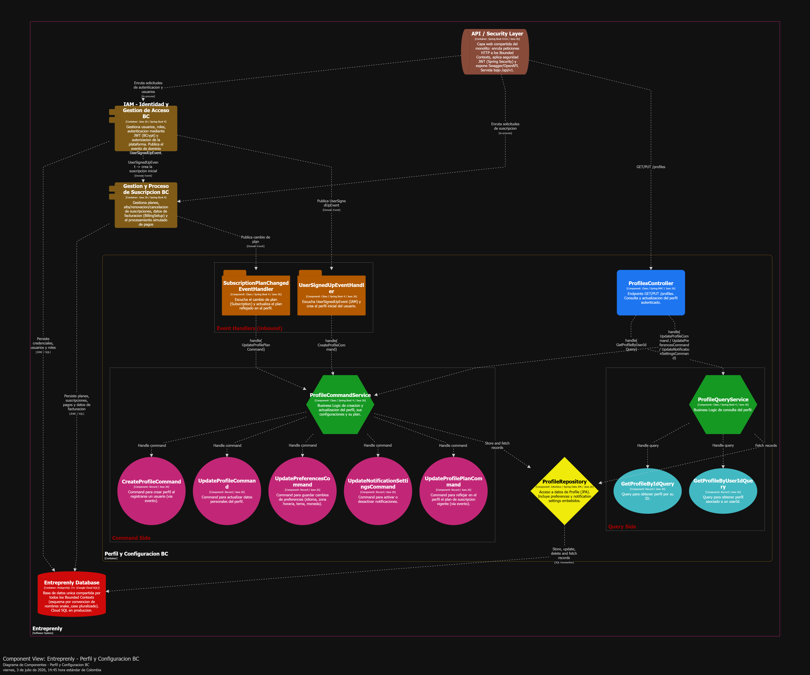

**Figura 2.6.1.1:** Diagrama de componentes de Profile. Presenta la API REST consumida por la aplicación móvil, los servicios de comandos y consultas, los adaptadores para eventos de IAM y Subscription, el repositorio y la persistencia en PostgreSQL. Fuente: adaptado de `structurizr-104049-ProfileComponent` del proyecto original.

#### 2.6.1.6. Bounded Context Software Architecture Code Level Diagrams

El diseño a nivel de código muestra cómo las abstracciones del dominio se mantienen independientes de los controllers, los handlers de integración y la persistencia JPA. Las dependencias apuntan hacia los contratos internos: Interface e Infrastructure dependen de Application y Domain, mientras que el agregado no conoce la tecnología del cliente móvil ni la base de datos.

##### 2.6.1.6.1. Bounded Context Domain Layer Class Diagrams

  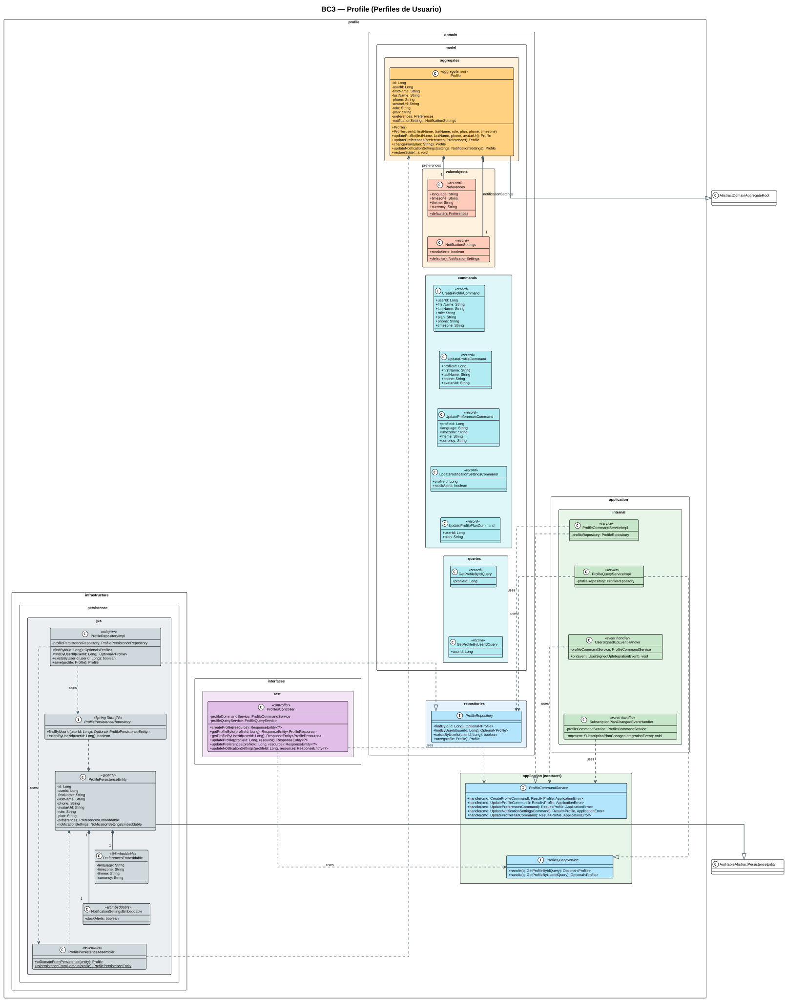

**Figura 2.6.1.2:** Diagrama de clases de Profile con el agregado `Profile`, los value objects `Preferences` y `NotificationSettings`, commands, queries, servicios de aplicación, event handlers, controller y adaptadores de persistencia. Fuente: adaptado de `CLASS DIAGRAM — Perfil y Configuración BC` del proyecto original.

##### 2.6.1.6.2. Bounded Context Database Design Diagram

  

**Figura 2.6.1.3:** Diagrama de base de datos (vista general del modelo con énfasis en Profile). Fuente: `Entreprenly_database_diagram` del proyecto original.

**Diccionario de datos — Profile:**

<table border="1" cellpadding="8" cellspacing="0" style="width:100%; border-collapse: collapse;">
  <tr style="background-color:#2c3e50; color:white;">
    <th>Tabla</th><th>Campo</th><th>Key</th><th>Descripción</th>
  </tr>
  <tr>
    <td rowspan="11" style="vertical-align:middle; text-align:center;"><code>profiles</code></td>
    <td><code>id</code></td><td style="vertical-align:middle; text-align:center;">PK</td><td>Identificador autoincremental del perfil.</td>
  </tr>
  <tr><td><code>created_at</code>, <code>updated_at</code></td><td style="vertical-align:middle; text-align:center;">—</td><td>Marcas de auditoría heredadas.</td></tr>
  <tr><td><code>user_id</code></td><td style="vertical-align:middle; text-align:center;">UNIQUE, IDX</td><td>Referencia lógica única al usuario administrado por IAM.</td></tr>
  <tr><td><code>first_name</code>, <code>last_name</code></td><td style="vertical-align:middle; text-align:center;">—</td><td>Nombres y apellidos mostrados en el perfil.</td></tr>
  <tr><td><code>phone</code></td><td style="vertical-align:middle; text-align:center;">—</td><td>Número de contacto del comerciante.</td></tr>
  <tr><td><code>avatar_url</code></td><td style="vertical-align:middle; text-align:center;">—</td><td>Ubicación de la fotografía seleccionada o capturada desde el dispositivo móvil.</td></tr>
  <tr><td><code>role</code>, <code>plan</code></td><td style="vertical-align:middle; text-align:center;">—</td><td>Rol informativo y plan sincronizado desde Subscription.</td></tr>
  <tr><td><code>preference_language</code></td><td style="vertical-align:middle; text-align:center;">—</td><td>Idioma preferido de la interfaz móvil.</td></tr>
  <tr><td><code>preference_timezone</code></td><td style="vertical-align:middle; text-align:center;">—</td><td>Zona horaria utilizada para fechas, ventas y alertas.</td></tr>
  <tr><td><code>preference_theme</code>, <code>preference_currency</code></td><td style="vertical-align:middle; text-align:center;">—</td><td>Tema visual y moneda preferida.</td></tr>
  <tr><td><code>notify_stock_alerts</code></td><td style="vertical-align:middle; text-align:center;">—</td><td>Indica si el usuario acepta notificaciones push de stock.</td></tr>
</table>

**Relaciones:** cada registro de `profiles` corresponde a un único usuario de IAM mediante `user_id`. En el modelo lógico existe una relación uno a uno; en la implementación del Bounded Context se trata como referencia lógica única para evitar dependencia ORM y FK física entre contextos. `Preferences` y `NotificationSettings` se almacenan como columnas embebidas porque no poseen identidad ni ciclo de vida independiente.

### 2.6.2. Bounded Context: Inventory

Este Bounded Context es responsable de la administración del inventario del comerciante: catálogo de productos y gestión de lotes para productos perecederos. Está diseñado bajo Clean Architecture y DDD táctico, separando dominio, aplicación, infraestructura e interfaz. Soporta dos jerarquías paralelas según tipo de medida —productos por unidad y productos por peso— para evitar columnas nulas estructurales, integra la validación física con balanza inteligente (IoT) con fallback manual, y expone una fachada ACL (`InventoryContextFacade`) que provee el catálogo por propietario y permite el descuento de stock a otros contextos, principalmente Chatbot (pedidos por WhatsApp) y Sales (venta presencial). El aislamiento multitenant se logra con `owner_email` como referencia lógica al propietario, sin FK física entre Bounded Contexts.

#### 2.6.2.1. Domain Layer

**Sub-capa Model - Aggregates:**

<table border="1" cellpadding="8" cellspacing="0" style="width:100%; border-collapse: collapse;">
  <tr style="background-color:#2c3e50; color:white;">
    <th>Tipo</th><th>Nombre</th><th>Descripción</th><th>Responsabilidad Principal</th><th>Relación con otros elementos</th>
  </tr>
  <tr>
    <td>Aggregate Root</td><td>UnitProduct</td>
    <td>Producto vendido por unidad (ej. gaseosa, galleta). Extiende `AbstractDomainAggregateRoot`.</td>
    <td>Mantener invariantes de catálogo: `name` requerido, `code_qr` UNIQUE, `price >= 0`, `owner_email` obligatorio. El borrado elimina en cascada sus `UnitLot`.</td>
    <td>Agrega `UnitLot` vía `productId` lógico. Leído por `StockAlertGenerator` y expuesto vía Facade como `CatalogItem`.</td>
  </tr>
  <tr>
    <td>Aggregate Root</td><td>WeightProduct</td>
    <td>Producto vendido al peso (ej. manzana, pollo). Precio por kilogramo.</td>
    <td>Mantener `price_per_kg >= 0`, `code_qr` UNIQUE, `owner_email`. Soporta captura IoT de peso con fallback manual.</td>
    <td>Agrega `WeightLot`. Relacionado con Sales para validación Unidad/Peso y con Chatbot para descuento de stock.</td>
  </tr>
  <tr>
    <td>Aggregate Root</td><td>UnitLot</td>
    <td>Lote de un producto unitario. Trazabilidad de perecederos.</td>
    <td>Validar `quantity >= 0`, `entry_date <= expiry_date`, `expiry_date` no pasada al crear. Orden por defecto ascendente por vencimiento.</td>
    <td>Referencia lógica `product_id` a `UnitProduct`. Genera alertas vía `StockAlertGenerator`.</td>
  </tr>
  <tr>
    <td>Aggregate Root</td><td>WeightLot</td>
    <td>Lote de un producto por peso. Stock en `quantity_kg` decimal.</td>
    <td>Validar `quantity_kg >= 0`, fechas coherentes. Soporta ajuste por balanza IoT.</td>
    <td>Referencia lógica `product_id` a `WeightProduct`.</td>
  </tr>
</table>

**Sub-capa Model - Entities (lectura y alertas):**

<table border="1" cellpadding="8" cellspacing="0" style="width:100%; border-collapse: collapse;">
  <tr style="background-color:#2c3e50; color:white;">
    <th>Tipo</th><th>Nombre</th><th>Descripción</th><th>Responsabilidad Principal</th><th>Relación con otros elementos</th>
  </tr>
  <tr>
    <td>Entity</td><td>Lot</td>
    <td>Vista unificada de lectura de lotes (unitarios y por peso) para listados y panel resumen.</td>
    <td>Servir a `LotQueryService` (`GetAllLotsQuery`, `GetLotByIdQuery`) sin lógica de escritura.</td>
    <td>Derivada de `UnitLot` y `WeightLot`.</td>
  </tr>
  <tr>
    <td>Entity</td><td>StockAlert</td>
    <td>Alerta de monitoreo: stock bajo, agotado o lote por vencer/vencido.</td>
    <td>Almacenar `type`, `severity`, producto/lote afectado y mensaje para dashboard móvil y Toasts.</td>
    <td>Generada por `StockAlertGenerator`. Consultada por `StockAlertQueryService`.</td>
  </tr>
</table>

**Sub-capa Model - Commands:**

<table border="1" cellpadding="8" cellspacing="0" style="width:100%; border-collapse: collapse;">
  <tr style="background-color:#2c3e50; color:white;">
    <th>Tipo</th><th>Nombre</th><th>Descripción</th><th>Responsabilidad Principal</th><th>Relación con otros elementos</th>
  </tr>
  <tr><td>Command</td><td>CreateUnitProductCommand</td><td>Crear producto unitario (`name, description, code_qr, price, weight_grams, brand, owner_email`).</td><td>Validar unicidad de `code_qr` y precio válido.</td><td>Manejado por `UnitProductCommandService`. Publica `ProductCreated`.</td></tr>
  <tr><td>Command</td><td>UpdateUnitProductCommand</td><td>Actualizar datos de producto unitario.</td><td>Mantener invariantes sin cambiar `owner_email`.</td><td>Manejado por `UnitProductCommandService`.</td></tr>
  <tr><td>Command</td><td>DeleteUnitProductCommand</td><td>Eliminar producto unitario y sus lotes.</td><td>Ejecutar borrado en cascada.</td><td>Requiere confirmación diálogo en UI.</td></tr>
  <tr><td>Command</td><td>CreateWeightProductCommand</td><td>Crear producto por peso (`price_per_kg`).</td><td>Validar precio por kg y `code_qr` único.</td><td>Manejado por `WeightProductCommandService`.</td></tr>
  <tr><td>Command</td><td>CreateUnitLotCommand</td><td>Crear lote unitario (`product_id, code_qr, entry_date, expiry_date, quantity`).</td><td>Validar que `expiry_date` no sea pasada y que el producto exista.</td><td>Manejado por `UnitLotCommandService`. Publica `StockAdjusted`.</td></tr>
  <tr><td>Command</td><td>CreateWeightLotCommand</td><td>Crear lote por peso (`quantity_kg`).</td><td>Validar peso inicial y fechas.</td><td>Manejado por `WeightLotCommandService`.</td></tr>
</table>

**Sub-capa Model - Queries:**

<table border="1" cellpadding="8" cellspacing="0" style="width:100%; border-collapse: collapse;">
  <tr style="background-color:#2c3e50; color:white;">
    <th>Tipo</th><th>Nombre</th><th>Descripción</th><th>Responsabilidad Principal</th><th>Relación con otros elementos</th>
  </tr>
  <tr><td>Query</td><td>GetAllUnitProductsQuery</td><td>Listar productos unitarios del propietario autenticado.</td><td>Filtrar por `owner_email` con búsqueda en tiempo real por nombre/categoría.</td><td>Manejada por `UnitProductQueryService`.</td></tr>
  <tr><td>Query</td><td>GetUnitProductByIdQuery</td><td>Obtener detalle de un producto unitario.</td><td>Retornar con sus lotes ordenados por vencimiento.</td><td>Manejada por `UnitProductQueryService`.</td></tr>
  <tr><td>Query</td><td>GetAllLotsQuery / GetLotByIdQuery</td><td>Consulta unificada de lotes.</td><td>Servir tabla de lotes y panel `Activos / Próximos 7 días / Vencidos`.</td><td>Manejadas por `LotQueryService`.</td></tr>
  <tr><td>Query</td><td>GetAllWeightLotsQuery / GetWeightLotByIdQuery</td><td>Consulta de lotes por peso.</td><td>Servir validación de stock en POS y Chatbot.</td><td>Manejadas por `WeightLotQueryService`.</td></tr>
  <tr><td>Query</td><td>GetAllStockAlertsQuery / GetStockAlertByIdQuery</td><td>Consultar alertas generadas.</td><td>Alimentar KPIs del dashboard móvil y banners inline.</td><td>Manejadas por `StockAlertQueryService`.</td></tr>
</table>

**Sub-capa Model - Events (mejora respecto a la guía, que los omite):**

<table border="1" cellpadding="8" cellspacing="0" style="width:100%; border-collapse: collapse;">
  <tr style="background-color:#2c3e50; color:white;">
    <th>Tipo</th><th>Nombre</th><th>Descripción</th><th>Responsabilidad Principal</th><th>Relación con otros elementos</th>
  </tr>
  <tr><td>Event</td><td>ProductCreated</td><td>Se emite al crear `UnitProduct` o `WeightProduct`.</td><td>Permitir seeding y sincronización de catálogo.</td><td>Consumido internamente para generar alerta inicial si aplica.</td></tr>
  <tr><td>Event</td><td>StockAdjusted</td><td>Se emite al crear lote o descontar stock (venta o pedido Chatbot).</td><td>Disparar re-evaluación de alertas.</td><td>Entrada de `StockAlertGenerator`.</td></tr>
  <tr><td>Event</td><td>LowStockDetected / StockDepleted</td><td>Stock bajo umbral o en cero.</td><td>Generar `StockAlert` con severidad `WARNING` / `CRITICAL`.</td><td>Mostrado en dashboard móvil, tarjeta y Toast.</td></tr>
  <tr><td>Event</td><td>LotExpiringSoon / LotExpired</td><td>Lote próximo a vencer (7 días) o vencido.</td><td>Generar alerta amarilla/roja con banner inline.</td><td>Ordena tabla de lotes por `expiry_date` asc.</td></tr>
</table>

**Sub-capa Model - Value Objects:**

<table border="1" cellpadding="8" cellspacing="0" style="width:100%; border-collapse: collapse;">
  <tr style="background-color:#2c3e50; color:white;">
    <th>Tipo</th><th>Nombre</th><th>Descripción</th><th>Responsabilidad Principal</th><th>Relación con otros elementos</th>
  </tr>
  <tr><td>Value Object</td><td>ProductType</td><td>Enum `UNIT`, `WEIGHT`.</td><td>Decidir jerarquía, badge, filtro y diálogo POS (`Registrar Cantidad[int]` vs `Registrar Peso[decimal + balanza]`).</td><td>Usado por `UnitProduct`, `WeightProduct`, `Lot` y `StockAlert`.</td></tr>
  <tr><td>Value Object</td><td>AlertType</td><td>Tipo de alerta: `LOW_STOCK`, `OUT_OF_STOCK`, `EXPIRING_SOON`, `EXPIRED`.</td><td>Clasificar la causa de la alerta.</td><td>Atributo de `StockAlert`.</td></tr>
  <tr><td>Value Object</td><td>AlertSeverity</td><td>Severidad: `INFO`, `WARNING`, `CRITICAL` (verde/amarillo/rojo).</td><td>Mapear a color y a tarjeta KPI con borde izquierdo de 4px.</td><td>Atributo de `StockAlert`.</td></tr>
  <tr><td>Value Object</td><td>QrCode / Money</td><td>`code_qr` UNIQUE por producto/lote; `price` y `price_per_kg >= 0`.</td><td>Garantizar unicidad e invariantes monetarios.</td><td>Embebidos en agregados.</td></tr>
</table>

**Sub-capa Services:**

<table border="1" cellpadding="8" cellspacing="0" style="width:100%; border-collapse: collapse;">
  <tr style="background-color:#2c3e50; color:white;">
    <th>Tipo</th><th>Nombre</th><th>Descripción</th><th>Responsabilidad Principal</th><th>Relación con otros elementos</th>
  </tr>
  <tr>
    <td>Domain Service</td><td>StockAlertGenerator</td>
    <td>Servicio de monitoreo que lee productos y lotes y genera alertas.</td>
    <td>Evaluar umbrales de stock y vencimiento; crear `StockAlert` sin acoplarse a persistencia.</td>
    <td>Lee `UnitProduct`, `WeightProduct`, `UnitLot`, `WeightLot`; genera `StockAlert`. Se ejecuta tras `StockAdjusted`.</td>
  </tr>
</table>

**Sub-capa Repositories:**

<table border="1" cellpadding="8" cellspacing="0" style="width:100%; border-collapse: collapse;">
  <tr style="background-color:#2c3e50; color:white;">
    <th>Tipo</th><th>Nombre</th><th>Descripción</th><th>Responsabilidad Principal</th><th>Relación con otros elementos</th>
  </tr>
  <tr><td>Repository</td><td>UnitProductRepository</td><td>Interfaz de persistencia de productos unitarios.</td><td>CRUD filtrado por `owner_email`.</td><td>Implementada en Infrastructure (JPA).</td></tr>
  <tr><td>Repository</td><td>WeightProductRepository</td><td>Interfaz de persistencia de productos por peso.</td><td>CRUD filtrado por `owner_email`.</td><td>Implementada en Infrastructure.</td></tr>
  <tr><td>Repository</td><td>UnitLotRepository</td><td>Persistencia de lotes unitarios.</td><td>CRUD + consulta por `product_id` con cascade delete.</td><td>Implementada en Infrastructure.</td></tr>
  <tr><td>Repository</td><td>WeightLotRepository</td><td>Persistencia de lotes por peso.</td><td>CRUD + consulta por `product_id`.</td><td>Implementada en Infrastructure.</td></tr>
</table>

#### 2.6.2.2. Interface Layer

**REST - Controllers:**

<table border="1" cellpadding="8" cellspacing="0" style="width:100%; border-collapse: collapse;">
  <tr style="background-color:#2c3e50; color:white;">
    <th>Tipo</th><th>Nombre</th><th>Descripción</th><th>Responsabilidad Principal</th><th>Relación con otros elementos</th>
  </tr>
  <tr><td>Controller</td><td>UnitProductsController</td><td>Expone CRUD de productos unitarios. Métodos: `getAll`, `getById`, `create`, `update`, `delete` con `userDetails` para multitenancy.</td><td>Validar `owner_email` del token JWT y delegar a `UnitProductCommandService` / `UnitProductQueryService`.</td><td>Endpoints `GET/POST /api/v1/inventory/unit-products`, `GET/PUT/DELETE /api/v1/inventory/unit-products/{id}`.</td></tr>
  <tr><td>Controller</td><td>WeightProductsController</td><td>CRUD de productos por peso.</td><td>Delegar a `WeightProductCommandService` / `WeightProductQueryService`.</td><td>Endpoints `.../weight-products`.</td></tr>
  <tr><td>Controller</td><td>UnitLotsController / WeightLotsController</td><td>Gestión de lotes por tipo.</td><td>Validar `expiry_date` no pasada y existencia del producto.</td><td>Endpoints `.../unit-lots`, `.../weight-lots`.</td></tr>
  <tr><td>Controller</td><td>LotsController</td><td>Lectura unificada. Método `getAll`.</td><td>Servir tabla ordenada por vencimiento.</td><td>Usa `LotQueryService`. Endpoint `GET /api/v1/inventory/lots`.</td></tr>
  <tr><td>Controller</td><td>StockAlertsController</td><td>Lectura de alertas. Método `getAll`.</td><td>Servir KPIs y banners.</td><td>Usa `StockAlertQueryService`. Endpoint `GET /api/v1/inventory/stock-alerts`.</td></tr>
</table>

**REST - Resources y Transform (assemblers):**

<table border="1" cellpadding="8" cellspacing="0" style="width:100%; border-collapse: collapse;">
  <tr style="background-color:#2c3e50; color:white;">
    <th>Tipo</th><th>Nombre</th><th>Descripción</th><th>Responsabilidad Principal</th><th>Relación con otros elementos</th>
  </tr>
  <tr><td>Resource</td><td>CreateUnitProductResource / UnitProductResource</td><td>DTOs de entrada/salida (`name, description, code_qr, price, weight_grams, brand`).</td><td>Desacoplar API del dominio y validar formato.</td><td>Convertidos a `CreateUnitProductCommand` vía assembler.</td></tr>
  <tr><td>Resource</td><td>CreateWeightProductResource / CreateLotResource</td><td>DTOs para productos por peso y lotes (`price_per_kg`, `quantity / quantity_kg`, `entry_date`, `expiry_date`).</td><td>Validar tipos (int vs decimal) y fechas.</td><td>Usados por controllers de peso y lotes.</td></tr>
  <tr><td>Assembler</td><td>*ResourceFromEntityAssembler / *CommandFromResourceAssembler</td><td>Transformadores bidireccionales.</td><td>Evitar filtrado de entidades de dominio al exterior.</td><td>Puente entre Interface y Application.</td></tr>
</table>

**ACL - Fachada anticorrupción:**

<table border="1" cellpadding="8" cellspacing="0" style="width:100%; border-collapse: collapse;">
  <tr style="background-color:#2c3e50; color:white;">
    <th>Tipo</th><th>Nombre</th><th>Descripción</th><th>Responsabilidad Principal</th><th>Relación con otros elementos</th>
  </tr>
  <tr>
    <td>Facade</td><td>InventoryContextFacade</td>
    <td>Fachada para otros BCs. Métodos: `fetchCatalogByOwner(ownerEmail): List&lt;CatalogItem&gt;`, `decrementStockForItems(ownerEmail, items): void`.</td>
    <td>Proveer catálogo aislado por propietario y descontar stock de forma transaccional (bloquea venta si `Stock insuficiente. Disponible: X`).</td>
    <td>Usa `UnitProductQueryService`, `WeightProductQueryService`, `UnitLotCommandService` y `WeightLotCommandService`. Consumida por Chatbot y Sales.</td>
  </tr>
  <tr><td>Record</td><td>CatalogItem (`name, price, byWeight, stock`)</td><td>Ítem de catálogo expuesto.</td><td>Unificar unidad y peso para Chatbot.</td><td>Retornado por `fetchCatalogByOwner`.</td></tr>
  <tr><td>Record</td><td>StockDeductionItem (`productName, quantity`)</td><td>Solicitud de descuento.</td><td>Representar ítems confirmados de venta/pedido.</td><td>Parámetro de `decrementStockForItems`.</td></tr>
</table>

#### 2.6.2.3. Application Layer

**Internal - CommandServices:**

<table border="1" cellpadding="8" cellspacing="0" style="width:100%; border-collapse: collapse;">
  <tr style="background-color:#2c3e50; color:white;">
    <th>Tipo</th><th>Nombre</th><th>Descripción</th><th>Responsabilidad Principal</th><th>Relación con otros elementos</th>
  </tr>
  <tr><td>Service</td><td>UnitProductCommandService</td><td>Implementa `handle(Create/Update/DeleteUnitProductCommand)`.</td><td>Orquestar validaciones, persistencia y publicación de `ProductCreated`.</td><td>Usa `UnitProductRepository`. Llamado por `UnitProductsController` y Facade.</td></tr>
  <tr><td>Service</td><td>WeightProductCommandService</td><td>Maneja comandos de productos por peso.</td><td>Garantizar `price_per_kg` y unicidad de QR.</td><td>Usa `WeightProductRepository`.</td></tr>
  <tr><td>Service</td><td>UnitLotCommandService / WeightLotCommandService</td><td>Manejan `CreateUnitLotCommand` / `CreateWeightLotCommand` y descuento de stock.</td><td>Validar fechas y stock disponible; emitir `StockAdjusted`.</td><td>Usan `UnitLotRepository` / `WeightLotRepository`.</td></tr>
</table>

**Internal - QueryServices:**

<table border="1" cellpadding="8" cellspacing="0" style="width:100%; border-collapse: collapse;">
  <tr style="background-color:#2c3e50; color:white;">
    <th>Tipo</th><th>Nombre</th><th>Descripción</th><th>Responsabilidad Principal</th><th>Relación con otros elementos</th>
  </tr>
  <tr><td>Service</td><td>UnitProductQueryService / WeightProductQueryService</td><td>Implementan `handle(GetAll... / Get...ByIdQuery)`.</td><td>Consultas filtradas por `owner_email`.</td><td>Usados por controllers y Facade.</td></tr>
  <tr><td>Service</td><td>UnitLotQueryService / WeightLotQueryService / LotQueryService</td><td>Consultas de lotes.</td><td>Retornar ordenados por `expiry_date` asc para gestión de perecederos.</td><td>Usados por `LotsController` y dashboard móvil.</td></tr>
  <tr><td>Service</td><td>StockAlertQueryService</td><td>Implementa `handle(GetAllStockAlertsQuery, GetStockAlertByIdQuery)`.</td><td>Exponer alertas para KPIs y Toasts.</td><td>Usado por `StockAlertsController`.</td></tr>
</table>

#### 2.6.2.4. Infrastructure Layer

**Persistence:**

<table border="1" cellpadding="8" cellspacing="0" style="width:100%; border-collapse: collapse;">
  <tr style="background-color:#2c3e50; color:white;">
    <th>Tipo</th><th>Nombre</th><th>Descripción</th><th>Responsabilidad Principal</th><th>Relación con otros elementos</th>
  </tr>
  <tr><td>Repository JPA</td><td>JpaUnitProductRepository / JpaWeightProductRepository / JpaUnitLotRepository / JpaWeightLotRepository</td><td>Implementaciones JPA de las interfaces de dominio sobre PostgreSQL compartida (esquema `public`).</td><td>Persistir con herencia `AuditableAbstractPersistenceEntity(id BIGINT PK, created_at, updated_at)` y `SnakeCaseWithPluralizedTablePhysicalNamingStrategy`. `owner_email` como referencia lógica sin FK inter-BC; `product_id` con FK y cascade delete de lotes.</td><td>Respaldan a los Command/QueryServices. Siembra productos y lotes demo al arranque.</td></tr>
</table>

**Reglas de infraestructura y validación física:**

- Monolito modular Spring Boot con despliegue único; base PostgreSQL compartida en 3FN.
- Balanza inteligente (IoT): si el producto es `WEIGHT` y la balanza responde, captura automática del peso (valor grande en tiempo real); si no hay respuesta, fallback manual permitido. Funcionalidad premium ligada al Plan Control.
- Bloqueo de venta sin stock: si cantidad/peso solicitado supera disponible, se retorna error y no se agrega el ítem al ticket. Búsqueda y filtrado en tiempo real por nombre/categoría con estado vacío controlado.

#### 2.6.2.5. Bounded Context Software Architecture Component Level Diagrams

  

**Figura 2.6.2.1:** Diagrama de componentes de Inventory. Muestra controllers, command/query services, `InventoryContextFacade`, `StockAlertGenerator` y persistencia en PostgreSQL compartida, con seeding demo y borrado en cascada. Fuente: adaptado de `structurizr-104049-InventoryComponent` del proyecto original.

#### 2.6.2.6. Bounded Context Software Architecture Code Level Diagrams

##### 2.6.2.6.1. Bounded Context Domain Layer Class Diagrams

  

**Figura 2.6.2.2:** Diagrama de clases del dominio Inventory con paquetes `domain.model (aggregates, entities, commands, queries, valueobjects)`, `application (commandservices, queryservices)`, `interfaces (rest, acl)` e `infrastructure (persistence)`. Los agregados extienden `AbstractDomainAggregateRoot` y los lotes referencian a productos por `productId` lógico.

##### 2.6.2.6.2. Bounded Context Database Design Diagram

  

**Figura 2.6.2.3:** Diagrama de base de datos (vista general del modelo con énfasis en BC4 Inventory). Fuente: `Entreprenly_database_diagram` del proyecto original.

**Diccionario BC4 — Inventory (4 tablas, mejora respecto a la guía que solo muestra imagen):**

<table border="1" cellpadding="8" cellspacing="0" style="width:100%; border-collapse: collapse;">
  <tr style="background-color:#2c3e50; color:white;">
    <th>Tabla</th><th>Campo</th><th>Key</th><th>Descripción</th>
  </tr>
  <tr>
    <td rowspan="7" style="vertical-align:middle; text-align:center;"><code>inventory_unit_products</code></td>
    <td><code>id</code></td><td style="vertical-align:middle; text-align:center;">PK</td><td>Identificador autoincremental.</td>
  </tr>
  <tr>
    <td><code>created_at</code>, <code>updated_at</code></td><td style="vertical-align:middle; text-align:center;">—</td><td>Auditoría heredada.</td>
  </tr>
  <tr>
    <td><code>owner_email</code></td><td style="vertical-align:middle; text-align:center;">IDX</td><td>Email del propietario (lógico, sin FK inter-BC). Aísla catálogo por comerciante.</td>
  </tr>
  <tr>
    <td><code>name</code>, <code>description</code>, <code>brand</code></td><td style="vertical-align:middle; text-align:center;">—</td><td>Datos de catálogo.</td>
  </tr>
  <tr>
    <td><code>code_qr</code></td><td style="vertical-align:middle; text-align:center;">UNIQUE</td><td>Código QR único del producto.</td>
  </tr>
  <tr>
    <td><code>price</code></td><td style="vertical-align:middle; text-align:center;">—</td><td>Precio unitario <code>&gt;= 0</code>.</td>
  </tr>
  <tr>
    <td><code>weight_grams</code></td><td style="vertical-align:middle; text-align:center;">—</td><td>Peso referencial en gramos.</td>
  </tr>
  <tr>
    <td rowspan="3" style="vertical-align:middle; text-align:center;"><code>inventory_weight_products</code></td>
    <td><code>id</code></td><td style="vertical-align:middle; text-align:center;">PK</td><td>Identificador.</td>
  </tr>
  <tr>
    <td><code>owner_email</code>, <code>name</code>, <code>description</code>, <code>code_qr</code></td><td style="vertical-align:middle; text-align:center;">UNIQUE en <code>code_qr</code></td><td>Igual semántica que unitarios.</td>
  </tr>
  <tr>
    <td><code>price_per_kg</code></td><td style="vertical-align:middle; text-align:center;">—</td><td>Precio por kilogramo <code>&gt;= 0</code>.</td>
  </tr>
  <tr>
    <td rowspan="6" style="vertical-align:middle; text-align:center;"><code>inventory_unit_lots</code></td>
    <td><code>id</code></td><td style="vertical-align:middle; text-align:center;">PK</td><td>Identificador.</td>
  </tr>
  <tr>
    <td><code>owner_email</code></td><td style="vertical-align:middle; text-align:center;">IDX</td><td>Propietario lógico.</td>
  </tr>
  <tr>
    <td><code>product_id</code></td><td style="vertical-align:middle; text-align:center;">FK → <code>inventory_unit_products.id</code></td><td>Lote pertenece a un producto. Cascade delete.</td>
  </tr>
  <tr>
    <td><code>code_qr</code></td><td style="vertical-align:middle; text-align:center;">—</td><td>QR del lote para trazabilidad.</td>
  </tr>
  <tr>
    <td><code>entry_date</code>, <code>expiry_date</code></td><td style="vertical-align:middle; text-align:center;">—</td><td>Ingreso y vencimiento (<code>expiry_date</code> no pasada al crear).</td>
  </tr>
  <tr>
    <td><code>quantity</code></td><td style="vertical-align:middle; text-align:center;">—</td><td>Cantidad entera <code>&gt;= 0</code>.</td>
  </tr>
  <tr>
    <td rowspan="4" style="vertical-align:middle; text-align:center;"><code>inventory_weight_lots</code></td>
    <td><code>id</code></td><td style="vertical-align:middle; text-align:center;">PK</td><td>Identificador.</td>
  </tr>
  <tr>
    <td><code>product_id</code></td><td style="vertical-align:middle; text-align:center;">FK → <code>inventory_weight_products.id</code></td><td>Relación con producto por peso.</td>
  </tr>
  <tr>
    <td><code>code_qr</code>, <code>entry_date</code></td><td style="vertical-align:middle; text-align:center;">—</td><td>Trazabilidad e ingreso.</td>
  </tr>
  <tr>
    <td><code>quantity_kg</code></td><td style="vertical-align:middle; text-align:center;">—</td><td>Stock decimal en kg <code>&gt;= 0</code>, ajustable por balanza IoT.</td>
  </tr>
</table>

**Relaciones:** `inventory_unit_lots.product_id` → `inventory_unit_products.id`; `inventory_weight_lots.product_id` → `inventory_weight_products.id`. Sin FK físicas hacia otros BCs para preservar autonomía; `owner_email` referencia lógica a `users.email`.

### 2.6.3. Bounded Context: Chatbot
Este Bounded Context es responsable de la interacción conversacional entre el comerciante y sus clientes a través de WhatsApp: registro y actualización de conversaciones, procesamiento de mensajes entrantes y salientes, interpretación de solicitudes de productos contra el catálogo, generación y actualización de pedidos, validación de comprobantes de pago y administración de la sesión/puente (bridge) de conexión con WhatsApp. Está diseñado bajo Clean Architecture y DDD táctico con separación CQRS, exponiendo puertos de salida que son implementados como adaptadores ACL en Infrastructure para consumir, sin acoplamiento directo, información de Gestión de Inventario, IAM, Perfil y Configuración y Ventas.

#### 2.6.3.1. Domain Layer

**Sub-capa Model - Aggregates:**

<table border="1" cellpadding="8" cellspacing="0" style="width:100%; border-collapse: collapse;">
  <tr style="background-color:#2c3e50; color:white;">
    <th>Tipo</th><th>Nombre</th><th>Descripción</th><th>Responsabilidad Principal</th><th>Relación con otros elementos</th>
  </tr>
  <tr>
    <td>Aggregate Root</td><td>Conversation</td>
    <td>Hilo de conversación entre el comerciante y un cliente. Extiende `AbstractDomainAggregateRoot`.</td>
    <td>Mantener `sellerId`, `clientPhone`, `clientName`, `status` (ConversationStatus) y el último mensaje registrado.</td>
    <td>registerLastMessage(content, time), changeStatus(status), restoreState(...). Agrega `ChatMessage` y `ChatOrder` vía `conversationId` lógico.</td>
  </tr>
  <tr>
    <td>Aggregate Root</td><td>ChatMessage</td>
    <td>Mensaje individual (entrante o saliente) dentro de una conversación.</td>
    <td>Registrar `content`, `sender` (MessageSender), `type` (MessageType) y `sentAt`.</td>
    <td>restoreState(...). Referencia lógica `conversationId` a `Conversation`.</td>
  </tr>
  <tr>
    <td>Aggregate Root</td><td>ChatOrder</td>
    <td>Pedido generado por el chatbot a partir del catálogo consultado por el cliente.</td>
    <td>Mantener `items` (List&lt;OrderItem&gt;), `total`, `status` (OrderStatus), `hasReceipt` y `rejectionCount` (máx. 2, constante `MAX_RECEIPT_REJECTIONS`).</td>
    <td>confirm(), rejectReceipt(), attachReceipt([image]), confirmDelivery(deliveryAddress), changeStatus(status), isPending(), isBlocked(), computeTotal(items) [privado], restoreState(...). Referencia lógica `conversationId`.</td>
  </tr>
  <tr>
    <td>Aggregate Root</td><td>WhatsappSession</td>
    <td>Sesión/puente de conexión entre el número de WhatsApp del comerciante y el sistema.</td>
    <td>Mantener `sellerId`, `phone`, `businessName`, `status` (SessionStatus) y `qrCode`.</td>
    <td>connect(), disconnect(), changeStatus(status), restoreState(...).</td>
  </tr>
</table>

**Sub-capa Model - Value Objects:**
<table border="1" cellpadding="8" cellspacing="0" style="width:100%; border-collapse: collapse;">
  <tr style="background-color:#2c3e50; color:white;">
    <th>Tipo</th><th>Nombre</th><th>Descripción</th><th>Responsabilidad Principal</th><th>Relación con otros elementos</th>
  </tr>
  <tr><td>Value Object (enum)</td><td>ConversationStatus</td><td>ACTIVE, WAITING_PAYMENT, COMPLETED, CLOSED.</td><td>Representar el estado del ciclo de vida de una conversación.</td><td>Atributo de `Conversation`.</td></tr>
  <tr><td>Value Object (enum)</td><td>MessageSender</td><td>CLIENT, BOT, SYSTEM.</td><td>Identificar el origen de un mensaje.</td><td>Atributo de `ChatMessage`.</td></tr>
  <tr><td>Value Object (enum)</td><td>MessageType</td><td>TEXT, IMAGE.</td><td>Clasificar el formato del contenido del mensaje.</td><td>Atributo de `ChatMessage`.</td></tr>
  <tr><td>Value Object (enum)</td><td>OrderStatus</td><td>PENDING, WAITING_PAYMENT, CONFIRMED, CANCELLED, BLOCKED.</td><td>Representar el estado del ciclo de vida de un pedido.</td><td>Atributo de `ChatOrder`.</td></tr>
  <tr><td>Value Object (enum)</td><td>SessionStatus</td><td>CONNECTED, DISCONNECTED, EXPIRED.</td><td>Representar el estado de conexión del bridge de WhatsApp.</td><td>Atributo de `WhatsappSession`.</td></tr>
  <tr><td>Value Object (record)</td><td>OrderItem</td><td>`productName, quantity, unitPrice`, con `subtotal()` calculado.</td><td>Representar una línea de producto dentro de un pedido, sin identidad propia.</td><td>Contenido en `ChatOrder.items` (1..*).</td></tr>
  <tr><td>Value Object (record)</td><td>CatalogProduct</td><td>`name, price, soldByWeight, availableStock`, con `isInStock()` calculado.</td><td>Proyección de solo lectura del catálogo de Inventory dentro del dominio del Chatbot.</td><td>Retornado por el puerto `ProductCatalogService` y usado por `ProductReplyComposer`.</td></tr>
</table>

**Sub-capa Model - Commands:**
<table border="1" cellpadding="8" cellspacing="0" style="width:100%; border-collapse: collapse;">
  <tr style="background-color:#2c3e50; color:white;">
    <th>Tipo</th><th>Nombre</th><th>Descripción</th><th>Responsabilidad Principal</th><th>Relación con otros elementos</th>
  </tr>
  <tr><td>Command</td><td>HandleInboundMessageCommand</td><td>`fromPhone, clientName, content, ownerEmail`.</td><td>Representar un mensaje de texto entrante desde WhatsApp.</td><td>Manejado por `ChatbotConversationService`.</td></tr>
  <tr><td>Command</td><td>HandleInboundReceiptCommand</td><td>`fromPhone, ownerEmail, image`.</td><td>Representar un comprobante de pago entrante (imagen).</td><td>Manejado por `ChatbotConversationService`.</td></tr>
  <tr><td>Command</td><td>CreateChatOrderCommand / UpdateChatOrderCommand</td><td>`conversationId, orderNumber, items, deliveryAddress, paymentMethod, status` (create) / `orderId, status, hasReceipt` (update).</td><td>Crear o actualizar un pedido del chatbot.</td><td>Manejados por `ChatOrderCommandService`.</td></tr>
  <tr><td>Command</td><td>ConfirmChatOrderDeliveryCommand / AttachReceiptCommand</td><td>Confirmar dirección de entrega / adjuntar comprobante.</td><td>Avanzar el ciclo de vida del pedido.</td><td>Manejados por `ChatOrderCommandService`.</td></tr>
  <tr><td>Command</td><td>CreateConversationCommand / UpdateConversationCommand</td><td>Crear o actualizar una conversación.</td><td>Mantener el hilo conversacional por cliente.</td><td>Manejados por `ConversationCommandService`.</td></tr>
  <tr><td>Command</td><td>CreateChatMessageCommand</td><td>Registrar un nuevo mensaje en una conversación.</td><td>Persistir mensajes entrantes o salientes.</td><td>Manejado por `ChatMessageCommandService`.</td></tr>
  <tr><td>Command</td><td>ReportBridgeConnectionCommand</td><td>`connected, phone, businessName, sellerId`.</td><td>Reportar el estado de conexión del bridge de WhatsApp.</td><td>Manejado por `WhatsappSessionCommandService`.</td></tr>
  <tr><td>Command</td><td>CreateWhatsappSessionCommand / UpdateWhatsappSessionCommand</td><td>Crear o actualizar una sesión de WhatsApp.</td><td>Registrar la vinculación del número del comerciante.</td><td>Manejados por `WhatsappSessionCommandService`.</td></tr>
</table>

**Sub-capa Model - Queries:**
<table border="1" cellpadding="8" cellspacing="0" style="width:100%; border-collapse: collapse;">
  <tr style="background-color:#2c3e50; color:white;">
    <th>Tipo</th><th>Nombre</th><th>Descripción</th><th>Responsabilidad Principal</th><th>Relación con otros elementos</th>
  </tr>
  <tr><td>Query</td><td>GetAllConversationsQuery / GetConversationByIdQuery</td><td>Listar conversaciones o consultar una por id.</td><td>Alimentar la bandeja de chats de la aplicación móvil.</td><td>Manejadas por `ConversationQueryService`.</td></tr>
  <tr><td>Query</td><td>GetAllChatMessagesQuery / GetChatMessagesByConversationIdQuery</td><td>Listar mensajes globales o por conversación.</td><td>Servir el hilo de mensajes de una conversación.</td><td>Manejadas por `ChatMessageQueryService`.</td></tr>
  <tr><td>Query</td><td>GetAllChatOrdersQuery / GetChatOrderByIdQuery</td><td>Listar pedidos del chatbot o consultar uno por id.</td><td>Servir el panel de pedidos y su detalle.</td><td>Manejadas por `ChatOrderQueryService`.</td></tr>
  <tr><td>Query</td><td>GetAllWhatsappSessionsQuery / GetWhatsappSessionByIdQuery</td><td>Listar sesiones de WhatsApp o consultar una por id.</td><td>Servir el estado de vinculación del bridge.</td><td>Manejadas por `WhatsappSessionQueryService`.</td></tr>
</table>

**Sub-capa Repositories:**

<table border="1" cellpadding="8" cellspacing="0" style="width:100%; border-collapse: collapse;">
  <tr style="background-color:#2c3e50; color:white;">
    <th>Tipo</th><th>Nombre</th><th>Descripción</th><th>Responsabilidad Principal</th><th>Relación con otros elementos</th>
  </tr>
  <tr><td>Repository</td><td>ConversationRepository</td><td>Puerto de persistencia de `Conversation`.</td><td>findAll(), findById(id), findAllBySellerId(sellerId), findByClientPhoneAndSellerId(phone, sellerId), save(conversation).</td><td>Implementado en Infrastructure.</td></tr>
  <tr><td>Repository</td><td>ChatMessageRepository</td><td>Puerto de persistencia de `ChatMessage`.</td><td>findByConversationId(id), findByConversationIdIn(ids), save(message).</td><td>Implementado en Infrastructure.</td></tr>
  <tr><td>Repository</td><td>ChatOrderRepository</td><td>Puerto de persistencia de `ChatOrder`.</td><td>findById(id), findByConversationId(id), count(), save(order).</td><td>Implementado en Infrastructure.</td></tr>
  <tr><td>Repository</td><td>WhatsappSessionRepository</td><td>Puerto de persistencia de `WhatsappSession`.</td><td>findBySellerId(sellerId), findById(id), save(session).</td><td>Implementado en Infrastructure.</td></tr>
</table>

**Sub-capa Services:**
<table border="1" cellpadding="8" cellspacing="0" style="width:100%; border-collapse: collapse;">
  <tr style="background-color:#2c3e50; color:white;">
    <th>Tipo</th><th>Nombre</th><th>Descripción</th><th>Responsabilidad Principal</th><th>Relación con otros elementos</th>
  </tr>
  <tr>
    <td>Domain Service</td><td>ChatbotResponder → RuleBasedChatbotResponder</td>
    <td>Servicio conversacional basado en reglas.</td>
    <td>reply(content, clientName): generar la respuesta textual del bot.</td>
    <td>Invocado por `ChatbotConversationService`.</td>
  </tr>
  <tr>
    <td>Domain Service</td><td>ProductReplyComposer → RuleBasedProductReplyComposer</td>
    <td>Servicio de interpretación de intención de compra.</td>
    <td>compose(content, catalog), detectOrder(content, catalog[, contextProduct]), matchProduct(content, catalog).</td>
    <td>Consume `CatalogProduct` obtenido del puerto `ProductCatalogService`.</td>
  </tr>
</table>

#### 2.6.3.2. Interface Layer

**REST - Controllers:**
<table border="1" cellpadding="8" cellspacing="0" style="width:100%; border-collapse: collapse;">
  <tr style="background-color:#2c3e50; color:white;">
    <th>Tipo</th><th>Nombre</th><th>Descripción</th><th>Responsabilidad Principal</th><th>Relación con otros elementos</th>
  </tr>
  <tr><td>Controller</td><td>ChatbotWebhookController</td><td>Recibe los eventos entrantes de WhatsApp.</td><td>verify(mode, token, challenge), receive(resource), receiveReceipt(resource).</td><td>Delega en `ChatbotConversationService`.</td></tr>
  <tr><td>Controller</td><td>ChatbotBridgeController</td><td>Gestiona la sesión/puente con WhatsApp.</td><td>pushQr(token, resource), pushStatus(token, resource), getQrState(auth), disconnectSession(auth).</td><td>Usa `WhatsAppBridgeState` y `WhatsappSessionCommandService`.</td></tr>
  <tr><td>Controller (SSE)</td><td>ChatbotStreamController</td><td>Expone el canal de notificaciones en tiempo real.</td><td>stream(token?): ResponseEntity&lt;SseEmitter&gt;.</td><td>Usa `ChatbotSseService`.</td></tr>
  <tr><td>Controller</td><td>ConversationsController</td><td>CRUD de conversaciones.</td><td>getAllConversations(auth), getConversationById(id, auth), createConversation(resource, auth), updateConversation(id, resource, auth).</td><td>Usa `ConversationCommandService` / `ConversationQueryService`.</td></tr>
  <tr><td>Controller</td><td>ChatMessagesController</td><td>Lectura y creación de mensajes.</td><td>getMessages(conversationId?, auth), createMessage(resource, auth), deliverBotMessageToClient(message) [privado].</td><td>Usa `WhatsAppMessagingService` para entregar mensajes del bot.</td></tr>
  <tr><td>Controller</td><td>ChatOrdersController</td><td>CRUD de pedidos del chatbot.</td><td>getAllOrders(auth), getOrderById(id, auth), createOrder(resource, auth), updateOrder(id, resource, auth).</td><td>Usa `ChatOrderCommandService` / `ChatOrderQueryService`.</td></tr>
  <tr><td>Controller</td><td>WhatsappSessionsController</td><td>CRUD de sesiones de WhatsApp.</td><td>getAllSessions(auth), getSessionById(id, auth), createSession(resource, auth), updateSession(id, resource, auth).</td><td>Usa `WhatsappSessionCommandService` / `WhatsappSessionQueryService`.</td></tr>
  <tr><td>Controller (temporal)</td><td>ChatbotAdminController</td><td>Endpoint administrativo protegido por token.</td><td>purgeTestData(token): limpieza de datos de prueba.</td><td>Uso exclusivo de entornos de desarrollo.</td></tr>
</table>

**Cross-cutting - Guard:**
<table border="1" cellpadding="8" cellspacing="0" style="width:100%; border-collapse: collapse;">
  <tr style="background-color:#2c3e50; color:white;">
    <th>Tipo</th><th>Nombre</th><th>Descripción</th><th>Responsabilidad Principal</th><th>Relación con otros elementos</th>
  </tr>
  <tr>
    <td>Guard</td><td>ChatbotSubscriptionGuard</td>
    <td>Validador de acceso por suscripción, invocado en cada controller.</td>
    <td>canAccess(authentication), canAccessOwner(ownerEmail): boolean.</td>
    <td>Delega en el puerto `SubscriptionAccessChecker`.</td>
  </tr>
</table>

#### 2.6.3.3. Application Layer

**Internal - Command Services:**
<table border="1" cellpadding="8" cellspacing="0" style="width:100%; border-collapse: collapse;">
  <tr style="background-color:#2c3e50; color:white;">
    <th>Tipo</th><th>Nombre</th><th>Descripción</th><th>Responsabilidad Principal</th><th>Relación con otros elementos</th>
  </tr>
  <tr><td>Service</td><td>ChatbotConversationService</td><td>Punto de entrada principal del flujo conversacional.</td><td>handle(HandleInboundMessageCommand), handle(HandleInboundReceiptCommand).</td><td>Orquesta `ChatbotResponder` y `ProductReplyComposer`.</td></tr>
  <tr><td>Service</td><td>ConversationCommandService</td><td>Escritura de conversaciones.</td><td>handle(CreateConversationCommand), handle(UpdateConversationCommand).</td><td>Usa `ConversationRepository`.</td></tr>
  <tr><td>Service</td><td>ChatMessageCommandService</td><td>Escritura de mensajes.</td><td>handle(CreateChatMessageCommand).</td><td>Usa `ChatMessageRepository`.</td></tr>
  <tr><td>Service</td><td>ChatOrderCommandService</td><td>Escritura de pedidos.</td><td>handle(Create/Update/ConfirmChatOrderDelivery/AttachReceiptCommand).</td><td>Usa `ChatOrderRepository`, `InventoryStockService` y `ChatSaleService`.</td></tr>
  <tr><td>Service</td><td>WhatsappSessionCommandService</td><td>Escritura de sesiones de WhatsApp.</td><td>handle(Create/Update/ReportBridgeConnectionCommand).</td><td>Usa `WhatsappSessionRepository`.</td></tr>
</table>
Todos retornan `Result&lt;T, ApplicationError&gt;`, estandarizando el manejo de errores de aplicación.

**Internal - Query Services:**
<table border="1" cellpadding="8" cellspacing="0" style="width:100%; border-collapse: collapse;">
  <tr style="background-color:#2c3e50; color:white;">
    <th>Tipo</th><th>Nombre</th><th>Descripción</th><th>Responsabilidad Principal</th><th>Relación con otros elementos</th>
  </tr>
  <tr><td>Service</td><td>ConversationQueryService</td><td>Lectura de conversaciones.</td><td>handle(GetAllConversationsQuery), handle(GetConversationByIdQuery).</td><td>Usa `ConversationRepository`.</td></tr>
  <tr><td>Service</td><td>ChatMessageQueryService</td><td>Lectura de mensajes.</td><td>handle(GetAllChatMessagesQuery), handle(GetChatMessagesByConversationIdQuery).</td><td>Usa `ChatMessageRepository`.</td></tr>
  <tr><td>Service</td><td>ChatOrderQueryService</td><td>Lectura de pedidos.</td><td>handle(GetAllChatOrdersQuery), handle(GetChatOrderByIdQuery).</td><td>Usa `ChatOrderRepository`.</td></tr>
  <tr><td>Service</td><td>WhatsappSessionQueryService</td><td>Lectura de sesiones.</td><td>handle(GetAllWhatsappSessionsQuery), handle(GetWhatsappSessionByIdQuery).</td><td>Usa `WhatsappSessionRepository`.</td></tr>
</table>

**Internal - Outbound Services (Ports):**
<table border="1" cellpadding="8" cellspacing="0" style="width:100%; border-collapse: collapse;">
  <tr style="background-color:#2c3e50; color:white;">
    <th>Tipo</th><th>Nombre</th><th>Descripción</th><th>Responsabilidad Principal</th><th>Relación con otros elementos</th>
  </tr>
  <tr><td>Port</td><td>SellerEmailResolver</td><td>Resolver identidad entre seller y email.</td><td>resolveEmail(sellerId), resolveSellerId(email).</td><td>Implementado por `IamSellerEmailResolver` (IAM BC).</td></tr>
  <tr><td>Port</td><td>ProductCatalogService</td><td>Consultar catálogo del comerciante.</td><td>findByOwner(ownerEmail): List&lt;CatalogProduct&gt;.</td><td>Implementado por `InventoryProductCatalogService` (Gestión de Inventario BC).</td></tr>
  <tr><td>Port</td><td>InventoryStockService</td><td>Descontar stock tras confirmar un pedido.</td><td>decrementForOrder(ownerEmail, items).</td><td>Implementado por `InventoryStockAdjuster` (Gestión de Inventario BC).</td></tr>
  <tr><td>Port</td><td>ChatSaleService</td><td>Registrar la venta asociada a un pedido confirmado.</td><td>createSaleForOrder(ownerEmail, sellerId, order).</td><td>Implementado por `SalesBcChatSaleService` (Ventas BC).</td></tr>
  <tr><td>Port</td><td>SubscriptionAccessChecker</td><td>Validar acceso al módulo por plan.</td><td>canUseChatbot(ownerEmail): boolean.</td><td>Implementado por `SubscriptionFeatureAccessChecker` (Perfil y Configuración BC).</td></tr>
  <tr><td>Port</td><td>ConnectedSellerProvider</td><td>Resolver el vendedor conectado en el contexto del bridge.</td><td>currentOwnerEmail(): Optional&lt;String&gt;.</td><td>Implementado por `WhatsAppBridgeState`.</td></tr>
  <tr><td>Port</td><td>WhatsAppMessagingService</td><td>Enviar mensajes salientes al cliente.</td><td>sendText(ownerEmail, toPhone, content): boolean.</td><td>Implementado por `BridgeWhatsAppMessagingService` / `LoggingWhatsAppMessagingService`.</td></tr>
  <tr><td>Port</td><td>ChatbotEventPublisher</td><td>Publicar eventos para notificación en tiempo real.</td><td>publishMessageCreated, publishConversationChanged, publishOrderChanged.</td><td>Implementado por `ChatbotSseService`.</td></tr>
</table>

#### 2.6.3.4. Infrastructure Layer

**Adaptadores ACL (Anti-Corruption Layer):**
<table border="1" cellpadding="8" cellspacing="0" style="width:100%; border-collapse: collapse;">
  <tr style="background-color:#2c3e50; color:white;">
    <th>Tipo</th><th>Nombre</th><th>Descripción</th><th>Responsabilidad Principal</th><th>Relación con otros elementos</th>
  </tr>
  <tr><td>ACL Adapter</td><td>IamSellerEmailResolver</td><td>Implementa `SellerEmailResolver` consultando IAM BC.</td><td>Traducir sellerId ↔ email sin exponer el modelo de IAM.</td><td>Consumido por los command/query services.</td></tr>
  <tr><td>ACL Adapter</td><td>InventoryProductCatalogService</td><td>Implementa `ProductCatalogService` consultando Gestión de Inventario BC.</td><td>Traducir el catálogo de Inventory al VO `CatalogProduct` del Chatbot.</td><td>Consumido por `ProductReplyComposer`.</td></tr>
  <tr><td>ACL Adapter</td><td>InventoryStockAdjuster</td><td>Implementa `InventoryStockService`.</td><td>Descontar stock en Gestión de Inventario BC tras confirmarse un pedido.</td><td>Consumido por `ChatOrderCommandService`.</td></tr>
  <tr><td>ACL Adapter</td><td>SalesBcChatSaleService</td><td>Implementa `ChatSaleService`.</td><td>Registrar la venta correspondiente en Ventas BC.</td><td>Consumido por `ChatOrderCommandService`.</td></tr>
  <tr><td>ACL Adapter</td><td>SubscriptionFeatureAccessChecker</td><td>Implementa `SubscriptionAccessChecker`.</td><td>Validar si el plan del comerciante habilita el uso del chatbot.</td><td>Consumido por `ChatbotSubscriptionGuard`.</td></tr>
</table>

**Adaptadores de mensajería WhatsApp y tiempo real:**
<table border="1" cellpadding="8" cellspacing="0" style="width:100%; border-collapse: collapse;">
  <tr style="background-color:#2c3e50; color:white;">
    <th>Tipo</th><th>Nombre</th><th>Descripción</th><th>Responsabilidad Principal</th><th>Relación con otros elementos</th>
  </tr>
  <tr><td>Adapter</td><td>BridgeWhatsAppMessagingService</td><td>Implementa `WhatsAppMessagingService`.</td><td>sendText(ownerEmail, toPhone, content): envío real a través del bridge de WhatsApp.</td><td>Usado en producción por `ChatMessagesController`.</td></tr>
  <tr><td>Adapter</td><td>LoggingWhatsAppMessagingService</td><td>Implementación alternativa de `WhatsAppMessagingService`.</td><td>Registrar el envío en logs (entornos de desarrollo/pruebas) en vez de despacharlo.</td><td>Sustituye al adapter de bridge en perfiles no productivos.</td></tr>
  <tr><td>Adapter</td><td>WhatsAppBridgeState</td><td>Implementa `ConnectedSellerProvider`.</td><td>setQr, setConnected, getQr, isConnected, clear, currentOwnerEmail: estado en memoria por vendedor.</td><td>Usado por `ChatbotBridgeController`.</td></tr>
  <tr><td>Adapter (SSE)</td><td>ChatbotSseService</td><td>Implementa `ChatbotEventPublisher`.</td><td>subscribe(), publishMessageCreated, publishConversationChanged, publishOrderChanged.</td><td>Usado por `ChatbotStreamController`.</td></tr>
</table>

**Reglas de infraestructura y seguridad:**
- Monolito modular Spring Boot con PostgreSQL/MySQL compartida y límites lógicos por Bounded Context.
- `owner_email` / `seller_id` se manejan como referencias lógicas a IAM, sin FK física inter-BC, igual que en Profile e Inventory.
- Los endpoints requieren JWT válido y son protegidos por `ChatbotSubscriptionGuard`, que verifica el plan activo del comerciante antes de exponer cualquier dato de conversaciones, mensajes, pedidos o sesiones.
- La confirmación de una venta electrónica queda bloqueada hasta que el terminal POS físico la apruebe, evitando registrar como completada una venta que aún no fue confirmada por el medio de pago.

#### 2.6.3.5. Bounded Context Software Architecture Component Level Diagrams

  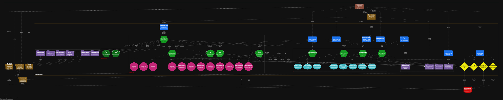

**Figura 2.6.3.1:** Diagrama de componentes de Chatbot. Presenta la separación Query Side / Command Side (CQRS), los controllers REST, los repositorios sobre la base de datos compartida y las dependencias hacia Gestión de Inventario BC, IAM BC, Perfil y Configuración BC y Ventas BC a través de los adaptadores ACL. Fuente: adaptado de `structurizr-109637-ChatbotComponent` del proyecto original.

#### 2.6.3.6. Bounded Context Software Architecture Code Level Diagrams

##### 2.6.3.6.1. Bounded Context Domain Layer Class Diagrams

  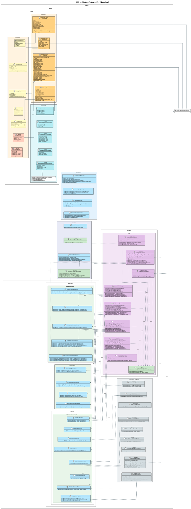

**Figura 2.6.3.2:** Diagrama de clases de Chatbot con los cuatro aggregate roots (`Conversation`, `ChatMessage`, `ChatOrder`, `WhatsappSession`), los value objects de estado y los records inmutables, los commands, los repositorios, los servicios de dominio basados en reglas, los servicios de aplicación (command/query), los puertos de salida y sus adaptadores concretos en infraestructura (`«acl adapter»`, `«adapter»`, `«adapter (SSE)»`). Fuente: adaptado de `CLASS DIAGRAM — Chatbot de WhatsApp BC` del proyecto original.

##### 2.6.3.6.2. Bounded Context Database Design Diagram

  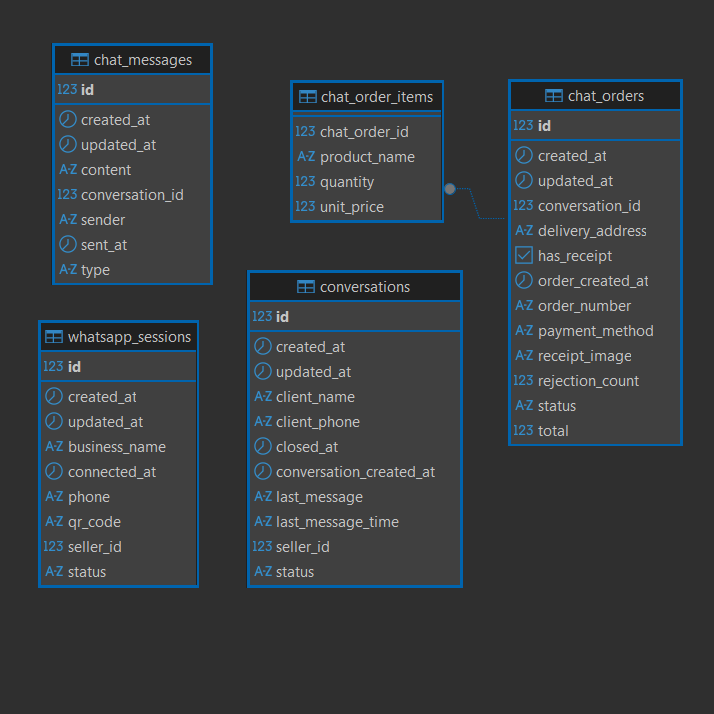

**Figura 2.6.3.3:** Diagrama de base de datos (modelo con énfasis en Chatbot). Fuente: `Entreprenly_database_diagram` del proyecto original.
 
**Diccionario de datos — Chatbot:**
 
<table border="1" cellpadding="8" cellspacing="0" style="width:100%; border-collapse: collapse;">
  <tr style="background-color:#2c3e50; color:white;">
    <th>Tabla</th><th>Campo</th><th>Key</th><th>Descripción</th>
  </tr>
  <tr>
    <td rowspan="7" style="vertical-align:middle; text-align:center;"><code>conversations</code></td>
    <td><code>id</code></td><td style="vertical-align:middle; text-align:center;">PK</td><td>Identificador autoincremental de la conversación.</td>
  </tr>
  <tr><td><code>created_at</code>, <code>updated_at</code></td><td style="vertical-align:middle; text-align:center;">—</td><td>Auditoría heredada.</td></tr>
  <tr><td><code>seller_id</code></td><td style="vertical-align:middle; text-align:center;">IDX</td><td>Referencia lógica al comerciante propietario (IAM).</td></tr>
  <tr><td><code>client_name</code>, <code>client_phone</code></td><td style="vertical-align:middle; text-align:center;">—</td><td>Identificación del cliente en WhatsApp.</td></tr>
  <tr><td><code>last_message</code>, <code>last_message_time</code></td><td style="vertical-align:middle; text-align:center;">—</td><td>Cache del último mensaje para el listado de conversaciones.</td></tr>
  <tr><td><code>status</code></td><td style="vertical-align:middle; text-align:center;">—</td><td>ACTIVE, WAITING_PAYMENT, COMPLETED, CLOSED.</td></tr>
  <tr><td><code>conversation_created_at</code>, <code>closed_at</code></td><td style="vertical-align:middle; text-align:center;">—</td><td>Marcas de negocio del ciclo de vida.</td></tr>
  <tr>
    <td rowspan="4" style="vertical-align:middle; text-align:center;"><code>chat_messages</code></td>
    <td><code>id</code></td><td style="vertical-align:middle; text-align:center;">PK</td><td>Identificador del mensaje.</td>
  </tr>
  <tr><td><code>conversation_id</code></td><td style="vertical-align:middle; text-align:center;">FK → <code>conversations.id</code></td><td>Conversación a la que pertenece el mensaje.</td></tr>
  <tr><td><code>content</code>, <code>sender</code>, <code>type</code></td><td style="vertical-align:middle; text-align:center;">—</td><td>Contenido, emisor (CLIENT/BOT/SYSTEM) y tipo (TEXT/IMAGE).</td></tr>
  <tr><td><code>sent_at</code></td><td style="vertical-align:middle; text-align:center;">—</td><td>Marca de envío del mensaje.</td></tr>
  <tr>
    <td rowspan="7" style="vertical-align:middle; text-align:center;"><code>chat_orders</code></td>
    <td><code>id</code></td><td style="vertical-align:middle; text-align:center;">PK</td><td>Identificador del pedido.</td>
  </tr>
  <tr><td><code>conversation_id</code></td><td style="vertical-align:middle; text-align:center;">FK → <code>conversations.id</code></td><td>Conversación de origen del pedido.</td></tr>
  <tr><td><code>order_number</code></td><td style="vertical-align:middle; text-align:center;">—</td><td>Número de referencia del pedido.</td></tr>
  <tr><td><code>delivery_address</code>, <code>payment_method</code></td><td style="vertical-align:middle; text-align:center;">—</td><td>Datos de entrega y medio de pago.</td></tr>
  <tr><td><code>receipt_image</code>, <code>has_receipt</code>, <code>rejection_count</code></td><td style="vertical-align:middle; text-align:center;">—</td><td>Comprobante de pago y control de rechazos (máx. 2).</td></tr>
  <tr><td><code>status</code>, <code>total</code></td><td style="vertical-align:middle; text-align:center;">—</td><td>Estado del pedido y monto total.</td></tr>
  <tr><td><code>order_created_at</code></td><td style="vertical-align:middle; text-align:center;">—</td><td>Marca de creación del pedido.</td></tr>
  <tr>
    <td rowspan="3" style="vertical-align:middle; text-align:center;"><code>chat_order_items</code></td>
    <td><code>id</code></td><td style="vertical-align:middle; text-align:center;">PK</td><td>Identificador del ítem.</td>
  </tr>
  <tr><td><code>chat_order_id</code></td><td style="vertical-align:middle; text-align:center;">FK → <code>chat_orders.id</code></td><td>Pedido al que pertenece el ítem.</td></tr>
  <tr><td><code>product_name</code>, <code>quantity</code>, <code>unit_price</code></td><td style="vertical-align:middle; text-align:center;">—</td><td>Copia denormalizada del producto pedido (VO `OrderItem`).</td></tr>
  <tr>
    <td rowspan="5" style="vertical-align:middle; text-align:center;"><code>whatsapp_sessions</code></td>
    <td><code>id</code></td><td style="vertical-align:middle; text-align:center;">PK</td><td>Identificador de la sesión.</td>
  </tr>
  <tr><td><code>seller_id</code></td><td style="vertical-align:middle; text-align:center;">IDX</td><td>Referencia lógica al comerciante propietario (IAM).</td></tr>
  <tr><td><code>phone</code>, <code>business_name</code></td><td style="vertical-align:middle; text-align:center;">—</td><td>Número y nombre del negocio vinculados al bridge.</td></tr>
  <tr><td><code>status</code>, <code>qr_code</code></td><td style="vertical-align:middle; text-align:center;">—</td><td>Estado de conexión (CONNECTED/DISCONNECTED/EXPIRED) y código QR vigente.</td></tr>
  <tr><td><code>connected_at</code></td><td style="vertical-align:middle; text-align:center;">—</td><td>Marca de la última conexión exitosa.</td></tr>
</table>

**Relaciones:** `chat_messages.conversation_id` → `conversations.id`; `chat_orders.conversation_id` → `conversations.id`; `chat_order_items.chat_order_id` → `chat_orders.id`. Sin FK físicas hacia otros BCs: `seller_id` / `owner_email` son referencias lógicas a `users`/`profiles` (IAM), y el catálogo consultado (`inventory_unit_products` / `inventory_weight_products`), la venta registrada (`sales` / `sale_items`) y el plan validado (`subscriptions`) se acceden exclusivamente a través de los adaptadores ACL descritos en la capa de Infraestructura.

### 2.6.4. Bounded Context: Subscription

Este Bounded Context administra la relación de suscripción del comerciante con Entreprenly. Comprende el catálogo de planes Free y Control, la contratación, los datos de facturación, los métodos de pago, los cobros, la activación, la renovación, la cancelación y la consulta del historial. Free se establece como plan efectivo al crear la cuenta y permite el acceso básico sin vencimiento; Control habilita los beneficios contratados durante un periodo mensual o anual, una vez aprobado el pago correspondiente.

El diseño sigue DDD táctico y Clean Architecture mediante las capas Domain, Interface, Application e Infrastructure. Subscription es responsable de las reglas de vigencia y de los cambios del plan efectivo. Una solicitud de cancelación conserva los beneficios hasta el final del periodo contratado; al concluir, se cancela la suscripción de pago y se restablece Free. Las consultas de acceso evalúan tanto el estado como las fechas, de modo que una ejecución tardía del procesamiento de vencimientos no prolongue el acceso premium.

#### 2.6.4.1. Domain Layer

**Sub-capa Model - Aggregates:**

<table border="1" cellpadding="8" cellspacing="0" style="width:100%; border-collapse: collapse;">
  <tr style="background-color:#2c3e50; color:white;">
    <th>Tipo</th><th>Nombre</th><th>Descripción</th><th>Responsabilidad Principal</th><th>Relación con otros elementos</th>
  </tr>
  <tr>
    <td>Aggregate Root</td><td>SubscriptionPlan</td><td>Define el código, nombre, descripción, precios, periodicidad y funcionalidades de Free y Control.</td><td>Mantener importes no negativos, moneda consistente y un código único; resolver el precio mensual o anual mediante getPriceFor. Free no requiere cobro.</td><td>Referenciado por Subscription y Payment mediante planId; contiene Money y BillingPeriod.</td>
  </tr>
  <tr>
    <td>Aggregate Root</td><td>Subscription</td><td>Representa la suscripción de pago del usuario, con estado, periodo, solicitud de cancelación y último pago aplicado; el acceso Free se resuelve cuando no existe Control vigente.</td><td>Controlar applyPayment, activate, scheduleCancellation, cancel e isActiveAt; aplicar cada pago una sola vez y conservar el periodo vigente ante una cancelación programada.</td><td>Referencia a SubscriptionPlan, Payment y al propietario mediante identificadores; extiende AbstractDomainAggregateRoot.</td>
  </tr>
  <tr>
    <td>Aggregate Root</td><td>Payment</td><td>Registra cada intento de cobro, importe, moneda, plan, periodo, resultado y referencia de transacción.</td><td>Conservar la trazabilidad del cobro y distinguir PENDING, APPROVED, DECLINED y FAILED. Un resultado no aprobado no habilita ni extiende Control.</td><td>Se vincula a Subscription mediante subscriptionId y al propietario mediante userId.</td>
  </tr>
  <tr>
    <td>Aggregate Root</td><td>BillingSetup</td><td>Agrupa la configuración de facturación y los métodos de pago del usuario.</td><td>Mantener los datos fiscales y la colección de medios de pago, con un único método predeterminado cuando existan métodos disponibles.</td><td>Contiene FiscalData y PaymentMethod; se recupera por userId a través de BillingSetupRepository.</td>
  </tr>
</table>

**Sub-capa Model - Entities:**

<table border="1" cellpadding="8" cellspacing="0" style="width:100%; border-collapse: collapse;">
  <tr style="background-color:#2c3e50; color:white;">
    <th>Tipo</th><th>Nombre</th><th>Descripción</th><th>Responsabilidad Principal</th><th>Relación con otros elementos</th>
  </tr>
  <tr>
    <td>Entity</td><td>SubscriptionPlan / Subscription / Payment / BillingSetup</td><td>Entidades con identidad propia que constituyen las raíces de agregado del contexto.</td><td>Mantener sus invariantes dentro de cada límite de consistencia; coordinar referencias entre agregados mediante identificadores.</td><td>No se requieren entidades subordinadas con ciclo de vida independiente; PaymentMethod es un valor reemplazable identificado por la referencia externa methodId.</td>
  </tr>
</table>

El historial es una proyección de los eventos de negocio persistidos. SubscriptionActivity conserva eventId, userId, subscriptionId opcional, tipo, fecha y detalle de la operación. No es una raíz de agregado ni sustituye a Subscription; permite consultar cambios anteriores aunque el plan efectivo vuelva a Free.

**Sub-capa Model - Commands:**

<table border="1" cellpadding="8" cellspacing="0" style="width:100%; border-collapse: collapse;">
  <tr style="background-color:#2c3e50; color:white;">
    <th>Tipo</th><th>Nombre</th><th>Descripción</th><th>Responsabilidad Principal</th><th>Relación con otros elementos</th>
  </tr>
  <tr>
    <td>Command</td><td>CreateSubscriptionPlanCommand</td><td>Solicita registrar un plan con código, precios, moneda y beneficios.</td><td>Transportar la configuración del catálogo; el servicio verifica unicidad y el agregado valida las condiciones monetarias.</td><td>Atendido por SubscriptionPlanCommandService; operación restringida a la administración del catálogo.</td>
  </tr>
  <tr>
    <td>Command</td><td>CreateSubscriptionCommand</td><td>Solicita contratar el plan seleccionado para un usuario y una periodicidad.</td><td>Iniciar la contratación y el cobro sin retirar Free antes de la aprobación del pago.</td><td>Atendido por SubscriptionCommandService; utiliza SubscriptionPlanRepository y PaymentGateway.</td>
  </tr>
  <tr>
    <td>Command</td><td>ProcessSubscriptionPaymentCommand</td><td>Solicita procesar el pago de una suscripción.</td><td>Identificar la suscripción y el medio de pago; el importe se obtiene del catálogo y no de un valor libre enviado por el cliente.</td><td>SubscriptionCommandService registra Payment y aplica el resultado mediante Subscription.applyPayment.</td>
  </tr>
  <tr>
    <td>Command</td><td>RenewSubscriptionCommand</td><td>Solicita extender la vigencia de Control.</td><td>Comprobar que el periodo sea renovable, procesar el cobro y extender desde el vencimiento vigente únicamente tras su aprobación.</td><td>Atendido por SubscriptionCommandService; Free y las suscripciones canceladas no se renuevan mediante esta operación.</td>
  </tr>
  <tr>
    <td>Command</td><td>CancelSubscriptionCommand</td><td>Solicita la cancelación de la suscripción de pago.</td><td>Programar el cese al finalizar el periodo; repetir la solicitud no modifica la fecha de vencimiento ni duplica sus efectos.</td><td>Atendido por SubscriptionCommandService; invoca scheduleCancellation sobre Subscription.</td>
  </tr>
  <tr><td>Command</td><td>UpdateBillingDetailsCommand</td><td>Actualiza los datos fiscales del propietario.</td><td>Validar FiscalData y modificar BillingSetup.</td><td>Atendido por BillingSetupCommandService.</td></tr>
  <tr><td>Command</td><td>AddPaymentMethodCommand / RemovePaymentMethodCommand / SetDefaultPaymentMethodCommand</td><td>Gestiona referencias de métodos de pago.</td><td>Actualizar la colección sin duplicar methodId; si se elimina el predeterminado, seleccionar otro de forma explícita o dejar la colección vacía.</td><td>Atendidos por BillingSetupCommandService.</td></tr>
  <tr><td>Command</td><td>CompleteSubscriptionPeriodCommand</td><td>Procesa una contratación cuyo periodo concluyó.</td><td>Cancelar si existe solicitud; expirar si no hay renovación aprobada.</td><td>Atendido por SubscriptionCommandService; operación interna idempotente.</td></tr>
</table>

Los comandos expresan una intención y transportan datos. La autorización corresponde a la aplicación y las invariantes se ejecutan en los agregados. El campo requestedPaymentStatus se limita al adaptador de pagos simulado; no constituye una confirmación válida emitida por un proveedor real.

**Sub-capa Model - Queries:**

<table border="1" cellpadding="8" cellspacing="0" style="width:100%; border-collapse: collapse;">
  <tr style="background-color:#2c3e50; color:white;">
    <th>Tipo</th><th>Nombre</th><th>Descripción</th><th>Responsabilidad Principal</th><th>Relación con otros elementos</th>
  </tr>
  <tr>
    <td>Query</td><td>GetAllSubscriptionPlansQuery</td><td>Consulta el catálogo de planes.</td><td>Obtener las condiciones de Free y Control disponibles para contratación.</td><td>Atendida por SubscriptionPlanQueryService.</td>
  </tr>
  <tr>
    <td>Query</td><td>GetSubscriptionPlanByIdQuery</td><td>Consulta un plan específico.</td><td>Recuperar precios, periodicidad y funcionalidades del plan solicitado.</td><td>Atendida por SubscriptionPlanQueryService.</td>
  </tr>
  <tr>
    <td>Query</td><td>GetSubscriptionByIdQuery</td><td>Consulta el detalle de una suscripción.</td><td>Obtener estado, plan y fechas después de comprobar la pertenencia al usuario autenticado.</td><td>Atendida por SubscriptionQueryService.</td>
  </tr>
  <tr>
    <td>Query</td><td>GetActiveSubscriptionByUserIdQuery</td><td>Consulta la suscripción vigente del propietario.</td><td>Resolver el plan efectivo considerando estado, periodo y cancelación programada.</td><td>Atendida por SubscriptionQueryService; sirve al panel y la validación de acceso.</td>
  </tr>
  <tr>
    <td>Query</td><td>GetPaymentsBySubscriptionIdQuery</td><td>Consulta los intentos de cobro de una suscripción.</td><td>Obtener importes, fechas y resultados en orden cronológico, dentro del ámbito del propietario.</td><td>Atendida por SubscriptionQueryService; complementa el historial de actividad.</td>
  </tr>
  <tr><td>Query</td><td>GetBillingSetupByUserIdQuery</td><td>Consulta la configuración de facturación.</td><td>Entregar datos del propietario autenticado con métodos enmascarados.</td><td>Atendida por BillingSetupQueryService.</td></tr>
  <tr><td>Query</td><td>GetSubscriptionHistoryQuery</td><td>Consulta la actividad con rango de fechas y paginación.</td><td>Recuperar solo registros del propietario; conservar orden por fecha y eventId.</td><td>Atendida por SubscriptionHistoryQueryService; utilizada también para exportar.</td></tr>
</table>

**Sub-capa Model - Events:**

<table border="1" cellpadding="8" cellspacing="0" style="width:100%; border-collapse: collapse;">
<tr style="background-color:#2c3e50; color:white;"><th>Tipo</th><th>Nombre</th><th>Descripción</th><th>Responsabilidad Principal</th><th>Relación con otros elementos</th></tr>
  <tr><td>Domain Event</td><td>SubscriptionActivated</td><td>Control fue activado tras un pago aprobado.</td><td>Registrar el inicio del periodo contratado.</td><td>Emitido por Subscription; origina actividad y cambio de plan efectivo.</td></tr>
  <tr><td>Domain Event</td><td>SubscriptionRenewed</td><td>Se extendió el periodo tras aplicar un nuevo pago.</td><td>Conservar la fecha anterior y la nueva fecha de vencimiento.</td><td>Emitido por Subscription; actualiza el historial.</td></tr>
  <tr><td>Domain Event</td><td>SubscriptionCancellationScheduled</td><td>Se confirmó la solicitud de cancelación.</td><td>Registrar cancellationRequestedAt sin retirar el acceso vigente.</td><td>Emitido por Subscription.</td></tr>
  <tr><td>Domain Event</td><td>SubscriptionCancelled / SubscriptionExpired</td><td>Terminó la contratación por cancelación o vencimiento sin renovación aprobada.</td><td>Registrar el fin de Control y activar la resolución de Free.</td><td>Emitidos por Subscription; la aplicación comunica el plan efectivo a Profile.</td></tr>
  <tr><td>Domain Event</td><td>PaymentProcessed</td><td>Se registró el resultado del intento de cobro.</td><td>Conservar paymentId, estado, importe y fecha sin datos sensibles.</td><td>Emitido por Payment; alimenta el historial.</td></tr>
  <tr><td>Domain Event</td><td>BillingDetailsUpdated / PaymentMethodsChanged</td><td>Se actualizó la configuración de facturación.</td><td>Registrar la operación sin copiar documentos fiscales ni tokens al historial.</td><td>Emitidos por BillingSetup.</td></tr>
</table>

Los eventos de dominio expresan hechos del negocio. UserSignedUpIntegrationEvent y SubscriptionPlanChangedIntegrationEvent son contratos entre contextos y se describen en Interface; ApplicationReadyEvent pertenece exclusivamente al arranque de Application.

**Sub-capa Model - Value Objects:**

<table border="1" cellpadding="8" cellspacing="0" style="width:100%; border-collapse: collapse;">
  <tr style="background-color:#2c3e50; color:white;">
    <th>Tipo</th><th>Nombre</th><th>Descripción</th><th>Responsabilidad Principal</th><th>Relación con otros elementos</th>
  </tr>
  <tr>
    <td>Value Object</td><td>Money</td><td>Importe decimal y moneda de un precio o cobro.</td><td>Mantener precisión monetaria y rechazar importes negativos; comparar importes junto con su moneda.</td><td>Utilizado por SubscriptionPlan y Payment.</td>
  </tr>
  <tr>
    <td>Value Object</td><td>BillingPeriod</td><td>Periodicidad MONTHLY o YEARLY.</td><td>Determinar el precio y la extensión del periodo contratado.</td><td>Utilizado por SubscriptionPlan, Subscription y Payment para Control; el acceso Free no requiere periodo de cobro.</td>
  </tr>
  <tr>
    <td>Value Object</td><td>SubscriptionStatus</td><td>Estados ACTIVE, PENDING_PAYMENT, CANCELLED, EXPIRED y SUSPENDED.</td><td>Representar el ciclo de vida; la vigencia se determina conjuntamente con currentPeriodEnd.</td><td>Utilizado por Subscription. Free es un plan, mientras que la cancelación programada se consulta mediante isCancellationScheduled.</td>
  </tr>
  <tr>
    <td>Value Object</td><td>PaymentStatus</td><td>Resultados PENDING, APPROVED, DECLINED y FAILED.</td><td>Distinguir un pago pendiente, aprobado, rechazado o fallido.</td><td>Utilizado por Payment; solo APPROVED permite aplicar el pago.</td>
  </tr>
  <tr>
    <td>Value Object</td><td>FiscalData</td><td>Documento, número, nombre o razón social, correo y dirección fiscal.</td><td>Agrupar información de facturación completa y válida antes de preparar el cobro.</td><td>Contenido en BillingSetup.</td>
  </tr>
  <tr>
    <td>Value Object</td><td>PaymentMethod</td><td>Referencia del proveedor, marca, últimos cuatro dígitos, titular, vencimiento y selección predeterminada.</td><td>Representar un medio de pago mediante datos descriptivos y una referencia; sus cambios sustituyen el valor dentro del agregado.</td><td>Colección de BillingSetup; no almacena el número completo de tarjeta ni su código de seguridad.</td>
  </tr>
</table>

La cancelación programada se representa mediante cancellationRequestedAt y autoRenew = false. Mientras status = ACTIVE y now < currentPeriodEnd, Control conserva sus beneficios. cancelledAt permanece vacío hasta que se ejecuta la cancelación efectiva; entonces status pasa a CANCELLED. Una contratación que vence sin renovación aprobada y sin solicitud de cancelación pasa a EXPIRED. SUSPENDED no concede beneficios premium y PENDING_PAYMENT no sustituye el acceso Free.

Por usuario se admite como máximo una contratación abierta de Control, considerando PENDING_PAYMENT, ACTIVE y SUSPENDED. Un índice único condicionado por user_id y control de concurrencia protegen esta regla. Free se obtiene del catálogo cuando no existe Control vigente; no se crea una segunda fila activa para Free. Las contrataciones cerradas se conservan para el historial. GetActiveSubscriptionByUserIdQuery puede devolver ausencia de Control; SubscriptionContextFacade resuelve en ese caso el plan Free.

La contratación pendiente se reutiliza cuando se reintenta un pago rechazado; no se abre una segunda contratación para el mismo usuario. Antes de una nueva contratación, Application procesa una contratación anterior cuyo periodo ya terminó.

La renovación se procesa mientras Control esté vigente y no tenga cancelación programada. La aprobación extiende el periodo desde currentPeriodEnd; un rechazo conserva la fecha original. autoRenew permite al procesamiento periódico solicitar el mismo caso de uso con una clave de operación por suscripción y periodo. Al confirmar la cancelación se deshabilita esa renovación. Abrir y cerrar el diálogo de confirmación no produce ningún comando ni cambio de estado.

**Sub-capa Services:**

<table border="1" cellpadding="8" cellspacing="0" style="width:100%; border-collapse: collapse;">
  <tr style="background-color:#2c3e50; color:white;">
    <th>Tipo</th><th>Nombre</th><th>Descripción</th><th>Responsabilidad Principal</th><th>Relación con otros elementos</th>
  </tr>
  <tr>
    <td>Domain Behavior</td><td>Subscription.applyPayment / activate</td><td>Aplica un pago aprobado y establece el periodo contratado.</td><td>Verificar correspondencia de suscripción, plan, moneda y periodo; impedir la reutilización de un pago.</td><td>Comportamiento de Subscription invocado por SubscriptionCommandService.</td>
  </tr>
  <tr>
    <td>Domain Behavior</td><td>Subscription.scheduleCancellation / cancel / expire / isActiveAt</td><td>Gestiona cancelación y vigencia.</td><td>Conservar acceso hasta currentPeriodEnd y resolver el vencimiento con una fecha explícita.</td><td>La aplicación coordina su ejecución; la fachada resuelve Free al no existir Control vigente.</td>
  </tr>
  <tr>
    <td>Domain Behavior</td><td>SubscriptionPlan.getPriceFor / hasFeature</td><td>Resuelve el precio y los beneficios del catálogo.</td><td>Mantener estas reglas junto a los datos del plan, sin depender del proveedor de pagos ni de controladores.</td><td>Utilizado por los servicios de aplicación al contratar o consultar acceso.</td>
  </tr>
</table>

Las reglas anteriores pertenecen a las raíces de agregado y no requieren un servicio de dominio independiente. SubscriptionCommandService y SubscriptionQueryService son contratos de aplicación: coordinan casos de uso y no sustituyen las invariantes del dominio.

**Sub-capa Repositories:**

<table border="1" cellpadding="8" cellspacing="0" style="width:100%; border-collapse: collapse;">
  <tr style="background-color:#2c3e50; color:white;">
    <th>Tipo</th><th>Nombre</th><th>Descripción</th><th>Responsabilidad Principal</th><th>Relación con otros elementos</th>
  </tr>
  <tr>
    <td>Repository</td><td>SubscriptionPlanRepository</td><td>Contrato de persistencia del catálogo.</td><td>Consultar por identificador o código y verificar unicidad antes de guardar.</td><td>Implementado en Infrastructure; utilizado por servicios del catálogo.</td>
  </tr>
  <tr>
    <td>Repository</td><td>SubscriptionRepository</td><td>Contrato de persistencia de suscripciones.</td><td>Recuperar por identificador o propietario y estado; guardar cambios de vigencia con control de concurrencia.</td><td>Implementado en Infrastructure; conserva las contrataciones anteriores.</td>
  </tr>
  <tr>
    <td>Repository</td><td>PaymentRepository</td><td>Contrato de persistencia de intentos de cobro.</td><td>Guardar resultados y consultar por subscriptionId, conservando la referencia de transacción.</td><td>Implementado en Infrastructure; utilizado por SubscriptionCommandService y SubscriptionQueryService.</td>
  </tr>
  <tr>
    <td>Repository</td><td>BillingSetupRepository</td><td>Contrato de persistencia de facturación.</td><td>Recuperar y guardar la configuración completa del propietario mediante userId.</td><td>Implementado en Infrastructure; persiste los valores de BillingSetup.</td>
  </tr>
</table>

#### 2.6.4.2. Interface Layer

**REST - Controllers:**

<table border="1" cellpadding="8" cellspacing="0" style="width:100%; border-collapse: collapse;">
  <tr style="background-color:#2c3e50; color:white;">
    <th>Tipo</th><th>Nombre</th><th>Descripción</th><th>Responsabilidad Principal</th><th>Relación con otros elementos</th>
  </tr>
  <tr>
    <td>Controller</td><td>SubscriptionsController</td><td>Expone contratación, consulta, renovación, cancelación, pagos y validación de acceso.</td><td>Validar recursos y pertenencia al usuario autenticado; delegar cada operación a los servicios de aplicación.</td><td>Utiliza SubscriptionCommandService y SubscriptionQueryService.</td>
  </tr>
  <tr>
    <td>Controller</td><td>SubscriptionPlansController</td><td>Expone la consulta y administración del catálogo.</td><td>Separar la lectura de planes de las operaciones administrativas de creación.</td><td>Utiliza SubscriptionPlanCommandService y SubscriptionPlanQueryService.</td>
  </tr>
  <tr>
    <td>Controller</td><td>SubscriptionDashboardController</td><td>Expone el panel, la configuración de facturación y la confirmación del pago.</td><td>Entregar plan efectivo, vigencia, métodos de pago y actividad del usuario; encauzar las modificaciones a través de la aplicación.</td><td>Delega en SubscriptionQueryService, BillingSetupCommandService, BillingSetupQueryService y SubscriptionHistoryQueryService; no accede directamente a repositorios.</td>
  </tr>
</table>

**REST - Resources y Transform (assemblers):**

<table border="1" cellpadding="8" cellspacing="0" style="width:100%; border-collapse: collapse;">
  <tr style="background-color:#2c3e50; color:white;">
    <th>Tipo</th><th>Nombre</th><th>Descripción</th><th>Responsabilidad Principal</th><th>Relación con otros elementos</th>
  </tr>
  <tr>
    <td>Resource</td><td>SubscriptionResource / AccessValidationResource</td><td>Representaciones de la suscripción y del acceso autorizado.</td><td>Exponer identificadores, plan, estado, fechas y beneficios sin entregar entidades persistentes.</td><td>Construidos a partir del resultado de los servicios de aplicación.</td>
  </tr>
  <tr>
    <td>Resource</td><td>PaymentResource</td><td>Representación del cobro registrado.</td><td>Entregar importe, moneda, fecha y resultado; excluir tokens y datos internos del proveedor.</td><td>Utilizado en pagos y confirmaciones.</td>
  </tr>
  <tr>
    <td>Resource</td><td>Recursos de contratación, renovación y facturación</td><td>Datos de entrada de las operaciones del usuario.</td><td>Validar formato y campos obligatorios; obtener el propietario de la identidad autenticada y los precios del catálogo.</td><td>Transformados en comandos o solicitudes de aplicación.</td>
  </tr>
  <tr>
    <td>Assembler</td><td>Transformadores de Subscription y Payment</td><td>Conversión entre recursos y modelos de aplicación.</td><td>Mantener las decisiones de serialización fuera del dominio.</td><td>Utilizados por los controladores REST.</td>
  </tr>
</table>

**ACL - Integración entre contextos:**

<table border="1" cellpadding="8" cellspacing="0" style="width:100%; border-collapse: collapse;">
  <tr style="background-color:#2c3e50; color:white;">
    <th>Tipo</th><th>Nombre</th><th>Descripción</th><th>Responsabilidad Principal</th><th>Relación con otros elementos</th>
  </tr>
  <tr>
    <td>Facade</td><td>IamContextFacade</td><td>Contrato de consulta del módulo de identidad y acceso.</td><td>Resolver la identidad del usuario sin acceder directamente a sus tablas.</td><td>Utilizado para comprobar el propietario de las operaciones.</td>
  </tr>
  <tr>
    <td>Published Contract</td><td>Validación de acceso a funcionalidades</td><td>Contrato de lectura del plan efectivo y sus beneficios.</td><td>Evaluar vigencia y hasFeature; devolver una respuesta independiente del modelo interno de Subscription.</td><td>Expuesto mediante validateAccess y AccessValidationResource para los consumidores.</td>
  </tr>
  <tr>
    <td>Integration Event</td><td>SubscriptionPlanChangedIntegrationEvent</td><td>Contrato de notificación a Profile.</td><td>Comunicar cambios confirmados del plan sin compartir agregados.</td><td>Profile actualiza su representación del plan; Subscription conserva la autoridad sobre la vigencia.</td>
  </tr>
  <tr><td>Facade</td><td>SubscriptionContextFacade</td><td>Expone getEffectivePlan(userId, at) y validateAccess(userId, feature, at).</td><td>Resolver Free o Control y sus beneficios usando la misma regla de vigencia del panel.</td><td>Consumida por adaptadores de otros contextos; no expone entidades ORM.</td></tr>
  <tr><td>Integration Event</td><td>UserSignedUpIntegrationEvent</td><td>Notifica el alta en IAM.</td><td>Establecer Free como plan efectivo y sincronizar Profile de forma idempotente, sin crear una contratación de pago.</td><td>Consumido por UserSignedUpSubscriptionEventHandler.</td></tr>
</table>

#### 2.6.4.3. Application Layer

**Servicios de aplicación:**

<table border="1" cellpadding="8" cellspacing="0" style="width:100%; border-collapse: collapse;">
  <tr style="background-color:#2c3e50; color:white;">
    <th>Tipo</th><th>Nombre</th><th>Descripción</th><th>Responsabilidad Principal</th><th>Relación con otros elementos</th>
  </tr>
  <tr>
    <td>Command Service</td><td>SubscriptionCommandService</td><td>Coordina contratación, cobro, renovación y cancelación.</td><td>Autorizar al propietario, recuperar agregados, solicitar el cobro por PaymentGateway, aplicar las reglas y persistir el resultado.</td><td>Depende de repositorios y del contrato PaymentGateway; publica cambios de plan después de confirmar la persistencia.</td>
  </tr>
  <tr>
    <td>Command Service</td><td>SubscriptionPlanCommandService</td><td>Coordina el registro del catálogo.</td><td>Verificar permisos administrativos y unicidad antes de crear SubscriptionPlan.</td><td>Utiliza SubscriptionPlanRepository.</td>
  </tr>
  <tr>
    <td>Query Service</td><td>SubscriptionQueryService</td><td>Resuelve detalle, suscripción vigente y pagos.</td><td>Mantener las consultas dentro del ámbito del propietario y calcular el acceso con la fecha de consulta.</td><td>Utiliza SubscriptionRepository y PaymentRepository.</td>
  </tr>
  <tr>
    <td>Query Service</td><td>SubscriptionPlanQueryService</td><td>Resuelve consultas de planes.</td><td>Obtener el catálogo y las condiciones del plan seleccionado.</td><td>Utiliza SubscriptionPlanRepository.</td>
  </tr>
  <tr>
    <td>Application Use Case</td><td>Gestión de facturación e historial</td><td>Coordina los cambios en BillingSetup y la lectura de actividad.</td><td>Validar pertenencia, actualizar datos fiscales y métodos de pago; reunir cambios y cobros para su consulta y descarga.</td><td>Utiliza BillingSetupRepository y registros de actividad; los textos del panel se componen como recursos de presentación.</td>
  </tr>
  <tr>
    <td>Event Handler</td><td>UserSignedUpSubscriptionEventHandler</td><td>Atiende la creación de una cuenta.</td><td>Resolver Free para el usuario recién creado y comunicar el plan efectivo una sola vez mediante una clave de evento procesado.</td><td>Consume UserSignedUpIntegrationEvent; resuelve el catálogo y registra la notificación en el outbox.</td>
  </tr>
  <tr>
    <td>Event Handler</td><td>SubscriptionCatalogReadyEventHandler</td><td>Inicializa los planes predeterminados.</td><td>Crear Free y Control solo cuando no existan, sin sobrescribir configuraciones vigentes.</td><td>Consume ApplicationReadyEvent.</td>
  </tr>
  <tr>
    <td>Application Use Case</td><td>Procesamiento de fin de periodo</td><td>Coordina las suscripciones que alcanzan su vencimiento.</td><td>Ejecutar cancelaciones programadas, conservar la contratación histórica y restablecer Free; una renovación aprobada extiende el periodo sin duplicación.</td><td>Invoca comportamiento de Subscription y comunica el cambio efectivo a Profile.</td>
  </tr>
  <tr><td>Command Service</td><td>BillingSetupCommandService</td><td>Atiende los comandos de facturación y métodos de pago.</td><td>Autorizar al propietario y ejecutar las invariantes de BillingSetup dentro de una transacción.</td><td>Depende de BillingSetupRepository.</td></tr>
  <tr><td>Query Service</td><td>BillingSetupQueryService</td><td>Resuelve GetBillingSetupByUserIdQuery.</td><td>Retornar información fiscal y métodos enmascarados, sin tokens del proveedor.</td><td>Depende de BillingSetupRepository.</td></tr>
  <tr><td>Query Service</td><td>SubscriptionHistoryQueryService</td><td>Resuelve consulta y descarga del historial.</td><td>Aplicar propietario, fechas y paginación; delegar la generación del archivo al adaptador de exportación.</td><td>Depende de SubscriptionActivityStore, puerto de lectura de Application.</td></tr>
  <tr><td>Event Handler</td><td>SubscriptionActivityProjector</td><td>Proyecta los eventos de negocio persistidos.</td><td>Insertar una actividad por eventId y permitir reintentos sin duplicados.</td><td>Consume eventos del outbox y escribe mediante SubscriptionActivityStore.</td></tr>
</table>

La llamada al proveedor de pagos se separa de la transacción local de persistencia. El intento se identifica antes del cobro y su resultado se registra de manera idempotente. La actualización de la suscripción y el registro de que el pago fue aplicado deben conservarse de forma consistente; una repetición de la respuesta no extiende nuevamente el periodo. Los eventos se guardan en subscription_outbox dentro de la misma transacción local. Un publicador posterior entrega los eventos con reintentos; eventId permite deduplicar el historial y las notificaciones. Los cambios de plan destinados a un usuario se procesan en orden para impedir que Profile termine mostrando un plan anterior.

#### 2.6.4.4. Infrastructure Layer

**Persistencia e integración:**

<table border="1" cellpadding="8" cellspacing="0" style="width:100%; border-collapse: collapse;">
  <tr style="background-color:#2c3e50; color:white;">
    <th>Tipo</th><th>Nombre</th><th>Descripción</th><th>Responsabilidad Principal</th><th>Relación con otros elementos</th>
  </tr>
  <tr>
    <td>Persistence Adapter</td><td>Implementaciones JPA de los repositorios</td><td>Adaptan los contratos a la base de datos relacional.</td><td>Mapear agregados y valores, aplicar transacciones y evitar actualizaciones concurrentes incompatibles.</td><td>Implementan SubscriptionPlanRepository, SubscriptionRepository, PaymentRepository y BillingSetupRepository.</td>
  </tr>
  <tr>
    <td>Outbound Port</td><td>PaymentGateway</td><td>Contrato de aplicación para solicitar un cobro.</td><td>Intercambiar PaymentGatewayRequest y PaymentGatewayResponse sin acoplar el dominio a un proveedor.</td><td>Invocado por SubscriptionCommandService e implementado por adaptadores de Infrastructure.</td>
  </tr>
  <tr>
    <td>Payment Adapter</td><td>FakePaymentGateway</td><td>Adaptador de simulación del resultado del cobro.</td><td>Producir respuestas controladas de aprobación, rechazo o fallo para validar los flujos de la aplicación.</td><td>Implementa PaymentGateway; no realiza cobros financieros reales.</td>
  </tr>
  <tr>
    <td>Persistence Mechanism</td><td>Control de duplicados y concurrencia</td><td>Protección del registro y aplicación de pagos.</td><td>Usar una referencia única de operación y control transaccional para impedir cobros aplicados dos veces o periodos sobrescritos.</td><td>Complementa las invariantes de Subscription y la persistencia de Payment.</td>
  </tr>
  <tr>
    <td>Scheduling Adapter</td><td>Ejecución periódica del fin de periodo</td><td>Activa el caso de uso de vencimiento.</td><td>Seleccionar suscripciones pendientes de procesamiento y delegar las decisiones a la aplicación.</td><td>No modifica directamente el plan ni reemplaza la comprobación de vigencia en las consultas.</td>
  </tr>
  <tr>
    <td>Read Model</td><td>Persistencia de actividad y exportación</td><td>Conserva los cambios de suscripción necesarios para el historial.</td><td>Registrar fecha, usuario, suscripción y operación confirmada; generar la descarga a partir de registros autorizados.</td><td>Complementa los pagos persistidos y el modelo de consulta del panel.</td>
  </tr>
  <tr><td>Application Port</td><td>SubscriptionActivityStore</td><td>Contrato de lectura y escritura de la proyección de actividad.</td><td>Insertar por eventId único y consultar por userId, fechas y paginación.</td><td>Implementado por persistencia relacional; no es repositorio de agregado.</td></tr>
  <tr><td>Outbox Adapter</td><td>SubscriptionOutboxPublisher</td><td>Entrega los eventos confirmados en la transacción local.</td><td>Reintentar entregas pendientes conservando orden por usuario y deduplicación por evento.</td><td>Alimenta SubscriptionActivityProjector y los consumidores de integración.</td></tr>
  <tr><td>Export Adapter</td><td>SubscriptionHistoryExporter</td><td>Genera el archivo del historial autorizado.</td><td>Convertir los registros de lectura a CSV con fechas, operación y resultado.</td><td>Invocado por SubscriptionHistoryQueryService; no introduce reglas de dominio.</td></tr>
</table>

#### 2.6.4.5. Bounded Context Software Architecture Component Level Diagrams

  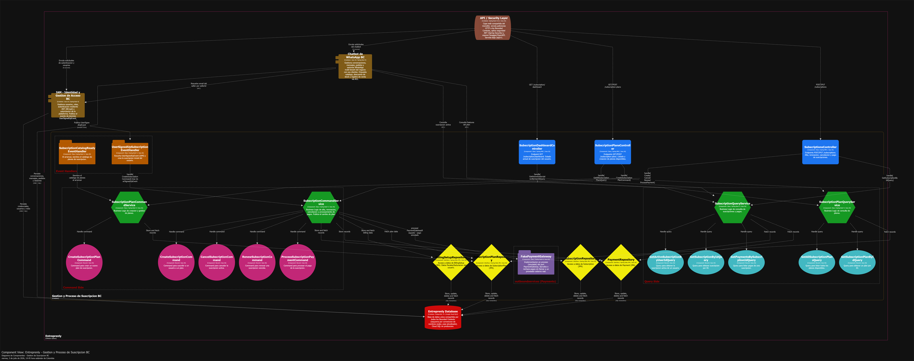

**Figura 2.6.4.1:** Componentes y dependencias de Subscription. Los controladores delegan los casos de uso a Application; los adaptadores implementan los contratos de persistencia y pago. El dominio no depende de los controladores, JPA ni del proveedor de pagos. Profile recibe cambios confirmados, mientras los consumidores de funcionalidades consultan el plan efectivo mediante la fachada.

#### 2.6.4.6. Bounded Context Software Architecture Code Level Diagrams

El modelo separa las raíces de agregado, sus valores y las proyecciones de lectura. Las referencias externas se conservan como identificadores y la persistencia de eventos permite reconstruir la actividad sin convertir el historial en una raíz de agregado.

##### 2.6.4.6.1. Bounded Context Domain Layer Class Diagrams

  

**Figura 2.6.4.2:** Agregados y objetos de valor del dominio. La solicitud de cancelación y su ejecución utilizan fechas diferentes. Payment.appliedAt identifica la aplicación de cada cobro, mientras Subscription.version protege la actualización concurrente del periodo. Los textos y etiquetas del panel pertenecen a los recursos de interfaz y no se almacenan como reglas de BillingSetup.

##### 2.6.4.6.2. Bounded Context Database Design Diagram

  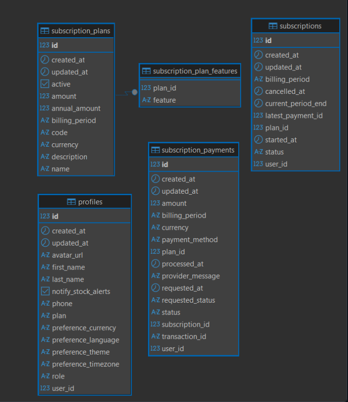

**Figura 2.6.4.3:** Modelo de persistencia del contexto, incluida la configuración de facturación y las proyecciones de actividad. user_id conserva una referencia lógica a IAM; Profile e Inventory no se incorporan al esquema de Subscription.

**Diccionario de persistencia:**

<table border="1" cellpadding="8" cellspacing="0" style="width:100%; border-collapse: collapse;">
<tr style="background-color:#2c3e50; color:white;"><th>Tipo</th><th>Nombre</th><th>Descripción</th><th>Responsabilidad Principal</th><th>Relación con otros elementos</th></tr>
  <tr><td>Table</td><td>subscription_plans / subscription_plan_features</td><td>Catálogo Free y Control con precios y beneficios.</td><td>Código único, importes no negativos y unicidad de la pareja plan_id–feature.</td><td>Los beneficios se consultan desde SubscriptionContextFacade.</td></tr>
  <tr><td>Table</td><td>subscriptions</td><td>Contrataciones de Control; Free se resuelve sin una contratación adicional.</td><td>Índice único parcial por user_id para estados PENDING_PAYMENT, ACTIVE y SUSPENDED; version para concurrencia y current_period_end obligatorio al activar Control.</td><td>Conserva plan_id y latest_payment_id como referencias entre agregados.</td></tr>
  <tr><td>Table</td><td>subscription_payments</td><td>Intentos de cobro y registro de su aplicación.</td><td>operation_key única y aplicada una sola vez mediante applied_at. El resultado y la extensión se guardan en la misma transacción local.</td><td>subscription_id referencia la contratación; latest_payment_id debe corresponder a esa misma contratación.</td></tr>
  <tr><td>Table</td><td>billing_setups / subscription_payment_methods</td><td>Datos fiscales y valores de medios de pago.</td><td>user_id único; pareja billing_setup_id–method_id única y como máximo un método predeterminado por configuración.</td><td>FiscalData se embebe; la colección de valores pertenece a BillingSetup.</td></tr>
  <tr><td>Read Model</td><td>subscription_activity</td><td>Historial inmutable de operaciones confirmadas.</td><td>event_id único para deduplicar; índice por user_id y occurred_at para consulta y exportación.</td><td>subscription_id es opcional y lógico para permitir actividad de facturación sin contratación.</td></tr>
  <tr><td>Outbox</td><td>subscription_outbox</td><td>Eventos pendientes de entrega.</td><td>Guardar el evento en la transacción que modifica el agregado; publicar con reintentos y orden por usuario.</td><td>Alimenta la proyección de actividad y la integración con Profile.</td></tr>
</table>

Los datos de auditoría created_at y updated_at complementan las tablas de agregados. La referencia transaction_id se conserva cuando el proveedor la entrega; operation_key identifica también los intentos pendientes o fallidos. La pasarela simulada permite evaluar el flujo sin cobros reales y no convierte requestedPaymentStatus en una entrada válida para una integración financiera externa.

### 2.6.5. Bounded Context: Sales

Este Bounded Context es el núcleo transaccional responsable del registro, procesamiento y consolidación de las ventas comerciales en Entreprenly. Su propósito principal es permitir a los comerciantes gestionar tanto las ventas presenciales en el punto de venta móvil (POS para bodegas y puestos de mercado) como las ventas originadas de manera omnicanal a través del canal conversacional de WhatsApp. 

Sales gestiona de forma integral la composición de los ítems de venta (diferenciando productos unitarios de productos por peso con integración a balanza), el cálculo automático de subtotales e importes finales, la validación de métodos de pago peruanos populares (Yape, Plin y efectivo con cálculo de cambio), y la emisión del comprobante de venta digital. Asimismo, se comunica de manera desacoplada con el Bounded Context de Inventory para la deducción oportuna del stock físico y expone una fachada de Anti-Corruption Layer (ACL) para registrar ventas provenientes de pedidos confirmados por el Chatbot. El diseño respeta los estándares de Domain-Driven Design (DDD) y Clean Architecture, organizándose en las capas Domain, Interface, Application e Infrastructure.

#### 2.6.5.1. Domain Layer

**Sub-capa Model - Aggregates:**

<table border="1" cellpadding="8" cellspacing="0" style="width:100%; border-collapse: collapse;">
  <tr style="background-color:#2c3e50; color:white;">
    <th>Tipo</th><th>Nombre</th><th>Descripción</th><th>Responsabilidad Principal</th><th>Relación con otros elementos</th>
  </tr>
  <tr>
    <td>Aggregate Root</td><td>Sale</td>
    <td>Representa la transacción comercial y ciclo de vida de una venta presencial o digital. Extiende <code>AbstractDomainAggregateRoot</code>.</td>
    <td>Garantizar la consistencia transaccional de los ítems, calcular subtotales y total general, validar transiciones de estado (<code>IN_PROGRESS</code>, <code>PENDING_PAYMENT</code>, <code>COMPLETED</code>, <code>CANCELLED</code>) y aplicar el pago correspondiente.</td>
    <td>Compone una colección de <code>SaleItem</code> y una referencia a <code>SalePayment</code>; emite eventos como <code>SaleCompleted</code> y es gestionado por <code>SaleCommandService</code> y <code>SaleQueryService</code>.</td>
  </tr>
</table>

El agregado `Sale` mantiene las invariantes de negocio: una venta debe contener al menos un ítem para proceder al cobro, los importes deben ser no negativos, las ventas completadas son inmutables y la deducción de inventario solo se activa ante la confirmación exitosa del pago.

**Sub-capa Model - Entities:**

<table border="1" cellpadding="8" cellspacing="0" style="width:100%; border-collapse: collapse;">
  <tr style="background-color:#2c3e50; color:white;">
    <th>Tipo</th><th>Nombre</th><th>Descripción</th><th>Responsabilidad Principal</th><th>Relación con otros elementos</th>
  </tr>
  <tr>
    <td>Entity</td><td>SaleItem</td>
    <td>Línea de detalle individual asociada a la venta.</td>
    <td>Congelar el precio unitario histórico y nombre del producto al momento de la venta; calcular el subtotal de línea según sea por unidad (cantidad entera) o por peso (kilogramos decimales).</td>
    <td>Pertenece exclusivamente a <code>Sale</code>; referencia de forma lógica a <code>productId</code> del contexto Inventory.</td>
  </tr>
  <tr>
    <td>Entity</td><td>SalePayment</td>
    <td>Registro del abono y método de pago liquidado para la venta.</td>
    <td>Validar el importe pagado, el tipo de método de pago (Yape, Plin o efectivo), registrar el número de operación digital o el importe entregado y el vuelto a devolver.</td>
    <td>Asociada unívocamente a <code>Sale</code>; utiliza el Value Object <code>PaymentMethodType</code>.</td>
  </tr>
</table>

**Sub-capa Model - Commands:**

<table border="1" cellpadding="8" cellspacing="0" style="width:100%; border-collapse: collapse;">
  <tr style="background-color:#2c3e50; color:white;">
    <th>Tipo</th><th>Nombre</th><th>Descripción</th><th>Responsabilidad Principal</th><th>Relación con otros elementos</th>
  </tr>
  <tr><td>Command</td><td>CreateSaleCommand</td><td>Solicita iniciar una nueva venta asociada al comerciante autenticado.</td><td>Inicializar el agregado <code>Sale</code> en estado <code>IN_PROGRESS</code> con numeración única.</td><td>Atendido por <code>SaleCommandService</code>; originado desde <code>SalesController</code> o <code>SalesContextFacade</code>.</td></tr>
  <tr><td>Command</td><td>AddUnitItemToSaleCommand</td><td>Agrega un producto de tipo unitario indicando <code>productId</code>, cantidad entera y precio.</td><td>Validar disponibilidad y calcular subtotal acumulado en la venta en curso.</td><td>Atendido por <code>SaleCommandService</code>; modifica la colección de ítems de <code>Sale</code>.</td></tr>
  <tr><td>Command</td><td>AddWeightItemToSaleCommand</td><td>Agrega un producto comercializado por peso indicando <code>productId</code>, peso en kilogramos y precio por kg.</td><td>Capturar pesaje (manual o vía balanza Bluetooth/sensor) y calcular subtotal proporcional.</td><td>Atendido por <code>SaleCommandService</code>; modifica la colección de ítems de <code>Sale</code>.</td></tr>
  <tr><td>Command</td><td>ProcessSalePaymentCommand</td><td>Registra el método de pago seleccionado y valida el abono.</td><td>Verificar suficiencia del pago, conciliar montos y generar comprobante de venta.</td><td>Transiciona la venta a estado <code>COMPLETED</code> y dispara la emisión de comprobante.</td></tr>
  <tr><td>Command</td><td>CancelSaleCommand</td><td>Anula una venta en curso antes o durante el proceso de cobro.</td><td>Liberar la transacción sin afectar saldos financieros ni descontar stock.</td><td>Transiciona el estado de <code>Sale</code> a <code>CANCELLED</code>.</td></tr>
</table>

**Sub-capa Model - Queries:**

<table border="1" cellpadding="8" cellspacing="0" style="width:100%; border-collapse: collapse;">
  <tr style="background-color:#2c3e50; color:white;">
    <th>Tipo</th><th>Nombre</th><th>Descripción</th><th>Responsabilidad Principal</th><th>Relación con otros elementos</th>
  </tr>
  <tr><td>Query</td><td>GetAllSalesQuery</td><td>Consulta el listado histórico de ventas del comerciante autenticado.</td><td>Recuperar colecciones paginadas de ventas con filtros de estado y orden cronológico descendente.</td><td>Atendida por <code>SaleQueryService</code> para alimentar la vista de historial en la app móvil.</td></tr>
  <tr><td>Query</td><td>GetSaleByIdQuery</td><td>Recupera el detalle exhaustivo de una venta específica mediante su identificador.</td><td>Retornar la cabecera, desglose completo de ítems, totales, método de pago y datos del comprobante.</td><td>Atendida por <code>SaleQueryService</code> para la pantalla de detalle de venta.</td></tr>
  <tr><td>Query</td><td>GetSalesByDateQuery</td><td>Consulta las ventas realizadas en una fecha o rango temporal específico.</td><td>Filtrar transacciones por fecha calendario para permitir el arqueo de caja diario del comerciante.</td><td>Atendida por <code>SaleQueryService</code> invocada desde <code>SalesController</code>.</td></tr>
</table>

**Sub-capa Model - Events:**

<table border="1" cellpadding="8" cellspacing="0" style="width:100%; border-collapse: collapse;">
  <tr style="background-color:#2c3e50; color:white;">
    <th>Tipo</th><th>Nombre</th><th>Descripción</th><th>Responsabilidad Principal</th><th>Relación con otros elementos</th>
  </tr>
  <tr><td>Event</td><td>SaleInitiated</td><td>Se emite al abrir una nueva transacción de venta en el terminal móvil.</td><td>Registrar el inicio de la operación de venta en auditoría.</td><td>Publicado por el agregado <code>Sale</code>.</td></tr>
  <tr><td>Event</td><td>ItemAddedToSale</td><td>Se emite cada vez que un producto unitario o por peso se añade al carrito del POS.</td><td>Notificar la actualización de ítems e importes parciales.</td><td>Alimenta el recálculo reactivo en la interfaz móvil.</td></tr>
  <tr><td>Event</td><td>SalePaymentReceived</td><td>Se emite cuando el importe de pago es registrado y verificado con éxito.</td><td>Constatar la liquidación económica de la transacción.</td><td>Precondición para el cierre definitivo de la venta.</td></tr>
  <tr><td>Event</td><td>SaleCompleted</td><td>Evento clave emitido cuando la venta queda formalmente consolidada y pagada.</td><td>Disparar la deducción de inventario en el Bounded Context de Inventory y registrar métricas contables.</td><td>Consumido internamente por el sistema Outbox y por Inventory BC.</td></tr>
  <tr><td>Event</td><td>SaleCancelled</td><td>Se emite al anular o descartar una venta en progreso.</td><td>Registrar la cancelación y liberar cualquier bloqueo temporal de ítems.</td><td>Auditoría de operaciones descartadas.</td></tr>
</table>

**Sub-capa Model - Value Objects:**

<table border="1" cellpadding="8" cellspacing="0" style="width:100%; border-collapse: collapse;">
  <tr style="background-color:#2c3e50; color:white;">
    <th>Tipo</th><th>Nombre</th><th>Descripción</th><th>Responsabilidad Principal</th><th>Relación con otros elementos</th>
  </tr>
  <tr><td>Value Object</td><td>SaleNumber</td><td>Código alfanumérico secuencial y legible del comprobante (ej. <code>TKT-001042</code>).</td><td>Garantizar identificación única externa para el cliente y control de correlativos por comerciante.</td><td>Atributo inmutable de <code>Sale</code>.</td></tr>
  <tr><td>Value Object</td><td>Money</td><td>Encapsula importes monetarios con validación de valores no negativos y dos decimales.</td><td>Garantizar consistencia aritmética en precios, subtotales, totales y cálculo de vuelto.</td><td>Embebido en <code>Sale</code>, <code>SaleItem</code> y <code>SalePayment</code>.</td></tr>
  <tr><td>Value Object</td><td>PaymentMethodType</td><td>Enumeración de medios de pago soportados: <code>YAPE</code>, <code>PLIN</code>, <code>CASH</code>.</td><td>Clasificar la modalidad de liquidación y exigir datos requeridos (número de operación vs. efectivo).</td><td>Atributo de <code>SalePayment</code>.</td></tr>
  <tr><td>Value Object</td><td>ItemType</td><td>Enumeración del tipo de producto vendido: <code>UNIT</code> o <code>WEIGHT</code>.</td><td>Definir la regla de cálculo (multiplicación por enteros vs. multiplicación por masa en kilogramos).</td><td>Atributo de <code>SaleItem</code>.</td></tr>
  <tr><td>Value Object</td><td>SaleStatus</td><td>Enumeración de ciclo de vida: <code>IN_PROGRESS</code>, <code>PENDING_PAYMENT</code>, <code>COMPLETED</code>, <code>CANCELLED</code>.</td><td>Controlar el flujo de estados válidos del agregado para prevenir modificaciones post-pago.</td><td>Atributo de estado de <code>Sale</code>.</td></tr>
</table>

**Sub-capa Repositories:**

<table border="1" cellpadding="8" cellspacing="0" style="width:100%; border-collapse: collapse;">
  <tr style="background-color:#2c3e50; color:white;">
    <th>Tipo</th><th>Nombre</th><th>Descripción</th><th>Responsabilidad Principal</th><th>Relación con otros elementos</th>
  </tr>
  <tr><td>Repository</td><td>SaleRepository</td><td>Interfaz de persistencia para el agregado <code>Sale</code>.</td><td>Operaciones CRUD, persistencia en cascada de ítems y pagos, y consultas especializadas por comerciante y fecha.</td><td>Definida en Domain e implementada en Infrastructure mediante Spring Data JPA.</td></tr>
</table>

#### 2.6.5.2. Interface Layer

La capa de interfaz expone los puntos de entrada HTTP RESTful hacia la aplicación móvil y la fachada de Anti-Corruption Layer (ACL) para la integración con otros Bounded Contexts.

<table border="1" cellpadding="8" cellspacing="0" style="width:100%; border-collapse: collapse;">
  <tr style="background-color:#2c3e50; color:white;">
    <th>Tipo</th><th>Nombre</th><th>Descripción</th><th>Responsabilidad Principal</th><th>Relación con otros elementos</th>
  </tr>
  <tr>
    <td>Inbound Controller</td><td>SalesController</td>
    <td>Controlador Spring MVC bajo la ruta <code>/api/v1/sales</code>.</td>
    <td>Exponer endpoints HTTP GET/POST para crear ventas presenciales, consultar ventas por identificador, listar historial y filtrar por fecha.</td>
    <td>Transforma peticiones HTTP en comandos/queries y delega a <code>SaleCommandService</code> y <code>SaleQueryService</code>.</td>
  </tr>
  <tr>
    <td>Inbound ACL Facade</td><td>SalesContextFacade</td>
    <td>Fachada de integración para comunicación entre contextos (In-process).</td>
    <td>Recibir peticiones de registro de venta provenientes de pedidos confirmados por WhatsApp (<code>registerSale(ChatSaleLine)</code>) desde el Chatbot BC.</td>
    <td>Adapta la estructura de <code>ChatSaleLine</code> a un <code>CreateSaleCommand</code> y lo delega a <code>SaleCommandService</code>.</td>
  </tr>
  <tr>
    <td>Resource / DTO</td><td>CreateSaleResource</td>
    <td>Cuerpo de solicitud para registrar una nueva venta con sus ítems.</td>
    <td>Transportar datos de entrada validados (lista de productos, cantidades/pesos, precios pactados).</td>
    <td>Recibido por <code>SalesController</code> en operaciones <code>POST /sales</code>.</td>
  </tr>
  <tr>
    <td>Resource / DTO</td><td>ProcessPaymentResource</td>
    <td>Cuerpo de solicitud para liquidar el pago de la venta.</td>
    <td>Transportar el método de pago seleccionado, monto entregado y referencia de operación digital.</td>
    <td>Mapeado a <code>ProcessSalePaymentCommand</code>.</td>
  </tr>
  <tr>
    <td>Resource / DTO</td><td>SaleResource</td>
    <td>Representación de salida JSON de la venta consolidada.</td>
    <td>Presentar al cliente móvil el correlativo de ticket, lista de ítems detallados, totales, estado y fecha de emisión.</td>
    <td>Retornado en endpoints <code>GET /sales</code> y <code>GET /sales/{saleId}</code>.</td>
  </tr>
  <tr>
    <td>Assembler</td><td>SaleResourceFromEntityAssembler</td>
    <td>Transformador bidireccional entre agregados de dominio y DTOs de interfaz.</td>
    <td>Aislar el modelo de dominio interno de las estructuras públicas de la API REST.</td>
    <td>Invocado por controladores para construir respuestas <code>SaleResource</code>.</td>
  </tr>
</table>

#### 2.6.5.3. Application Layer

La capa de aplicación implementa el patrón CQRS (Command Query Responsibility Segregation), separando estrictamente las operaciones de modificación de estado de las consultas de lectura, y coordinando la consistencia eventual con otros contextos:

<table border="1" cellpadding="8" cellspacing="0" style="width:100%; border-collapse: collapse;">
  <tr style="background-color:#2c3e50; color:white;">
    <th>Tipo</th><th>Nombre</th><th>Descripción</th><th>Responsabilidad Principal</th><th>Relación con otros elementos</th>
  </tr>
  <tr>
    <td>Command Service</td><td>SaleCommandService</td>
    <td>Servicio de aplicación para la gestión transaccional de comandos de venta.</td>
    <td>Orquestar la lógica de creación de ventas, adición y cálculo de ítems, validación de pagos, emisión de eventos de dominio y persistencia de comprobantes.</td>
    <td>Implementa <code>handle(CreateSaleCommand)</code> y <code>handle(ProcessSalePaymentCommand)</code>; interactúa con <code>SaleRepository</code> y publica eventos en el Outbox.</td>
  </tr>
  <tr>
    <td>Query Service</td><td>SaleQueryService</td>
    <td>Servicio de aplicación optimizado para la consulta de información de ventas.</td>
    <td>Atender consultas de lectura del historial comercial, detalle por identificador y filtrado cronológico diario.</td>
    <td>Implementa <code>handle(GetAllSalesQuery)</code>, <code>handle(GetSaleByIdQuery)</code> y <code>handle(GetSalesByDateQuery)</code> consultando directamente <code>SaleRepository</code>.</td>
  </tr>
  <tr>
    <td>Outbound ACL / Handler</td><td>InventoryAclService</td>
    <td>Servicio de integración y desacoplamiento con el contexto de Inventario.</td>
    <td>Notificar la finalización exitosa de una venta para que el Bounded Context de Inventory descuente automáticamente el stock de los lotes correspondientes.</td>
    <td>Consume el evento <code>SaleCompleted</code> e invoca las interfaces de decremento de inventario.</td>
  </tr>
</table>

#### 2.6.5.4. Infrastructure Layer

La capa de infraestructura provee las implementaciones técnicas concretas para el almacenamiento relacional, la seguridad y los adaptadores de integración:

<table border="1" cellpadding="8" cellspacing="0" style="width:100%; border-collapse: collapse;">
  <tr style="background-color:#2c3e50; color:white;">
    <th>Tipo</th><th>Nombre</th><th>Descripción</th><th>Responsabilidad Principal</th><th>Relación con otros elementos</th>
  </tr>
  <tr>
    <td>Persistence Adapter</td><td>SaleRepositoryImpl</td>
    <td>Implementación concreta del repositorio de dominio <code>SaleRepository</code>.</td>
    <td>Mapear las entidades del dominio al modelo relacional de base de datos utilizando Spring Data JPA y ejecutar transacciones SQL seguras.</td>
    <td>Interactúa con la base de datos PostgreSQL alojada en Google Cloud SQL.</td>
  </tr>
  <tr>
    <td>Persistence Adapter</td><td>SpringDataJpaSaleRepository</td>
    <td>Interfaz interna de Spring Data JPA con consultas JPQL especializadas.</td>
    <td>Proveer operaciones de persistencia estándar y consultas por rangos de fecha y propietario.</td>
    <td>Utilizada por <code>SaleRepositoryImpl</code>.</td>
  </tr>
  <tr>
    <td>Outbox Adapter</td><td>SalesOutboxService</td>
    <td>Mecanismo transaccional para garantizar la publicación confiable de eventos de dominio.</td>
    <td>Persistir los eventos como <code>SaleCompleted</code> en la misma transacción que la venta para asegurar entrega garantizada (Transactional Outbox Pattern).</td>
    <td>Alimenta la comunicación asíncrona hacia otros Bounded Contexts.</td>
  </tr>
  <tr>
    <td>Receipt Adapter</td><td>DigitalReceiptPdfAdapter</td>
    <td>Adaptador técnico de generación y compartición de comprobantes digitales.</td>
    <td>Generar el comprobante estructurado en formato PDF o texto formateado para ser compartido directamente por WhatsApp o guardado en el dispositivo móvil.</td>
    <td>Invocado tras la finalización exitosa de la venta.</td>
  </tr>
</table>

#### 2.6.5.5. Bounded Context Software Architecture Component Level Diagrams

A continuación se presenta el diagrama de componentes del Bounded Context de Ventas (Sales BC), el cual ilustra la separación de responsabilidades y la interacción entre sus elementos de software:

  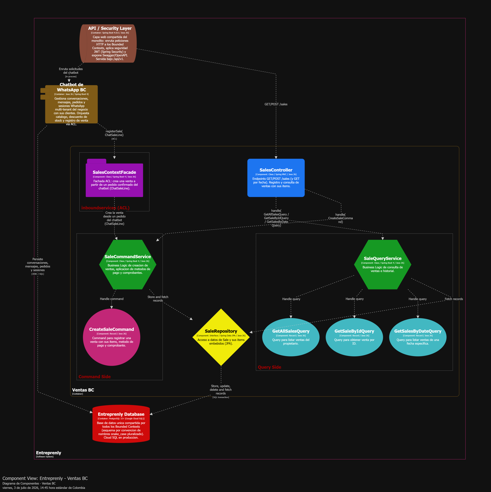

**Figura 2.6.5.1:** *Diagrama de componentes de Sales BC. Las peticiones web externas ingresan por la capa de API / Security Layer con validación JWT hacia `SalesController`. Las ventas originadas desde el Chatbot de WhatsApp ingresan vía ACL a través de `SalesContextFacade`. El flujo de comandos delega la lógica de negocio a `SaleCommandService`, mientras las consultas de historial y fecha son resueltas por `SaleQueryService`. La persistencia se resuelve mediante `SaleRepository` sobre la base de datos PostgreSQL (Google Cloud SQL).*

#### 2.6.5.6. Bounded Context Software Architecture Code Level Diagrams

El modelo del Bounded Context de Sales separa rigurosamente la raíz de agregado transaccional, sus entidades subordinadas y los objetos de valor inmutables. A continuación se presentan el diagrama de clases de dominio y el diagrama relacional de base de datos.

##### 2.6.5.6.1. Bounded Context Domain Layer Class Diagrams

  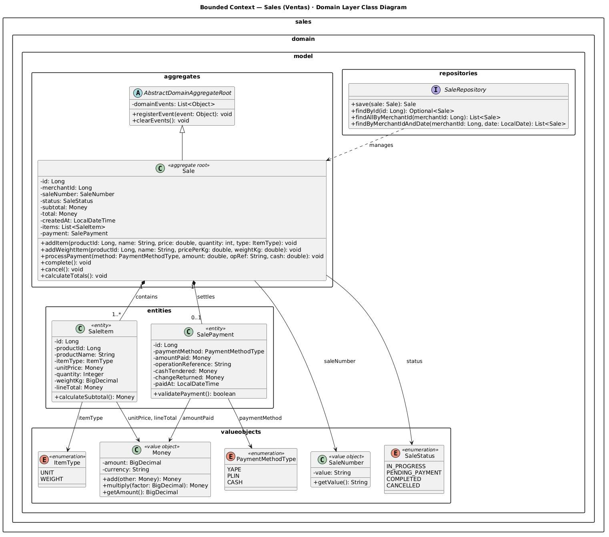

**Figura 2.6.5.2:** *Diagrama de clases del modelo de dominio de Sales. El agregado raíz `Sale` encapsula sus entidades subordinadas `SaleItem` y `SalePayment`, garantizando el cálculo inmutable de los importes y aplicando los objetos de valor `Money`, `SaleNumber`, `ItemType` y `PaymentMethodType`.*

##### 2.6.5.6.2. Bounded Context Database Design Diagram

  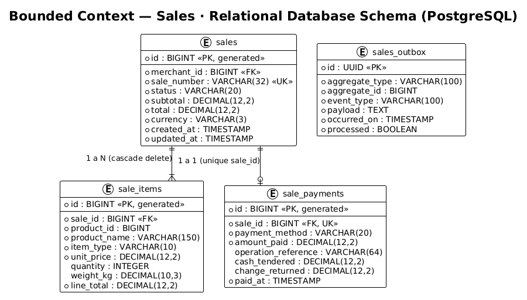

**Figura 2.6.5.3:** *Modelo relacional de base de datos del Bounded Context Sales en PostgreSQL (Google Cloud SQL), compuesto por las tablas transaccionales de ventas, líneas de detalle, pagos y la tabla de Outbox para publicación de eventos.*

**Diccionario de persistencia:**

<table border="1" cellpadding="8" cellspacing="0" style="width:100%; border-collapse: collapse;">
  <tr style="background-color:#2c3e50; color:white;">
    <th>Tipo</th><th>Nombre</th><th>Descripción</th><th>Responsabilidad Principal</th><th>Relación con otros elementos</th>
  </tr>
  <tr>
    <td>Table</td><td>sales</td>
    <td>Almacena las cabeceras de las transacciones comerciales realizadas.</td>
    <td>Registrar el identificador único, código correlativo de ticket (`sale_number` UNIQUE), propietario (`merchant_id`), estado de la venta, totales e importes consolidados.</td>
    <td>Clave foránea lógica hacia el usuario/comerciante en IAM; se relaciona 1 a N con `sale_items` y 1 a 1 opcional con `sale_payments`.</td>
  </tr>
  <tr>
    <td>Table</td><td>sale_items</td>
    <td>Almacena las líneas de detalle de los productos vendidos por cada venta.</td>
    <td>Registrar el nombre y precio histórico del producto (`product_id`), el tipo de comercialización (`UNIT` o `WEIGHT`), cantidad entera o peso en kilogramos con precisión de tres decimales (`weight_kg`) y subtotal de línea.</td>
    <td>Clave foránea `sale_id` con borrado en cascada referenciando a `sales`.</td>
  </tr>
  <tr>
    <td>Table</td><td>sale_payments</td>
    <td>Registra la liquidación económica del comprobante de venta.</td>
    <td>Almacenar el método de pago (`YAPE`, `PLIN`, `CASH`), importe exacto cancelado, código de operación digital y cálculo de efectivo recibido y vuelto entregado.</td>
    <td>Clave foránea `sale_id` con restricción de unicidad (1 pago por venta confirmada).</td>
  </tr>
  <tr>
    <td>Outbox</td><td>sales_outbox</td>
    <td>Tabla transaccional para la publicación de eventos de dominio hacia otros contextos.</td>
    <td>Garantizar atomicidad en la publicación de `SaleCompleted` para orquestar la deducción de inventario en Inventory BC de forma confiable sin pérdida de mensajes.</td>
    <td>Leída y despachada por el servicio de mensajería asíncrona en Infrastructure.</td>
  </tr>
</table>

Los campos de auditoría `created_at` y `updated_at` garantizan la trazabilidad temporal de cada registro. El esquema utiliza tipos de datos estándar de PostgreSQL (`decimal(12,2)` para dinero y `decimal(10,3)` para pesajes), asegurando máxima precisión en el cálculo financiero y el pesaje comercial.
