# Capítulo IV: Product Implementation & Validation

Este capítulo documenta la implementación y validación de Entreprenly en el curso Aplicaciones para Dispositivos Móviles. Para el hito TB1 se presenta el Sprint 1, orientado a la aplicación Android nativa y a su integración con los servicios de la plataforma. Se reutilizan la Landing Page y el backend del proyecto anterior, conservando sus responsabilidades y revisando su compatibilidad con los requisitos móviles del capítulo II.

El trabajo combina la configuración de los proyectos, el desarrollo por Bounded Context y la consolidación de evidencias para el Sprint Review. Las decisiones de planificación se presentan en las secciones 4.2.1.1 a 4.2.1.3; las evidencias de desarrollo, pruebas, ejecución, servicios, despliegue y colaboración se organizan en las secciones 4.2.1.4 a 4.2.1.9. Los resultados de las entrevistas de validación y las evaluaciones heurísticas corresponden a la sección 4.3.

El criterio del TB1 exige una Landing Page desplegada, un backend desplegado con al menos el 70 % del alcance requerido y la presentación de las pantallas core de la aplicación. La reutilización del código constituye una base de trabajo; el porcentaje de avance y el cumplimiento funcional se sustentan con las evidencias de la revisión del sprint.

## 4.1. Software Configuration Management

En esta sección se describe cómo el equipo **Lernen Labs** gestiona la configuración de los productos de Entreprenly. Se presentan las herramientas del entorno de trabajo (4.1.1), la organización de los repositorios y el flujo de ramas (4.1.2), las convenciones de código por lenguaje (4.1.3) y la configuración de despliegue de la Landing Page, la aplicación Android y los servicios web (4.1.4).

### 4.1.1. Software Development Environment Configuration

En esta sección se detallan las herramientas, frameworks y plataformas que el equipo utiliza para el desarrollo colaborativo de Entreprenly. Se consideran las actividades de Project Management, Requirements Management, Product UX/UI Design, Software Development, Software Testing, Software Documentation y Software Deployment.

**Project Management**

<table border="1" cellpadding="8" cellspacing="0" style="width:100%; border-collapse: collapse;">
  <tr style="background-color:#2c3e50; color:white;"><th>Producto</th><th>Propósito de uso</th><th>Ruta de Referencia / Descarga</th></tr>
  <tr><td><strong>Miro</strong></td><td>Gestión del Product Backlog y del Sprint Backlog. El tablero organiza las HUs y sus Work-items con los estados <em>To Do</em>, <em>In Process</em>, <em>To Review</em> y <em>Done</em>.</td><td>https://miro.com/app/board/uXjVEel-fbI=/</td></tr>
  <tr><td><strong>Google Meet</strong></td><td>Reuniones de planificación, revisión y coordinación del equipo.</td><td>https://meet.google.com/</td></tr>
</table>

**Requirements Management**

<table border="1" cellpadding="8" cellspacing="0" style="width:100%; border-collapse: collapse;">
  <tr style="background-color:#2c3e50; color:white;"><th>Producto</th><th>Propósito de uso</th><th>Ruta de Referencia / Descarga</th></tr>
  <tr><td><strong>Miro</strong></td><td>Registro de User Stories, story points, sprint asignado y estado de cada HU, junto con los artefactos de Event Storming del capítulo II.</td><td>https://miro.com/</td></tr>
  <tr><td><strong>Gherkin</strong></td><td>Redacción de los criterios de aceptación de las User Stories con la estructura <code>Dado – Cuando – Entonces</code>.</td><td>https://cucumber.io/docs/gherkin/</td></tr>
</table>

**Product UX/UI Design**

<table border="1" cellpadding="8" cellspacing="0" style="width:100%; border-collapse: collapse;">
  <tr style="background-color:#2c3e50; color:white;"><th>Producto</th><th>Propósito de uso</th><th>Ruta de Referencia / Descarga</th></tr>
  <tr><td><strong>Figma</strong></td><td>Diseño de wireframes, mock-ups, prototipos y Style Guidelines. La página <strong>Mobile</strong> reúne las pantallas de la aplicación Android y la página <strong>Web</strong>, las referencias de la Landing Page.</td><td>https://www.figma.com/design/aZv1YLCkMN17TLsgGsDJdR/Entreprenly</td></tr>
</table>

**Software Development**

<table border="1" cellpadding="8" cellspacing="0" style="width:100%; border-collapse: collapse;">
  <tr style="background-color:#2c3e50; color:white;"><th>Producto</th><th>Propósito de uso</th><th>Ruta de Referencia / Descarga</th></tr>
  <tr><td><strong>Android Studio</strong></td><td>IDE para el desarrollo, la ejecución en emulador y la depuración de la aplicación Android.</td><td>https://developer.android.com/studio</td></tr>
  <tr><td><strong>Kotlin / Jetpack Compose</strong></td><td>Lenguaje y toolkit de UI declarativa de la aplicación móvil, con Material 3 y Navigation Compose.</td><td>https://developer.android.com/compose</td></tr>
  <tr><td><strong>Retrofit / OkHttp</strong></td><td>Consumo de los servicios REST del backend desde la aplicación Android.</td><td>https://square.github.io/retrofit/</td></tr>
  <tr><td><strong>Spring Boot / Java</strong></td><td>Desarrollo de los RESTful Web Services organizados por Bounded Context con DDD y CQRS.</td><td>https://spring.io/projects/spring-boot</td></tr>
  <tr><td><strong>PostgreSQL</strong></td><td>Base de datos relacional del backend: local en desarrollo y Supabase en el entorno desplegado.</td><td>https://www.postgresql.org/</td></tr>
  <tr><td><strong>Docker</strong></td><td>Empaquetado del backend en la imagen <code>entreprenly-platform</code> (puerto <code>8092</code>).</td><td>https://www.docker.com/</td></tr>
  <tr><td><strong>HTML5 / Tailwind CSS / JavaScript</strong></td><td>Desarrollo de la Landing Page; Node.js se utiliza para compilar la hoja de estilos de Tailwind.</td><td>https://tailwindcss.com/</td></tr>
  <tr><td><strong>Git / GitHub</strong></td><td>Control de versiones y alojamiento de los repositorios de la organización Lernen Labs.</td><td>https://github.com/LernenLabs</td></tr>
</table>

**Software Testing**

<table border="1" cellpadding="8" cellspacing="0" style="width:100%; border-collapse: collapse;">
  <tr style="background-color:#2c3e50; color:white;"><th>Producto</th><th>Propósito de uso</th><th>Ruta de Referencia / Descarga</th></tr>
  <tr><td><strong>JUnit 5 / Mockito</strong></td><td>Pruebas unitarias y de integración de los servicios y agregados del backend.</td><td>https://junit.org/junit5/</td></tr>
  <tr><td><strong>Spring Boot Test / MockMvc</strong></td><td>Pruebas de los controladores REST: códigos HTTP, serialización JSON y manejo de errores.</td><td>https://docs.spring.io/spring-boot/reference/testing/</td></tr>
  <tr><td><strong>JUnit / Compose UI Test</strong></td><td>Pruebas unitarias e instrumentadas de la aplicación Android.</td><td>https://developer.android.com/develop/ui/compose/testing</td></tr>
  <tr><td><strong>Swagger UI / Postman</strong></td><td>Verificación manual de los endpoints desplegados con datos de muestra.</td><td>https://www.postman.com/</td></tr>
</table>

**Software Documentation**

<table border="1" cellpadding="8" cellspacing="0" style="width:100%; border-collapse: collapse;">
  <tr style="background-color:#2c3e50; color:white;"><th>Producto</th><th>Propósito de uso</th><th>Ruta de Referencia / Descarga</th></tr>
  <tr><td><strong>Swagger / OpenAPI</strong></td><td>Documentación de los endpoints del backend mediante SpringDoc OpenAPI.</td><td>https://adm-entreprenly-backend.onrender.com/swagger-ui.html</td></tr>
  <tr><td><strong>Markdown</strong></td><td>Redacción del informe del proyecto y de los README de cada repositorio.</td><td>https://www.markdownguide.org/</td></tr>
</table>

**Software Deployment**

<table border="1" cellpadding="8" cellspacing="0" style="width:100%; border-collapse: collapse;">
  <tr style="background-color:#2c3e50; color:white;"><th>Producto</th><th>Propósito de uso</th><th>Ruta de Referencia / Descarga</th></tr>
  <tr><td><strong>GitHub Pages / GitHub Actions</strong></td><td>Publicación automática de la Landing Page en cada push a <code>main</code>.</td><td>https://pages.github.com/</td></tr>
  <tr><td><strong>Render</strong></td><td>Despliegue del backend como servicio Docker.</td><td>https://render.com/</td></tr>
  <tr><td><strong>Supabase</strong></td><td>Base de datos PostgreSQL del backend desplegado.</td><td>https://supabase.com/</td></tr>
</table>

**Configuración local del backend**

<table border="1" cellpadding="8" cellspacing="0" style="width:100%; border-collapse: collapse;">
  <tr style="background-color:#2c3e50; color:white;">
    <th>Herramienta</th><th>Versión</th><th>Uso</th>
  </tr>
  <tr><td style="vertical-align:middle; text-align:center;">Java JDK</td><td style="vertical-align:middle; text-align:center;">26</td><td>Lenguaje del backend.</td></tr>
  <tr><td style="vertical-align:middle; text-align:center;">Spring Boot</td><td style="vertical-align:middle; text-align:center;">4.0.6</td><td>WebMVC, JPA, Security, Validation.</td></tr>
  <tr><td style="vertical-align:middle; text-align:center;">PostgreSQL</td><td style="vertical-align:middle; text-align:center;">15+</td><td>Local en desarrollo; Supabase en el entorno desplegado.</td></tr>
  <tr><td style="vertical-align:middle; text-align:center;">Maven Wrapper</td><td style="vertical-align:middle; text-align:center;">—</td><td>Compilación con `./mvnw spring-boot:run` y `./mvnw clean package`.</td></tr>
  <tr><td style="vertical-align:middle; text-align:center;">JWT + BCrypt</td><td style="vertical-align:middle; text-align:center;">jjwt 0.12.6</td><td>Autenticación por token.</td></tr>
  <tr><td style="vertical-align:middle; text-align:center;">SpringDoc OpenAPI</td><td style="vertical-align:middle; text-align:center;">3.0.3</td><td>Swagger UI.</td></tr>
  <tr><td style="vertical-align:middle; text-align:center;">Docker</td><td style="vertical-align:middle; text-align:center;">—</td><td>Imagen `entreprenly-platform` en puerto `8092`.</td></tr>
</table>

- Crear la base local `daop-entreprenly` antes del primer arranque; las tablas se crean al iniciar.
- Configuración por `.env.example` → `.env` o variables de entorno. API base `/api/v1`, Swagger local `http://localhost:8092/swagger-ui.html`.

**Configuración de la aplicación Android**

<table border="1" cellpadding="8" cellspacing="0" style="width:100%; border-collapse: collapse;">
  <tr style="background-color:#2c3e50; color:white;">
    <th>Herramienta</th><th>Versión</th><th>Uso</th>
  </tr>
  <tr><td style="vertical-align:middle; text-align:center;">Android Gradle Plugin</td><td style="vertical-align:middle; text-align:center;">9.4.1</td><td>Compilación con `./gradlew assembleDebug`.</td></tr>
  <tr><td style="vertical-align:middle; text-align:center;">Kotlin</td><td style="vertical-align:middle; text-align:center;">2.2.10</td><td>Lenguaje de la aplicación; compatibilidad con Java 11.</td></tr>
  <tr><td style="vertical-align:middle; text-align:center;">Jetpack Compose (BOM)</td><td style="vertical-align:middle; text-align:center;">2026.02.01</td><td>UI declarativa con Material 3.</td></tr>
  <tr><td style="vertical-align:middle; text-align:center;">Navigation Compose</td><td style="vertical-align:middle; text-align:center;">2.9.5</td><td>Navegación entre pantallas por Bounded Context.</td></tr>
  <tr><td style="vertical-align:middle; text-align:center;">Retrofit / OkHttp</td><td style="vertical-align:middle; text-align:center;">3.0.0 / 4.12.0</td><td>Cliente HTTP y registro de peticiones.</td></tr>
  <tr><td style="vertical-align:middle; text-align:center;">DataStore Preferences</td><td style="vertical-align:middle; text-align:center;">1.1.7</td><td>Persistencia local de la sesión y las preferencias.</td></tr>
  <tr><td style="vertical-align:middle; text-align:center;">Android SDK</td><td style="vertical-align:middle; text-align:center;">min 30 / target 37</td><td>Compatibilidad desde Android 11.</td></tr>
</table>

### 4.1.2. Source Code Management

Para la gestión del código fuente y el seguimiento de modificaciones, el equipo **Lernen Labs** utiliza GitHub como plataforma principal y Git como sistema de control de versiones distribuido. Cada producto de la solución tiene un repositorio independiente dentro de la organización, y el informe del proyecto se mantiene en un repositorio propio.

**Repositorios del Proyecto**

| Producto               | URL del Repositorio                                    |
| :--------------------- | :----------------------------------------------------- |
| **Organización**       | https://github.com/LernenLabs                          |
| **Reporte**            | https://github.com/LernenLabs/adm-entreprenly          |
| **Landing Page**       | https://github.com/LernenLabs/adm-entreprenly-landing  |
| **Aplicación Android** | https://github.com/LernenLabs/adm-entreprenly-frontend |
| **Web Services**       | https://github.com/LernenLabs/adm-entreprenly-backend  |

**Estrategia de Flujo de Trabajo: GitFlow**

El equipo implementa el modelo GitFlow para organizar el desarrollo colaborativo. Este flujo permite trabajar en varios Bounded Contexts en paralelo sin afectar la estabilidad de la rama principal.

- **main**: rama principal con el código en estado de producción. Cada versión integrada aquí se etiqueta con su número de versión.
- **develop**: rama base de desarrollo, donde se integran las funcionalidades terminadas antes de pasar a `main` al cierre de cada sprint.
- **feature**: ramas temporales para desarrollar una funcionalidad o un Bounded Context; se crean desde `develop` y se fusionan nuevamente en ella.
- **release**: ramas para preparar un lanzamiento, con ajustes menores y correcciones finales.
- **hotfix**: ramas creadas desde `main` para corregir errores críticos del entorno de producción.

**Convenciones de Nombres para Ramas**

- **Feature Branches**: `feature/[bounded-context]` o `feature/[descripcion]` (por ejemplo, `feature/inventory`, `feature/chatbot` o `feature/render-deploy-hook`).
- **Release Branches**: `release/v[Major.Minor.Patch]`.
- **Hotfix Branches**: `hotfix/[descripcion-error]`.

**Versionamiento Semántico**

El equipo adopta Semantic Versioning 2.0.0 para nombrar los lanzamientos, con el formato MAJOR.MINOR.PATCH:

1. MAJOR: se incrementa con cambios incompatibles en la API.
2. MINOR: se incrementa al añadir funcionalidad compatible con versiones anteriores.
3. PATCH: se incrementa con correcciones de errores compatibles con versiones anteriores.

**Estándar de Mensajes de Commit**

Para asegurar un historial de cambios legible y facilitar la automatización, se utiliza la especificación de Conventional Commits para todos los mensajes de commit. La estructura utilizada es [tipo]:[descripción breve], empleando los siguientes prefijos:

- feat: Incorporación de una nueva funcionalidad.
- fix: Corrección de un error o bug.
- docs: Modificaciones exclusivamente en la documentación.
- style: Cambios de formato o estética que no afectan la lógica del código.
- refactor: Reestructuración de código que no añade funciones ni corrige errores.
- test: Adición o actualización de pruebas.

Los repositorios de la aplicación Android y del backend validan este formato con el workflow `commit-policy.yml` de GitHub Actions.

### 4.1.3. Source Code Style Guide & Conventions

Se establecen las guías de estilo y convenciones de codificación adoptadas por el equipo de Lernen Labs para el desarrollo de los productos digitales que conforman la solución **Entreprenly**. El objetivo es garantizar que el código fuente sea legible, mantenible y coherente entre todos los miembros del equipo, independientemente del componente o capa de la arquitectura en la que se trabaje. Como regla general, **toda nomenclatura de elementos en el código fuente se redacta en inglés**, incluyendo nombres de variables, clases, métodos, componentes, atributos y comentarios técnicos.

Las referencias adoptadas para cada lenguaje y tecnología utilizada en la solución se detallan a continuación.

#### HTML

Para el desarrollo del Landing Page de Entreprenly, el equipo adopta como referencia principal la **HTML Style Guide and Coding Conventions** de W3Schools y la **Google HTML/CSS Style Guide**.

Las convenciones aplicadas son las siguientes:

- Se utiliza **HTML5** como estándar de marcado, declarando siempre el `DOCTYPE` al inicio del documento: `<!DOCTYPE html>`.
- Los nombres de los elementos y atributos se escriben en **minúsculas** (`<section>`, `<article>`, `class="hero-section"`).
- Los atributos se encierran siempre entre **comillas dobles**: ``.
- Se incluyen los atributos `lang` en la etiqueta `<html>` para indicar el idioma de la página: `<html lang="es">`.
- Todas las imágenes incluyen el atributo `alt` con una descripción significativa, como parte del enfoque de accesibilidad (a11y) del proyecto.
- Se utiliza **indentación de 2 espacios** para mantener la legibilidad del árbol de elementos.
- Los elementos de bloque se escriben en líneas separadas; los elementos en línea pueden mantenerse en una misma línea si el resultado es conciso.
- Se evita el uso de estilos en línea (`style=""`); todo el estilo visual se delega a las clases utilitarias de **Tailwind CSS** y a la hoja de estilos generada.
- Los comentarios se utilizan para delimitar secciones principales del documento: `<!-- Hero Section -->`.

#### CSS

Para el estilo visual del Landing Page de Entreprenly, el equipo utiliza **Tailwind CSS v4** bajo un enfoque _utility-first_. La hoja de estilos final `styles.css` se genera a partir de `src/input.css` mediante la CLI de Tailwind (`tailwindcss --minify`), por lo que no se escribe CSS a mano salvo casos puntuales.

Las convenciones aplicadas son las siguientes:

- El estilo se compone directamente en el marcado mediante **clases utilitarias** de Tailwind (`flex`, `px-4`, `text-center`, `md:grid-cols-3`), evitando hojas de estilo manuales extensas.
- Las **variantes responsive** (`sm:`, `md:`, `lg:`) se utilizan para aplicar los principios de Responsive Web Design bajo un enfoque mobile-first.
- Cuando se requiere una clase propia, su nombre se escribe en **kebab-case** y se evita el uso de selectores de ID para estilos.
- Los **tokens de diseño** (colores, tipografías y espaciados) se centralizan en la configuración de Tailwind y en variables CSS dentro de `src/input.css`, manteniendo la consistencia con el Design System.
- Las unidades relativas (`rem`, `em`) se prefieren sobre `px` para valores de tipografía y espaciado, garantizando escalabilidad y accesibilidad.
- Se evita el uso de `!important`; las especificidades se gestionan mediante el orden natural de las utilidades de Tailwind.

#### JavaScript

El Landing Page de Entreprenly utiliza JavaScript para comportamientos de interacción básicos. El equipo adopta las convenciones establecidas en la **Google HTML/CSS Style Guide** para los aspectos de scripting complementarios al marcado.

Las convenciones aplicadas son las siguientes:

- Se utiliza `const` para valores que no cambian y `let` para valores que pueden reasignarse; se evita el uso de `var`.
- Los nombres de variables y funciones se escriben en **camelCase**: `getUserData`, `handleButtonClick`.
- Las funciones se declaran como **arrow functions** cuando no requieren su propio contexto `this`: `const fetchData = () => { ... }`.
- Los strings se definen usando **template literals** cuando se requiere interpolación: `` `Hello, ${userName}` ``.
- El código se organiza en funciones con una única responsabilidad, evitando bloques de lógica demasiado extensos.
- Se incluyen comentarios descriptivos en funciones no triviales, explicando el propósito y no el mecanismo.

#### Kotlin

Para el desarrollo de la aplicación Android de Entreprenly, el equipo adopta las **Kotlin Coding Conventions** oficiales y la **Android Kotlin Style Guide** como referencias principales.

Las convenciones aplicadas son las siguientes:

- Los nombres de **clases, interfaces, objetos y enumeraciones** se escriben en **PascalCase**: `ChatOrder`, `ProductRepository`, `OrderStatus`.
- Los nombres de **funciones, propiedades y variables** se escriben en **camelCase**: `loadProducts()`, `isLoading`.
- Las **constantes** (`const val` y valores inmutables de nivel superior) se escriben en **UPPER_SNAKE_CASE**: `MAX_RETRY_ATTEMPTS`.
- Los nombres de **archivos** coinciden con la clase principal que contienen y usan **PascalCase**: `ChatScreen.kt`, `ChatbotViewModels.kt`.
- Se prefiere `val` sobre `var` y los tipos **no nulos**; los valores opcionales se manejan con `?.`, `?:` y `let`, evitando el operador `!!`.
- Se utilizan **data classes** para recursos y valores del dominio, y **sealed classes** o enumeraciones para representar estados finitos.
- Las operaciones asíncronas se implementan con **corrutinas** y `suspend fun`, y su resultado se expone a la UI mediante `StateFlow`.
- Se aplica **indentación de 4 espacios** y un máximo de 100 caracteres por línea.

#### Jetpack Compose y arquitectura Android

Además de las convenciones de Kotlin, el equipo sigue las **Compose API guidelines** y la arquitectura recomendada por Android para organizar la aplicación.

Las convenciones aplicadas son las siguientes:

- Las funciones **@Composable** que emiten UI se nombran en **PascalCase** como sustantivos: `OrderDetailScreen`, `ProductCard`.
- Las pantallas siguen el patrón `[Feature]Screen` y sus ViewModels el patrón `[Feature]ViewModel`.
- Cada Composable recibe un parámetro `modifier: Modifier = Modifier` como primer parámetro opcional, y el estado se eleva al ViewModel (_state hoisting_).
- Los colores, la tipografía y los espaciados se toman del tema de **Material 3**, en coherencia con las Style Guidelines del capítulo III.
- Los paquetes se escriben en **minúsculas** y se organizan por bounded context con la estructura `online.entreprenly.entreprenlyapp.[boundedcontext].[layer]`, con las capas `domain`, `application`, `infrastructure` e `interfaces` (`ui/screens`, `ui/components`, `ui/viewmodels`, `ui/navigation`).
- La navegación de cada contexto se define en su propio archivo `[Feature]Navigation.kt` y se registra en el grafo principal de la aplicación.

#### Java y Spring Boot

Para el desarrollo de los RESTful Web Services de Entreprenly, el equipo adopta la **Google Java Style Guide** y las convenciones de **Spring Boot Features** como referencias principales.

Las convenciones aplicadas son las siguientes:

- Los nombres de **clases** se escriben en **PascalCase**: `ProjectController`, `UserRepository`, `AuthenticationService`.
- Los nombres de **métodos y variables** se escriben en **camelCase**: `findProjectById()`, `currentUser`.
- Los nombres de **constantes** se escriben en **UPPER_SNAKE_CASE**: `DEFAULT_PAGE_SIZE`.
- Los nombres de **paquetes** se escriben en **minúsculas** y se organizan por bounded context, siguiendo la estructura: `online.entreprenly.platform.[boundedcontext].[layer]`. Los bounded contexts implementados son `iam`, `profile`, `inventory`, `sales`, `subscription`, `chatbot` y `shared`. Por ejemplo: `online.entreprenly.platform.iam.interfaces.rest`, `online.entreprenly.platform.chatbot.domain.model.aggregates`.
- La arquitectura interna de cada bounded context sigue el patrón de capas: `interfaces` (controllers), `application` (services, command handlers), `domain` (entities, value objects, repositories interfaces) e `infrastructure` (JPA repositories, external adapters).
- Los **endpoints** de los controladores REST se nombran en **kebab-case** y en plural para recursos: `/api/v1/projects`, `/api/v1/users`.
- Los **métodos HTTP** se emplean de acuerdo con su semántica RESTful: `GET` para consultas, `POST` para creación, `PUT` para actualización completa, `PATCH` para actualización parcial y `DELETE` para eliminación.
- Se utilizan **anotaciones estándar** de Spring Boot: `@RestController`, `@Service`, `@Repository`, `@Entity`, `@Value`, entre otras.
- Se aplica **indentación de 4 espacios** de acuerdo con la Google Java Style Guide.
- Los **comentarios Javadoc** se incluyen en todas las clases públicas y en los métodos cuya lógica no sea autoexplicativa.

#### Gherkin (Acceptance Criteria)

Para la redacción de los criterios de aceptación de las User Stories (detallados en el Capítulo III), el equipo adopta el estilo **Gherkin** en su variante en español (`Dado – Cuando – Entonces`). Las pruebas automatizadas se implementan con **JUnit** sobre los servicios y agregados de cada bounded context del backend y sobre la lógica de la aplicación Android.

Las convenciones aplicadas son las siguientes:

- Cada escenario se redacta en **español**, en **tiempo presente y tercera persona**.
- La estructura `Dado – Cuando – Entonces` se respeta estrictamente: `Dado` define el contexto inicial, `Cuando` describe la acción del usuario o del sistema y `Entonces` especifica el resultado esperado.
- Se utiliza `y` para añadir condiciones adicionales dentro de un mismo bloque, evitando repetir la palabra clave principal.
- Los nombres de los escenarios son descriptivos y comunican el comportamiento esperado sin referirse a detalles de implementación.
- Se evita la lógica condicional dentro de un mismo escenario; cada escenario cubre un único camino de ejecución (happy path o unhappy path).

**Ejemplo de criterio de aceptación de una User Story:**

```gherkin
Dado que el comerciante está en la pantalla "Agregar producto" del módulo Inventario
Cuando ingresa nombre, precio por unidad, stock inicial, categoría y tipo "Por unidad" y presiona "Guardar"
Entonces el producto se registra en el inventario y aparece en la lista de productos
```

### 4.1.4. Software Deployment Configuration

En esta sección se especifica la configuración de despliegue de cada producto digital de **Entreprenly**: **Landing Page**, **Aplicación Android** y **RESTful Web Services**. Para cada producto se documenta el camino desde el repositorio de código fuente hasta su publicación; las capturas del despliegue se presentan en la sección 4.2.1.8.

**Productos desplegados y URLs públicas**

<table border="1" cellpadding="8" cellspacing="0" style="width:100%; border-collapse: collapse;">
  <tr style="background-color:#2c3e50; color:white;"><th>Producto</th><th>Tecnología / Plataforma de despliegue</th><th>URL pública</th></tr>
  <tr><td>Landing Page</td><td>HTML5 + Tailwind CSS / GitHub Pages</td><td>https://lernenlabs.github.io/adm-entreprenly-landing/</td></tr>
  <tr><td>Aplicación Android</td><td>Kotlin + Jetpack Compose / APK generado con Gradle</td><td>Instalación en emulador o dispositivo con Android 11 o superior</td></tr>
  <tr><td>RESTful Web Services (API)</td><td>Spring Boot + Docker / Render + Supabase</td><td>https://adm-entreprenly-backend.onrender.com/swagger-ui.html</td></tr>
</table>

**Deployment Diagram (C4 Model)**

El diagrama de despliegue, elaborado en la sección 2.5.3.3, muestra cómo se distribuyen la Landing Page, la aplicación móvil, los servicios web y la base de datos en sus entornos de ejecución.

<p align="center">
  
</p>

#### Landing Page (GitHub Pages)

La Landing Page se desarrolla con **HTML5**, **Tailwind CSS** y **JavaScript**, y se publica con **GitHub Pages** mediante el workflow `deploy.yml` de **GitHub Actions**.

1. El workflow se ejecuta en cada push a la rama `main`.
2. El job `build` instala las dependencias con Node.js 20 y ejecuta `npm run build` para generar la hoja de estilos de Tailwind.
3. El sitio se empaqueta con `actions/upload-pages-artifact` y el job `deploy` lo publica con `actions/deploy-pages` en el entorno `github-pages`.
4. La publicación se valida accediendo a https://lernenlabs.github.io/adm-entreprenly-landing/.

#### Aplicación Android

La aplicación se construye con **Gradle** desde Android Studio o desde la línea de comandos.

1. Clonar el repositorio `adm-entreprenly-frontend` y abrirlo en Android Studio.
2. La URL del backend se define en `app/build.gradle.kts` con el campo `API_BASE_URL`, que apunta a `https://adm-entreprenly-backend.onrender.com/`.
3. Generar el APK con `./gradlew assembleDebug`.
4. Instalar el APK en un emulador o dispositivo con Android 11 (API 30) o superior y verificar el inicio de sesión contra el backend desplegado.

#### RESTful Web Services (Render + Supabase)

El backend se despliega con Docker por perfiles `default/cloud/prod`.

<table border="1" cellpadding="8" cellspacing="0" style="width:100%; border-collapse: collapse;">
  <tr style="background-color:#2c3e50; color:white;">
    <th>Variable</th><th>Valor</th>
  </tr>
  <tr><td style="vertical-align:middle; text-align:center;">SPRING_PROFILES_ACTIVE</td><td><code>cloud</code> en Render, <code>prod</code> en Cloud Run.</td></tr>
  <tr><td style="vertical-align:middle; text-align:center;">DATABASE_HOST / PORT / NAME / USER / PASSWORD</td><td>Pooler Supabase en Render (<code>5432/postgres</code>); Cloud SQL por socket en producción.</td></tr>
  <tr><td style="vertical-align:middle; text-align:center;">JWT_SECRET</td><td>Secreto largo aleatorio.</td></tr>
  <tr><td style="vertical-align:middle; text-align:center;">PUBLIC_API_URL</td><td>URL pública del servicio para Swagger.</td></tr>
  <tr><td style="vertical-align:middle; text-align:center;">CLOUD_SQL_CONNECTION_NAME</td><td>Solo Cloud Run (<code>project:region:instance</code>) con rol <code>roles/cloudsql.client</code>.</td></tr>
</table>

1. Crear en Render un servicio web de tipo Docker conectado al repositorio `adm-entreprenly-backend`.
2. Registrar las variables de entorno anteriores con el perfil `cloud` y las credenciales del pooler de Supabase.
3. Render construye la imagen a partir del `Dockerfile` y publica el servicio.
4. Validar el despliegue en `https://adm-entreprenly-backend.onrender.com/swagger-ui/index.html`.

Como alternativa, el backend puede desplegarse en **Cloud Run + Cloud SQL** con un trigger que construye el `Dockerfile` y publica una nueva revisión en cada push a `main`. El plan gratuito de Render se suspende tras unos 15 minutos sin tráfico, por lo que la primera petición posterior puede tardar alrededor de un minuto.

## 4.2. Landing Page & Mobile Application Implementation

La implementación se organiza en tres proyectos de Lernen Labs. La Landing Page presenta Entreprenly y sus planes; la aplicación Android permite al comerciante operar desde su dispositivo; y el backend expone los servicios REST de IAM, Profile, Inventory, Sales, Chatbot y Subscription.

|      Proyecto      |                                    Repositorio                                     |                                                     Base de implementación                                                      |
| :----------------: | :--------------------------------------------------------------------------------: | :-----------------------------------------------------------------------------------------------------------------------------: |
|    Landing Page    |  [adm-entreprenly-landing](https://github.com/LernenLabs/adm-entreprenly-landing)  | HTML, JavaScript y Tailwind CSS; reutilización de la landing existente y revisión del contenido y los accesos al producto móvil |
| Aplicación Android | [adm-entreprenly-frontend](https://github.com/LernenLabs/adm-entreprenly-frontend) |                             Kotlin y Jetpack Compose; navegación y organización por Bounded Context                             |
|      Backend       |  [adm-entreprenly-backend](https://github.com/LernenLabs/adm-entreprenly-backend)  |                                Java y Spring Boot; servicios REST, JWT y persistencia PostgreSQL                                |

El backend se adapta a partir de `daop-entreprenly-web-services` y la landing a partir de `landing-entreprenly`. El frontend móvil se desarrolla como aplicación nativa, tomando las interfaces de la página **Mobile** de Figma como referencia de interacción y estilo. Los repositorios actuales conservan su propia trazabilidad de cambios y colaboración.

Cada integrante lidera un contexto y participa en las revisiones comunes. La integración considera la sesión de IAM, la navegación entre módulos, los contratos de la API y los componentes compartidos. Profile gestiona datos y preferencias del usuario; IAM conserva la responsabilidad sobre identidad y credenciales, por lo que sus operaciones se coordinan mediante los contratos entre contextos.

La documentación del backend registra un despliegue en Render y una base de datos PostgreSQL en Supabase. La URL de referencia del servicio es [adm-entreprenly-backend.onrender.com](https://adm-entreprenly-backend.onrender.com) y su [Swagger UI](https://adm-entreprenly-backend.onrender.com/swagger-ui.html) constituye el punto de consulta de los contratos. La evidencia de disponibilidad y del alcance entregado se incorpora en la sección 4.2.1.8.

### 4.2.1. Sprint 1

El Sprint 1 comprende las **41 User Stories** acordadas por el equipo en la reunión del 28 de septiembre de 2026. Las historias conservan las estimaciones del Product Backlog y suman **97 story points**. Su distribución cubre la Landing Page, Profile y navegación compartida, Inventory, Chatbot, Subscription y Sales.

IAM se considera un avance previo disponible para la integración. El backend forma parte de la base reutilizada del producto; la Landing Page también se reutiliza, y sus ocho HUs (US-53, US-84 a US-89 y US-94) se incluyen en el Sprint 1 para su revisión y despliegue desde el primer sprint. Estos antecedentes se revisan durante el sprint y se distinguen del esfuerzo correspondiente a las HUs seleccionadas.

El objetivo del sprint es que el comerciante acceda con su cuenta y utilice los recorridos core de la aplicación Android para consultar y actualizar su perfil, gestionar productos y lotes, atender conversaciones y pagos, administrar su suscripción y registrar ventas. La revisión del TB1 incluye la continuidad entre estas pantallas y los servicios desplegados que las soportan.

|            Responsable             |               Aspecto principal               |                                        HUs seleccionadas                                         | Story points |
| :--------------------------------: | :-------------------------------------------: | :----------------------------------------------------------------------------------------------: | :----------: |
|  Chavez Carrasco, Lionel Abraham   | Landing Page, Profile y navegación compartida | US-53, US-84, US-85, US-86, US-87, US-88, US-89, US-94, US-62, US-63, US-67, US-68, US-81, US-75 |      26      |
|    Laura Acosta, Victor Jhosef     |                   Inventory                   |                      US-01, US-05, US-07, US-08, US-03, US-06, US-11, US-13                      |      20      |
| Palma De Los Santos, Elynor Mikela |                    Chatbot                    |                                US-37, US-38, US-39, US-40, US-46                                 |      16      |
|    Villon Amez, Enrique Manuel     |                 Subscription                  |                         US-15, US-16, US-17, US-18, US-20, US-21, US-22                          |      18      |
|      Gonza Morales, Anderson       |                     Sales                     |                         US-28, US-29, US-31, US-32, US-33, US-36, US-97                          |      17      |
|             **Total**              |         **Seis aspectos de trabajo**          |                                       **41 User Stories**                                        |    **97**    |

Las HUs de Profile sobre fotografía, cambio de correo, cambio de contraseña y verificación del teléfono (US-64, US-65, US-66 y US-69) mantienen sus diseños como insumo para siguientes iteraciones. No forman parte de la selección del Sprint 1.

#### 4.2.1.1. Sprint Planning 1

La planificación se realizó por **Google Meet el 28 de septiembre de 2026 a las 10:00 p. m.** (America/Lima), con la selección de HUs y la distribución de responsabilidades por Bounded Context. El sprint se desarrolla del 28 de septiembre al 4 de octubre de 2026 y su resultado se presenta en el TB1 (semana 7). Lionel coordina la consolidación del Sprint 1 y del informe; los cinco integrantes participan en la integración de los recorridos y las revisiones cruzadas.

El registro adapta la estructura del Sprint Planning de `daop-entreprenly` al equipo y al alcance del curso actual. De acuerdo con la [Scrum Guide](https://scrumguides.org/scrum-guide.html), el Sprint Backlog reúne el objetivo, las historias seleccionadas y el plan de trabajo para el incremento.

<table border="1" cellpadding="8" cellspacing="0" style="width:100%; border-collapse:collapse; text-align:center;">
  <tbody>
    <tr><th>Sprint #</th><td>Sprint 1</td></tr>
    <tr><th colspan="2">Sprint Planning Background</th></tr>
    <tr><th>Date</th><td>2026-09-28</td></tr>
    <tr><th>Time</th><td>10:00 PM</td></tr>
    <tr><th>Location</th><td>Reunión virtual por Google Meet</td></tr>
    <tr><th>Prepared By</th><td>Chavez Carrasco, Lionel Abraham</td></tr>
    <tr><th>Attendees (to planning meeting)</th><td>Chavez Carrasco, Lionel Abraham / Palma De Los Santos, Elynor Mikela / Laura Acosta, Victor Jhosef / Villon Amez, Enrique Manuel / Gonza Morales, Anderson</td></tr>
    <tr><th>Sprint 1 – 1 Review Summary</th><td>Al ser el primer sprint del curso, no existe un sprint anterior que revisar. Se parte de los artefactos corregidos del AV1, de la Landing Page y el backend reutilizados del ciclo anterior y del avance previo de IAM.</td></tr>
    <tr><th>Sprint 1 – 1 Retrospective Summary</th><td>Al ser el primer sprint, no existe retrospectiva previa. La retroalimentación del AV1 se incorpora mediante la reformulación del Problem Statement y el ajuste de las User Stories y el Product Backlog; el equipo acuerda trabajar con liderazgo por Bounded Context y componentes móviles compartidos.</td></tr>
    <tr><th colspan="2">Sprint Goal &amp; User Stories</th></tr>
    <tr><th>Sprint 1 Goal</th><td>Nuestro enfoque está en que el comerciante gestione su perfil, su inventario, sus ventas, sus pedidos por WhatsApp y su suscripción desde la aplicación Android, y en presentar el producto mediante la Landing Page desplegada. Creemos que esto brinda a los dueños de minimarkets, bodegas y puestos de mercado un control diario de su negocio desde el celular. Esto se confirmará cuando un comerciante pueda iniciar sesión, registrar un producto, registrar una venta, revisar un pedido del chatbot y consultar su plan en la aplicación conectada al backend desplegado, y cuando la Landing Page esté disponible en su URL pública.</td></tr>
    <tr><th>Sprint 1 Velocity</th><td>97</td></tr>
    <tr><th>Sum of Story Points</th><td>97</td></tr>
  </tbody>
</table>

**Dependencias e integración**

- IAM proporciona la sesión y la autorización necesarias para las operaciones protegidas.
- Inventory expone productos, lotes y disponibilidad requeridos por Sales y Chatbot.
- Sales conserva la coherencia entre el ticket, el cierre de venta y el Resumen de Caja.
- Chatbot coordina conversaciones y validación de comprobantes con el flujo de pedidos y el stock disponible.
- Subscription controla el plan y su estado; Profile utiliza esa información sin asumir la gestión del cobro.
- Profile conserva las preferencias del comerciante y colabora en la navegación común con US-75 y US-81.

**Criterios de cierre del sprint**

La Definition of Done requiere que cada HU tenga trazabilidad con el requisito del capítulo II, un recorrido móvil consistente con Figma, código revisado e integrado y evidencia de los criterios de aceptación aplicables. La revisión registra los estados de éxito, validación y recuperación; las operaciones que dependen del backend utilizan sus contratos y cuentan con evidencia de ejecución.

Para el TB1, además, se acredita la URL pública de la Landing Page, se presenta el inventario de funcionalidades backend comprometidas y se demuestra al menos el 70 % de ese alcance con servicios desplegados y evidencias asociadas. El cálculo corresponde a funcionalidades verificadas respecto del total acordado para el backend del TB1; su denominador y resultados se documentan en las evidencias de servicios y despliegue. Se muestran las pantallas core y se consolida el informe con Registro de Versiones, Collaboration Insights, Student Outcome, conclusiones, bibliografía y anexos actualizados.

Una pantalla diseñada, un componente reutilizado o una HU con código disponible se registra según su avance; su cierre requiere cumplir los criterios anteriores. Las pruebas y validaciones planificadas se reportan como resultados cuando existe evidencia de su ejecución.

#### 4.2.1.2. Aspect Leaders and Collaborators

En el Sprint 1, el equipo organizó su trabajo en torno a seis aspectos principales: la Landing Page, Profile y la navegación compartida, Inventory, Chatbot, Subscription y Sales. Cada aspecto tiene un líder (**L**) responsable de su avance y de la trazabilidad con sus HUs, y colaboradores (**C**) que apoyan en las dependencias, los componentes comunes y la revisión cruzada. A continuación se presenta la matriz de liderazgo y colaboración (LACX):

<table border="1" cellpadding="8" cellspacing="0" style="width:100%; border-collapse: collapse; text-align:center;">
  <thead>
    <tr>
      <th>Team Member (Last Name, First Name)</th>
      <th>GitHub Username</th>
      <th>Landing Page<br>Leader (L) / Collaborator (C)</th>
      <th>Profile y Navegación Compartida<br>Leader (L) / Collaborator (C)</th>
      <th>Inventory<br>Leader (L) / Collaborator (C)</th>
      <th>Chatbot<br>Leader (L) / Collaborator (C)</th>
      <th>Subscription<br>Leader (L) / Collaborator (C)</th>
      <th>Sales<br>Leader (L) / Collaborator (C)</th>
    </tr>
  </thead>
  <tbody>
    <tr><td>Chavez Carrasco, Lionel Abraham</td><td>LioTG</td><td>L</td><td>L</td><td>C</td><td>C</td><td>C</td><td>C</td></tr>
    <tr><td>Palma De Los Santos, Elynor Mikela</td><td>elynorpalma</td><td>C</td><td>C</td><td>C</td><td>L</td><td>C</td><td>C</td></tr>
    <tr><td>Laura Acosta, Victor Jhosef</td><td>Zatrynox</td><td>C</td><td>C</td><td>L</td><td>C</td><td>C</td><td>C</td></tr>
    <tr><td>Villon Amez, Enrique Manuel</td><td>enriquevillon25</td><td>C</td><td>C</td><td>C</td><td>C</td><td>L</td><td>C</td></tr>
    <tr><td>Gonza Morales, Anderson</td><td>Ander-U</td><td>C</td><td>C</td><td>C</td><td>C</td><td>C</td><td>L</td></tr>
  </tbody>
</table>

Además de liderar Landing Page y Profile, Lionel coordina el Sprint 1 y consolida el informe (Style Guidelines, Registro de Versiones y Student Outcome). Elynor elaboró la referencia inicial del diseño móvil en Figma. Cada líder mantiene la trazabilidad entre sus HUs, las pantallas, las operaciones de los servicios y las evidencias que aporta al Sprint Review.

#### 4.2.1.3. Sprint Backlog 1

El Sprint Backlog contiene las **41 HUs y 97 story points** seleccionados en la reunión de planificación. Los identificadores y títulos se conservan respecto de la sección 2.4.3; cada HU se desglosa en Work-items específicos de interfaz, lógica e integración y revisión de los criterios de aceptación. Los identificadores S1-T01.1 a S1-T41.3 vinculan cada subtarea con su HU y mantienen el responsable del Bounded Context. Las tareas transversales se presentan después y no agregan story points a la selección.

El seguimiento del sprint se realiza en el [tablero de Miro de Entreprenly](https://miro.com/app/board/uXjVEel-fbI=/) (ver Anexo J), que contiene el Sprint Backlog 1 a nivel de HU y la tabla de Work-items con la HU a la que pertenece cada tarea. Se utilizan los estados de seguimiento **To Do, In Process, To Review y Done**. Al cierre del Sprint 1, las **41 HUs** y sus **127 Work-items** se registran como **Done**.

<p align="center">
  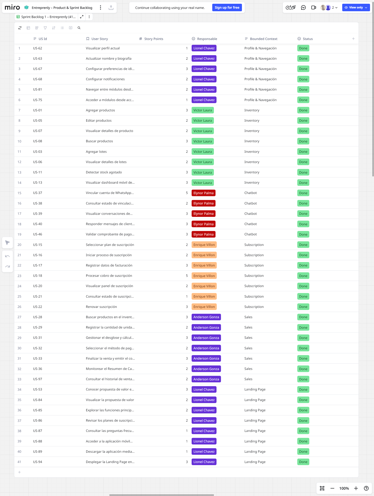
</p>

**Figura 4.1:** Sprint Backlog 1 en el [tablero de Miro](https://miro.com/app/board/uXjVEel-fbI=/) con las 41 HUs, su responsable, Bounded Context y estado.

<p align="center">
  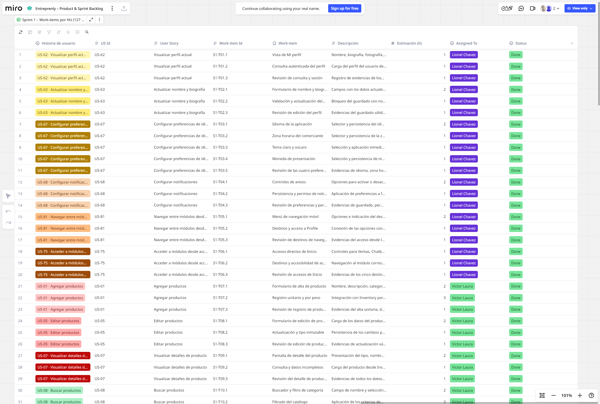
</p>

**Figura 4.2:** Work-items del Sprint 1 en Miro, vinculados con su HU, estimación, responsable y estado.

Las horas de la siguiente tabla son **estimaciones iniciales propuestas para desglosar las tareas**, sujetas al refinamiento de los responsables. Se mantienen separadas de los story points y de las horas efectivamente trabajadas. La disponibilidad de las pantallas de Profile en Figma se registra como evidencia de diseño y no implica por sí sola el cierre de la HU.

<!-- pdf:only
\begingroup\footnotesize\setlength{\tabcolsep}{3pt}
-->

<table border="1" cellpadding="6" cellspacing="0" style="width:100%; border-collapse:collapse; text-align:center;">
  <thead>
    <tr><th colspan="8">Sprint # Sprint 1</th></tr>
    <tr><th colspan="2">User Story</th><th colspan="6">Work-Item / Task</th></tr>
    <tr><th>Id</th><th>Title</th><th>Id</th><th>Title</th><th>Description</th><th>Estimation<br>(Hours)</th><th>Assigned To</th><th>Status</th></tr>
  </thead>
  <tbody>
<tr><td>US-62</td><td>Visualizar perfil actual</td><td>S1-T01.1</td><td>Vista de Mi perfil</td><td>Nombre, biografía, fotografía, correo y preferencias actuales en la pantalla de perfil.</td><td>1</td><td>Lionel Chavez</td><td>Done</td></tr>
<tr><td>US-62</td><td>Visualizar perfil actual</td><td>S1-T01.2</td><td>Consulta autenticada del perfil</td><td>Carga del perfil del usuario de la sesión y redirección al login ante sesión expirada.</td><td>1</td><td>Lionel Chavez</td><td>Done</td></tr>
<tr><td>US-62</td><td>Visualizar perfil actual</td><td>S1-T01.3</td><td>Revisión de consulta y sesión</td><td>Registro de evidencias de los escenarios de visualización exitosa y sesión expirada.</td><td>1</td><td>Lionel Chavez</td><td>Done</td></tr>
<tr><td>US-63</td><td>Actualizar nombre y biografía</td><td>S1-T02.1</td><td>Formulario de nombre y biografía</td><td>Campos con los datos actuales y acción de guardar cambios desde Mi perfil.</td><td>2</td><td>Lionel Chavez</td><td>Done</td></tr>
<tr><td>US-63</td><td>Actualizar nombre y biografía</td><td>S1-T02.2</td><td>Validación y actualización del perfil</td><td>Bloqueo del guardado con nombre vacío, actualización de datos válidos y presentación del perfil actualizado.</td><td>1</td><td>Lionel Chavez</td><td>Done</td></tr>
<tr><td>US-63</td><td>Actualizar nombre y biografía</td><td>S1-T02.3</td><td>Revisión de edición del perfil</td><td>Evidencias del guardado válido y del error de nombre obligatorio sin persistencia de cambios inválidos.</td><td>1</td><td>Lionel Chavez</td><td>Done</td></tr>
<tr><td>US-67</td><td>Configurar preferencias de idioma, zona horaria, tema y moneda</td><td>S1-T03.1</td><td>Idioma de la aplicación</td><td>Selector y persistencia del idioma; actualización inmediata de los textos traducibles sin reiniciar la aplicación.</td><td>2</td><td>Lionel Chavez</td><td>Done</td></tr>
<tr><td>US-67</td><td>Configurar preferencias de idioma, zona horaria, tema y moneda</td><td>S1-T03.2</td><td>Zona horaria del comerciante</td><td>Selector y persistencia de la zona horaria; aplicación de la preferencia a fechas y horas.</td><td>1</td><td>Lionel Chavez</td><td>Done</td></tr>
<tr><td>US-67</td><td>Configurar preferencias de idioma, zona horaria, tema y moneda</td><td>S1-T03.3</td><td>Tema claro y oscuro</td><td>Selección y aplicación inmediata del tema, conservando la preferencia entre sesiones.</td><td>1</td><td>Lionel Chavez</td><td>Done</td></tr>
<tr><td>US-67</td><td>Configurar preferencias de idioma, zona horaria, tema y moneda</td><td>S1-T03.4</td><td>Moneda de presentación</td><td>Selección y persistencia de moneda; formato del Resumen de Caja y del ticket con su símbolo.</td><td>1</td><td>Lionel Chavez</td><td>Done</td></tr>
<tr><td>US-67</td><td>Configurar preferencias de idioma, zona horaria, tema y moneda</td><td>S1-T03.5</td><td>Revisión de las cuatro preferencias</td><td>Evidencias de idioma, zona horaria, tema y moneda, incluida su continuidad entre Profile y Sales.</td><td>1</td><td>Lionel Chavez</td><td>Done</td></tr>
<tr><td>US-68</td><td>Configurar notificaciones</td><td>S1-T04.1</td><td>Controles de avisos</td><td>Opciones para activar o desactivar los tipos de notificación y guardar las preferencias.</td><td>2</td><td>Lionel Chavez</td><td>Done</td></tr>
<tr><td>US-68</td><td>Configurar notificaciones</td><td>S1-T04.2</td><td>Persistencia y permiso de notificaciones</td><td>Aplicación de preferencias a futuros avisos push; explicación del permiso denegado y acceso a Ajustes.</td><td>1</td><td>Lionel Chavez</td><td>Done</td></tr>
<tr><td>US-68</td><td>Configurar notificaciones</td><td>S1-T04.3</td><td>Revisión de preferencias y permisos</td><td>Evidencias de guardado, permiso denegado y salida sin cambios, conservando las preferencias anteriores.</td><td>1</td><td>Lionel Chavez</td><td>Done</td></tr>
<tr><td>US-81</td><td>Navegar entre módulos desde el menú de navegación móvil</td><td>S1-T05.1</td><td>Menú de navegación móvil</td><td>Opciones e indicación del destino seleccionado para los módulos de la aplicación.</td><td>2</td><td>Lionel Chavez</td><td>Done</td></tr>
<tr><td>US-81</td><td>Navegar entre módulos desde el menú de navegación móvil</td><td>S1-T05.2</td><td>Destinos y acceso a Profile</td><td>Conexión de las opciones con su módulo y del bloque de usuario con la pantalla Perfil.</td><td>1</td><td>Lionel Chavez</td><td>Done</td></tr>
<tr><td>US-81</td><td>Navegar entre módulos desde el menú de navegación móvil</td><td>S1-T05.3</td><td>Revisión de destinos de navegación</td><td>Evidencias del acceso desde las opciones del menú y desde el bloque de usuario.</td><td>1</td><td>Lionel Chavez</td><td>Done</td></tr>
<tr><td>US-75</td><td>Acceder a módulos desde accesos directos de la pantalla de Inicio</td><td>S1-T06.1</td><td>Accesos directos de Inicio</td><td>Controles para Ventas, Chatbot, Pedidos, Inventario y Ayuda en la pantalla de Inicio.</td><td>1</td><td>Lionel Chavez</td><td>Done</td></tr>
<tr><td>US-75</td><td>Acceder a módulos desde accesos directos de la pantalla de Inicio</td><td>S1-T06.2</td><td>Destinos y accesibilidad de accesos</td><td>Navegación al módulo correspondiente, nombres accesibles y áreas táctiles para cada acceso directo.</td><td>1</td><td>Lionel Chavez</td><td>Done</td></tr>
<tr><td>US-75</td><td>Acceder a módulos desde accesos directos de la pantalla de Inicio</td><td>S1-T06.3</td><td>Revisión de accesos de Inicio</td><td>Evidencias de los cinco destinos y de las etiquetas y áreas de interacción accesibles.</td><td>1</td><td>Lionel Chavez</td><td>Done</td></tr>
<tr><td>US-01</td><td>Agregar productos</td><td>S1-T07.1</td><td>Formulario de alta de producto</td><td>Nombre, descripción, categoría, tipo de producto, precio y stock inicial, con unidades o kilogramos según corresponda.</td><td>2</td><td>Victor Laura</td><td>Done</td></tr>
<tr><td>US-01</td><td>Agregar productos</td><td>S1-T07.2</td><td>Registro unitario y por peso</td><td>Integración con Inventory para Unit Product y Weight Product; validación de los campos obligatorios antes del guardado.</td><td>3</td><td>Victor Laura</td><td>Done</td></tr>
<tr><td>US-01</td><td>Agregar productos</td><td>S1-T07.3</td><td>Revisión de registro de productos</td><td>Evidencias del alta unitaria, del alta por peso y del bloqueo por campos obligatorios vacíos.</td><td>1</td><td>Victor Laura</td><td>Done</td></tr>
<tr><td>US-05</td><td>Editar productos</td><td>S1-T08.1</td><td>Formulario de edición de producto</td><td>Carga de los datos del producto seleccionado y presentación de los campos editables.</td><td>2</td><td>Victor Laura</td><td>Done</td></tr>
<tr><td>US-05</td><td>Editar productos</td><td>S1-T08.2</td><td>Actualización y tipo inmutable</td><td>Persistencia de los cambios permitidos y bloqueo del cambio de tipo con el mensaje definido en la HU.</td><td>1</td><td>Victor Laura</td><td>Done</td></tr>
<tr><td>US-05</td><td>Editar productos</td><td>S1-T08.3</td><td>Revisión de edición de productos</td><td>Evidencias de actualización válida y del intento de modificar el tipo de producto.</td><td>1</td><td>Victor Laura</td><td>Done</td></tr>
<tr><td>US-07</td><td>Visualizar detalles de producto</td><td>S1-T09.1</td><td>Pantalla de detalle del producto</td><td>Presentación del tipo, nombre, descripción, código QR, stock total y precio del producto.</td><td>2</td><td>Victor Laura</td><td>Done</td></tr>
<tr><td>US-07</td><td>Visualizar detalles de producto</td><td>S1-T09.2</td><td>Consulta y datos incompletos</td><td>Carga del producto desde Inventory y representación de datos ausentes mediante un guion.</td><td>1</td><td>Victor Laura</td><td>Done</td></tr>
<tr><td>US-07</td><td>Visualizar detalles de producto</td><td>S1-T09.3</td><td>Revisión del detalle de producto</td><td>Evidencias de todos los datos requeridos y de la presentación de información incompleta.</td><td>1</td><td>Victor Laura</td><td>Done</td></tr>
<tr><td>US-08</td><td>Buscar productos</td><td>S1-T10.1</td><td>Buscador y filtro de categoría</td><td>Campo de nombre y selección de categoría en el listado móvil de productos.</td><td>2</td><td>Victor Laura</td><td>Done</td></tr>
<tr><td>US-08</td><td>Buscar productos</td><td>S1-T10.2</td><td>Filtrado del catálogo</td><td>Aplicación de los criterios de nombre y categoría sobre los productos del comerciante y actualización del listado.</td><td>3</td><td>Victor Laura</td><td>Done</td></tr>
<tr><td>US-08</td><td>Buscar productos</td><td>S1-T10.3</td><td>Revisión de búsquedas de productos</td><td>Evidencias de coincidencias por nombre y de resultados por categoría.</td><td>1</td><td>Victor Laura</td><td>Done</td></tr>
<tr><td>US-03</td><td>Agregar lotes</td><td>S1-T11.1</td><td>Formulario de nuevo lote</td><td>Selección del producto asociado, cantidad y fecha del lote con acción de agregar.</td><td>2</td><td>Victor Laura</td><td>Done</td></tr>
<tr><td>US-03</td><td>Agregar lotes</td><td>S1-T11.2</td><td>Registro y validación del lote</td><td>Persistencia del lote con cantidad y fecha válidas; bloqueo y mensajes de campos obligatorios omitidos.</td><td>1</td><td>Victor Laura</td><td>Done</td></tr>
<tr><td>US-03</td><td>Agregar lotes</td><td>S1-T11.3</td><td>Revisión de registro de lotes</td><td>Evidencias de alta válida y de intento de registro con datos incompletos.</td><td>1</td><td>Victor Laura</td><td>Done</td></tr>
<tr><td>US-06</td><td>Visualizar detalles de lotes</td><td>S1-T12.1</td><td>Pantalla de detalle del lote</td><td>Información del lote seleccionado y su producto asociado en la vista móvil.</td><td>2</td><td>Victor Laura</td><td>Done</td></tr>
<tr><td>US-06</td><td>Visualizar detalles de lotes</td><td>S1-T12.2</td><td>Consulta y error de comunicación</td><td>Recuperación de los detalles y mensaje de carga fallida ante timeout o error 500.</td><td>1</td><td>Victor Laura</td><td>Done</td></tr>
<tr><td>US-06</td><td>Visualizar detalles de lotes</td><td>S1-T12.3</td><td>Revisión del detalle de lote</td><td>Evidencias de consulta exitosa y del mensaje de error de comunicación definido en la HU.</td><td>1</td><td>Victor Laura</td><td>Done</td></tr>
<tr><td>US-11</td><td>Detectar stock agotado</td><td>S1-T13.1</td><td>Reglas de stock bajo y agotado</td><td>Identificación de stock mayor a cero y menor o igual a 5 unidades o kg; identificación de lotes en cero y productos sin stock.</td><td>2</td><td>Victor Laura</td><td>Done</td></tr>
<tr><td>US-11</td><td>Detectar stock agotado</td><td>S1-T13.2</td><td>Indicadores y listado de alertas</td><td>Contadores de la campana y de Sin Stock, con identificación del producto y lote afectados.</td><td>3</td><td>Victor Laura</td><td>Done</td></tr>
<tr><td>US-11</td><td>Detectar stock agotado</td><td>S1-T13.3</td><td>Revisión de límites de stock</td><td>Evidencias de alertas de stock bajo, lotes agotados y productos sin stock en sus lotes.</td><td>1</td><td>Victor Laura</td><td>Done</td></tr>
<tr><td>US-13</td><td>Visualizar dashboard móvil de lotes</td><td>S1-T14.1</td><td>Dashboard móvil de lotes</td><td>Indicadores Total de Lotes, Lotes Vencidos y Sin Stock; resúmenes por producto y acceso a alertas.</td><td>2</td><td>Victor Laura</td><td>Done</td></tr>
<tr><td>US-13</td><td>Visualizar dashboard móvil de lotes</td><td>S1-T14.2</td><td>Resumen y contador de alertas</td><td>Conteo de lotes de productos existentes, stock total y número de lotes por producto; contador solo cuando existen alertas.</td><td>3</td><td>Victor Laura</td><td>Done</td></tr>
<tr><td>US-13</td><td>Visualizar dashboard móvil de lotes</td><td>S1-T14.3</td><td>Revisión del dashboard de lotes</td><td>Evidencias de indicadores, resúmenes y mensaje No hay alertas pendientes cuando no existen condiciones críticas.</td><td>1</td><td>Victor Laura</td><td>Done</td></tr>
<tr><td>US-37</td><td>Vincular cuenta de WhatsApp Business desde el dispositivo móvil</td><td>S1-T15.1</td><td>Vinculación mediante enlace seguro</td><td>Acción Vincular WhatsApp, apertura de la autorización en WhatsApp Business y retorno a Entreprenly.</td><td>2</td><td>Elynor Palma</td><td>Done</td></tr>
<tr><td>US-37</td><td>Vincular cuenta de WhatsApp Business desde el dispositivo móvil</td><td>S1-T15.2</td><td>Vinculación alternativa mediante QR</td><td>Presentación del QR para escaneo desde otro dispositivo y registro de la conexión confirmada para habilitar el chatbot.</td><td>3</td><td>Elynor Palma</td><td>Done</td></tr>
<tr><td>US-37</td><td>Vincular cuenta de WhatsApp Business desde el dispositivo móvil</td><td>S1-T15.3</td><td>Recuperación de QR expirado</td><td>Descarte del código vencido, mensaje de expiración y generación automática de un nuevo QR.</td><td>1</td><td>Elynor Palma</td><td>Done</td></tr>
<tr><td>US-37</td><td>Vincular cuenta de WhatsApp Business desde el dispositivo móvil</td><td>S1-T15.4</td><td>Revisión de vinculación de WhatsApp</td><td>Evidencias de autorización por enlace, conexión por QR y recuperación del código expirado.</td><td>2</td><td>Elynor Palma</td><td>Done</td></tr>
<tr><td>US-38</td><td>Consultar estado de vinculación del chatbot</td><td>S1-T16.1</td><td>Indicador de estado del chatbot</td><td>Presentación de estado activo o desconectado y del número vinculado cuando corresponde.</td><td>2</td><td>Elynor Palma</td><td>Done</td></tr>
<tr><td>US-38</td><td>Consultar estado de vinculación del chatbot</td><td>S1-T16.2</td><td>Consulta de sesión y revinculación</td><td>Lectura del estado de conexión y habilitación de volver a vincular ante sesión expirada o cierre externo.</td><td>1</td><td>Elynor Palma</td><td>Done</td></tr>
<tr><td>US-38</td><td>Consultar estado de vinculación del chatbot</td><td>S1-T16.3</td><td>Revisión del estado de conexión</td><td>Evidencias de cuenta activa y de sesión desconectada con opción de revinculación.</td><td>1</td><td>Elynor Palma</td><td>Done</td></tr>
<tr><td>US-39</td><td>Visualizar conversaciones de clientes en la aplicación móvil</td><td>S1-T17.1</td><td>Listado móvil de conversaciones</td><td>Conversaciones ordenadas de la más reciente a la más antigua con el último mensaje disponible.</td><td>2</td><td>Elynor Palma</td><td>Done</td></tr>
<tr><td>US-39</td><td>Visualizar conversaciones de clientes en la aplicación móvil</td><td>S1-T17.2</td><td>Consulta de conversaciones y estado vacío</td><td>Carga de conversaciones de la cuenta vinculada y mensaje cuando todavía no existen conversaciones.</td><td>3</td><td>Elynor Palma</td><td>Done</td></tr>
<tr><td>US-39</td><td>Visualizar conversaciones de clientes en la aplicación móvil</td><td>S1-T17.3</td><td>Revisión del listado de conversaciones</td><td>Evidencias del orden y último mensaje, y del estado sin actividad de clientes.</td><td>1</td><td>Elynor Palma</td><td>Done</td></tr>
<tr><td>US-40</td><td>Responder mensajes de clientes desde la aplicación móvil</td><td>S1-T18.1</td><td>Compositor de respuesta</td><td>Campo de mensaje y acción de envío en la conversación activa seleccionada.</td><td>2</td><td>Elynor Palma</td><td>Done</td></tr>
<tr><td>US-40</td><td>Responder mensajes de clientes desde la aplicación móvil</td><td>S1-T18.2</td><td>Envío y registro en el hilo</td><td>Bloqueo de mensajes vacíos, envío mediante WhatsApp y registro del mensaje enviado en la conversación.</td><td>3</td><td>Elynor Palma</td><td>Done</td></tr>
<tr><td>US-40</td><td>Responder mensajes de clientes desde la aplicación móvil</td><td>S1-T18.3</td><td>Revisión de respuestas a clientes</td><td>Evidencias de entrega y registro de respuesta, y de intento de envío sin contenido.</td><td>1</td><td>Elynor Palma</td><td>Done</td></tr>
<tr><td>US-46</td><td>Validar comprobante de pago desde la aplicación móvil</td><td>S1-T19.1</td><td>Vista de comprobante y pedido</td><td>Presentación del comprobante reportado por el cliente, monto y detalles del pedido asociado.</td><td>2</td><td>Elynor Palma</td><td>Done</td></tr>
<tr><td>US-46</td><td>Validar comprobante de pago desde la aplicación móvil</td><td>S1-T19.2</td><td>Aprobación manual del pago</td><td>Registro de la aprobación con marca de tiempo y continuidad del flujo de confirmación del pedido.</td><td>1</td><td>Elynor Palma</td><td>Done</td></tr>
<tr><td>US-46</td><td>Validar comprobante de pago desde la aplicación móvil</td><td>S1-T19.3</td><td>Rechazo y notificación del motivo</td><td>Captura del motivo, registro del rechazo y coordinación con el bot para notificar al cliente los siguientes pasos.</td><td>2</td><td>Elynor Palma</td><td>Done</td></tr>
<tr><td>US-46</td><td>Validar comprobante de pago desde la aplicación móvil</td><td>S1-T19.4</td><td>Revisión de validación de comprobantes</td><td>Evidencias de consulta, aprobación con fecha y hora, y rechazo con motivo y notificación.</td><td>1</td><td>Elynor Palma</td><td>Done</td></tr>
<tr><td>US-15</td><td>Seleccionar plan de suscripción</td><td>S1-T20.1</td><td>Selector del Plan Control</td><td>Presentación del plan y señal visual de la opción elegida con acción de continuar.</td><td>2</td><td>Enrique Villon</td><td>Done</td></tr>
<tr><td>US-15</td><td>Seleccionar plan de suscripción</td><td>S1-T20.2</td><td>Selección y bloqueo sin plan</td><td>Registro del plan seleccionado y bloqueo del avance con mensaje cuando no existe selección.</td><td>1</td><td>Enrique Villon</td><td>Done</td></tr>
<tr><td>US-15</td><td>Seleccionar plan de suscripción</td><td>S1-T20.3</td><td>Revisión de selección del plan</td><td>Evidencias de selección del Plan Control y del intento de continuar sin plan.</td><td>1</td><td>Enrique Villon</td><td>Done</td></tr>
<tr><td>US-16</td><td>Iniciar proceso de suscripción</td><td>S1-T21.1</td><td>Entrada al proceso de suscripción</td><td>Acción de continuar desde el plan seleccionado hacia el recorrido de contratación.</td><td>2</td><td>Enrique Villon</td><td>Done</td></tr>
<tr><td>US-16</td><td>Iniciar proceso de suscripción</td><td>S1-T21.2</td><td>Inicio y navegación a facturación</td><td>Registro del inicio con Plan Control y acceso a facturación; bloqueo cuando no se seleccionó un plan.</td><td>1</td><td>Enrique Villon</td><td>Done</td></tr>
<tr><td>US-16</td><td>Iniciar proceso de suscripción</td><td>S1-T21.3</td><td>Revisión del inicio de suscripción</td><td>Evidencias de continuidad con plan seleccionado y del mensaje al intentar iniciar sin selección.</td><td>1</td><td>Enrique Villon</td><td>Done</td></tr>
<tr><td>US-17</td><td>Registrar datos de facturación</td><td>S1-T22.1</td><td>Formulario de datos de facturación</td><td>Campos de facturación y acción Continuar al pago con mensajes asociados a los campos inválidos.</td><td>2</td><td>Enrique Villon</td><td>Done</td></tr>
<tr><td>US-17</td><td>Registrar datos de facturación</td><td>S1-T22.2</td><td>Validación y registro de facturación</td><td>Persistencia de información válida y acceso al resumen previo al cobro; bloqueo de datos inválidos.</td><td>3</td><td>Enrique Villon</td><td>Done</td></tr>
<tr><td>US-17</td><td>Registrar datos de facturación</td><td>S1-T22.3</td><td>Revisión de datos de facturación</td><td>Evidencias de registro válido y de información inválida que impide continuar al pago.</td><td>1</td><td>Enrique Villon</td><td>Done</td></tr>
<tr><td>US-18</td><td>Procesar cobro de suscripción</td><td>S1-T23.1</td><td>Resumen y acción de pago</td><td>Resumen previo al cobro y acción Pagar y activar suscripción después del registro de facturación.</td><td>3</td><td>Enrique Villon</td><td>Done</td></tr>
<tr><td>US-18</td><td>Procesar cobro de suscripción</td><td>S1-T23.2</td><td>Cobro y resultado de activación</td><td>Integración con el servicio de cobro; registro del pago aprobado y bloqueo de activación ante rechazo o datos inválidos.</td><td>3</td><td>Enrique Villon</td><td>Done</td></tr>
<tr><td>US-18</td><td>Procesar cobro de suscripción</td><td>S1-T23.3</td><td>Revisión del cobro de suscripción</td><td>Evidencias de cobro aprobado y de error con motivo visible dentro de la misma vista.</td><td>2</td><td>Enrique Villon</td><td>Done</td></tr>
<tr><td>US-20</td><td>Visualizar panel de suscripción</td><td>S1-T24.1</td><td>Panel móvil de suscripción</td><td>Datos generales del plan actual y acciones relacionadas con su gestión.</td><td>2</td><td>Enrique Villon</td><td>Done</td></tr>
<tr><td>US-20</td><td>Visualizar panel de suscripción</td><td>S1-T24.2</td><td>Consulta de plan y alternativa Free</td><td>Carga del plan vigente; presentación del Plan Free por defecto y acceso a actualizar al Plan Control.</td><td>1</td><td>Enrique Villon</td><td>Done</td></tr>
<tr><td>US-20</td><td>Visualizar panel de suscripción</td><td>S1-T24.3</td><td>Revisión del panel de suscripción</td><td>Evidencias del plan actual y de la vista del usuario con Plan Free.</td><td>1</td><td>Enrique Villon</td><td>Done</td></tr>
<tr><td>US-21</td><td>Consultar estado de suscripción</td><td>S1-T25.1</td><td>Etiqueta de estado de suscripción</td><td>Representación del estado real de la suscripción en su resumen móvil.</td><td>1</td><td>Enrique Villon</td><td>Done</td></tr>
<tr><td>US-21</td><td>Consultar estado de suscripción</td><td>S1-T25.2</td><td>Correspondencia de estados del plan</td><td>Consulta y mapeo de Activa, cancelada, cancelación programada y Plan Free sin presentar estados incorrectos.</td><td>1</td><td>Enrique Villon</td><td>Done</td></tr>
<tr><td>US-21</td><td>Consultar estado de suscripción</td><td>S1-T25.3</td><td>Revisión de estados de suscripción</td><td>Evidencias de suscripción vigente y de cada estado no activo previsto por la HU.</td><td>1</td><td>Enrique Villon</td><td>Done</td></tr>
<tr><td>US-22</td><td>Renovar suscripción</td><td>S1-T26.1</td><td>Acción y confirmación de renovación</td><td>Acceso a Renovar suscripción y confirmación de la operación desde el resumen.</td><td>2</td><td>Enrique Villon</td><td>Done</td></tr>
<tr><td>US-22</td><td>Renovar suscripción</td><td>S1-T26.2</td><td>Renovación y elegibilidad del plan</td><td>Registro y actualización del vencimiento; bloqueo para Plan Free o suscripción no renovable con mensaje de contratar o reactivar.</td><td>3</td><td>Enrique Villon</td><td>Done</td></tr>
<tr><td>US-22</td><td>Renovar suscripción</td><td>S1-T26.3</td><td>Revisión de renovación de suscripción</td><td>Evidencias de renovación válida con nueva fecha y de renovación no permitida.</td><td>1</td><td>Enrique Villon</td><td>Done</td></tr>
<tr><td>US-28</td><td>Buscar productos en el inventario y validar su tipo de medida</td><td>S1-T27.1</td><td>Buscador con autocompletado</td><td>Sugerencias de productos en tiempo real y mensaje Producto no encontrado cuando no existen coincidencias.</td><td>2</td><td>Anderson Gonza</td><td>Done</td></tr>
<tr><td>US-28</td><td>Buscar productos en el inventario y validar su tipo de medida</td><td>S1-T27.2</td><td>Selección por tipo de medida</td><td>Cierre del buscador y apertura de Registrar Peso para Weight Product o Registrar Cantidad para Unit Product.</td><td>3</td><td>Anderson Gonza</td><td>Done</td></tr>
<tr><td>US-28</td><td>Buscar productos en el inventario y validar su tipo de medida</td><td>S1-T27.3</td><td>Revisión de búsqueda para ventas</td><td>Evidencias de producto por peso, producto unitario y búsqueda sin coincidencias.</td><td>1</td><td>Anderson Gonza</td><td>Done</td></tr>
<tr><td>US-29</td><td>Registrar la cantidad de unidades en el Ticket de Venta</td><td>S1-T28.1</td><td>Diálogo Registrar Cantidad</td><td>Nombre del producto, stock disponible, teclado numérico y acción Confirmar cantidad para unidades enteras.</td><td>2</td><td>Anderson Gonza</td><td>Done</td></tr>
<tr><td>US-29</td><td>Registrar la cantidad de unidades en el Ticket de Venta</td><td>S1-T28.2</td><td>Validación de stock y alta en ticket</td><td>Cálculo del subtotal y adición del ítem; bloqueo por stock insuficiente manteniendo el diálogo abierto para corregir.</td><td>1</td><td>Anderson Gonza</td><td>Done</td></tr>
<tr><td>US-29</td><td>Registrar la cantidad de unidades en el Ticket de Venta</td><td>S1-T28.3</td><td>Revisión de cantidades unitarias</td><td>Evidencias de cantidad válida con subtotal y de cantidad superior al stock sin adición al ticket.</td><td>1</td><td>Anderson Gonza</td><td>Done</td></tr>
<tr><td>US-31</td><td>Gestionar el desglose y cálculo del Ticket de Venta</td><td>S1-T29.1</td><td>Desglose del Ticket de Venta</td><td>Lista de productos, cantidades o pesos, subtotales y monto total acumulado.</td><td>2</td><td>Anderson Gonza</td><td>Done</td></tr>
<tr><td>US-31</td><td>Gestionar el desglose y cálculo del Ticket de Venta</td><td>S1-T29.2</td><td>Cálculo y eliminación de ítems</td><td>Subtotal por precio y cantidad o peso; eliminación inmediata con recálculo del total y conteo de ítems sin confirmación adicional.</td><td>3</td><td>Anderson Gonza</td><td>Done</td></tr>
<tr><td>US-31</td><td>Gestionar el desglose y cálculo del Ticket de Venta</td><td>S1-T29.3</td><td>Revisión de cálculos del ticket</td><td>Evidencias de subtotales y total, y de eliminación de un producto con recálculo del detalle.</td><td>1</td><td>Anderson Gonza</td><td>Done</td></tr>
<tr><td>US-32</td><td>Seleccionar el método de pago para la transacción</td><td>S1-T30.1</td><td>Selector de método de pago</td><td>Opciones Efectivo y canal digital que agrupa Tarjeta, Yape y Plin para el ticket.</td><td>2</td><td>Anderson Gonza</td><td>Done</td></tr>
<tr><td>US-32</td><td>Seleccionar el método de pago para la transacción</td><td>S1-T30.2</td><td>Registro del canal y validación</td><td>Conservación del medio elegido para la caja; bloqueo de finalización sin método con mensaje visible durante 3 segundos.</td><td>1</td><td>Anderson Gonza</td><td>Done</td></tr>
<tr><td>US-32</td><td>Seleccionar el método de pago para la transacción</td><td>S1-T30.3</td><td>Revisión de métodos de pago</td><td>Evidencias de selección de los canales y del intento de finalizar sin método de pago.</td><td>1</td><td>Anderson Gonza</td><td>Done</td></tr>
<tr><td>US-33</td><td>Finalizar la venta y emitir el comprobante de pago</td><td>S1-T31.1</td><td>Finalización y comprobante de venta</td><td>Acción Finalizar Venta y presentación del resultado y comprobante de la transacción.</td><td>2</td><td>Anderson Gonza</td><td>Done</td></tr>
<tr><td>US-33</td><td>Finalizar la venta y emitir el comprobante de pago</td><td>S1-T31.2</td><td>Registro de venta y actualización de caja</td><td>Integración con /api/v1/sales y /api/v1/cash-registers; suma al canal elegido, bloqueo de ticket vacío y limpieza tras éxito.</td><td>3</td><td>Anderson Gonza</td><td>Done</td></tr>
<tr><td>US-33</td><td>Finalizar la venta y emitir el comprobante de pago</td><td>S1-T31.3</td><td>Revisión del cierre de venta</td><td>Evidencias del registro y caja, diálogo Venta Exitosa con cierre automático a los 2 segundos o manual, y mensaje de ticket vacío durante 3 segundos.</td><td>1</td><td>Anderson Gonza</td><td>Done</td></tr>
<tr><td>US-36</td><td>Monitorear el Resumen de Caja en tiempo real dentro del panel de ventas</td><td>S1-T32.1</td><td>Resumen de Caja en Ventas</td><td>Valores de Efectivo, canal digital Tarjeta / Yape / Plin y Total del día en el panel de ventas.</td><td>2</td><td>Anderson Gonza</td><td>Done</td></tr>
<tr><td>US-36</td><td>Monitorear el Resumen de Caja en tiempo real dentro del panel de ventas</td><td>S1-T32.2</td><td>Carga y actualización de saldos diarios</td><td>Consulta de /api/v1/cash-registers al ingresar o regresar a Ventas y actualización automática tras cada transacción.</td><td>1</td><td>Anderson Gonza</td><td>Done</td></tr>
<tr><td>US-36</td><td>Monitorear el Resumen de Caja en tiempo real dentro del panel de ventas</td><td>S1-T32.3</td><td>Revisión de persistencia de caja</td><td>Evidencias de ventas sucesivas y de conservación de saldos al navegar entre secciones.</td><td>1</td><td>Anderson Gonza</td><td>Done</td></tr>
<tr><td>US-97</td><td>Consultar el historial de ventas del día</td><td>S1-T33.1</td><td>Historial diario y selector de fecha</td><td>Transacciones de la más reciente a la más antigua con hora, método de pago, cantidad de productos y total en la moneda configurada.</td><td>2</td><td>Anderson Gonza</td><td>Done</td></tr>
<tr><td>US-97</td><td>Consultar el historial de ventas del día</td><td>S1-T33.2</td><td>Consulta por día de negocio</td><td>Consulta de /api/v1/sales por fecha y actualización al seleccionar otro día; estados Cargando ventas y No hay ventas registradas para este día.</td><td>1</td><td>Anderson Gonza</td><td>Done</td></tr>
<tr><td>US-97</td><td>Consultar el historial de ventas del día</td><td>S1-T33.3</td><td>Revisión del historial de ventas</td><td>Evidencias del día con ventas, cambio de fecha y día sin registros con transición desde el estado de carga.</td><td>1</td><td>Anderson Gonza</td><td>Done</td></tr>
<tr><td>US-53</td><td>Conocer propuesta de valor en landing page</td><td>S1-T34.1</td><td>Hero y beneficios clave</td><td>Headline principal, propuesta de valor y beneficios clave visibles al terminar de cargar la landing page.</td><td>2</td><td>Lionel Chavez</td><td>Done</td></tr>
<tr><td>US-53</td><td>Conocer propuesta de valor en landing page</td><td>S1-T34.2</td><td>Sección de funcionalidades</td><td>Presentación de las características principales del producto al navegar a la categoría de funcionalidades.</td><td>3</td><td>Lionel Chavez</td><td>Done</td></tr>
<tr><td>US-53</td><td>Conocer propuesta de valor en landing page</td><td>S1-T34.3</td><td>Revisión de la propuesta de valor</td><td>Evidencias de la carga del Hero y de la navegación a la categoría de funcionalidades.</td><td>1</td><td>Lionel Chavez</td><td>Done</td></tr>
<tr><td>US-84</td><td>Visualizar la propuesta de valor</td><td>S1-T35.1</td><td>Mensaje del Hero</td><td>Mensaje «Controla inventario, pedidos y cobros de tu negocio» junto con la acción principal del Hero.</td><td>2</td><td>Lionel Chavez</td><td>Done</td></tr>
<tr><td>US-84</td><td>Visualizar la propuesta de valor</td><td>S1-T35.2</td><td>Renderizado en la URL principal</td><td>Carga completa del Hero al acceder a la URL principal desde escritorio y dispositivos móviles.</td><td>1</td><td>Lionel Chavez</td><td>Done</td></tr>
<tr><td>US-84</td><td>Visualizar la propuesta de valor</td><td>S1-T35.3</td><td>Revisión del Hero</td><td>Evidencias del mensaje principal y de la acción disponible al terminar el renderizado.</td><td>1</td><td>Lionel Chavez</td><td>Done</td></tr>
<tr><td>US-85</td><td>Explorar las funciones principales</td><td>S1-T36.1</td><td>Tarjetas de los cuatro pilares</td><td>Iconos y descripciones de Inventario, Finanzas, Chatbot y Balanza IoT.</td><td>2</td><td>Lionel Chavez</td><td>Done</td></tr>
<tr><td>US-85</td><td>Explorar las funciones principales</td><td>S1-T36.2</td><td>Navegación a la sección de funciones</td><td>Enlace del menú y desplazamiento hacia la sección de funciones de la landing page.</td><td>1</td><td>Lionel Chavez</td><td>Done</td></tr>
<tr><td>US-85</td><td>Explorar las funciones principales</td><td>S1-T36.3</td><td>Revisión de funciones</td><td>Evidencias de los cuatro pilares con su icono y descripción.</td><td>1</td><td>Lionel Chavez</td><td>Done</td></tr>
<tr><td>US-86</td><td>Revisar los planes de suscripción</td><td>S1-T37.1</td><td>Tabla comparativa de planes</td><td>Costo mensual y funcionalidades incluidas en el Plan Free y el Plan Control.</td><td>2</td><td>Lionel Chavez</td><td>Done</td></tr>
<tr><td>US-86</td><td>Revisar los planes de suscripción</td><td>S1-T37.2</td><td>Consistencia con Subscription</td><td>Alineación de precios y beneficios con los planes ofrecidos en la aplicación móvil.</td><td>1</td><td>Lionel Chavez</td><td>Done</td></tr>
<tr><td>US-86</td><td>Revisar los planes de suscripción</td><td>S1-T37.3</td><td>Revisión de planes</td><td>Evidencias de la tabla comparativa con ambos niveles de suscripción.</td><td>1</td><td>Lionel Chavez</td><td>Done</td></tr>
<tr><td>US-87</td><td>Consultar las preguntas frecuentes</td><td>S1-T38.1</td><td>Acordeón de preguntas frecuentes</td><td>Preguntas sobre la balanza IoT y el chatbot con su respuesta desplegable.</td><td>1</td><td>Lionel Chavez</td><td>Done</td></tr>
<tr><td>US-87</td><td>Consultar las preguntas frecuentes</td><td>S1-T38.2</td><td>Comportamiento de expansión</td><td>Expansión de la pregunta seleccionada y cierre de las demás preguntas abiertas.</td><td>1</td><td>Lionel Chavez</td><td>Done</td></tr>
<tr><td>US-87</td><td>Consultar las preguntas frecuentes</td><td>S1-T38.3</td><td>Revisión del FAQ</td><td>Evidencias de la apertura de una respuesta y del cierre de las demás.</td><td>1</td><td>Lionel Chavez</td><td>Done</td></tr>
<tr><td>US-88</td><td>Acceder a la aplicación móvil desde la landing page</td><td>S1-T39.1</td><td>Botón Ingresar</td><td>Acción «Ingresar» visible en la navegación de la landing page.</td><td>1</td><td>Lionel Chavez</td><td>Done</td></tr>
<tr><td>US-88</td><td>Acceder a la aplicación móvil desde la landing page</td><td>S1-T39.2</td><td>Enlace profundo y alternativa de descarga</td><td>Apertura de la aplicación mediante enlace profundo y opciones de descarga cuando no está instalada.</td><td>1</td><td>Lionel Chavez</td><td>Done</td></tr>
<tr><td>US-88</td><td>Acceder a la aplicación móvil desde la landing page</td><td>S1-T39.3</td><td>Revisión del acceso a la aplicación</td><td>Evidencias de los escenarios con la aplicación instalada y sin instalar.</td><td>1</td><td>Lionel Chavez</td><td>Done</td></tr>
<tr><td>US-89</td><td>Descargar la aplicación mediante el botón de acción principal</td><td>S1-T40.1</td><td>Botón Empezar gratis</td><td>Llamado a la acción principal del Hero orientado a la descarga de la aplicación.</td><td>1</td><td>Lionel Chavez</td><td>Done</td></tr>
<tr><td>US-89</td><td>Descargar la aplicación mediante el botón de acción principal</td><td>S1-T40.2</td><td>Enlace según el dispositivo</td><td>Enlace de descarga compatible con el sistema operativo y apertura del registro si la aplicación está instalada.</td><td>1</td><td>Lionel Chavez</td><td>Done</td></tr>
<tr><td>US-89</td><td>Descargar la aplicación mediante el botón de acción principal</td><td>S1-T40.3</td><td>Revisión del llamado a la acción</td><td>Evidencias de la descarga sugerida y de la apertura del registro en la aplicación.</td><td>1</td><td>Lionel Chavez</td><td>Done</td></tr>
<tr><td>US-94</td><td>Desplegar la Landing Page en GitHub Pages</td><td>S1-T41.1</td><td>Build de producción</td><td>Generación de los artefactos optimizados de la landing page sin errores.</td><td>2</td><td>Lionel Chavez</td><td>Done</td></tr>
<tr><td>US-94</td><td>Desplegar la Landing Page en GitHub Pages</td><td>S1-T41.2</td><td>Despliegue en GitHub Pages</td><td>Publicación del build en GitHub Pages y verificación de la URL pública.</td><td>3</td><td>Lionel Chavez</td><td>Done</td></tr>
<tr><td>US-94</td><td>Desplegar la Landing Page en GitHub Pages</td><td>S1-T41.3</td><td>Revisión del despliegue</td><td>Evidencias de la URL publicada y del procedimiento de reversión ante un despliegue fallido.</td><td>1</td><td>Lionel Chavez</td><td>Done</td></tr>
  </tbody>
</table>

<!-- pdf:only
\endgroup
-->

**Detalle de las estimaciones:** los **127 Work-items** suman **196 horas propuestas**. El desglose conserva el total propuesto previamente para cada HU y distribuye ese esfuerzo entre sus subtareas. Estas horas sirven como base para el refinamiento y la revisión de capacidad del equipo; no acreditan tiempo invertido ni reemplazan los 97 story points de las HUs seleccionadas. Los nombres abreviados de la columna Assigned To corresponden a los integrantes identificados en la sección 4.2.1.2.

**Distribución de Work-items por responsable**

|  Responsable   |     Bounded Context / aspecto      |  HUs   | Work-items | Horas propuestas |
| :------------: | :--------------------------------: | :----: | :--------: | :--------------: |
| Lionel Chavez  | Landing Page, Profile y navegación |   14   |     44     |        57        |
|  Victor Laura  |             Inventory              |   8    |     24     |        40        |
|  Elynor Palma  |              Chatbot               |   5    |     17     |        30        |
| Enrique Villon |            Subscription            |   7    |     21     |        35        |
| Anderson Gonza |               Sales                |   7    |     21     |        34        |
|   **Total**    |         **Seis aspectos**          | **41** |  **127**   |     **196**      |

**Trabajo transversal del Sprint 1**

| Work-item |                                  Entregable                                  |                     Responsable                     |                                 Status                                 |
| :-------: | :--------------------------------------------------------------------------: | :-------------------------------------------------: | :--------------------------------------------------------------------: |
|  S1-X01   |       Repositorios de landing y backend reutilizados bajo Lernen Labs        |           Lionel, con revisión del equipo           |                                  Done                                  |
|  S1-X02   |           Lineamientos de estilo móvil y referencia común en Figma           |      Lionel y Elynor, con revisión del equipo       |                                  Done                                  |
|  S1-X03   |           Wireframes, mock-ups, wireflows y user flows de Profile            |                       Lionel                        |                                  Done                                  |
|  S1-X04   |   Integración de los contextos con IAM, navegación y contratos compartidos   | Cada responsable de BC y Lionel en la consolidación |                                  Done                                  |
|  S1-X05   | Evidencias de ejecución, servicios y despliegue para la meta backend del TB1 |               Cada responsable de BC                |                                  Done                                  |
|  S1-X06   |       Registro de Versiones, Student Outcome e integración del informe       |                       Lionel                        |                                  Done                                  |

En Profile y navegación, el estado **Done** se sustenta en la integración registrada en el frontend, incluida la [implementación de pantallas, preferencias, notificaciones y navegación](https://github.com/LernenLabs/adm-entreprenly-frontend/commit/9e25a06) y la [incorporación de Reddit Sans](https://github.com/LernenLabs/adm-entreprenly-frontend/commit/3bef09c). La evidencia de los demás Bounded Contexts se presenta en las secciones 4.2.1.4 a 4.2.1.9. Las tareas S1-X01 a S1-X06 son actividades de soporte y consolidación; no incorporan nuevas HUs ni duplican las estimaciones del Product Backlog.

**Trazabilidad de Profile:** los diseños se consultan en el [archivo de Entreprenly en Figma](https://www.figma.com/design/aZv1YLCkMN17TLsgGsDJdR/Entreprenly?node-id=0-1&t=AdJBMXva6dlVX206-1) (ver Anexo G), donde los wireflows y los user flows se encuentran separados por HU. La implementación de US-67 se revisa con cada preferencia y US-68 con la configuración de avisos y el permiso del sistema.

#### 4.2.1.4. Development Evidence for Sprint Review

Evidencias del Sprint 1 para Inventory BC. El diseño (wireframes, mockups y wireflows) ya está documentado en 3.1.4; aquí solo se mapea cada historia a pantallas, flujos y servicios.

<table border="1" cellpadding="8" cellspacing="0" style="width:100%; border-collapse: collapse;">
  <tr style="background-color:#2c3e50; color:white;">
    <th>Historia</th><th>Pantallas y flujos (ver 3.1.4)</th><th>Evidencia de avance</th>
  </tr>
  <tr>
    <td style="vertical-align:middle; text-align:center;">US-01 Agregar productos</td><td>Agregar con validación de obligatorios y toast de registro.</td><td>Endpoints <code>POST /api/v1/inventory/unit-products</code> y <code>weight-products</code>.</td>
  </tr>
  <tr>
    <td style="vertical-align:middle; text-align:center;">US-05 Editar productos</td><td>Detalle con precio, stock y lotes asociados hacia editar.</td><td><code>PUT /api/v1/inventory/unit-products/{id}</code> con invariantes de catálogo.</td>
  </tr>
  <tr>
    <td style="vertical-align:middle; text-align:center;">US-07 Visualizar detalles de producto</td><td>Detalle con alerta de stock bajo y lotes activo/agotado.</td><td><code>GET /api/v1/inventory/unit-products/{id}</code> con lotes ordenados por vencimiento.</td>
  </tr>
  <tr>
    <td style="vertical-align:middle; text-align:center;">US-08 Buscar productos</td><td>Búsqueda en tiempo real y estado sin resultados con opción de agregar.</td><td>Consulta filtrada por propietario y texto.</td>
  </tr>
  <tr>
    <td style="vertical-align:middle; text-align:center;">US-03 Agregar lotes</td><td>Crear lote con producto, número, cantidad, ingreso y vencimiento sin fechas pasadas.</td><td><code>POST /api/v1/inventory/unit-lots</code> y <code>weight-lots</code>.</td>
  </tr>
  <tr>
    <td style="vertical-align:middle; text-align:center;">US-06 Visualizar detalles de lotes</td><td>Detalle con estado, fechas y cantidades actual/inicial.</td><td><code>GET /api/v1/inventory/lots</code> y por id.</td>
  </tr>
  <tr>
    <td style="vertical-align:middle; text-align:center;">US-11 Detectar stock agotado</td><td>Aviso de agotado que retira el producto de la oferta del chatbot.</td><td><code>GET /api/v1/inventory/stock-alerts</code> con severidad crítica.</td>
  </tr>
  <tr>
    <td style="vertical-align:middle; text-align:center;">US-13 Dashboard móvil de lotes</td><td>Contadores Activos, Por vencer y Vencidos con banners amarillo/rojo.</td><td>Panel alimentado por alertas y lotes próximos a vencer.</td>
  </tr>
</table>

Evidencias del Sprint 1 para Sales BC. El diseño móvil se encuentra en especificación para el siguiente incremento; aquí se registra el mapeo de cada historia a los contratos y endpoints de backend desplegados y verificados en Render:

<table border="1" cellpadding="8" cellspacing="0" style="width:100%; border-collapse: collapse;">
  <tr style="background-color:#2c3e50; color:white;">
    <th>Historia</th><th>Pantallas y flujos (ver 3.1.4)</th><th>Evidencia de avance</th>
  </tr>
  <tr>
    <td style="vertical-align:middle; text-align:center;">US-28 Buscar productos por medida</td><td>Buscador con autocompletado y selección de flujo según tipo (Unit / Weight).</td><td>Integración con catálogo de inventario y definición de payload de venta.</td>
  </tr>
  <tr>
    <td style="vertical-align:middle; text-align:center;">US-29 Registrar cantidad en ticket</td><td>Diálogo Registrar Cantidad con teclado numérico y validación de stock disponible.</td><td>Verificación de stock y cálculo de subtotales en estructura de ítems de venta.</td>
  </tr>
  <tr>
    <td style="vertical-align:middle; text-align:center;">US-31 Desglose y cálculo del ticket</td><td>Desglose de ítems, cantidades, subtotales, botón de eliminación y cálculo reactivo del total.</td><td>Modelo de datos de transacción con cálculo de totales en backend.</td>
  </tr>
  <tr>
    <td style="vertical-align:middle; text-align:center;">US-32 Seleccionar método de pago</td><td>Selector entre Efectivo y canal Digital (Yape / Plin / Tarjeta) con validación obligatoria.</td><td>Atributo de canal de pago registrado en el esquema de persistencia de ventas.</td>
  </tr>
  <tr>
    <td style="vertical-align:middle; text-align:center;">US-33 Finalizar venta y comprobante</td><td>Acción Finalizar Venta, emisión de comprobante y diálogo de confirmación de transacción.</td><td>Endpoint <code>POST /api/v1/sales</code> desplegado y verificado en Swagger.</td>
  </tr>
  <tr>
    <td style="vertical-align:middle; text-align:center;">US-36 Monitorear Resumen de Caja</td><td>Panel de ventas con tarjetas de Efectivo, canal Digital y Total acumulado del día.</td><td>Cálculo y persistencia de totales por canal asociados a transacciones del día.</td>
  </tr>
  <tr>
    <td style="vertical-align:middle; text-align:center;">US-97 Consultar historial de ventas</td><td>Listado cronológico de transacciones del día con selector de fecha y estado de carga.</td><td>Endpoints <code>GET /api/v1/sales</code> y <code>GET /api/v1/sales/{saleId}</code> desplegados y verificados.</td>
  </tr>
</table>

#### 4.2.1.5. Testing Suite Evidence for Sprint Review

Para garantizar la calidad técnica, estabilidad y correcto funcionamiento de las funcionalidades desarrolladas durante el Sprint 1, el equipo de Lernen Labs implementó un conjunto de pruebas automatizadas en los distintos componentes de la solución **Entreprenly**. El enfoque adoptado combina pruebas unitarias y pruebas de integración para validar la lógica de negocio, las reglas de dominio y los contratos de comunicación entre capas.

Las herramientas y marcos de trabajo empleados para la suite de pruebas son:

- **Backend (Spring Boot & Java):**
  - **JUnit 5 (Jupiter):** Framework principal para la definición, estructuración y ejecución del ciclo de vida de las pruebas unitarias y de integración.
  - **Mockito:** Librería para la creación de objetos simulados (_mocks_ y _spies_), permitiendo aislar la lógica de servicios de aplicación y repositorios de infraestructura.
  - **Spring Boot Test & MockMvc:** Utilizados para pruebas de integración sobre los controladores REST de los Bounded Contexts, verificando códigos de estado HTTP, serialización JSON y manejo global de excepciones.
  - **AssertJ:** Librería de aserciones fluidas para mejorar la legibilidad y expresividad de las comprobaciones de estado y comportamiento.

- **Frontend Móvil (Android & Kotlin):**
  - **JUnit:** Ejecución de pruebas unitarias sobre la lógica de presentación, validadores de entrada y ViewModels en entorno JVM local.
  - **MockK / Mockito-Kotlin:** Simulación de dependencias en repositorios de datos móviles y clientes HTTP Retrofit.
  - **AndroidX Test:** Infraestructura de pruebas para componentes del ciclo de vida y navegación móvil en la plataforma Android.

#### 4.2.1.6. Execution Evidence for Sprint Review

- **Inventory BC:**
  - US-01 y US-05: agregar con obligatorios y editar precargado con guardado y toast.
  - US-07 y US-08: detalle con alerta y búsqueda con 2 resultados o estado vacío para agregar.
  - US-03 y US-06: crear lote sin fechas pasadas y detalle con cantidades y fechas.
  - US-11 y US-13: agotado con aviso y retiro de oferta más dashboard con contadores y banners.
- **Sales BC:**
  - US-28, US-29 y US-31: validación de estructura de ítems, cantidades y cálculo de subtotales.
  - US-32 y US-33: registro de transacción de venta exitosa mediante `POST /api/v1/sales` con método de pago seleccionado.
  - US-36 y US-97: consulta de listado de ventas del día e inspección de detalle por identificador mediante `GET /api/v1/sales`.

Ver diseño en 3.1.4; servicios en 4.2.1.7 y despliegue en 4.2.1.8.

#### 4.2.1.7. Services Documentation Evidence for Sprint Review

Documentación OpenAPI verificada del backend en avance:

- Swagger UI: `https://adm-entreprenly-backend.onrender.com/swagger-ui/index.html`.
- OpenAPI JSON: `https://adm-entreprenly-backend.onrender.com/v3/api-docs`.
- Base local: `http://localhost:8092/swagger-ui.html` con API bajo `/api/v1`.

<table border="1" cellpadding="8" cellspacing="0" style="width:100%; border-collapse: collapse;">
  <tr style="background-color:#2c3e50; color:white;">
    <th>Grupo</th><th>Endpoints</th>
  </tr>
  <tr><td style="vertical-align:middle; text-align:center;">Inventory</td><td><code>GET/POST /api/v1/inventory/unit-products</code>, <code>weight-products</code>, <code>unit-lots</code>, <code>lots</code>, <code>stock-alerts</code>.</td></tr>
  <tr><td style="vertical-align:middle; text-align:center;">Sales</td><td><code>GET /api/v1/sales</code> (List sales), <code>POST /api/v1/sales</code> (Register a sale), <code>GET /api/v1/sales/{saleId}</code> (Get sale by ID).</td></tr>
  <tr><td style="vertical-align:middle; text-align:center;">Transversales</td><td>Auth, suscripción, perfil y chatbot según avance del backend.</td></tr>
</table>

- El avance incluye contextos `inventory` (productos y lotes por unidad/peso con alertas) y base para `iam, sales, subscription, profile, chatbot`.
- Abrir Swagger en nube antes de la demo por el retardo del primer arranque en plan gratuito.

<p align="center">
  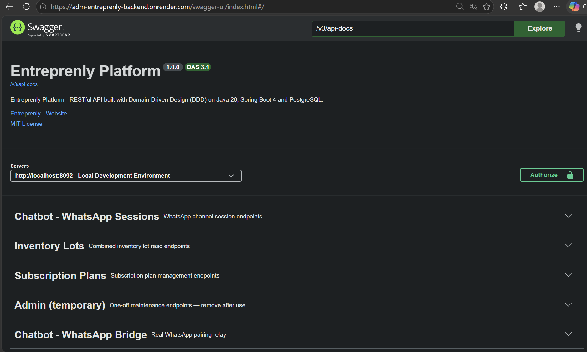
</p>

**Figura 4.3:** Swagger UI con grupos de endpoints, incluyendo Inventory.

<p align="center">
  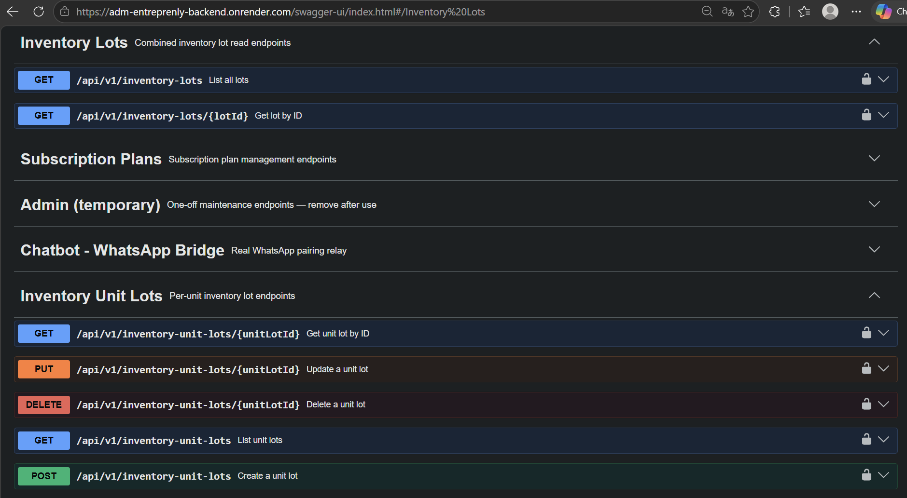
</p>

**Figura 4.4:** Endpoints Inventory Lots y Unit Lots con operaciones GET, POST, PUT y DELETE.

<p align="center">
  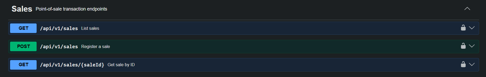
</p>

**Figura 4.5:** Endpoints Sales en Swagger UI con operaciones GET y POST para listar, registrar y consultar ventas.

<p align="center">
  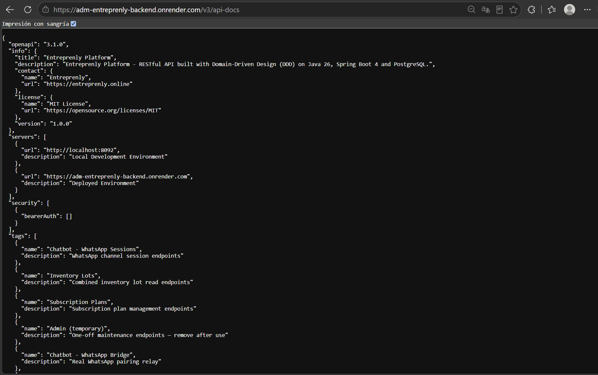
</p>

**Figura 4.6:** OpenAPI JSON con versión 3.1.0, servidores local y desplegado, y tags de Inventory.

#### 4.2.1.8. Software Deployment Evidence for Sprint Review

Despliegues reutilizados y verificados:

- Backend: `https://adm-entreprenly-backend.onrender.com/swagger-ui/index.html` responde con la documentación de servicios.
- Landing: `https://lernenlabs.github.io/adm-entreprenly-landing/` responde con el recorrido Hero, Problema, Features, How it works, Beneficios, Comparativa, Planes, FAQ y Footer.
- Flujo: servicio Docker en Render con variables de 4.1.4; abrir primero Swagger en nube y luego validar endpoints de Inventory del Sprint 1.

<p align="center">
  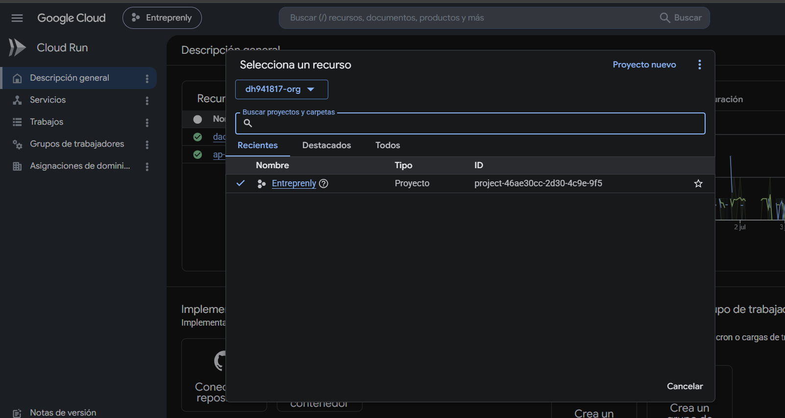
</p>

**Figura 4.7:** Dashboard del servicio en Render como evidencia de despliegue.

<p align="center">
  
</p>

**Figura 4.8:** Swagger respondiendo en la URL de Render como prueba de despliegue funcionando.

<p align="center">
  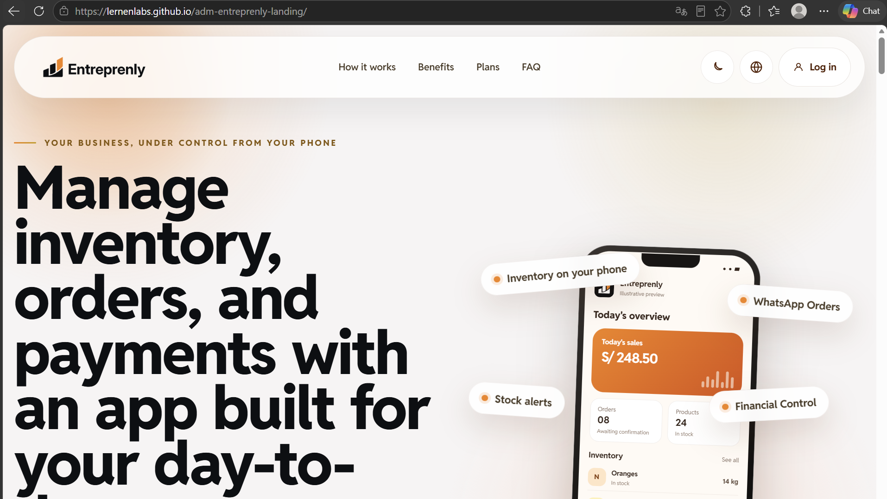
</p>

**Figura 4.9:** Landing desplegada con Hero y overview operativo.

#### 4.2.1.9. Team Collaboration Insights during Sprint

Durante el Sprint 1, el equipo de **Lernen Labs** coordinó el desarrollo de Entreprenly mediante reuniones de seguimiento y control de versiones en GitHub, integrando aportes en la aplicación móvil, backend, landing page y el presente informe. Se trabajó con ramas por funcionalidad integradas hacia `develop` tras revisión colaborativa.

A continuación, se presentan las métricas de **GitHub Insights** que evidencian la actividad, commits y contribuciones de los cinco integrantes durante el sprint:

## 4.3. Validation Interviews

Las entrevistas de validación recogen la experiencia de los dos segmentos objetivo: los comerciantes durante la gestión del negocio desde la aplicación móvil y los clientes finales durante la compra por WhatsApp. Su propósito es identificar dificultades de comprensión, navegación y ejecución de tareas, y relacionar los hallazgos con las necesidades identificadas en el capítulo II. Las preguntas se presentan por segmento en la sección 4.3.1; las respuestas y evidencias se registran en la sección 4.3.2 y sustentan la evaluación de la sección 4.3.3.

### 4.3.1. Diseño de Entrevistas

**Segmento 1: Comerciantes (Dueños de Minimarkets/Mercados)**

1. Después de explorar Entreprenly, ¿qué tareas de su negocio considera que podría realizar con la aplicación?

2. ¿Cómo fue su experiencia al moverse entre Inicio, Inventario, Ventas, Pedidos y Mi perfil?

3. ¿Qué textos, botones o símbolos le resultaron confusos durante el recorrido?

4. ¿Qué dificultades encontró al registrar un producto por unidad o por peso y buscarlo en el inventario?

5. ¿Qué información del resumen de lotes le ayuda a reconocer productos sin stock o próximos a vencer?

6. ¿Cómo comprobó que los productos, las cantidades, el total y el medio de pago de una venta quedaron registrados correctamente?

7. ¿Cómo reconoció si su cuenta de WhatsApp estaba vinculada y si una respuesta al cliente había sido enviada?

8. ¿Qué información necesitaría ver en un pedido para decidir si aprueba o rechaza su comprobante de pago?

9. ¿Qué dudas le surgieron al comparar los planes y revisar los pasos para contratar o renovar una suscripción?

10. ¿Cómo fue su experiencia al actualizar su perfil y configurar las preferencias y notificaciones de la aplicación?

**Segmento 2: Clientes Finales**

1. Después de recorrer la compra por WhatsApp, ¿cómo explicaría los pasos para realizar un pedido en Entreprenly?

2. ¿Cómo interpretó la información sobre los productos, sus precios y las cantidades disponibles durante la conversación?

3. ¿Qué dificultades encontró al consultar por un producto y entender la respuesta del chatbot?

4. ¿Cómo fue su experiencia al indicar la cantidad de un producto vendido por unidad o por peso?

5. ¿Qué información del resumen del pedido le permitió comprobar que los productos, las cantidades y el total correspondían a su compra?

6. Al recibir un aviso de producto agotado o cantidad insuficiente, ¿qué entendió que podía hacer para continuar con su pedido?

7. ¿Qué dudas le surgieron al revisar las instrucciones para pagar su pedido?

8. ¿Cómo comprobó que el comprobante de pago que envió por WhatsApp había sido recibido?

9. ¿Cómo interpretó los mensajes de aprobación o rechazo del pago y el estado en que quedó su pedido?

10. ¿Qué cambiaría del recorrido de compra por WhatsApp para utilizarlo en sus próximas compras?

### 4.3.2. Registro de Entrevistas

A continuación se registran las entrevistas de validación realizadas por segmento. Para cada entrevista se indica el nombre del participante, su edad, su distrito, una captura del video, el enlace a la grabación (con el minuto donde empieza la entrevista y su duración) y un resumen de sus principales comentarios sobre las tareas realizadas. Se realizaron dos entrevistas al Segmento 1 (comerciantes) y una al Segmento 2 (clientes finales).

**Segmento 1: Comerciantes**

- Primera entrevista:

<div align="center">
<div style="font-family: 'Segoe UI', sans-serif; max-width: 680px; margin: 24px auto; border: 1.5px solid #b0bec5; border-radius: 4px; overflow: hidden; box-shadow: 0 2px 8px rgba(0,0,0,0.12);">
  <div style="background-color: #1a6b6b; color: white; padding: 10px 16px; font-weight: 700; font-size: 1.1em; letter-spacing: 0.05em;">Entrevista de Validación – App Móvil</div>
  <div style="background-color: #1a6b6b; padding: 12px 16px 16px;">
    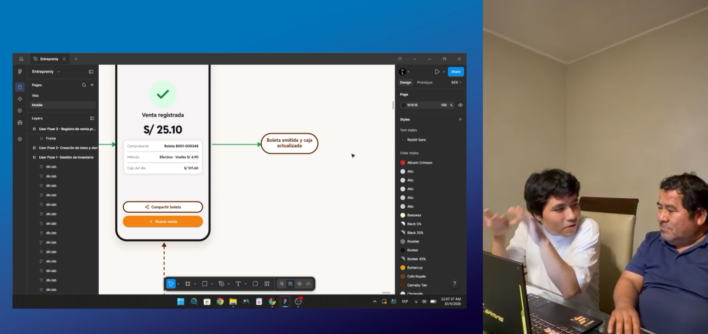
  </div>
  <table style="width: 100%; border-collapse: collapse; font-size: 0.88em;">
    <tr><td style="padding: 7px 14px; border: 1px solid #cfd8dc; width: 50%;"><strong>Entrevistado(a):</strong> Hercilio Carrasco Herrera</td><td style="padding: 7px 14px; border: 1px solid #cfd8dc; width: 50%;"><strong>Edad:</strong> 59</td></tr>
    <tr><td style="padding: 7px 14px; border: 1px solid #cfd8dc;"><strong>Entrevistador(a):</strong> Lionel Chavez Carrasco</td><td style="padding: 7px 14px; border: 1px solid #cfd8dc;"><strong>Distrito:</strong> San Miguel, Lima</td></tr>
    <tr><td style="padding: 7px 14px; border: 1px solid #cfd8dc;"><strong>Inicio de la entrevista:</strong> 00:24</td><td style="padding: 7px 14px; border: 1px solid #cfd8dc;"><strong>Duración:</strong> 09:41</td></tr>
  </table>
  <table style="width: 100%; border-collapse: collapse; font-size: 0.88em;">
    <tr><td style="padding: 7px 14px; border: 1px solid #cfd8dc;"><strong>Link de la entrevista (Microsoft Stream):</strong> <a href="https://upcedupe-my.sharepoint.com/:v:/g/personal/u202416151_upc_edu_pe/IQBP-W_XUfEoRYZCVwRaLNJCATXks06Sh8_yPnRqqPLV7lI?nav=eyJyZWZlcnJhbEluZm8iOnsicmVmZXJyYWxBcHAiOiJPbmVEcml2ZUZvckJ1c2luZXNzIiwicmVmZXJyYWxBcHBQbGF0Zm9ybSI6IldlYiIsInJlZmVycmFsTW9kZSI6InZpZXciLCJyZWZlcnJhbFZpZXciOiJNeUZpbGVzTGlua0NvcHkifX0&e=iSmzhu">Ver entrevista</a></td></tr>
  </table>
  <table style="width: 100%; border-collapse: collapse; font-size: 0.88em;">
    <tr><td style="padding: 10px 14px; border: 1px solid #cfd8dc; line-height: 1.6;">Hercilio recorrió la aplicación sin mayores dificultades y reconoció rápidamente las secciones de Inicio, Inventario, Ventas y Pedidos. Registró un producto por unidad y otro por peso; en este último dudó un momento sobre la unidad de medida, pero lo completó sin ayuda. Lo que más valoró fueron las alertas de lotes sin stock o próximos a vencer, porque hoy revisa esas fechas a mano y a veces se le pasan. También le gustó el chatbot de WhatsApp, ya que sus clientes podrían hacer pedidos sin que él tenga que responder cada mensaje. Al registrar una venta comprobó el total y el medio de pago en el resumen final. Sugirió que los botones y textos sean un poco más grandes para leerlos con facilidad. Calificó con 5 de 5 la probabilidad de usar la aplicación en su negocio.</td></tr>
  </table>
</div>
</div>

- Segunda entrevista:

<div align="center">
<div style="font-family: 'Segoe UI', sans-serif; max-width: 680px; margin: 24px auto; border: 1.5px solid #b0bec5; border-radius: 4px; overflow: hidden; box-shadow: 0 2px 8px rgba(0,0,0,0.12);">
  <div style="background-color: #1a6b6b; color: white; padding: 10px 16px; font-weight: 700; font-size: 1.1em; letter-spacing: 0.05em;">Entrevista de Validación – App Móvil</div>
  <div style="background-color: #1a6b6b; padding: 12px 16px 16px;">
    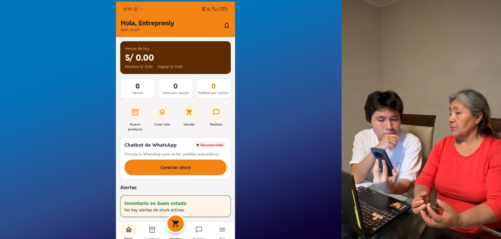
  </div>
  <table style="width: 100%; border-collapse: collapse; font-size: 0.88em;">
    <tr><td style="padding: 7px 14px; border: 1px solid #cfd8dc; width: 50%;"><strong>Entrevistado(a):</strong> María Encarnación Velasquez</td><td style="padding: 7px 14px; border: 1px solid #cfd8dc; width: 50%;"><strong>Edad:</strong> 62</td></tr>
    <tr><td style="padding: 7px 14px; border: 1px solid #cfd8dc;"><strong>Entrevistador(a):</strong> Lionel Chavez Carrasco</td><td style="padding: 7px 14px; border: 1px solid #cfd8dc;"><strong>Distrito:</strong> San Miguel, Lima</td></tr>
    <tr><td style="padding: 7px 14px; border: 1px solid #cfd8dc;"><strong>Inicio de la entrevista:</strong> 01:00</td><td style="padding: 7px 14px; border: 1px solid #cfd8dc;"><strong>Duración:</strong> 12:45</td></tr>
  </table>
  <table style="width: 100%; border-collapse: collapse; font-size: 0.88em;">
    <tr><td style="padding: 7px 14px; border: 1px solid #cfd8dc;"><strong>Link de la entrevista (Microsoft Stream):</strong> <a href="https://upcedupe-my.sharepoint.com/:v:/g/personal/u202416151_upc_edu_pe/IQBDnN2F2sR4Q45gqWIVxSh_AV_5Vca7N9NzFYjrPBQJ32o?nav=eyJyZWZlcnJhbEluZm8iOnsicmVmZXJyYWxBcHAiOiJPbmVEcml2ZUZvckJ1c2luZXNzIiwicmVmZXJyYWxBcHBQbGF0Zm9ybSI6IldlYiIsInJlZmVycmFsTW9kZSI6InZpZXciLCJyZWZlcnJhbFZpZXciOiJNeUZpbGVzTGlua0NvcHkifX0&e=V9OAOc">Ver entrevista</a></td></tr>
  </table>
  <table style="width: 100%; border-collapse: collapse; font-size: 0.88em;">
    <tr><td style="padding: 10px 14px; border: 1px solid #cfd8dc; line-height: 1.6;">María exploró la aplicación con interés y comentó que la navegación entre secciones le pareció ordenada y fácil de seguir. Registró productos y realizó una venta sin problemas, y destacó que el resumen le permite revisar las cantidades y el total antes de confirmar. Le gustaron especialmente las alertas de stock y vencimiento, así como el chatbot de WhatsApp para recibir pedidos y comprobantes de pago en un solo lugar. En la revisión de pedidos entendió cómo aprobar o rechazar un comprobante, aunque pidió que la imagen del comprobante se vea más grande. Como sugerencia principal, mencionó que sería útil emitir facturas además de boletas, ya que algunos de sus clientes son negocios que se las solicitan. Calificó con 5 de 5 la probabilidad de usar la aplicación en su negocio.</td></tr>
  </table>
</div>
</div>

**Segmento 2: Clientes finales**

- Primera entrevista:

<div align="center">
<div style="font-family: 'Segoe UI', sans-serif; max-width: 680px; margin: 24px auto; border: 1.5px solid #b0bec5; border-radius: 4px; overflow: hidden; box-shadow: 0 2px 8px rgba(0,0,0,0.12);">
  <div style="background-color: #1a6b6b; color: white; padding: 10px 16px; font-weight: 700; font-size: 1.1em; letter-spacing: 0.05em;">Entrevista de Validación – Chatbot de WhatsApp</div>
  <div style="background-color: #1a6b6b; padding: 12px 16px 16px;">
    
  </div>
  <table style="width: 100%; border-collapse: collapse; font-size: 0.88em;">
    <tr><td style="padding: 7px 14px; border: 1px solid #cfd8dc; width: 50%;"><strong>Entrevistado(a):</strong> Catherine Villar</td><td style="padding: 7px 14px; border: 1px solid #cfd8dc; width: 50%;"><strong>Edad:</strong> 21</td></tr>
    <tr><td style="padding: 7px 14px; border: 1px solid #cfd8dc;"><strong>Entrevistador(a):</strong> Elynor Palma</td><td style="padding: 7px 14px; border: 1px solid #cfd8dc;"><strong>Distrito:</strong> San Martin</td></tr>
    <tr><td style="padding: 7px 14px; border: 1px solid #cfd8dc;"><strong>Inicio de la entrevista:</strong> 0:00</td><td style="padding: 7px 14px; border: 1px solid #cfd8dc;"><strong>Duración:</strong> 12:02</td></tr>
  </table>
  <table style="width: 100%; border-collapse: collapse; font-size: 0.88em;">
    <tr><td style="padding: 7px 14px; border: 1px solid #cfd8dc;"><strong>Link de la entrevista (Microsoft Stream):</strong> <a href="https://upcedupe-my.sharepoint.com/:v:/g/personal/u20241a972_upc_edu_pe/IQAQo6NbfgoWQopNMRPgr2y8AacvNs6HtfVko-w9hyr-fNA?e=ljKMzz&nav=eyJyZWZlcnJhbEluZm8iOnsicmVmZXJyYWxBcHAiOiJTdHJlYW1XZWJBcHAiLCJyZWZlcnJhbFZpZXciOiJTaGFyZURpYWxvZy1MaW5rIiwicmVmZXJyYWxBcHBQbGF0Zm9ybSI6IldlYiIsInJlZmVycmFsTW9kZSI6InZpZXcifX0%3D">Ver entrevista</a></td></tr>
  </table>
  <table style="width: 100%; border-collapse: collapse; font-size: 0.88em;">
    <tr><td style="padding: 10px 14px; border: 1px solid #cfd8dc; line-height: 1.6;">Catherine es estudiante y compra con frecuencia en bodegas y tiendas de conveniencia, aunque nunca había hecho un pedido por WhatsApp. Aun así, completó todo el recorrido de compra con el chatbot: consultó productos, pidió el catálogo y recibió los precios, armó su pedido, envió su comprobante de pago y recibió la confirmación de aprobación. Le pareció una propuesta interesante. Destacó que el pago fue la parte más fácil, porque el chatbot solo le pidió la dirección y la captura del comprobante. También dijo que los mensajes de aprobación del pago son muy claros y bien redactados, y que le permitieron verificar fácilmente que la compra se realizó y que el pedido ya se estaba preparando. El resumen del pedido le sirvió para comprobar la cantidad y el precio de los productos. Como oportunidades de mejora, sugirió que el chatbot muestre el catálogo al iniciar la conversación, que entienda mejor las cantidades escritas en texto o en número, que avise cuando un producto no está disponible y que el catálogo se presente con los productos separados en líneas para leerlo más rápido.</td></tr>
  </table>
</div>
</div>

- Segunda entrevista:

<div align="center">
<div style="font-family: 'Segoe UI', sans-serif; max-width: 680px; margin: 24px auto; border: 1.5px solid #b0bec5; border-radius: 4px; overflow: hidden; box-shadow: 0 2px 8px rgba(0,0,0,0.12);">
  <div style="background-color: #1a6b6b; color: white; padding: 10px 16px; font-weight: 700; font-size: 1.1em; letter-spacing: 0.05em;">Entrevista de Validación – Chatbot de WhatsApp</div>
  <div style="background-color: #1a6b6b; padding: 12px 16px 16px;">
    
  </div>
  <table style="width: 100%; border-collapse: collapse; font-size: 0.88em;">
    <tr><td style="padding: 7px 14px; border: 1px solid #cfd8dc; width: 50%;"><strong>Entrevistado(a):</strong> Sofia Diaz</td><td style="padding: 7px 14px; border: 1px solid #cfd8dc; width: 50%;"><strong>Edad:</strong> 19</td></tr>
    <tr><td style="padding: 7px 14px; border: 1px solid #cfd8dc;"><strong>Entrevistador(a):</strong> Elynor Palma</td><td style="padding: 7px 14px; border: 1px solid #cfd8dc;"><strong>Distrito:</strong> Callao</td></tr>
    <tr><td style="padding: 7px 14px; border: 1px solid #cfd8dc;"><strong>Inicio de la entrevista:</strong> 12:02</td><td style="padding: 7px 14px; border: 1px solid #cfd8dc;"><strong>Duración:</strong> 11:34</td></tr>
  </table>
  <table style="width: 100%; border-collapse: collapse; font-size: 0.88em;">
    <tr><td style="padding: 7px 14px; border: 1px solid #cfd8dc;"><strong>Link de la entrevista (Microsoft Stream):</strong> <a href="https://upcedupe-my.sharepoint.com/:v:/g/personal/u20241a972_upc_edu_pe/IQAQo6NbfgoWQopNMRPgr2y8AacvNs6HtfVko-w9hyr-fNA?e=ljKMzz&nav=eyJyZWZlcnJhbEluZm8iOnsicmVmZXJyYWxBcHAiOiJTdHJlYW1XZWJBcHAiLCJyZWZlcnJhbFZpZXciOiJTaGFyZURpYWxvZy1MaW5rIiwicmVmZXJyYWxBcHBQbGF0Zm9ybSI6IldlYiIsInJlZmVycmFsTW9kZSI6InZpZXcifX0%3D">Ver entrevista</a></td></tr>
  </table>
  <table style="width: 100%; border-collapse: collapse; font-size: 0.88em;">
    <tr><td style="padding: 10px 14px; border: 1px solid #cfd8dc; line-height: 1.6;">Sofía vive en el Callao y ya había hecho compras por WhatsApp antes. Completó el recorrido sin dificultades: pidió una Coca-Cola, el chatbot registró el pedido con su número de orden y el total, le pidió la dirección de entrega y, después de enviar el comprobante, recibió el mensaje de pago aprobado y pedido en preparación. Le pareció una experiencia muy buena e interactiva, porque toda la compra se hace en el mismo chat. Valoró mucho que el chatbot responda al instante, sin las esperas que suelen tener las tiendas por WhatsApp. Dijo que la información de productos y precios está "muy al alcance", que la cantidad se registró correctamente y que el resumen le permitió comprobar los productos y el total. Los mensajes de aprobación le parecieron muy claros. Lo único que mencionó para el futuro es que la verificación del comprobante funcione con pagos reales, ya que en el prototipo es una simulación. Fuera de eso, consideró que el recorrido está muy bien.</td></tr>
  </table>
</div>
</div>

### 4.3.3. Evaluaciones según heurísticas

En esta sección el equipo evalúa las pantallas de la aplicación móvil de Entreprenly en tres grupos: heurísticas de usabilidad de Nielsen, arquitectura de información e inclusive design. Cada criterio tiene un puntaje del 1 al 5, la evidencia observada (referenciada por figura) y una mejora sugerida.

#### Catálogo de figuras

| Fig.    | Pantalla                                   | Archivo                               |
| ------- | ------------------------------------------ | ------------------------------------- |
| Fig. 1  | Inicio (Dashboard)                         | `Fig-01-panel-de-inicio.png`          |
| Fig. 2  | Lista de productos                         | `Fig-02-lista-de-productos.png`       |
| Fig. 3  | Agregar producto con errores de validación | `Fig-03-agregar-producto-errores.png` |
| Fig. 4  | Lotes con aviso de vencimiento             | `Fig-04-lotes-con-alerta.png`         |
| Fig. 5  | Selector de fecha de vencimiento           | `Fig-05-selector-de-fecha.png`        |
| Fig. 6  | Detalle de lote con alerta                 | `Fig-06-detalle-de-lote-alerta.png`   |
| Fig. 7  | Venta con peso ingresado a mano            | `Fig-07-venta-peso-manual.png`        |
| Fig. 8  | Venta con stock insuficiente               | `Fig-08-venta-stock-insuficiente.png` |
| Fig. 9  | Método de pago                             | `Fig-09-metodo-de-pago.png`           |
| Fig. 10 | Venta registrada                           | `Fig-10-venta-registrada.png`         |
| Fig. 11 | Detalle de pedido del chatbot              | `Fig-11-detalle-de-pedido.png`        |
| Fig. 12 | Rechazar pago con motivo                   | `Fig-12-rechazar-pago.png`            |
| Fig. 13 | Pedido bloqueado                           | `Fig-13-pedido-bloqueado.png`         |
| Fig. 14 | Planes sin selección                       | `Fig-14-planes-sin-seleccion.png`     |
| Fig. 15 | Cobro de suscripción rechazado             | `Fig-15-cobro-rechazado.png`          |
| Fig. 16 | Centro de ayuda                            | `Fig-16-centro-de-ayuda.png`          |
| Fig. 17 | Artículo de ayuda                          | `Fig-17-articulo-de-ayuda.png`        |
| Fig. 18 | Configuración de notificaciones            | `Fig-18-notificaciones.png`           |
| Fig. 19 | Inventario sin conexión                    | `Fig-19-inventario-sin-conexion.png`  |
| Fig. 20 | Vincular WhatsApp con código               | `Fig-20-vincular-whatsapp.png`        |
| Fig. 21 | Confirmar eliminación de producto          | `Fig-21-confirmar-eliminacion.png`    |
| Fig. 22 | Preferencias                               | `Fig-22-preferencias.png`             |

#### 4.3.3.1. Heurísticas de usabilidad

Evaluación basada en las 10 heurísticas de Nielsen.

##### Visibilidad del estado del sistema — 5/5

El Inicio, los lotes y los pedidos muestran su estado con etiquetas de color, y la app avisa cuando no hay conexión.

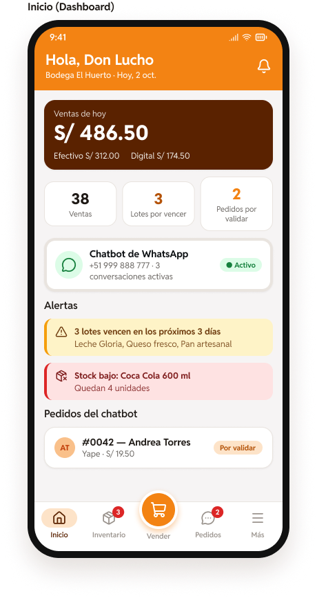 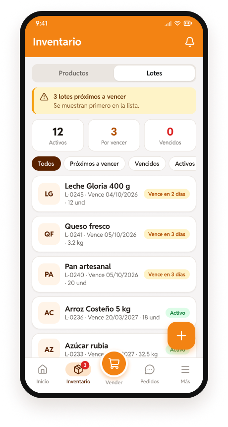 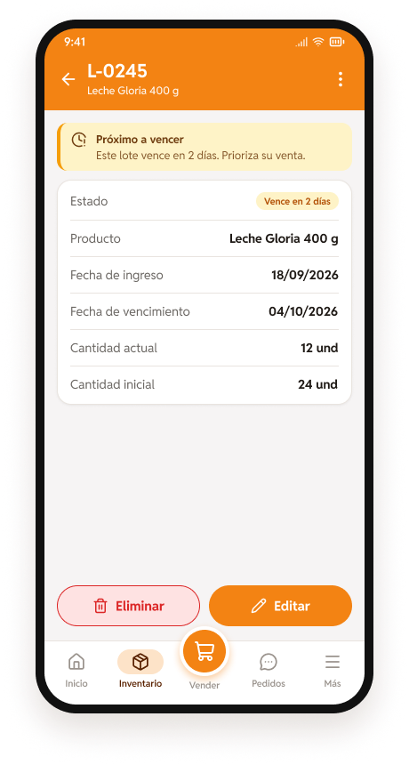 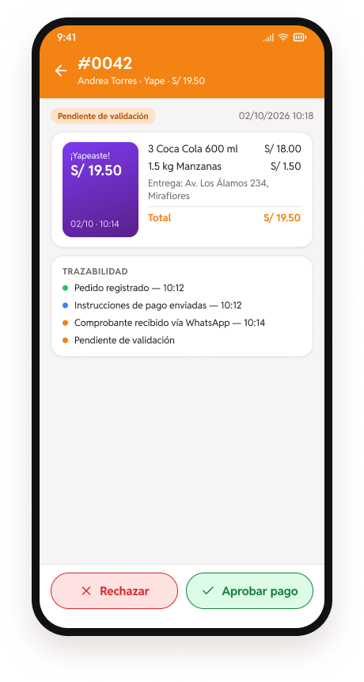 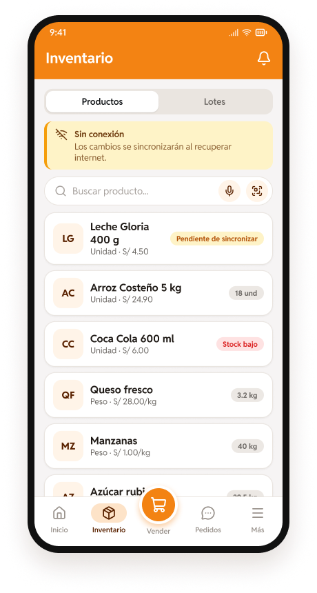

**Evidencia:** Fig. 1, Fig. 4, Fig. 6, Fig. 11, Fig. 19.

**Mejora:** Mostrar la hora de la última actualización en el Inicio.

##### Relación entre el sistema y el mundo real — 5/5

Usa palabras del comerciante: "Vender", "Caja", "Boleta", "Yape / Plin", "Vence en 2 días".

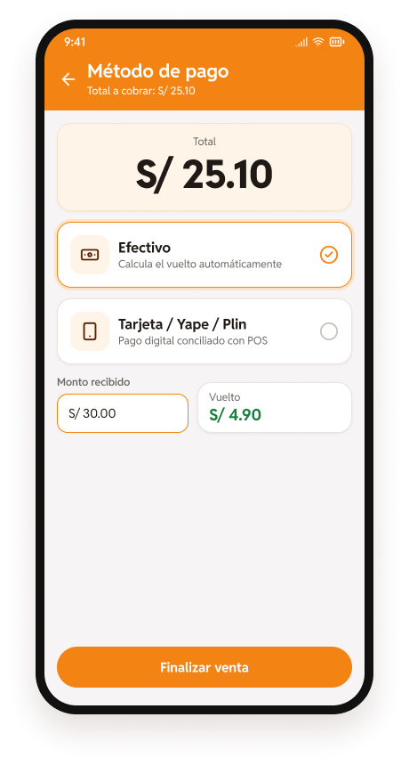  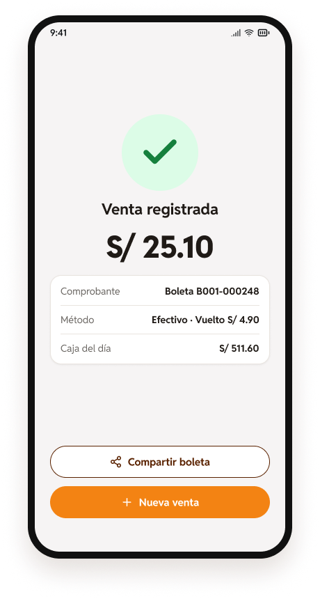

**Evidencia:** Fig. 9, Fig. 4, Fig. 10.

**Mejora:** Mostrar el precio por kilo junto al total en los productos por peso.

##### Libertad y control por parte del usuario — 4/5

Los formularios se pueden cerrar y eliminar un producto pide confirmación, pero el panel de rechazo de pago no tiene "Cancelar".

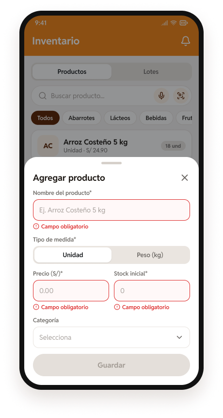 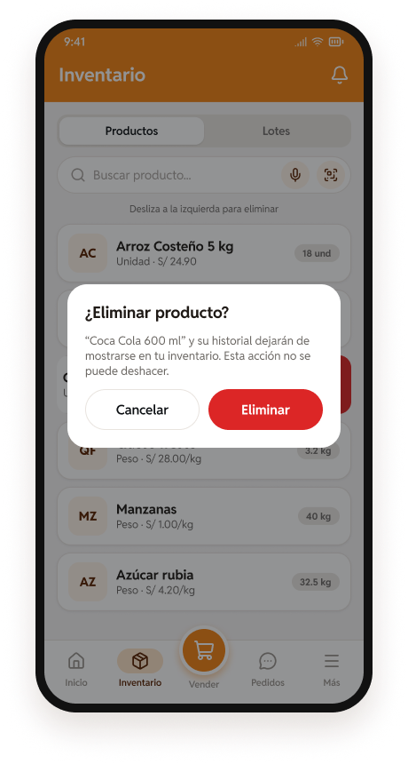 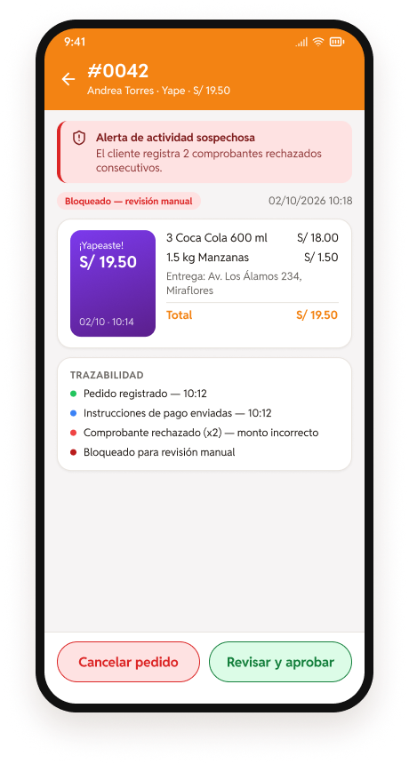

**Evidencia:** Fig. 3, Fig. 21, Fig. 12.

**Mejora:** Agregar "Cancelar" al panel de rechazo y "Deshacer" tras eliminar.

##### Consistencia y estándares — 5/5

Todas las pantallas usan la misma cabecera, barra inferior, botones y colores de estado.

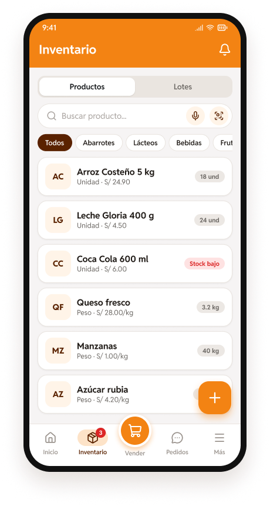  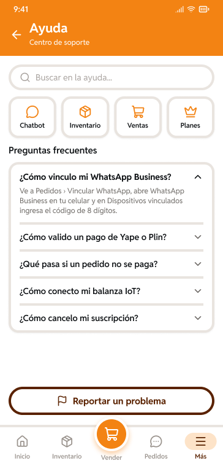

**Evidencia:** Fig. 2, Fig. 4, Fig. 16.

**Mejora:** Usar el mismo texto ("Guardar") en los botones de confirmación.

##### Prevención de errores — 5/5

Se bloquea guardar con campos vacíos, elegir fechas pasadas, vender sin stock y avanzar sin elegir plan.

 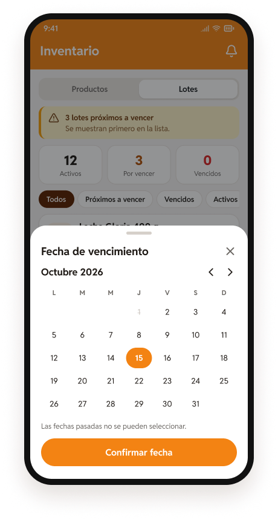 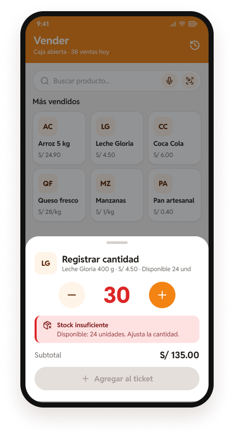 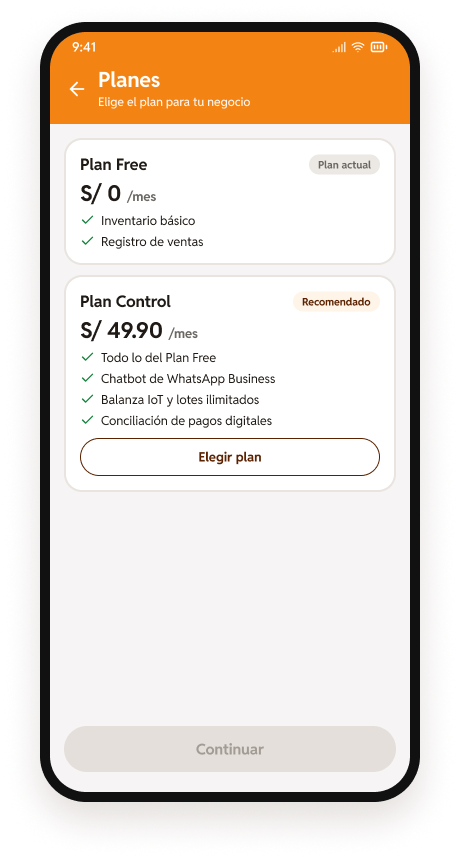

**Evidencia:** Fig. 3, Fig. 5, Fig. 8, Fig. 14.

**Mejora:** Avisar si la fecha de vencimiento de un lote es muy cercana.

##### Reconocer antes que recordar — 5/5

El comerciante elige productos de listas, filtros o QR en vez de recordar nombres o códigos.

 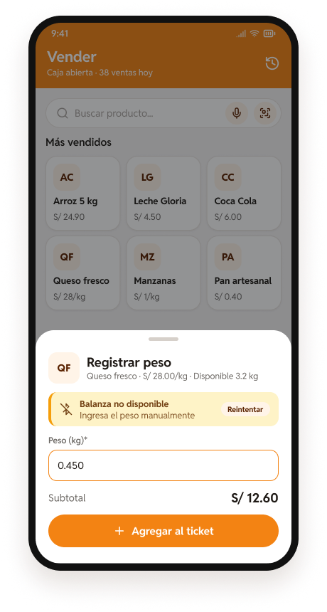

**Evidencia:** Fig. 2, Fig. 7.

**Mejora:** Mostrar los últimos productos vendidos al abrir el buscador.

##### Flexibilidad y eficiencia en el uso — 4/5

Se puede buscar por texto, voz o QR, vincular WhatsApp por código o QR y usar accesos directos.

  

**Evidencia:** Fig. 1, Fig. 2, Fig. 20.

**Mejora:** Permitir aprobar varios pedidos a la vez.

##### Diseño estético y minimalista — 4/5

Las pantallas son limpias, pero el detalle del pedido junta demasiada información.

 

**Evidencia:** Fig. 10, Fig. 11.

**Mejora:** Mostrar la trazabilidad del pedido plegada por defecto.

##### Ayuda a los usuarios a reconocer, diagnosticar y recuperarse de los errores — 5/5

Los errores dicen qué pasó y qué hacer, por ejemplo "Balanza no disponible, ingresa el peso manualmente".

   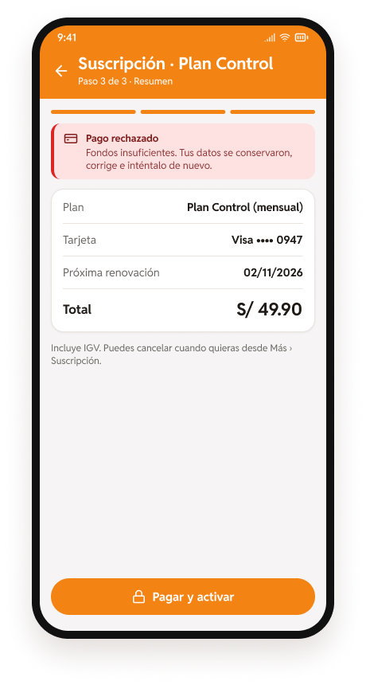

**Evidencia:** Fig. 7, Fig. 8, Fig. 13, Fig. 15.

**Mejora:** Enlazar los errores de pago con su artículo de ayuda.

##### Ayuda y documentación — 4/5

Hay un centro de ayuda con buscador y artículos paso a paso, pero solo se llega desde "Más".

 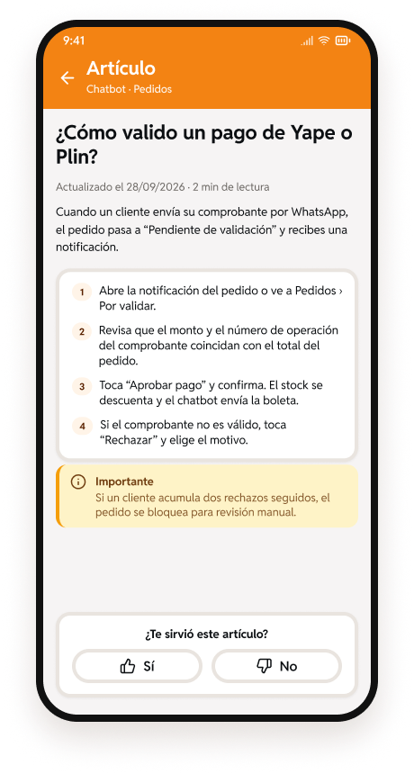

**Evidencia:** Fig. 16, Fig. 17.

**Mejora:** Agregar un ícono de ayuda en la vinculación de WhatsApp.

#### 4.3.3.2. Arquitectura de información

Evaluación de qué tan fácil es encontrar, entender y usar la información.

##### Is it findable? — 5/5

Las cinco secciones están siempre en la barra inferior e Inventario tiene buscador.

 

**Evidencia:** Fig. 1, Fig. 2.

**Mejora:** Agregar un buscador general en el Inicio.

##### Is it accessible? — 4/5

Botones grandes y estados con texto además de color, aunque algunos textos son pequeños.

  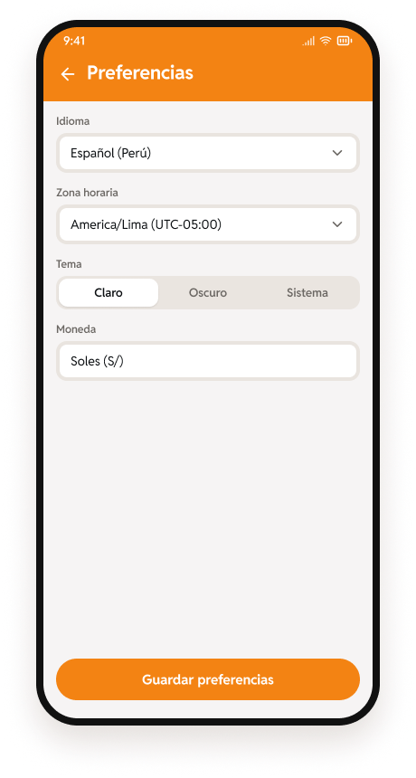

**Evidencia:** Fig. 9, Fig. 4, Fig. 22.

**Mejora:** Agregar una opción para agrandar la letra.

##### Is it clear? — 5/5

Cada pantalla tiene un título y una acción principal; los montos se ven grandes.

 

**Evidencia:** Fig. 9, Fig. 10.

**Mejora:** Ninguna relevante.

##### Is it communicative? — 5/5

Cada acción muestra un mensaje breve y los avisos usan colores según su importancia.

 

**Evidencia:** Fig. 4, Fig. 19.

**Mejora:** Agregar una vibración corta al confirmar una venta.

##### Is it usable? — 4/5

Las tareas frecuentes toman pocos pasos, pero vincular WhatsApp requiere pasos fuera de la app.

 

**Evidencia:** Fig. 7, Fig. 20.

**Mejora:** Agregar imágenes de cada paso de la vinculación.

##### Is it credible? — 4/5

Muestra boletas numeradas, trazabilidad de pedidos y el detalle del cobro.

  

**Evidencia:** Fig. 11, Fig. 10, Fig. 15.

**Mejora:** Agregar una nota de pago seguro en el paso de la tarjeta.

##### Is it controllable? — 4/5

El comerciante confirma las acciones importantes y elige qué notificaciones recibir.

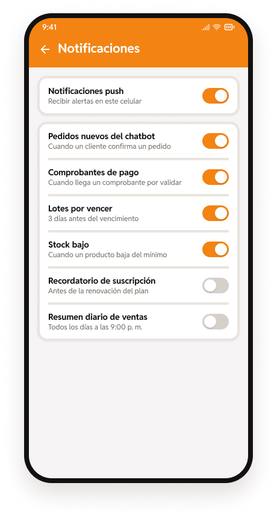 

**Evidencia:** Fig. 18, Fig. 21.

**Mejora:** Agregar "Deshacer" después de eliminar.

##### Is it valuable? — 5/5

Permite controlar stock, vencimientos, caja y pedidos de WhatsApp desde el celular.

  

**Evidencia:** Fig. 1, Fig. 4, Fig. 11.

**Mejora:** Mostrar en el Inicio los lotes que vencen esta semana.

##### Is it learnable? — 4/5

Las pantallas repiten los mismos patrones y hay artículos de ayuda paso a paso.

  

**Evidencia:** Fig. 2, Fig. 4, Fig. 17.

**Mejora:** Mostrar una guía corta la primera vez que se entra a cada módulo.

##### Is it delightful? — 4/5

La interfaz es ordenada y las pantallas de éxito dan sensación de logro.

 

**Evidencia:** Fig. 10, Fig. 1.

**Mejora:** Agregar pequeñas animaciones al registrar una venta.

#### 4.3.3.3. Inclusive design

Evaluación de los 7 principios de diseño inclusivo.

##### Principio 1: Proporciona experiencias comparables — 5/5

Se puede buscar por texto, voz o QR, y registrar el peso con balanza o a mano.

 

**Evidencia:** Fig. 2, Fig. 7.

**Mejora:** Agregar etiquetas de accesibilidad a los íconos.

##### Principio 2: Considera la situación del usuario — 5/5

Se usa con una mano, funciona sin internet y avisa con la app cerrada.

  

**Evidencia:** Fig. 7, Fig. 19, Fig. 4.

**Mejora:** Agregar un modo de alto contraste.

##### Principio 3: Sé consistente — 5/5

Colores, botones y formularios funcionan igual en todos los módulos.

   

**Evidencia:** Fig. 2, Fig. 4, Fig. 11, Fig. 16.

**Mejora:** Unificar el texto de los botones de confirmación.

##### Principio 4: Deja al usuario mandar — 4/5

El comerciante elige tema, notificaciones y el motivo al rechazar un pago.

  

**Evidencia:** Fig. 18, Fig. 22, Fig. 12.

**Mejora:** Agregar "Cancelar" al panel de rechazo.

##### Principio 5: Ofrece opciones — 5/5

Varias formas de cobrar (efectivo, tarjeta, Yape, Plin) y de vincular WhatsApp.

 

**Evidencia:** Fig. 9, Fig. 20.

**Mejora:** Permitir mostrar la boleta en pantalla para clientes sin WhatsApp.

##### Principio 6: Prioriza el contenido — 5/5

Lo más importante va primero: el total a cobrar y los lotes por vencer.

 

**Evidencia:** Fig. 9, Fig. 4.

**Mejora:** Ninguna relevante.

##### Principio 7: Agrega valor — 5/5

Aprovecha la cámara, el micrófono y las notificaciones del celular.

 

**Evidencia:** Fig. 2, Fig. 4.

**Mejora:** Usar la cámara para fotografiar comprobantes en efectivo.

#### Resumen de puntajes

| Grupo                       | Criterios evaluados | Promedio |
| --------------------------- | ------------------- | -------- |
| Heurísticas de usabilidad   | 10                  | 4.6 / 5  |
| Arquitectura de información | 10                  | 4.4 / 5  |
| Inclusive design            | 7                   | 4.9 / 5  |

En general, la app móvil obtiene buenos resultados en visibilidad del estado, prevención de errores y uso en el contexto real del comerciante. Las principales oportunidades de mejora son agregar "Cancelar" y "Deshacer", simplificar el detalle del pedido, agrandar la letra y guiar mejor la vinculación de WhatsApp.
